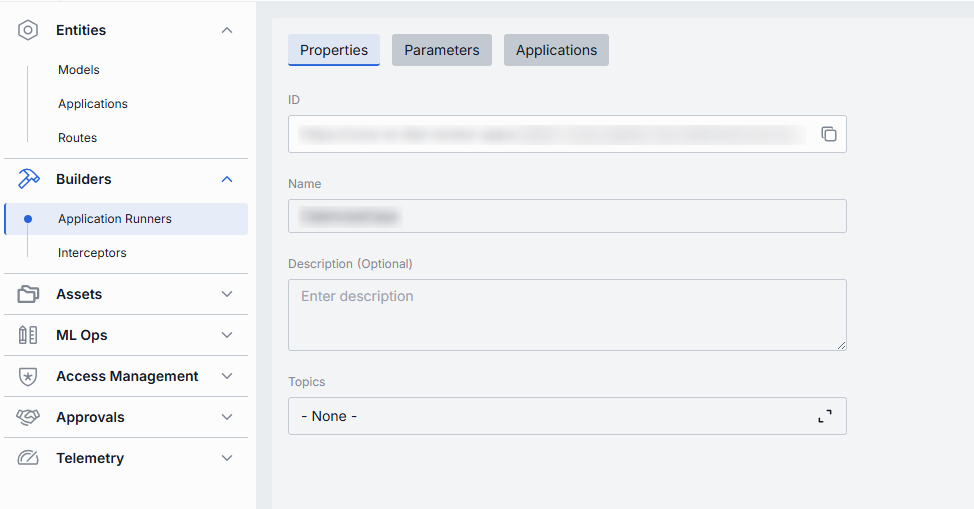
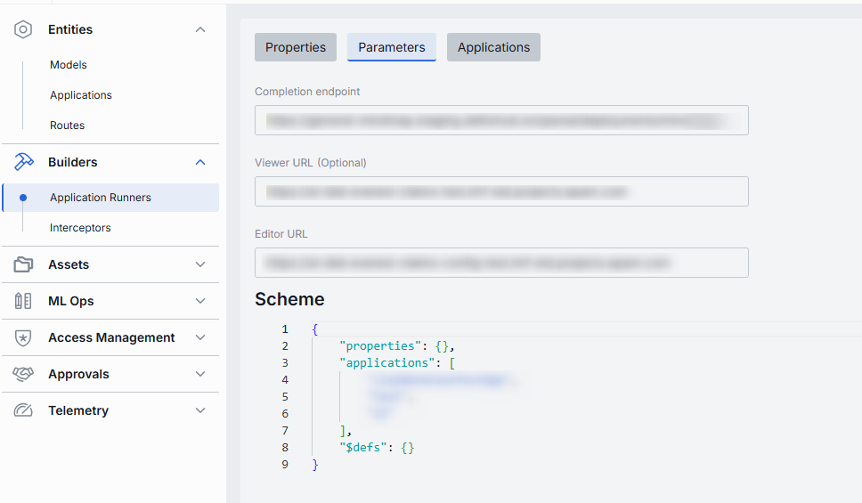

# Application Runners

## About Application Runners

**Application Runners** (known as `ApplicationTypeSchemas` in [DIAL Core dynamic settings](https://github.com/epam/ai-dial-core?tab=readme-ov-file#dynamic-settings)) are predefined templates used for creating custom implementations of applications in DIAL. These schemas enable low and no-code UI wizards for end-users to create applications. In self-hosted setups, you can extend the standard package with custom types to support specific business cases, allowing for fully custom UI and application wizards.

> Refer to [Schema-rich Applications](/docs/platform/3.core/7.apps.md#schema-rich-applications) to learn more.

## Application Runners List

In Application Runners you can manage the Application Runners you have in your DIAL instance. Use this page to view, filter, and create new artefacts.

##### Application Runners Grid

| Column           | Definition & Use Case                                                             |
|------------------|--------------------|
| **Display Name** | A user-friendly label for the application runner (e.g. “Python Lambda Runner”, “NodeJS App Service”). Helps you pick the right runtime when creating an Application. |
| **ID**  | The unique identifier for this runner—typically the base URL of the service (e.g. `https://my-runner.example.com`). DIAL Core uses this endpoint to POST orchestration payloads. |
| **Description**  | Free-text notes about the runner’s capabilities, cluster location, version, or SLA (e.g. “v2 on GKE, 2 vCPU, 8 GB RAM”).                                                         |

## Create

Use the **Create Application Runner** dialog to register a new runner in your DIAL instance. Once added, it appears in the **Application Runners** listing.

> It may take some time for the changes to take effect after saving.

##### To create a new Application Runner:

1. Click **Create** to invoke the **Create Application Runner** modal.
2. Define key parameters for the new application runner:

    | Field           | Required | Definition                                                                   |
    |-----------------|-----------|------------------------------------------------------------------------------|
    | **ID**          | Yes   | The unique identifier for this runner—typically the base URL of the service. |
    | **Name**        | Yes   | User-friendly name of the Application Runner.                               |
    | **Description** | No        | Free-text notes about the runner’s capabilities.                             |
3. Once all required fields are filled, click **Create**. The dialog closes and the new runner [configuration screen](#configuration) opened.

    > This entry will appear immediately in the listing once created.

## Configuration

##### Top Bar Controls

* **Delete**: Permanently removes this runner definition. All related Applications still bound to it will be deleted as well.
* **JSON Editor** (Toggle): Switch between the form-based UI and raw [JSON view](#json-editor) of the runner’s configuration. Use JSON mode for copy-paste or advanced edits.

### Properties

In the Properties tab, you can define identity and metadata of application runners - so DIAL Core knows where to send orchestration payloads and how to present this runner in the UI.

| Field           | Required | Definition  |
|-----------------|-----------|------------|
| **ID**          | Yes   | The base URL or unique identifier where this runner’s service is hosted (e.g. https://my-runner.example.com/v1/execute). DIAL Core will POST orchestration payloads to this endpoint for any Application bound here. |
| **Name**        | Yes   | A user-friendly label for this runner (e.g. “Python Lambda Runner” or “NodeJS Service Worker”).                      |
| **Description** | No        | Free-text notes about the runner - its environment (staging vs. prod), resource profile (2 vCPU, 8 GB RAM), or any special instructions.                                                                             |                                                                      |
| **Topics**        | No        | Tag this app with one or more topics or categories (e.g. "finance", "support").             |

### Parameters

In the Parameters tab, you can define how DIAL Core calls your runner service (its endpoints) and what parameter schema it expects. This lets DIAL validate, document, and render input forms for any Application bound to this runner.

| Field                   | Required | Definition |
|-------------------------|-----------|---------------|
| **Completion endpoint** | Yes   | The base URL or unique identifier where this runner’s service is hosted (e.g. https://my-runner.example.com/v1/execute). DIAL Core will POST orchestration payloads to this endpoint for any Application bound here. |
| **Viewer URL**          | No        | A link to a web UI where end-users can preview applications backed by this runner.                                    |
| **Editor URL**          | No        | A link to an external editing interface where the Application logic can be modified or configured.                    |                                                                      |
| **Scheme**              | Yes       | A JSON Schema document that defines the Parameters object your runner expects in its payload—under the properties, applications, and optional sections.                                                              |

### Applications

In the Applications tab, you can see which DIAL Applications are bound to this runner.
By assigning applications here, you tell DIAL Core to dispatch orchestration payloads for those apps to this specific runner endpoint.

##### Applications List

| Column            | Definition         |
| ----------------- | ----------------------------------------------------------------------------------------------------------------- |
| **Display Name**  | User-friendly name of the Application (e.g. “Data Clustering Application”).                                      |
| **Version**       | The Application’s version tag (e.g. `v1.0`, `2024-07-15`) as defined in **Entities → Applications → Properties**. |
| **Description**   | Free-text summary of what the Application does.                                                                   |
| **Deployment ID** | The unique alias used in the Application’s endpoint URL (e.g. `dca`, `support-bot`).                              |

#### Add

1. Click **+ Add** (top-right of the Applications Grid).
2. **Select** one or more apps in the modal.
3. **Confirm** to insert them into the table.

#### Remove
 
1. Click the **actions** menu in the app's line.
2. Choose **Remove** in the menu.

### JSON Editor

For advanced scenarios of bulk updates, copy/paste between environments, or tweaking settings not exposed in the form UI—you can switch to the **JSON Editor** in any application runners configuration page.

##### Switching to the JSON Editor

1. Navigate to **Builders → Application Runners**, then select the application runner you want to edit.
2. Click the **JSON Editor** toggle (top-right). The UI reveals the raw JSON.

> **TIP**: You can switch between UI and JSON only if there are no unsaved changes.
