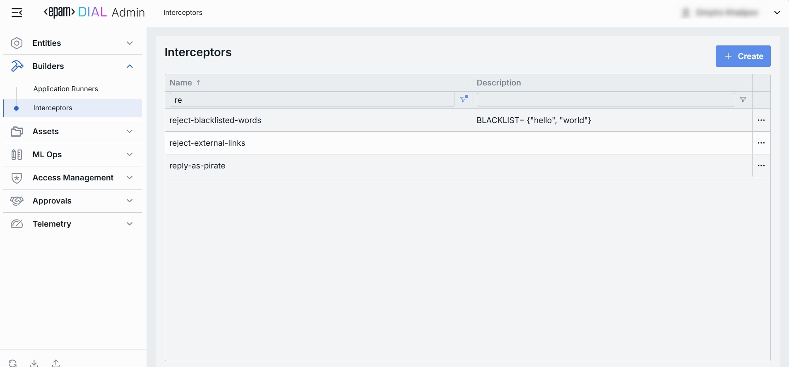
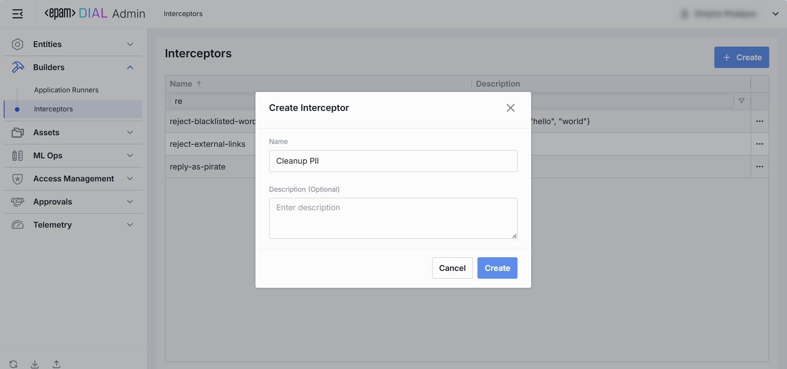

# Interceptors

## What Is an “Interceptor” in DIAL?

it is possible to incorporate additional logic into the processing of every request and response for models and apps. 
This is achieved through the integration of pluggable components known as Interceptors. Use SDK to develop Interceptors.

Interceptors implement Responsible AI approach and enforce compliance with organization policies and standards. 
They can block requests that violate regulations, come from restricted areas, risk data leaks, or give biased responses. 
Interceptors also enable applications to focus on certain topics, remove personal information from user requests, and cache responses from LLMs.

You define each interceptor under Builders → Interceptors, then attach it to any Model or Application in the order you choose.

## Interceptors Listing

The Interceptors page under Builders is your single source of truth for all the “hooks” you’ve built to extend DIAL’s request pipeline.
Use this page to view, filter, and create new artefacts.

### 1. Navigate to Interceptors

In the sidebar, expand **Builders** and click **Interceptors**.

### 2. Interceptors Grid

**Filtering & Sorting**
* Each column header has sort arrows; click to reorder.
* Beneath each header is a filter box - type text to narrow the list in real time.

| Column          | Definition & Use Case                                                                                                                               |
|-----------------|-----------------------------------------------------------------------------------------------------------------------------------------------------|
| **Name**        | Unique identifier for the interceptor (e.g. reject-blacklisted-words, audit-logger). This key is used when you attach it to a Model or Application. |
| **Description** | A brief summary of what this interceptor does and any parameters it uses (e.g. BLACKLIST={"foo","bar"} or Logs request/response payloads).          |

## Create Interceptors

Use the **Create Interceptor** dialog to register an interceptor in your DIAL instance. Once added, it appears in the **Interceptors** listing.

> It may take some time for the changes to take effect after saving.

### 1. Hit **Create** button 

Opens the **Create Interceptor** modal.

### 2. Define key parameters

In the modal, specify the following for the new interceptor:

| Column          | Definition & Use Case                                                                                                                               |
|-----------------|-----------------------------------------------------------------------------------------------------------------------------------------------------|
| **Name**        | Unique identifier for the interceptor (e.g. reject-blacklisted-words, audit-logger). This key is used when you attach it to a Model or Application. |
| **Description** | A brief summary of what this interceptor does and any parameters it uses (e.g. BLACKLIST={"foo","bar"} or Logs request/response payloads).          |

### 3. Click Create 
Once all required fields are filled hit **Create** button. The dialog closes and the new interceptor configuration screen opened.

  > This entry will appear immediately in the listing once created.

## Interceptor Configuration - Top Bar Controls

* **Delete**: Permanently removes this runner definition. All related Applications still bound to it will be deleted as well.

* **JSON Editor** (Toggle): Switch between the form-based UI and raw JSON view of the runner’s configuration. Use JSON mode for copy-paste or advanced edits.

## Interceptor Configuration - Properties Tab

The Properties tab defines the core metadata and execution endpoint for an Interceptor.

### 1. Properties Fields

| Field                  | Required | Definition & Use Case                                                                                                                                                                                                     |
|------------------------|-----------|---------------------------------------------------------------------------------------------------------------------------------------------------------------------------------------------------------------------------|
| **Name**               | **Yes**   | Unique key for this interceptor (e.g. `reject-external-links`, `audit-logger`). Used when attaching to Models or Applications under their **Interceptors** tab. Keep it URL-safe and lowercase with hyphens.              |
| **Description**        | No        | Free-text summary of the interceptor’s behavior and any configuration parameters (e.g. `BLACKLIST={"foo","bar"}`). Helps teammates understand when and why to attach it.                                                  |
| **Endpoint**           | **Yes**   | The URL of interceptor service. This URL is used to handle requests and responses for the interceptor.                                                                                                                    |
| **Forward Auth Token** | No        | Select an Auth Token (from **Access Management → Tokens**) to forward along in the `Authorization` header when calling your interceptor endpoint. Use this when your interceptor service requires its own authentication. |

## Interceptor Configuration - Entities Tab

The Entities tab on an Interceptor’s detail page shows which Models and Applications this hook is currently attached to. By binding interceptors here, you control exactly which AI endpoints (and in what order) will invoke your custom pre- or post-processing logic.

### 1. Entities List

| Column            | Definition                                                                                                        |
| ----------------- | ----------------------------------------------------------------------------------------------------------------- |
| **Display Name**  | Human-friendly name of the Application (e.g. “Data Clustering Application”).                                      |
| **Version**       | The Application’s version tag (e.g. `v1.0`, `2024-07-15`) as defined in **Entities → Applications → Properties**. |
| **Description**   | Free-text summary of what the Application does.                                                                   |
| **Deployment ID** | The unique alias used in the Application’s endpoint URL (e.g. `dca`, `support-bot`).                              |

### 2. Adding Entity

1. Click **+ Add** (top-right of the Entities Grid).
2. **Select** one or more apps/models in the modal.
3. **Confirm** to insert them into the table.

### 3. Removing Entity
 
1. Click the actions menu (•••) in the entity's line.
2. Choose **Remove** in the menu.