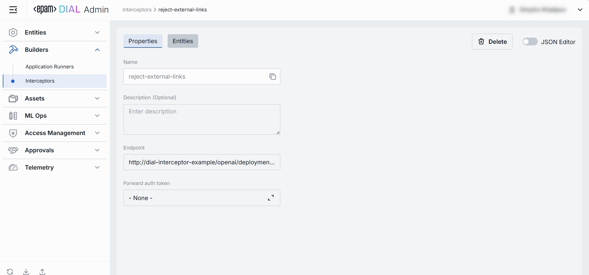
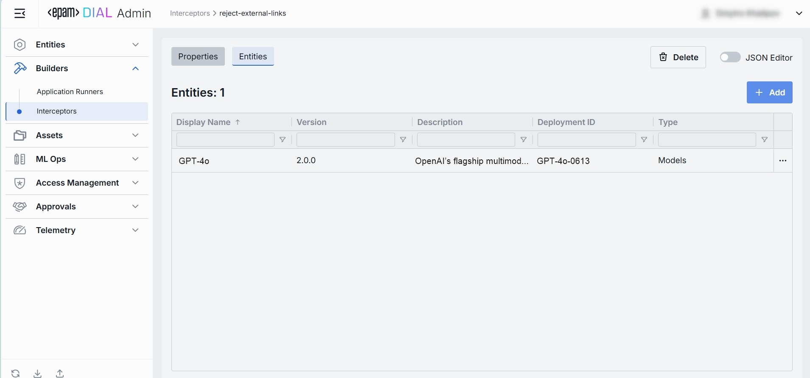
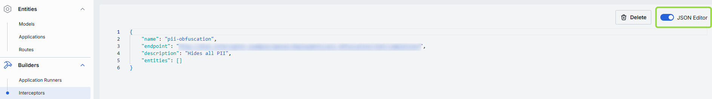

# Interceptors

## About Interceptors

You can add an additional logic into the processing of every request and response for models and apps, enabling PII obfuscation, guardrails, safety checks, and beyond. This is achieved through the integration of pluggable components known as Interceptors. 

> Refer to [Interceptors](/docs/platform/3.core/6.interceptors.md) to learn more.

## Interceptors List

In Interceptors, you can find, manage and add interceptors.

##### Interceptors Grid

| Column          | Definition & Use |
|-----------------|------------------------|
| **Name**        | A unique identifier for the interceptor (e.g. reject-blacklisted-words, audit-logger). This key is used when you attach it to a Model or Application. |
| **Description** | A brief summary of what this interceptor does and any parameters it uses (e.g. BLACKLIST={"foo","bar"} or Logs request/response payloads).          |

## Create

1. Click **+ Create** to invoke the **Create Interceptor** modal.
2. Define interceptor's parameters:

    | Column          | Definition & Use  |
    |-----------------|-------------|
    | **Name**        | A unique identifier of the interceptor (e.g. reject-blacklisted-words, audit-logger). This key is used when you attach it to a Model or Application. |
    | **Description** | A brief summary of what this interceptor does and any parameters it uses (e.g. BLACKLIST={"foo","bar"} or Logs request/response payloads).          |
3. Once all required fields are filled, click **Create**. The dialog closes and the new interceptor [configuration screen](#configuration) is opened. Once added, a new entry appears in the **Interceptors** listing. It may take some time for the changes to take effect after saving.

        

## Configuration

##### Top Bar Controls

* **Delete**: Permanently removes the selected interceptor.
* **JSON Editor** (Toggle): Switch between the form-based UI and raw [JSON view](#json-editor) of the interceptor’s configuration. Use JSON mode for copy-paste or advanced edits.

### Properties

In the Properties tab, you can define metadata and execution endpoints for Interceptors.

| Field  | Required | Definition & Use Case    |
|----------|-----------|--------------|
| **Name**               | Yes   | A unique key for this interceptor (e.g. `reject-external-links`, `audit-logger`). Used when attaching to Models or Applications under their **Interceptors** tab. Keep it URL-safe and lowercase with hyphens.              |
| **Description**        | No        | A free-text summary of the interceptor’s behavior and any configuration parameters (e.g. `BLACKLIST={"foo","bar"}`). Helps to identify the interceptor and its purpose.                                                  |
| **Endpoint**           | Yes   | The URL of the interceptor service. This URL is used to handle requests and responses for the interceptor.                                                                                                                    |
| **Forward Auth Token** | No        | Specify whether to forward an Auth Token to your interceptor's endpoint. Use this when your interceptor service requires its own authentication. |

### Entities

In the Entities tab, you can see to which Models and Applications this interceptor is currently attached. By binding interceptors here, you control exactly which AI endpoints (and in what order) will invoke your custom pre- or post-processing logic.

| Column            | Definition|
| ----------------- | -----------------|
| **Display Name**  | A user-friendly name of the Application/Model (e.g. "Data Clustering Application").                                      |
| **Version**       | The Application’s/Model's version tag (e.g. `v1.0`, `2024-07-15`) as defined in **Entities → Applications/Models → Properties**. |
| **Description**   | Free-text summary of what the Application/Model does.                                                                   |
| **Deployment ID** | A unique alias used in the Application’s/Models' endpoint URL (e.g. `dca`, `support-bot`).                              |

#### Add

1. Click **+ Add** (top-right of the Entities Grid).
2. **Select** one or more apps/models in the modal.
3. **Confirm** to insert them into the table.

#### Remove
 
1. Click the **actions** menu in the entity's line.
2. Choose **Remove** in the menu.

### JSON Editor

For advanced scenarios of bulk updates, copy/paste between environments, or tweaking settings not exposed in the form UI—you can switch to the **JSON Editor** in any interceptor configuration page.

##### Switching to the JSON Editor

1. Navigate to **Builders → Interceptors**, then select the interceptor you want to edit.
2. Click the **JSON Editor** toggle (top-right). The UI reveals the raw JSON.

> **TIP**: You can switch between UI and JSON only if there are no unsaved changes.
