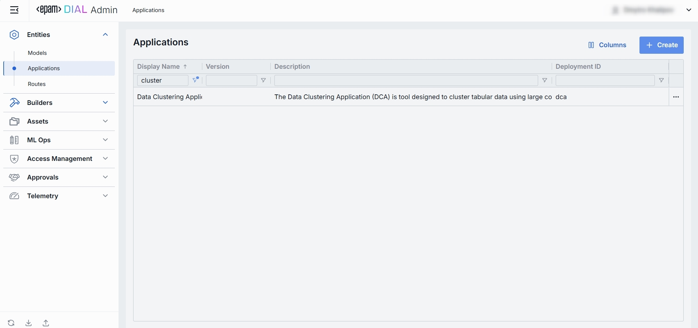
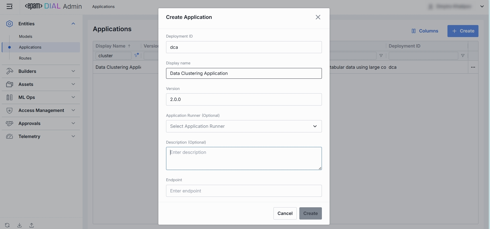
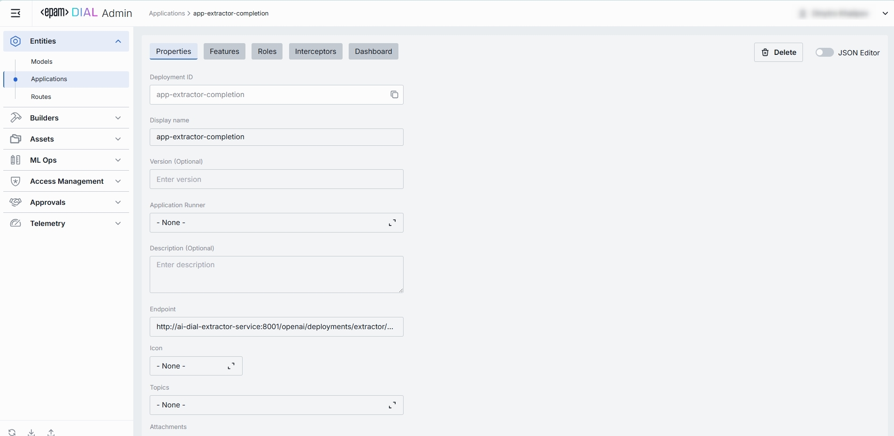
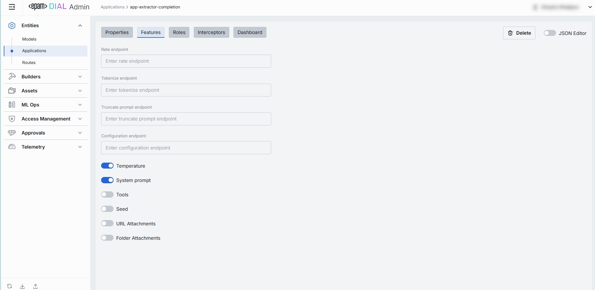
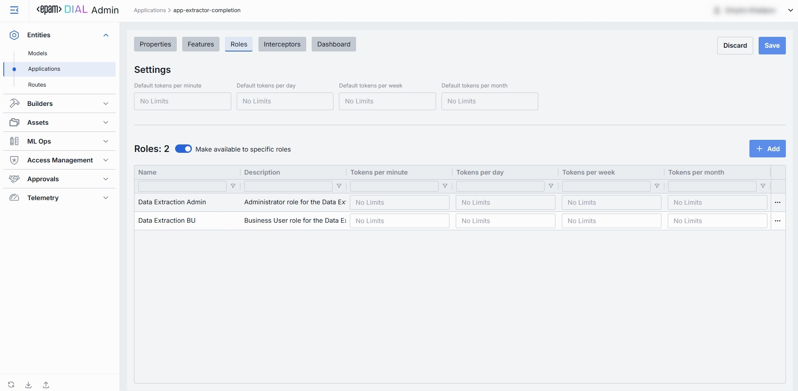
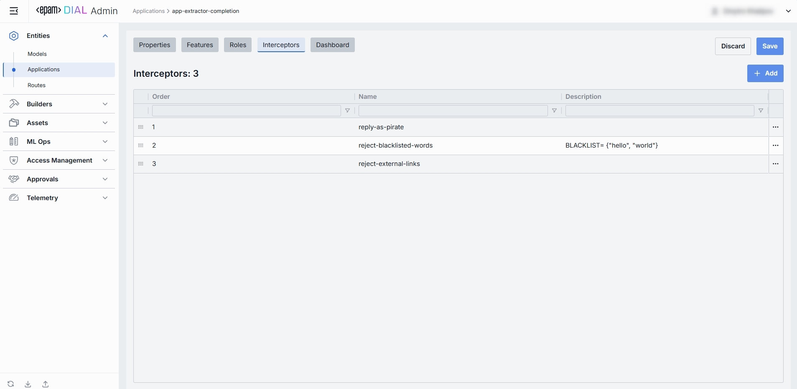
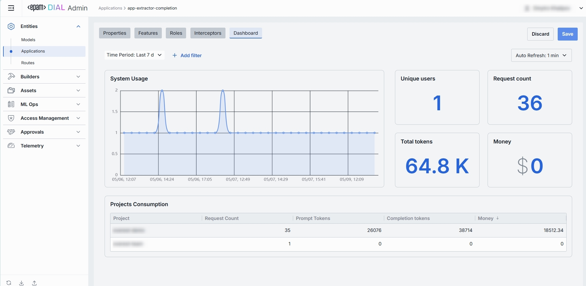
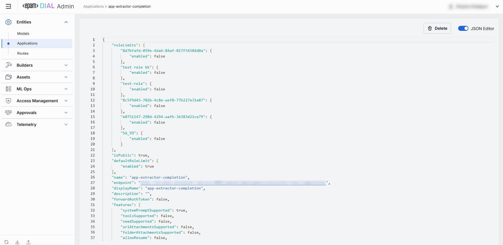

# Applications

## What Is an “Application” in DIAL?

In DIAL, an “application” is any programming logic that conforms to the Unified API of DIAL or registered custom endpoints and is packaged as a ready-to-deploy solution.

DIAL Chat users can engage with applications via standard or fully customized interfaces. Applications can interact via the Unified API or registered custom endpoints, enabling the creation of complex scenarios and utilizing all DIAL features.

You can expand the platform by introducing custom application types to build the applications you need, using the DIAL SDK to streamline the development process.

DIAL platform serves as an application server, offering tools to develop, deploy, and operate custom applications. Applications can be developed using the DIAL SDK to execute any custom logic and can even form an ecosystem and interact with each other through the Unified API with access to all DIAL Core features, including connectivity to models (including multi-modal models), file storage, access control, per-request API keys, and more.

## Typical Use Cases

With DIAL, you can create applications for diverse use cases, such as:
* Analyzing scientific datasets
* Working with medical records and trials
* Automating manual tasks
* Streamlining paperwork and communication
* Many other things that can be done...

## Applications List

The Applications page under Entities shows global/system AI “Applications” you’ve defined in your DIAL instance. 
Use this page to view, filter, and create new orchestrations.

### 1. Navigate to Applications

In the sidebar, expand **Entities** and click **Applications**.

### 2. Applications Grid

**Filtering & Sorting**
* Each column header has sort arrows; click to reorder.
* Beneath each header is a filter box - type text to narrow the list in real time.

| Field                     | Definition                                                                                                                                                                                                    |
|---------------------------|---------------------------------------------------------------------------------------------------------------------------------------------------------------------------------------------------------------|
| **Display Name**          | Human-friendly name of the Application (e.g. “Data Clustering Application”).                                                                                                                                  |
| **Version**               | Version string or tag (e.g. v1, 2024-07-01) - bump this to publish updates without disrupting existing consumers.                                                                                             |
| **Description**           | Brief free-text summary of the Application’s purpose (e.g. “Clusters incoming text into semantic groups”).                                                                                                    |
| **Deployment ID**         | Unique identifier used in the DIAL dynamic config (e.g. dca, support-bot). This is the path segment of the Application’s HTTP endpoint.                                                                       |
| **Endpoint**              | Full URL where the Application is exposed.                                                                                                                                                                    |
| **Topics**                | Tags or categories (e.g. “finance,” “support,” “image-capable”) you can assign for discovery, filtering, or grouping in large deployments. Helps end users and admins find the right application by use case. |
| **Attachment types**      | Controls which file attachments this application can accept.                                                                                                                                                  |
| **Max attachment number** | Maximum number of attachments allowed per single request.                                                                                                                                                     |
| **Forward auth token**    | Whether Auth Token needs to be forwarded from the caller’s session into the upstream API call—enabling multi-tenant scenarios or pass-through authentication to downstream services.                          |

### 3. Customize Visible Columns

Open the column selector to show/hide any table fields. Allows hiding less-relevant columns (e.g. Description) when you just need ID and Display Name info.

## Create Application

Use the **Create Application** dialog to register a new application in your DIAL instance. Once added, it appears in the **Applications** listing.

> It may take some time for the changes to take effect after saving.

### 1. Hit **Create** button 

Opens the **Create Application** modal.

### 2. Define key parameters
In the modal, specify the following for the new application:

| Field                  | Required?       | Definition & Guidance                                                                                                                                          |
|------------------------|-----------------|----------------------------------------------------------------------------------------------------------------------------------------------------------------|
| **Deployment ID**      | **Yes**         | A unique identifier under the applications section of DIAL Core’s dynamic config (e.g. support-bot, data-cluster).                                             |
| **Display Name**       | **Yes**         | Human-friendly label (e.g. “Customer Support Bot”) shown throughout the Admin UI.                                                                              |
| **Version**            | No              | Optional version tag to track releases (e.g. `2024-07-18`, `v1`).                                                                                              |
| **Application Runner** | No              | Application template designed to run multiple applications simultaneously. It is defined by a set of shared properties common to all the applications it runs. |
| **Description**        | No              | Free-text summary of what this Application does (e.g. supported inputs, business purpose).                                                                     |
| **Endpoint**           | **Conditional** | The full URL where this Application’s API will be exposed once created. Not needed if Application Runner selected. Required otherwise.                         |

### 3. Click Create 
Once all required fields are filled hit **Create** button. The dialog closes and the new application configuration screen opened.

  > This entry will appear immediately in the listing once created.

## Application Configuration - Top Bar Controls

* **Delete**: Permanently removes this application. All clients calling its endpoint will receive errors until a replacement is published.
* **JSON Editor** (Toggle): Switch between the form-based UI and raw JSON view of the application’s configuration. Use JSON mode for copy-paste or advanced edits.

## Application Configuration - Properties Tab

The Properties tab on an Application’s detail page lets you define its core identity, routing, UI metadata, and basic runtime controls. 

Once configured, your application is ready to orchestrate models and interceptors behind a single HTTP endpoint.

### 1. Basic Identification

| Field             | Required? | Description                                                                                                                               |
|-------------------|-----------|-------------------------------------------------------------------------------------------------------------------------------------------|
| **Deployment ID** | Yes       | Unique key under applications in DIAL Core’s dynamic config (e.g. data-clustering, support-bot).                                          |
| **Display Name**  | Yes       | Human-friendly label shown in the UI (e.g. “Data Clustering Application”). Helps to identify this application at a glance.                |
| **Version**       | No        | Version tag for rollout management (e.g. `v1.0`, `2024-07-15`). Bump this to publish a new iteration without breaking existing consumers. |
| **Description**   | No        | Free-text summary of the Application’s purpose (e.g. tooling, supported inputs/outputs, SLAs).                                            |

### 2. Execution  & Endpoint

| Field                   | Required?   | Description                                                                                                                                                               |
|-------------------------|-------------|---------------------------------------------------------------------------------------------------------------------------------------------------------------------------|
| **Completion Endpoint** | (Read-only) | URL where the app is exposed. Clients use this to integrate.                                                                                                              |
| **Application Runner**  | No          | Select the application template designed to run multiple applications simultaneously. It is defined by a set of shared properties common to all the applications it runs. |

### 3. Presentation & Attachments

| Field             | Required? | Description                                                                                                                                                                                                                                                                                  |
|-------------------|-----------|----------------------------------------------------------------------------------------------------------------------------------------------------------------------------------------------------------------------------------------------------------------------------------------------|
| **Icon**          | No        | Choose a logo to visually distinguish apps in the UI.                                                                                                                                                                                                                                        |
| **Topics**        | No        | Tag this app with one or more topics or categories (e.g. “finance”, “support”).                                                                                                                                                                                                              |
| **Attachments**   | No        | Control which attachment types (images, files) this app can process:  • **None** – no attachments allowed.  • **All** – unrestricted types. Optionally specify max number of attachments. • **Custom** – enter specific MIME types. Optionally specify max number of attachments. |

### 4. Advanced Options

| Field                  | Required? | Description                                                                                      |
|------------------------|-----------|--------------------------------------------------------------------------------------------------|
| **Forward auth token** | No        | Select a downstream auth token to forward from the user’s session (for multi-tenant downstream). |
| **Max retry attempts** | No        | Number of times DIAL Core will retry a failed run (due to timeouts or 5xx errors).               |
 

## Application Configuration - Features Tab

The Features tab on an Application’s detail page lets you control optional capabilities at the application level. 

> While Model feature flags govern what each LLM integration can do, Application feature flags define which of those capabilities your orchestrated service exposes to clients—plus allow you to plug in custom preprocessing endpoints.

### 1. Custom Feature Endpoints

Override or extend DIAL Core’s built-in protocol calls with your own HTTP services. These endpoints can be used by the Application Runner (e.g. a Python or Node Runner) to perform preprocessing or policy checks before delegating to your underlying models and workflows.

| Field                        | Description & When to Use                                                                                                                                                  |
|------------------------------|----------------------------------------------------------------------------------------------------------------------------------------------------------------------------|
| **Rate endpoint**            | URL to call a custom rate-estimation API. Use this to compute cost or quota usage based on your own logic (e.g. grouping by tenant, complex billing rules).             |
| **Tokenize endpoint**        | URL to call a custom tokenization service. When you need precise, app-wide token counting (for mixed-model or multi-step prompts) that the model adapter can’t provide. |
| **Truncate prompt endpoint** | URL to call your own prompt-truncation API. Handy if you implement advanced context-window management (e.g. dynamic summarization) before the actual model call.        |
| **Configuration endpoint**   | URL to fetch dynamic App-specific settings (e.g. per-tenant max tokens, allowed parameters). Use this to drive runtime overrides from a remote config store.            |

### 2. Feature Flags (Toggles)

Enable or disable per-request options that your Application accepts from clients and forwards to the underlying models.

1. **Toggle On/Off** any feature as needed.
2. Changes take effect immediately after saving.

| Toggle                 | What It Does                                                                                                                                                                         |
|------------------------|--------------------------------------------------------------------------------------------------------------------------------------------------------------------------------------|
| **Temperature**        | Enables the `temperature` parameter in API calls. Disable if you want fixed-deterministic outputs or you hard-code temperature in your workflow.                                     |
| **System prompt**      | Enables an initial “system” or “assistant instruction” message injection. Useful for orchestrating multi-step assistants where you need to enforce a global policy at the App level. |
| **Tools**              | Permits the use of `tools`/`functions` payloads in your API. Switch on if your Application invokes DIAL add-ons or external function calls (e.g. calendar lookup, database fetch).   |
| **Seed**               | Enables the `seed` parameter for reproducible results. Great for testing or deterministic pipelines; disable to ensure randomized creativity. f                                      |
| **URL Attachments**    | Accepts URL references (images, docs) as attachments in API requests. Must be enabled if your workflow downloads or processes remote assets via URL.                                 |
| **Folder Attachments** | Enables support for folder-level attachments (batching multiple files).                                                                                                              |

### 3. How Application Features Differ from Model Features

* **Scope**:
  * **Model Features** apply *per LLM*, controlling what the model endpoint itself supports (e.g. whether GPT-4 can accept system prompts or function calls).
  * **Application Features** apply *per orchestrated service*, governing what your composed workflow will accept and pass through—regardless of which models are called under the hood.

* **Override Capability**:
  * At the **Application** level, you can disable a feature globally (even if models support it) or plug in custom endpoints that sit *above* all models.
  * At the **Model** level, toggles only reflect the true capabilities of that specific LLM integration.

* **Use Cases**:
  * **Model** toggles ensure you don’t accidentally send unsupported parameters to a given model.
  * **Application** toggles let you present a consistent API to your clients (e.g. always accept `temperature` or never allow attachments), even if different underlying models behave differently.

## Application Configuration - Roles Tab

The **Roles** tab controls which user groups can invoke this app and enforces per-role rate limits. 

### 1. Default Rate Limits

Default limits are set for all the roles in the **Roles** grid by default, however can be overridden for any role.

| Field                         | Description                                                                           |
|-------------------------------|---------------------------------------------------------------------------------------|
| **Default tokens per minute** | The maximum tokens any user may consume per minute if no role-specific limit applies. |
| **Default tokens per day**    | The maximum tokens any user may consume per day if no role-specific limit applies.    |
| **Default tokens per week**   | The maximum tokens any user may consume per week if no role-specific limit applies.   |
| **Default tokens per month**  | The maximum tokens any user may consume per month if no role-specific limit applies.  |

### 2. Enable Role-Specific Access

* **Toggle**: **Make available to specific roles**
  * **Off**: App is callable by any authenticated user. All existing roles are in the grid.
  * **On**: App is restricted - only the roles you explicitly add to the grid below may invoke it.

### 3. Roles Grid

Lists the roles having access to the specific app as well as to set individual limits for the distinct roles.

Editing Role Limits:
1. **Click** in the desired cell (e.g., **Tokens per day** for the “ADMIN”).
2. **Enter** a numeric limit or leave blank to set no limits.
3. Click **Reset to default limits** to restore default settings for all roles.
4. Click **Save** to apply changes.

| Column                | Description & Guidance                                                                                                 |
|-----------------------|------------------------------------------------------------------------------------------------------------------------|
| **Name**              | Unique role identifier.                                                                                                |
| **Description**       | Human-readable explanation of the role’s purpose (e.g., “Admin, Prompt Engineer, Developer”).                          |
| **Tokens per minute** | Minute tokens limit for specific role. Blank = no limits. Inherits default value (see above). Can be overridden.       |
| **Tokens per day**    | Daily tokens limit for specific role. Blank = no limits. Inherits default value (see above). Can be overridden.        |
| **Tokens per week**   | Weekly tokens limit for specific role. Blank = no limits. Inherits default value (see above). Can be overridden.       |
| **Tokens per month**  | Monthly tokens limit for specific role. Blank = no limits. Inherits default value (see above). Can be overridden.      |
| **••• (Actions)**     | Additional role-specific actions. • Open role in a new tab. • Make all restrictions unlimited for the given role |

> **Use Cases**:
> • Give your “Admin” role unlimited monthly tokens but throttle “Developer” to 100,000 tokens/day.
> • Allow “External Partner” a small trial quota (e.g., 10,000 tokens/month) before upgrade.

### 4. Adding Role

Role adding is only possible if **Make available to specific roles** toggle is **On**.
1. Click **+ Add** (top-right of the Roles Grid).
2. **Select** one or more roles in the modal.
3. **Confirm** to insert them into the table.

### 5. Removing Role

Role removal is only possible if **Make available to specific roles** toggle is **On**. 
1. Click the actions menu (•••) in the role's line.
2. Choose **Remove** in the menu.

## Application Configuration - Interceptors Tab

Interceptors are lightweight plugins—defined under **Builders → Interceptors** that hook into DIAL Core’s processing pipeline.

The Interceptors tab lets you attach reusable “hooks” that run custom logic before requests enter or after responses leave your Application’s orchestration pipeline. 

Common use cases include use of interceptors to enforce policies, enrich or sanitize payloads, log data, or implement cross-cutting concerns without touching your core business code.

### 1. Interceptors Grid

| Column            | Description                                                                                                  |
| ----------------- |--------------------------------------------------------------------------------------------------------------|
| **Order**         | Execution sequence. Interceptors run in ascending order (1 → 2 → 3...).                                      |
| **Name**          | The interceptor’s alias, matching the **Name** field in its definition.                                      |
| **Description**   | Free-text summary from the interceptor’s definition, explaining its purpose.                                 |
| **•••** (Actions) | Additional role-specific actions. • Open interceptor in a new tab. • Remove interceptor from the model |

> **Order Matters**:
> A request will flow through each interceptor’s in this order; for Response interceptors are invoked in reverse order.

### 2. Adding an Interceptor

1. Click **+ Add** (in the upper-right of the interceptors grid).
2. In the **Add Interceptors** modal, choose one or more from the grid of defined interceptors.
3. **Apply** to append them to the bottom of the list (are added in the same order as selected in the modal).

> If you need a new interceptor, first create it under **Builders → Interceptors**, then revisit this tab to attach it.

### 3. Reordering Interceptors

1. **Drag & Drop** the handle (⋮⋮⋮⋮) on the left of the row to reassign its **Order**.
2. Release to reposition; order renumbers automatically.
3. **Save** to lock in the new execution sequence.

### 4. Removing Interceptor

1. Click the actions menu (•••) in the interceptor's row.
2. Choose **Remove** in the menu to detach it from this app.
3. **Save** to lock in the interceptors list.

### How Application Interceptors Differ from Model Interceptors

* **Scope of Invocation**:
  * **Model** Interceptors fire around each individual model call (i.e. before/after the LLM invocation).
  * **Application** Interceptors wrap the entire orchestrated workflow—including multi-model sequences, add-ons, and branching logic.

* **Use Cases**:
  * **Model-level** hooks are ideal for prompt “pre-processing” or response transformations specific to a single LLM.
  * **Application-level** hooks manage cross-cutting concerns across your whole Application (e.g., tenant-based routing, unified logging, end-to-end policy enforcement).

## Application Configuration - Dashboard Tab

The **Dashboard** tab provides real-time and historical metrics for the app, so you can monitor usage patterns, enforce SLAs, optimize costs, and troubleshoot anomalies.

### 1. Top Bar Controls

| Control                | What It Does                                                                                 |
| ---------------------- |----------------------------------------------------------------------------------------------|
| **Time Period**        | Choose the date range for all charts and tables (e.g. last 15 min, 2 days, 7 days, 30 days). |
| **+ Add filter**       | Drill into specific subsets by adding filters on Projects.                                   |
| **Auto refresh**       | Set the dashboard to poll for new data (e.g. every 1 min) or turn off auto-refresh.          |

### 2. System Usage Chart
* **What it shows**: A time-series line chart of request throughput over your selected period.

* **Metrics plotted**:
  * Requests per interval (auto-defined)

* **Use cases**:
  * Spot traffic peaks and valleys
  * Correlate spikes with deployments or feature rollouts

### 2. Key Metrics

Displayed alongside the chart are four high-level metrics. All calculated for the user-selected period:

| Metric            | Definition                                                        |
|-------------------|-------------------------------------------------------------------|
| **Unique Users**  | Count of distinct user IDs or API keys that have called this app. |
| **Request Count** | Total number of chat or embedding calls routed to this app.       |
| **Total Tokens**  | Sum of prompt + completion tokens consumed by this app.           |
| **Money**         | Estimated spending on this app.                                   |

> **Use cases**:
> * Charge back to internal teams or external customers by “Money.”
> * Track adoption via “Unique Users.”
> * Monitor burst traffic with “Request Count.”
> * Watch token consumption to anticipate quota exhaustion.

### 3. Projects Consumption Table

Below the KPIs is a breakdown table showing consumption by **Project**:

| Column                | Description                                               |
|-----------------------|-----------------------------------------------------------|
| **Project**           | The entity utilizing this app.                            |
| **Request Count**     | Number of calls directed to the app.                      |
| **Prompt tokens**     | Total tokens submitted in the prompt portion of requests. |
| **Completion tokens** | Total tokens returned by the app as responses.            |
| **Money**             | Estimated cost.                                           |

>**Use cases**:
>  * Compare consumption across multiple fine-tune versions.
>  * Spot cost-inefficient deployments that should be retired or optimized.

## Application Configuration - Editing via JSON Editor

For advanced scenarios of bulk updates, copy/paste between environments, or tweaking settings not exposed in the form UI—you can switch to the **JSON Editor** in any app’s configuration page.

### 1. Switching to the JSON Editor

1. Navigate to **Entities → Applications**, then select the app you want to edit.
2. Click the **JSON Editor** toggle (top-right). The UI reveals the raw JSON.

> **Tip**: You can switch between UI and JSON only if there are no unsaved changes.

