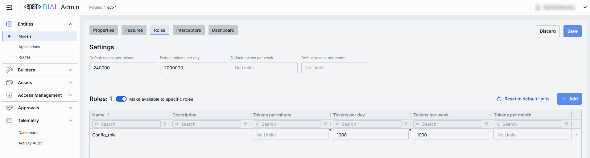

# Models

## Introduction

Model refers to the various language models (LLMs) that the platform supports. DIAL allows you to access models from all major LLM providers, language models from the open-source community, alternative vendors, and fine-tuned micro models, as well as self-hosted models or models listed on HuggingFace or DeepSeek.

You can use the DIAL SDK to create custom model adapters. Applications and model adapters implemented using this framework will be compatible with the DIAL API that was designed based on the Azure OpenAI API.

## Typical Use Cases

DIAL can function as an agentic platform, where models can be used as building blocks in your apps to create multi-modal and multi-agentic solutions. It offers unified access to all popular LLMs from various cloud providers and the open-source community with the support of cost engineering, multi-modality, data loss prevention, drift detection, validation of responses, regression testing, and other useful features.

## Models List

The **Models** page under **Entities** shows all LLM integrations (“models”) configured for your DIAL instance. Here you can view, filter, and add new model definitions that DIAL Core will route chat or embedding requests to.

##### Navigate to models

In the sidebar, expand **Entities** and click **Models**.

##### Models grid

**Filtering & Sorting**

* Each column header has sort arrows; click to reorder.
* Beneath each header is a filter box - type text to narrow the list in real time.

| Field                     | Definition                                                                                                                                                                                                                                                                                                                                                                                                   |
|---------------------------|--------------------------------------------------------------------------------------------------------------------------------------------------------------------------------------------------------------------------------------------------------------------------------------------------------------------------------------------------------------------------------------------------------------|
| **Display Name**          | User-friendly label for this model (e.g. “GPT-4 Turbo”). Shown in all DIAL client UI dropdowns, tables, and logs so operators can quickly identify the model.                                                                                                                                                                                                                                               |
| **Version**               | Optional tag or label for this model deployment (e.g. `0613`, `v1`). Use it to distinguish between “latest,” “beta,” or date-stamped builds.                                                                                                                                                                                                                                                                 |
| **Description**           | Free-text notes about this model’s purpose, training data, cost tier, or any other relevant details.                                                                                                                                                                                                                                                                                                         |
| **Deployment ID**         | The unique key under the `models` section of DIAL Core’s config. Must match the upstream service’s model or deployment name (e.g. `gpt-4-0613`).                                                                                                                                                                                                                                                             |
| **Adapter**               | Which connector handles requests for this model (**OpenAI** or **DIAL**). The adapter provides authentication, request formatting, and response parsing for the underlying LLM API.  More details here: https://docs.dialx.ai/platform/supported-models#llm-adapters                                                                                                                                      |
| **Type**                  | Whether this entry is a **Chat** model (conversational completions) or an **Embedding** model (vector generation). DIAL Core uses this to choose the correct API endpoint and payload schema.                                                                                                                                                                                                                |
| **Override Name**         | An optional, context-specific display label that supersedes **Display Name** in dropdowns or tables for certain routes or applications. Use it to give a model different aliases in different workflows without redefining the model.                                                                                                                                                                        |
| **Topics**                | Tags or categories (e.g. “finance,” “support,” “image-capable”) you can assign for discovery, filtering, or grouping in large deployments. Helps end users and admins find the right model by use case.                                                                                                                                                                                                      |
| **Attachment types**      | Controls which file attachments this model can accept.                                                                                                                                                                                                                                                                                                                                                       |
| **Max attachment number** | Maximum number of attachments allowed per single request. Leave blank for no limits. Prevents runaway requests with too many files.                                                                                                                                                                                                                                                                          |
| **Tokenizer model**       | Identifies the specific model whose tokenization algorithm exactly matches that of the referenced model. This is typically the name of the earliest released model in a series of models sharing an identical tokenization algorithm. This parameter is essential for DIAL clients that reimplement tokenization algorithms on their side, instead of utilizing the tokenize Endpoint provided by the model. |
| **Forward auth token**    | Optionally select to forward Auth Token from the caller’s session into the upstream API call—enabling multi-tenant scenarios or pass-through authentication to downstream services.                                                                                                                                                                                                                          |
| **Interaction limit**     | The interaction limit parameter in models refers to the maximum number of tokens that can be transmitted in a completion request and response combined. This parameter ensures that the model does not exceed a specified token limit during interactions.                                                                                                                                                   |
| **Prompt price**          | Cost per unit (according to **Cost unit**, typically “token” or “request”) applied to the *input* portion of each call. Used by the **Dashboard** and **Usage Logs** to estimate spend in real time.                                                                                                                                                                                                         |
| **Completion price**      | Cost per unit charged for the *output* portion of each call. Together with **Prompt price**, drives your per-model spend calculations.                                                                                                                                                                                                                                                                       |

##### Customize visible columns

Open the column selector to show/hide any table fields. Allows hiding less-relevant columns (e.g. Description) when you just need IDs and adapter info.

## Create Model

Use the **Create Model** dialog to register a new LLM integration in your DIAL instance. Once added, the model appears in the **Models** listing and can be targeted by Routes and Applications.

> It may take some time for the changes to take effect after saving.

##### Step 1: Hit Create button 

Opens the **Create Model** modal.

##### Step 2: Define key parameters

In the modal, specify the following for the new model:

| Field             | Required? | Definition & Guidance                                                                                                                                          |
|-------------------|-----------|----------------------------------------------------------------------------------------------------------------------------------------------------------------|
| **Deployment ID** | **Yes**   | Unique identifier used by the adapter to invoke your model backend.                                                                                            |
| **Display Name**  | **Yes**   | User-friendly label shown across the UI (e.g. “GPT-4 Turbo”).                                                                                                 |
| **Version**       | No        | Optional version tag to track releases (e.g. `2024-07-18`, `v1`). Use when you register multiple variants of the same model.                                   |
| **Description**   | No        | Free-text note about the model’s purpose or distinguishing traits.                                                                                             |
| **Adapter**       | **Yes**   | Select which Adapter will handle requests to this model (e.g. OpenAI, DIAL). The chosen Adapter supplies authentication, endpoint URL, and request formatting. |

  > This entry will appear immediately in the listing once saved.

##### Step 3: Click Create 

Once all required fields are filled hit **Create** button. The dialog closes and the new model configuration screen opened.

## Model Configuration

### Top Bar Controls

* **Delete**
  Permanently removes this model definition from DIAL Core. All Routes referencing it will error until a replacement is created.

* **JSON Editor** (Toggle)
  Switch between the form-based UI and raw JSON view of the model’s configuration. Use JSON mode for copy-paste or advanced edits.

### Properties Tab

The **Properties** tab on a Model’s detail page lets you view and edit the core definition and runtime settings. 

#### Basic Identification

| Field             | Required? | Description                                                                                                                                                                                      |
|-------------------|-----------|--------------------------------------------------------------------------------------------------------------------------------------------------------------------------------------------------|
| **Deployment ID** | Yes       | The unique key DIAL uses under the `models` section.   Must match the upstream’s deployment or model name (e.g. `gpt-4o`, `gpt-4-turbo`).  Routes refer to this ID when selecting a model. |
| **Display Name**  | Yes       | User-readable label shown in tables and dropdowns in DIAL client (e.g. “GPT-4o”).   Helps users pick the right model.                                                                        |
| **Version**       | No        | Optional tag for tracking releases (e.g. `0613`, `v1`).   Useful for A/B testing or canary rollouts.                                                                                          |
| **Description**   | No        | Free-text note on the model’s purpose, fine-tune details, or cost tier.                                                                                                                          |

#### Adapter & Endpoint

| Field        | Required? | Description                                                                                                                                                           |
|--------------|-----------|-----------------------------------------------------------------------------------------------------------------------------------------------------------------------|
| **Adapter**  | Yes       | Selects which Adapter (connector) handles requests (e.g. **OpenAI**, **DIAL**).   Adapter defines how to authenticate, format payloads, and parse responses.       |
| **Type**     | Yes       | Choose between **Chat** or **Embedding** API.  • **Chat** for conversational completions.  • **Embedding** for vector generation (semantic search, clustering). |
| **Endpoint** | Yes       | Read-only URL that DIAL will invoke for this model/type.   Auto-populated by the Adapter and deploymentId when the model was created.                              |

#### Presentation & Attachments

| Field             | Required? | Description                                                                                                                                                                                                                                                                                  |
|-------------------|-----------|----------------------------------------------------------------------------------------------------------------------------------------------------------------------------------------------------------------------------------------------------------------------------------------------|
| **Override Name** | No        | Custom display name for specific contexts.                                                                                                                                                                                                                                                   |
| **Icon**          | No        | Choose a logo to visually distinguish models in the UI.                                                                                                                                                                                                                                      |
| **Topics**        | No        | Tag this model with one or more topics or categories (e.g. “finance”, “support”).                                                                                                                                                                                                            |
| **Attachments**   | No        | Control which attachment types (images, files) this model can process:  • **None** – no attachments allowed.  • **All** – unrestricted types. Optionally specify max number of attachments. • **Custom** – enter specific MIME types. Optionally specify max number of attachments. |

#### Upstream Configuration

| Field                  | Required? | Description                                                                                                                                                                                                       |
|------------------------|-----------|-------------------------------------------------------------------------------------------------------------------------------------------------------------------------------------------------------------------|
| **Upstream Endpoints** | Yes       | One or more backend URLs to send requests to.  Enables round-robin load balancing or fallback among multiple hosts.                                                                                            |
| **Keys**               | No        | API key, token, or credential passed to the upstream.  Stored securely and masked—click the eye icon to reveal.                                                                                                |
| **Weight**             | Yes       | Numeric weight for this endpoint in a multi-upstream scenario.  Higher = more traffic share.                                                                                                                   |
| **Tier**               | No        | Specifies an endpoint group. In a regular scenario, all requests are routed to endpoints with the lowest tier, but in case of an outage or hitting the limits, the next one in the line helps to handle the load. |
| **Extra Data**         | No        | Free-form JSON or string metadata passed to the Adapter on each request.                                                                                                                                          |
| **+ Add Upstream**     | —         | Click to register additional endpoints if you need fail-over or capacity scaling.                                                                                                                                 |

#### Advanced Options

| Field                  | Required? | Description                                                                                                                                                                                                                                                                                                                                                                                                                                                                                                                                                                                                                            |
|------------------------|-----------|----------------------------------------------------------------------------------------------------------------------------------------------------------------------------------------------------------------------------------------------------------------------------------------------------------------------------------------------------------------------------------------------------------------------------------------------------------------------------------------------------------------------------------------------------------------------------------------------------------------------------------------|
| **Tokenizer Model**    | No        | Identifies the specific model whose tokenization algorithm exactly matches that of the referenced model. This is typically the name of the earliest released model in a series of models sharing an identical tokenization algorithm. This parameter is essential for DIAL clients that reimplement tokenization algorithms on their side, instead of utilizing the tokenize Endpoint provided by the model.                                                                                                                                                                                                                           |
| **Forward auth token** | No        | Select a downstream auth token to forward from the user’s session (for downstream multi-tenant).                                                                                                                                                                                                                                                                                                                                                                                                                                                                                                                                       |
| **Interaction limit**  | No        | This parameter ensures that the model does not exceed a specified token limit during interactions.  • **None** - DIAL applies no additional interaction‐limit beyond whatever your model enforces natively. Ideal for early prototyping or when you trust the LLM’s built-in safeguards. • **Total Number of Tokens** - enforces a single, cumulative cap on the sum of all prompt + completion tokens across the entire chat. • **Separately Prompts and Completions** - two independent limits: one on the sum of all input (prompt) tokens and another on the sum of all output (completion) tokens over the conversation. |
| **Max retry attempts** | No        | How many times DIAL Core will retry on upstream errors (e.g. on timeouts or 5xx responses).                                                                                                                                                                                                                                                                                                                                                                                                                                                                                                                                            |

#### Cost Configuration
Enables real-time cost estimation and quota enforcement. Powers the **Telemetry** dashboards with per-model spend metrics.

| Field                | Required? | Description                                                                                                                                                                                                                                                                                                                                    |
|----------------------|-----------|------------------------------------------------------------------------------------------------------------------------------------------------------------------------------------------------------------------------------------------------------------------------------------------------------------------------------------------------|
| **Cost unit**        | Yes       | Base unit for billing: • **None** - disables all cost tracking for this model. • **Tokens** - every token sent or received by the model is counted towards your cost metrics. • **Char without whitespace** - tells DIAL to count only non-whitespace characters (letters, numbers, punctuation) in each request as the billing unit. |
| **Prompt price**     | Yes       | Cost per unit for prompt tokens.                                                                                                                                                                                                                                                                                                               |
| **Completion price** | Yes       | Cost per unit for completion tokens (chat responses).                                                                                                                                                                                                                                                                                          |

### Features Tab

The **Features** tab lets you enable, disable, or override optional capabilities for a specific model. Use this to tailor DIAL Core’s Unified Protocol behavior—turning features on when your model supports them, or off when it doesn’t.

#### Custom Feature Endpoints

Some adapters expose specialized HTTP endpoints for tokenization, rate estimation, prompt truncation, or live configuration. You can override the default Unified Protocol calls by specifying these here.

| Field                        | Description & When to Use                                                                                                                                                                 |
|------------------------------|-------------------------------------------------------------------------------------------------------------------------------------------------------------------------------------------|
| **Rate endpoint**            | URL to invoke the model’s cost‐estimation or billing API. • Call an endpoint that returns token counts & credit usage. • Override if your adapter supports a dedicated “rate” path. |
| **Tokenize endpoint**        | URL to invoke a standalone tokenization service. • Use when you need precise token counts before truncation or batching. • Models without built-in tokenization require this.       |
| **Truncate prompt endpoint** | URL to invoke a prompt‐truncation API. • Ensures prompts are safely cut to max context length. • Useful when working with very long user inputs.                                    |
| **Configuration endpoint**   | URL to fetch model‐specific settings (e.g. max tokens, allowed parameters). • Only enable for “configurable” deployments.                                                              |

#### Feature Flags (Toggles)

Each toggle corresponds to a capability in the Unified Protocol. Switch them on only if your model and adapter fully support that feature.

**Toggle On/Off** any feature as needed:

| Toggle                 | What It Does                                                                                                                                                 |
|------------------------|--------------------------------------------------------------------------------------------------------------------------------------------------------------|
| **Temperature**        | Enables the `temperature` parameter in API calls. Controls randomness vs. determinism.                                                                       |
| **System prompt**      | Allows injecting a system‐level message (the “assistant’s instructions”) at the start of every chat. Disable for models that ignore or block system prompts. |
| **Tools**              | Enables the `tools` (a.k.a. functions) feature for safe external API calls. Switch on if you plan to use DIAL Add-ons or function calling.                   |
| **Seed**               | Enables the `seed` parameter for deterministic output. Use in testing or reproducible workflows.                                                             |
| **URL Attachments**    | Allows passing URLs as attachments (images, docs) to the model. Required for image-based or file-referencing prompts.                                        |
| **Folder Attachments** | Enables support for folder-level attachments (batching multiple files).                                                                                      |

### Tips

* **Start Minimal**: Enable only the features you need. Extra toggles can cause errors if upstream doesn’t support them.
* **Validate Endpoints**: After setting a custom endpoint, test it via a simple API call to confirm accessibility and authentication.

### Roles Tab

The **Roles** tab controls which user groups can invoke this model and enforces per-role rate limits. 
This is essential for multi-tenant governance, quota enforcement, and cost control across teams or customers, preventing runaway costs by enforcing a hard ceiling.

#### Default Rate Limits

Default limits are set for all the roles in the **Roles** grid by default, however can be overridden for any role.

| Field                         | Description                                                                           |
|-------------------------------|---------------------------------------------------------------------------------------|
| **Default tokens per minute** | The maximum tokens any user may consume per minute if no role-specific limit applies. |
| **Default tokens per day**    | The maximum tokens any user may consume per day if no role-specific limit applies.    |
| **Default tokens per week**   | The maximum tokens any user may consume per week if no role-specific limit applies.   |
| **Default tokens per month**  | The maximum tokens any user may consume per month if no role-specific limit applies.  |

#### Enable Role-Specific Access

* **Toggle**: **Make available to specific roles**
  * **Off**: Model is callable by any authenticated user. All existing roles are in the grid.
  * **On**: Model is restricted - only the roles you explicitly add to the grid below may invoke it.

#### Roles Grid

Lists the roles having access to the specific model as well as to set individual limits for the distinct roles.

Editing Role Limits:
1. **Click** in the desired cell (e.g., **Tokens per day** for the “ADMIN”).
2. **Enter** a numeric limit or leave blank to set no limits.
3. Click **Reset to default limits** to restore default settings for all roles.
4. Click **Save** to apply changes.

| Column                | Description & Guidance                                                                                                    |
|-----------------------|---------------------------------------------------------------------------------------------------------------------------|
| **Name**              | Unique role identifier.                                                                                                   |
| **Description**       | User-readable explanation of the role’s purpose (e.g., “AI-DIAL Prompt Engineering Team”).                               |
| **Tokens per minute** | Minute tokens limit for specific role. Blank = no limits. Inherits default value (see above). Can be overridden.          |
| **Tokens per day**    | Daily tokens limit for specific role. Blank = no limits. Inherits default value (see above). Can be overridden.           |
| **Tokens per week**   | Weekly tokens limit for specific role. Blank = no limits. Inherits default value (see above). Can be overridden.          |
| **Tokens per month**  | Monthly tokens limit for specific role. Blank = no limits. Inherits default value (see above). Can be overridden.         |
| **••• (Actions)**     | Additional role-specific actions. • Open role in a new tab. • Set all restrictions to no limits for the given role. |

> **Use Cases**:
> • Give your “Admin” role unlimited monthly tokens but throttle “Developer” to 100,000 tokens/day.
> • Allow “External Partner” a small trial quota (e.g., 10,000 tokens/month) before upgrade.

#### Adding Role

Role adding is only possible if **Make available to specific roles** toggle is **On**.
1. Click **+ Add** (top-right of the Roles Grid).
2. **Select** one or more roles in the modal.
3. **Confirm** to insert them into the table.

#### Removing Role

Role removal is only possible if **Make available to specific roles** toggle is **On**. 
1. Click the actions menu (•••) in the role's line.
2. Choose **Remove** in the menu.

### Interceptors Tab

Use the **Interceptors** tab to attach custom logic before requests go out to your LLM. Interceptors let you modify inputs, enforce policies, transform outputs, or record metrics on a per-model basis.

Interceptors are lightweight plugins—defined under **Builders → Interceptors** that hook into DIAL Core’s processing pipeline. Common use cases include:

* **Prompt Engineering**  Inject or rewrite user queries (e.g. add a “You are a prompt engineer” system message).
* **Content Moderation**  Filter or block inputs/outputs based on custom rules or external services.

#### Interceptors Grid

| Column            | Description                                                                                                  |
| ----------------- |--------------------------------------------------------------------------------------------------------------|
| **Order**         | Execution sequence. Interceptors run in ascending order (1 → 2 → 3...).                                      |
| **Name**          | The interceptor’s alias, matching the **Name** field in its definition.                                      |
| **Description**   | Free-text summary from the interceptor’s definition, explaining its purpose.                                 |
| **•••** (Actions) | Additional role-specific actions. • Open interceptor in a new tab. • Remove interceptor from the model |

> **Order Matters**:
> A request will flow through each interceptor’s in this order; for Response interceptors are invoked in reverse order.

#### Adding an Interceptor

1. Click **+ Add** (in the upper-right of the interceptors grid).
2. In the **Add Interceptors** modal, choose one or more from the grid of defined interceptors.
3. **Apply** to append them to the bottom of the list (are added in the same order as selected in the modal).

> If you need a new interceptor, first create it under **Builders → Interceptors**, then revisit this tab to attach it.

#### Reordering Interceptors

1. **Drag & Drop** the handle (⋮⋮⋮⋮) on the left of the row to reassign its **Order**.
2. Release to reposition; order renumbers automatically.
3. **Save** to lock in the new execution sequence.

#### Removing Interceptor

1. Click the actions menu (•••) in the interceptor's row.
2. Choose **Remove** in the menu to detach it from this model.
3. **Save** to lock in the interceptors list.

### Dashboard Tab

The **Dashboard** tab provides real-time and historical metrics for the model, so you can monitor usage patterns, enforce SLAs, optimize costs, and troubleshoot anomalies.

#### Top Bar Controls

| Control                | What It Does                                                                                 |
| ---------------------- |----------------------------------------------------------------------------------------------|
| **Time Period**        | Choose the date range for all charts and tables (e.g. last 15 min, 2 days, 7 days, 30 days). |
| **+ Add filter**       | Drill into specific subsets by adding filters on Projects.                                   |
| **Auto refresh**       | Set the dashboard to poll for new data (e.g. every 1 min) or turn off auto-refresh.          |

#### System Usage Chart
* **What it shows**: A time-series line chart of request throughput over your selected period.

* **Metrics plotted**:
  * Requests per interval (auto-defined)

* **Use cases**:
  * Spot traffic peaks and valleys
  * Correlate spikes with deployments or feature rollouts

#### Key Metrics

Displayed alongside the chart are four high-level metrics. All calculated for the user-selected period:

| Metric            | Definition                                                          |
|-------------------|---------------------------------------------------------------------|
| **Unique Users**  | Count of distinct user IDs or API keys that have called this model. |
| **Request Count** | Total number of chat or embedding calls routed to this model.       |
| **Total Tokens**  | Sum of prompt + completion tokens consumed by this model.           |
| **Money**         | Estimated spending on this model.                                   |

> **Use cases**:
> * Charge back to internal teams or external customers by “Money.”
> * Track adoption via “Unique Users.”
> * Monitor burst traffic with “Request Count.”
> * Watch token consumption to anticipate quota exhaustion.

#### Projects Consumption Table

Below the KPIs is a breakdown table showing consumption by **Project**:

| Column                | Description                                               |
|-----------------------|-----------------------------------------------------------|
| **Project**           | The entity utilizing this model.                          |
| **Request Count**     | Number of calls directed to the model.                    |
| **Prompt tokens**     | Total tokens submitted in the prompt portion of requests. |
| **Completion tokens** | Total tokens returned by the model as responses.          |
| **Money**             | Estimated cost.                                           |

>**Use cases**:
>  * Compare consumption across multiple projects.

### Editing via JSON Editor

For advanced scenarios of bulk updates, copy/paste between environments, or tweaking settings not exposed in the form UI—you can switch to the **JSON Editor** in any model’s configuration page.

#### Switching to the JSON Editor

1. Navigate to **Entities → Models**, then select the model you want to edit.
2. Click the **JSON Editor** toggle (top-right). The UI reveals the raw JSON.

> **Tip**: You can switch between UI and JSON only if there are no unsaved changes.