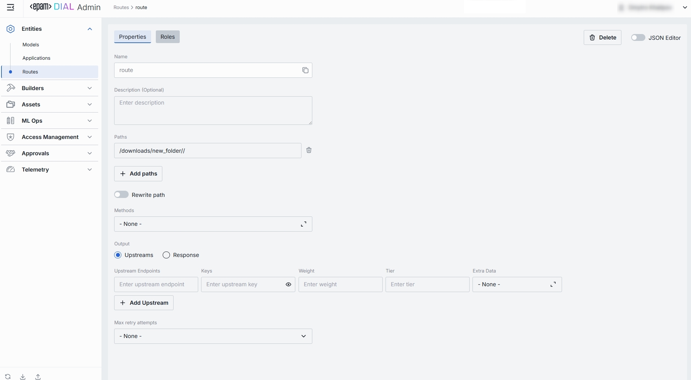

# Routes

## About Routes

Routes in DIAL are used for communication through registered endpoints in the [DIAL Core](/docs/platform/3.core/0.about-core.md). They act as a bridging mechanism between the DIAL Core and external applications, facilitating seamless interactions. Once a route with a designated endpoint is set up in DIAL Core, it allows client applications, such as DIAL Chat, to interact with this endpoint. Essentially, DIAL Core functions as an intermediary, handling authentication and authorization between the client and the external application linked to the route.

## Routes List

In Routes, you can manage all of your request‐routing definitions in one place. Use this page to view, filter, and create new artefact.

##### Routes grid

| Field           | Definition                                        |
|-----------------|---------------------------------------------------|
| **Name**        | User-friendly name of the Route.                 |
| **Description** | Brief free-text summary of the Route’s purpose.   |

## Create

Use the **Create Route** dialog to register a new route in your DIAL instance. Once added, it appears in the **Route** listing.

> It may take some time for the changes to take effect after saving.

##### To create a new route

1. Click **Create**to invoke the **Create Route** modal.
2. Define rout's parameters

    | Field           | Required        | Definition                                                   |
    |-----------------|------------------|----------------------------------------------------------------------|
    | **Name**        | Yes          | User-friendly name of the Route.                                    |
    | **Description** | No               | Brief free-text summary of the Route’s purpose.                      |
    | **Paths**       | Yes          | URL path pattern this route should match (e.g. `/chat`, `/support/`). |

3. Once all required fields are filled click **Create**. The dialog closes and the new [route configuration](#route-configuration) screen opened.

    > This entry will appear immediately in the listing once created.

## Route Configuration

##### Top Bar Controls

* **Delete**: Permanently removes this route. Any client calls to this path will return 404 until a new route is created.
* **JSON Editor** (Toggle): Switch between the form-based UI and raw [JSON view](#json-editor) of the route’s configuration. Use JSON mode for copy-paste or advanced edits.

### Properties

In the Properties tab, you can define the identity and routing behavior. 

##### Basic Identification

| Field            | Required | Definition                                                                          |
|------------------|-----------|-------------------------------------------------------------------------------------|
| **Name**         | Yes   | Unique route key used in the URL and dynamic config (e.g. `chat`, `support`).       |
| **Description**  | No        | Free‐text note about the route’s purpose (e.g. “Primary GPT-4 chat with fallback”). |                                                                      |
 
##### Request Matching: Paths & Methods

| Field            | Required | Definition  |
|------------------|-----------|------------|
| **Paths**        | Yes   | One or more URL path patterns this route should match (e.g. `/chat`, `/support/**`). Click **+ Add paths** to register additional patterns. Click the trash icon to remove a path.      |
| **Rewrite path** | No        | Toggle on to strip or transform the incoming path before forwarding upstream. Use when your upstream service expects a different URL structure (e.g. remove `/api/v1/routes/chat` prefix). |
| **Methods**      | No        | Select one or more HTTP verbs (GET, POST, PUT, DELETE, etc.) the route will accept.            |
 
##### Output Mode

Choose how the route should respond:

| Option        | Definition |
|---------------|-------------|
| **Upstreams** | Forwards matching requests to one or more upstream endpoints (Models or Applications).                        |
| **Response**  | Returns a static, pre-defined payload—no upstream call is made. (Useful for health checks or mock responses.) |

##### Upstream Configuration

Define where and how to forward requests when **Upstreams** mode is selected:

| Field                  | Required | Description & Use Case  |
|------------------------|-----------|-------------------------|
| **Upstream Endpoints** | Yes   | Full URLs of the back-end service(s) to receive the routed request (e.g. `https://dial-core.example.com/v1/chat`).  |
| **Keys**               | No        | API key or token to attach (via header or query) when calling the upstream. Click the eye icon to reveal a masked value. |
| **Weight**             | No        | Relative traffic weight for load balancing among multiple endpoints (higher = more traffic).                        |
| **Tier**               | No        | Specifies an endpoint group. In a regular scenario, all requests are routed to endpoints with the lowest tier, but in case of an outage or hitting the limits, the next one in the line helps to handle the load.  |
| **Extra Data**         | No        | Select a named JSON blob (from **Assets → Files**) to attach as metadata for the upstream adapter.                  |
| **+ Add Upstream**     | —         | Append additional endpoints for failover or capacity scaling.                                                       |

##### Response Configuration

Define where and how to forward requests when **Response** mode is selected:

| Field                  | Required | What It Does                                                                                          |
|------------------------|-----------|-------------------------------------------------------------------------------------------------------|
| **Status**             | No        | The HTTP status code your route will return (e.g. `200`, `404`, `503`).                               |
| **Body**               | No        | The exact payload to send in the response body. You can enter plain text or raw JSON.                 |
| **Max retry attempts** | No        | *(Optional)* Determines how many times DIAL will retry the static‐response logic on internal errors.  |

### Roles

In the **Roles** tab, you can define user groups that can invoke this route and define rate limits applicable to routes.

**Roles grid columns:**

| Column                | Description & Guidance  |
|-----------------------|------------------------------------------------------------------------------------------------------------------------|
| **Name**              | Unique role identifier. |
| **Description**       | User-friendly explanation of the role’s purpose (e.g., “Admin, Prompt Engineer, Developer”).                          |
| **Tokens per minute** | Minute tokens limit for specific role. Blank = no limits. Inherits default value (see above). Can be overridden.       |
| **Tokens per day**    | Daily tokens limit for specific role. Blank = no limits. Inherits default value (see above). Can be overridden.        |
| **Tokens per week**   | Weekly tokens limit for specific role. Blank = no limits. Inherits default value (see above). Can be overridden.       |
| **Tokens per month**  | Monthly tokens limit for specific role. Blank = no limits. Inherits default value (see above). Can be overridden.      |
| **Actions**     | Additional role-specific actions.   Open role in a new tab.   Make all restrictions unlimited for the given role |

#### Set Rate Limits

The grid on the Roles screen lists the roles that can access a specific route. Here, you can also set individual limits for selected roles. For example, you can the "Admin" role unlimited monthly tokens but throttle "Developer" to 100,000 tokens/day or allow the "External Partner" role a small trial quota (e.g., 10,000 tokens/month) before upgrade.

**To set or change rate limits for a role:**

1. **Click** in the desired cell (e.g., **Tokens per day** for the “ADMIN”).
2. **Enter** a numeric limit or leave blank to set no limits.
3. Click **Reset to default limits** to restore default settings for all roles.
4. Click **Save** to apply changes.

#### Default Rate Limits

Default limits are set for all the roles in the **Roles** grid by default, however you can override them for any role.

| Field                         | Description                                                                           |
|-------------------------------|---------------------------------------------------------------------------------------|
| **Default tokens per minute** | The maximum tokens any user may consume per minute if no role-specific limit applies. |
| **Default tokens per day**    | The maximum tokens any user may consume per day if no role-specific limit applies.    |
| **Default tokens per week**   | The maximum tokens any user may consume per week if no role-specific limit applies.   |
| **Default tokens per month**  | The maximum tokens any user may consume per month if no role-specific limit applies.  |

#### Role-Specific Access

Use **Make available to specific roles** toggle to define access to the application:

* **Off**: Route is accessible by any authenticated user. All existing roles are in the grid.
* **On**: Route is restricted - only the roles you explicitly add to the grid below may use it.

#### Add

You can add a role only if **Make available to specific roles** toggle is **On**.

1. Click **+ Add** (top-right of the Roles Grid).
2. **Select** one or more roles in the modal.
3. **Confirm** to insert them into the table.

#### Remove

You can remove a role only if **Make available to specific roles** toggle is **On**.

1. Click the **actions** menu in the role's line.
2. Choose **Remove** in the menu.

### JSON Editor

For advanced scenarios of bulk updates, copy/paste between environments, or tweaking settings not exposed in the form UI—you can switch to the **JSON Editor** in any route's configuration page.

##### Switching to the JSON Editor

1. Navigate to **Builders → Interceptors**, then select the interceptor you want to edit.
2. Click the **JSON Editor** toggle (top-right). The UI reveals the raw JSON.

> **TIP**: You can switch between UI and JSON only if there are no unsaved changes.