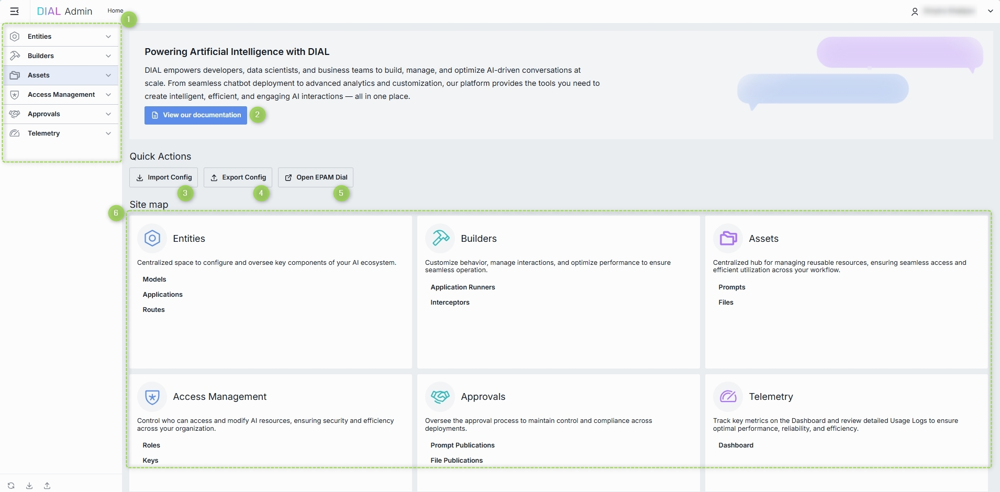
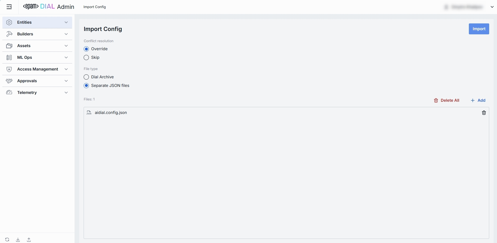
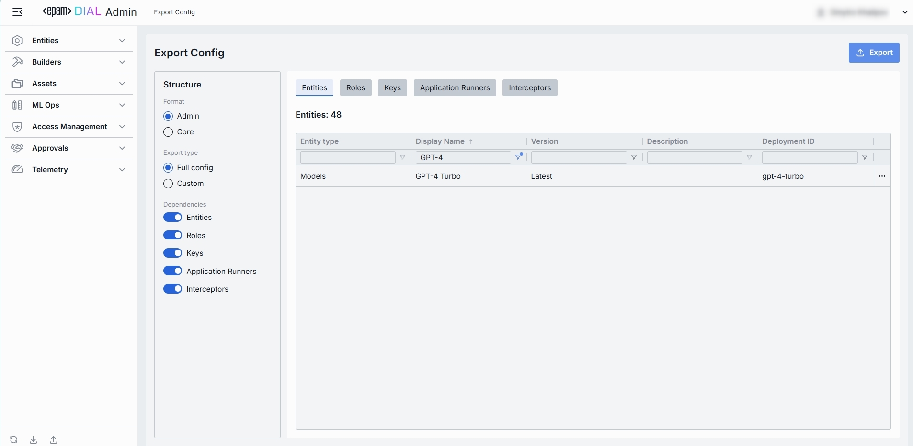
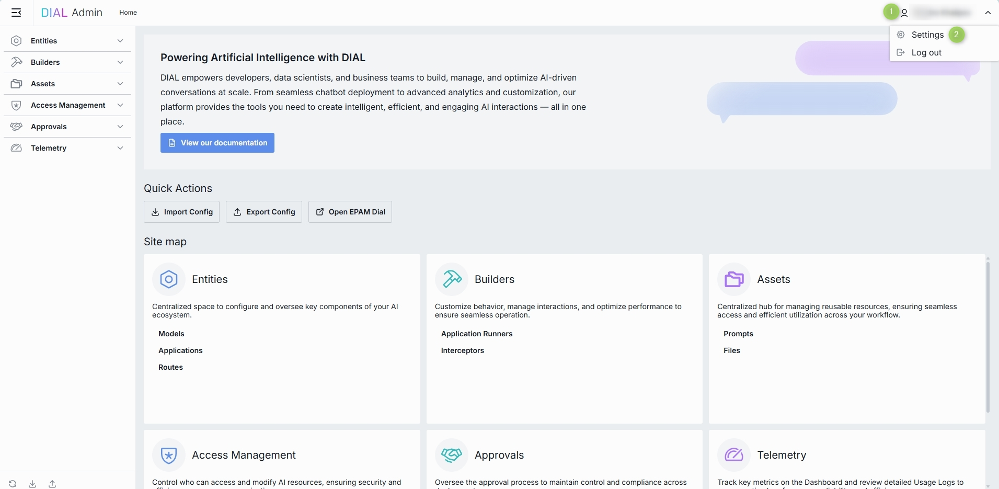

# Introduction to DIAL Admin Panel

## About

The DIAL Admin Panel is a centralized platform that provides system [administrators](#who-is-admin) with the tools to configure, manage, and monitor the DIAL ecosystem via a feature-rich, intuitive, and customizable interface. 

> Admin Panel serves as a powerful UI for administrators. System configurations can be done also by a direct modification of a [DIAL Core config](https://github.com/epam/ai-dial-core).

DIAL Admin Panel functionality can be categorized into the following sections:

* **Entities**: Configure all language models, applications, and routes within the DIAL environment. Go to [Entities](/docs/platform/11.admin-panel/entities-models.md) to learn more.
* **Builders**: Add and configure application types and interceptors. Go to [Builders](/docs/platform/11.admin-panel/builders-application-runners.md) to learn more.
* **Assets**: Access, add, and manage system resources such as prompts and files. Go to [Assets](/docs/platform/11.admin-panel/assets-files.md) to learn more.
* **Access Management**: Create and manage user groups, roles, API keys, and usage limits to implement access and cost control policy. Go to [Access Management](/docs/platform/11.admin-panel/access-management-roles.md) to learn more.
* **Approvals**: View and manage publication requests submitted by DIAL users for files and prompts. Go to [Approvals](/docs/platform/11.admin-panel/approvals-file-publications.md) to learn more.
* **Telemetry**: Monitor real-time system usage, including token consumption, system load, and other telemetry data for performance tracking. Go to [Telemetry](/docs/platform/11.admin-panel/telemetry-dashboard.md) to learn more.

### Who is Admin

System admin(s) can be defined in [DIAL Core static settings](https://github.com/epam/ai-dial-core?tab=readme-ov-file#static-settings) in the `access.admin.rules`:

* Has `READ` and `WRITE` access to all system resources (conversations, prompt, files and applications).
* Can view, approve and reject publication requests for DIAL users. 
* Has access to all DIAL Core API endpoints.

## Home Screen

The Home screen gives you a high-level overview of your environment and fast access to the most important actions and modules.

### Header & Global Controls

* **Hamburger menu** (left): Toggle the sidebar navigation expanded or collapsed using ☰.
* **DIAL Admin logo & Breadcrumbs**: Brand header and current page indicator.
* **User profile menu** (top right): Click your avatar to access [user settings](#user-settings) or sign out.

### 1. Sidebar Navigation

**Sidebar**: It is the main menu available at any page, which provides access to every major DIAL Admin section. Click any heading to expand/collapse its submenu and jump directly to that section.

* **Entities**: Models, Applications, Routes
* **Builders**: Application Runners, Interceptors
* **Assets**: Prompts, Files
* **Access Management**: Roles, Keys
* **Approvals**: Prompt Publications, File Publications
* **Telemetry**: Dashboard

### 2. View Documentation

**View our documentation** button opens the official [DIAL docs](https://docs.dialx.ai/) in a new tab. It's handy when you need an in-depth reference or look for details.

### 3. Import Config

**Import Config** button uploads a DIAL configuration file to provision or restore your instance. It is useful for migrating between environments or restoring backups.

* **File type**: Either DIAL Core (_.json_) or Admin (_.zip_) format can be selected.
* **Conflict resolution**: You can chose between two conflict resolution options:
  * Override: During the import process, any artifact in the archive that matches an existing artifact in DIAL by the identifier will **override** the existing artifact.
  * Skip: Any artifact in the archive that matches an existing artifact in DIAL by the identifier will be **ignored**, and the existing artifact will remain unchanged.

### 4. Export Config

**Export Config** allows you to download the configuration of the current instance as an archived *.json* file. Great for backups, audit snapshots, or sharing with teammates.

* Either Core (_.json_) or Admin (_.zip_) format can be selected.
* Config can be exported partially (user choice) or in full.
* The dependencies can be included or ignored for Entities, Roles, Keys, Application Runners and Interceptors. 

### 5. Open DIAL

**Open DIAL** button opens https://chat.dialx.ai/ in a new tab, where you can try your apps , prompts, and models live.

### 6. Site Map

Is a visual grid of cards you can use to navigate to a corresponding DIAL Admin section.

| Card                  | Description                                                                                      |
|-----------------------|--------------------------------------------------------------------------------------------------|
| **Entities**          | Central hub for your AI “building blocks” - Models, Applications, Routes.                        |
| **Builders**          | Components that allow you to add custom logic and functionality to your applications and models. |
| **Assets**            | Store and manage shared organization level assets - Prompts and Files.                           |
| **Access Management** | Define User roles, API keys, and Folders Storage permissions across your team.                   |
| **Approvals**         | Manage the publication process for Prompt and File assets.                                       |
| **Telemetry**         | View aggregated metrics over the historical interval in the Dashboard.                           |

### User Settings

Click your avatar (or name) to reveal the profile menu in the top-right corner of the header. Here, you can personalize your DIAL Admin experience and manage your session.

##### Profile Menu Options

| Option       | Description                                                              |
| ------------ | ------------------------------------------------------------------------ |
| **Settings** | Opens the User Settings modal where you can adjust personal preferences. Here you can choose a UI theme.|
| **Log out**  | Ends your session and returns you to the login screen.                   |

