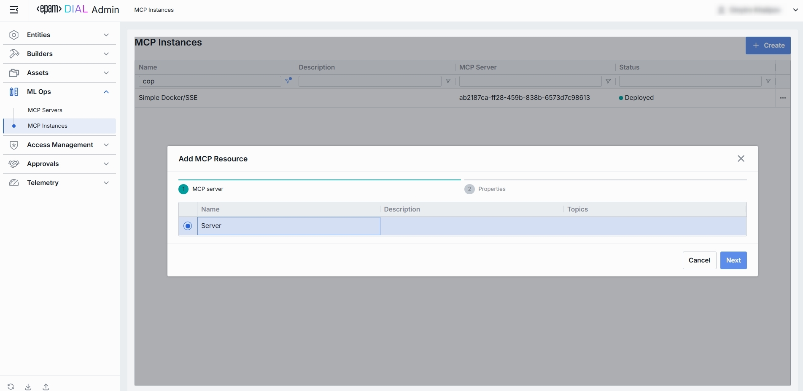

# MCP Instances

## What Is an "MCP Instance" in DIAL

An MCP Instance is the specific, running process (or in-memory object) created from an MCP Server (or Client) implementation. 
It carries its own configuration (such as a unique name, registered resources, prompts, tools, transport settings and authentication state ) and actively listens for, negotiates with, and responds to JSON-RPC messages from connected clients or hosts.

## Main Screen

In the sidebar, expand **ML Ops** and click **MCP Instances**.

This page provides a centralized view and management interface for all MCP Instances in DIAL Admin.

##### Grid

**Filtering &Sorting:**

* Each column header has sort arrows; click to reorder.
* Beneath each header is a filter box - type text to narrow the list in real time.

| Field           | Definition                                 |
|-----------------|--------------------------------------------|
| **Name**        | Identifying name for the MCP Instance.     |
| **Description** | Short summary of why this instance needed. |
| **MCP Server**  | Related MCP Server.                        |
| **Status**      | Deployment state of the MCP Instance.      |

## Create MCP Instance

Use the **Create MCP Instance** dialog to register a new MCP Instance in DIAL. Once added, it appears in the **MCP Instances** listing.

##### How to create a new MCP Instance

1. Click Create to invoke the **Create MCP Instance** modal.
2. Define key parameters. In the modal, select one of the MCP Servers (only servers in Status = 'Built' are shown). Then, specify the following for the new instance:

  | Field       | Required? | Description                              |
  |-------------|:---------:|------------------------------------------|
  | Name        |    Yes    | Identifier for the MCP Instance.         |
  | Description |    No     | Brief summary of the instance’s purpose. |

3. Click **Create**. Once all required fields are filled hit **Create** button. The dialog closes and the new MCP Instance configuration screen is opened.

  > This entry will appear immediately in the listing once created.

## Configuration

### Top Bar Controls

* **Delete**: Permanently removes this MCP Instance.
* **Deploy/Undeploy**: Deploying an MCP Instance spins up its configured server (or client) process—loading its resources, prompts, and tools, registering its endpoint, and making it available for JSON-RPC connections. Undeploying tears that process deregistering its capabilities, so it no longer responds to requests.

### Properties

The Properties tab for an MCP Server displays and configures the core metadata and connection details that define how your MCP Server will be built, discovered, and used by DIAL AI.

| Field           | Required? | Description                                                                                         |
|-----------------|-----------|-----------------------------------------------------------------------------------------------------|
| **Name**        | Yes       | A human-friendly display name for the instance. Used in lists, logs and when selecting an instance. |
| **Description** | No        | Optional free-text notes or details about the instance’s purpose.                                   |

### Tools

In MCP an exposed **Tool** is simply a named, invocable function that an LLM-powered client can call. Each Tool definition includes:

| Field             | Required? | Description                                                      |
|-------------------|-----------|------------------------------------------------------------------|
| **Name**          | Yes       | Identifier clients use to invoke this tool.                      |
| **Description**   | Yes       | A brief summary of what the tool does.                           |
| **Input Schema**  | Yes       | Defines the parameters (and their types) the client must supply. |
| **Output Schema** | Yes       | Defines the structure of the response returned to the client.    |

### Resources

In MCP, a Resource is a named context provider that an LLM-powered client can fetch at runtime. 
Each resource exposes data—static or dynamic—via a well-known URI and indicates its format with a MIME type. 
Resources let your AI agent retrieve documents, configuration files, database query results, or any other contextual payload through a simple fetchResource(name) call, without needing bespoke parsing or transport logic.

| Field           | Required? | Description                                                                                    |
|-----------------|-----------|------------------------------------------------------------------------------------------------|
| **Name**        | Yes       | The unique identifier for this resource.                                                       |
| **Description** | No        | A summary of what data this resource provides.                                                 |
| **URI**         | Yes       | The resource’s identifier.                                                                     |
| **MIME Type**   | Yes       | The media type of the resource’s payload (e.g. `application/json`, `text/plain`, `image/png`). |

### Prompts

A **Prompt** in MCP is a reusable, parameterized template of text or instructions that an LLM-powered host can fetch and execute. 
By defining named arguments, prompts let you separate static instruction text from dynamic inputs—ensuring consistent, versioned workflows and making it easy to swap out or update prompt logic without changing client code.

| Field           | Required? | Description                                                                    |
|-----------------|-----------|--------------------------------------------------------------------------------|
| **Name**        | Yes       | Identifier for this prompt (used when invoking it).                            |
| **Description** | No        | A human-friendly summary of what this prompt does.                             |
| **Arguments**   | Yes       | A list of parameters the prompt template accepts. See “Argument Fields” below. |

### Argument Fields

| Field           | Required? | Description                                                  |
|-----------------|-----------|--------------------------------------------------------------|
| **Name**        | Yes       | The variable name used inside the prompt template.           |
| **Description** | No        | Human-readable explanation of what that variable represents. |
| **Required**    | Yes       | Whether the client must supply a value for this argument.    |

