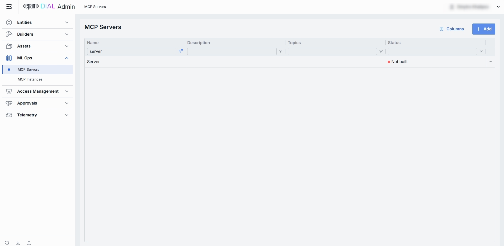
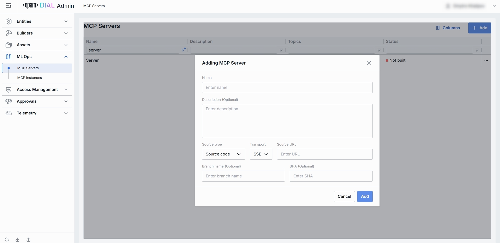
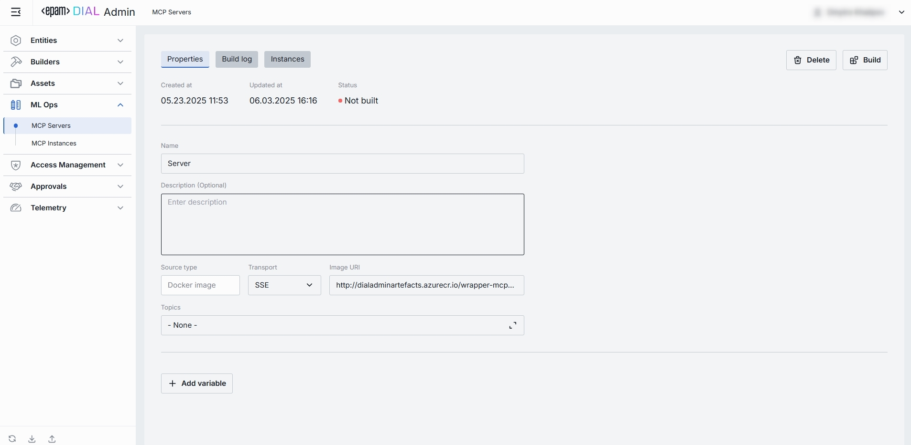
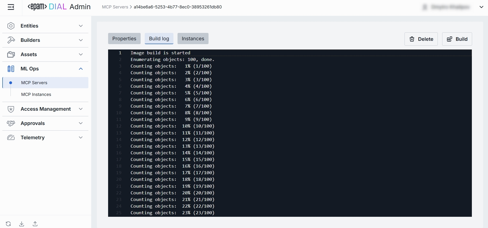
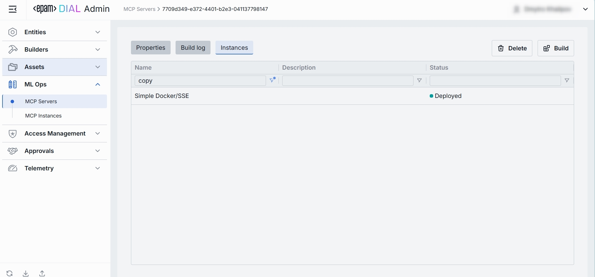

# MCP Servers

## What Is an "MCP Server" in DIAL

An MCP Server is the protocol-defined “server side” component that implements and exposes specific capabilities, namely Resources (contextual data), Prompts (templated workflows), and Tools (executable functions), over a standardized JSON-RPC interface. 

In practice, an MCP Server runs as a lightweight service (or process) that advertises its name and capabilities to MCP Clients, handles authentication and capability negotiation, and waits for requests from LLM-powered Hosts to fetch data or invoke actions—all without requiring the host to know any vendor-specific APIs. 

> Refer to [MCP documentation](https://modelcontextprotocol.io/) to learn more.

## Main Screen

In the sidebar, expand **ML Ops** and click **MCP Servers**.

The MCP Servers page provides a centralized view and management interface for all MCP Servers in DIAL Admin.

##### Grid: Filtering, Sorting, Columns Customization

* Each column header has sort arrows; click to reorder.
* Beneath each header is a filter box - type text to narrow the list in real time.
* Customize Visible Columns - open the column selector to show/hide any table fields.

| Field           | Definition                                                                                    |
|-----------------|-----------------------------------------------------------------------------------------------|
| **Name**        | Identifying name for the MCP Server.                                                          |
| **Description** | Short summary of what this server does (e.g., “Wraps GitHub APIs” or "Returns weather info"). |
| **Topics**      | Tags or categories you can assign for discovery, filtering, or grouping.                      |
| **Status**      | Build state of the MCP Server.                                                                |

## Create MCP Server

Use the **Create Key** dialog to register a new MCP Server in your DIAL instance. Once added, it appears in the **MCP Servers** listing.

1. Click **Create** to invoke the **Create MCP Server** modal.
2. Define key parameters. In the modal, specify the following for the new server:

| Field       | Required? | Description                                                                                                                                                       |
|-------------|:---------:|-------------------------------------------------------------------------------------------------------------------------------------------------------------------|
| Name        |    Yes    | Identifier for the MCP server.                                                                                                                                    |
| Description |    No     | Brief summary of the server’s purpose and functionality.                                                                                                          |
| Source Type |    Yes    | Method for obtaining server code. Can be `Source code` (to clone/build from a Git repository) or `Docker image`.                                                  |
| Transport   |    Yes    | Protocol used for server communication. Can be `SSE` (Server-Sent Events) or `STDIO` (Standard Input/Output).                                                     |
| Source URL  |    Yes    | URL to clone or pull based on Source Type. Git repository URL if using source code, or Docker image reference if using a Docker image.                            |
| Branch Name |    No     | Applicable only if Source Type is 'Source Code'. Git branch or tag to check out when building from source; defaults to repository’s primary branch if left blank. |
| SHA         |    No     | Applicable only if Source Type is 'Source Code'. Specific Git commit hash to pin the build; overrides branch if provided.                                         |

3. Once all required fields are filled click **Create**. The dialog closes and the new MCP Server configuration screen is opened.

  > This entry will appear immediately in the listing once created.

## MCP Server Configuration

### Top Bar Controls

* **Delete**: Permanently removes this MCP Server and all related MCP Instances using the given server. All dependent MCP Instances can be reviewed in the confirmation modal.
* **Build** button tells DIAL to fetch and prepare the MCP Server’s code or image into a runnable artifact.

## Properties

The Properties tab for an MCP Server displays and configures the core metadata and connection details that define how your MCP Server will be built, discovered, and used by DIAL AI.

| **Name**                   | **Required** | **Description**         |
|----------------------------|---------------|--------------------------|
| **Created at**             | -             | Date/time when this MCP Server record was first created in DIAL Admin.                                                                                             |
| **Updated at**             | -             | Date/time when any property of this MCP Server was last changed and saved.                                                                                         |
| **Status**                 | -             | Current build state of the MCP Server.                                                  | 
| **Name**                   | Yes           | Human-readable identifier for this MCP Server.                                                                                                                     |
| **Description**            | No            | Optional free-text field describing the server’s purpose.                                                                                                          |
| **Source type**            | Yes           | Dropdown specifying how the server’s code is provided; options are Source code (Git repo) or Docker image (container URI).                                         |
| **Transport**              | Yes           | Selects how the MCP Server communicates with the model; options are SSE (Server-Sent Events) or STDIO (Standard I/O).                                              |
| **Source URL / Image URI** | Yes           | If Source type = Source code, enter the Git repository URL; if Docker image, enter the container image URI (e.g., registry.example.com/myrepo/mcp-server\:latest). |
| **Branch name**            | No            | (Only when Source type = Source code) Optional Git branch name to build from; defaults to the repository’s default branch if omitted.                              |
| **SHA**                    | No            | (Only when Source type = Source code) Optional Git commit hash to lock to a specific revision.                                                                     |
| **Topics**                 | No            | Tags or categories you can assign for discovery, filtering, or grouping of MCP Servers.                                                                            |
| **Variables**              | No            | List of key-value pairs passed as environment variables to the server build (click “Add variable” to define as many as needed).                                    |

### Build Log

The Build Log tab displays the output produced when DIAL attempts to compile/package your MCP Server. 
It’s where you can see exactly what happened during the “Build”, diagnose failures, and confirm a successful build before deploying or running instances. 

### Instances

The tab lists every created (either deployed or not) MCP instance that was created based on the given MCP server. 

