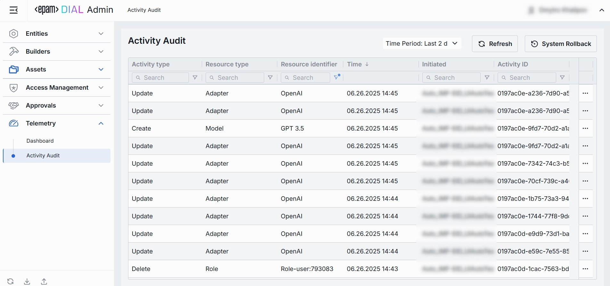
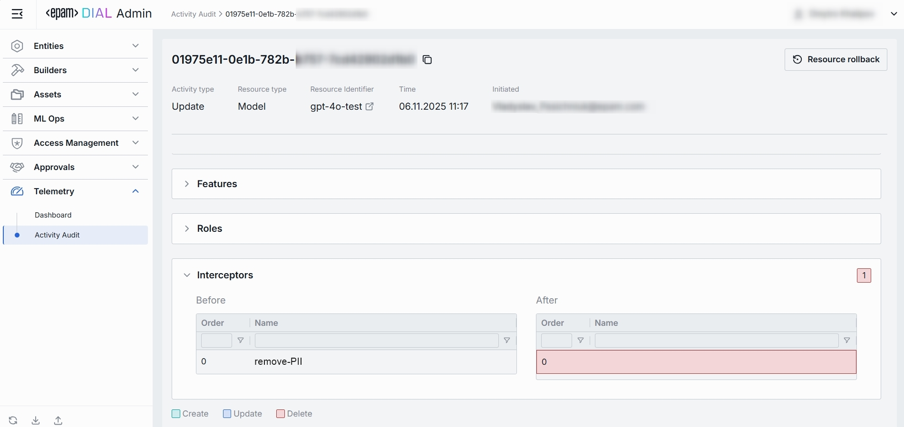

# Activity Audit

## About Activity Audit

The Activity Audit page is your system-wide “black box recorder”. It captures every change anyone makes in the Admin Panel (who, what , and when) so you could trace, verify, and, if needed, roll back any action.

## Activity Audit List

On the main Activity Audit screen, you can view all events that has happened in DIAL Admin Panel.

##### Top Bar Controls

* **Time Period** filter: A dropdown control that scopes the Activity-Audit table to a custom period range.
* **Refresh** button: Manually refreshes the entries on the page honoring all active filters and the selected **Time Period** to pull the latest audit events

| Name                | Required | Definition                                                                                           |
|---------------------|-----------|------------------------------------------------------------------------------------------------------|
| Activity type       | Yes       | The action performed on the resource (e.g., **Create**, **Update**, **Delete**).                     |
| Resource type       | Yes       | The category of the object affected (e.g., **Model**, **Interceptor**, **Role**, **Application**, etc.). |
| Resource identifier | Yes       | A user-friendly name or deployment Id of the specific resource that was acted upon.                   |
| Time                | Yes       | Timestamp of the change.                                       |
| Initiated           | Yes       | A user who triggered the action (e-mail); may show system e-mail for automated events.                 |
| Activity ID         | Yes       | Immutable UUID that uniquely identifies the audit event.                                             |

### Entry Details

The Activity-Audit Entry page is the detailed drill-down for a single audit event.
It lets you inspect exactly what changed in a resource, who did it, and when, with a side-by-side “before / after” diff that can be rolled back with one click.

##### Top Bar Controls

* **Resource Rollback**: Control that restores the previous version of the resource. Clicking it initiates a confirmation dialog and, if confirmed, generates a new audit entry.

| Name                | Required | Definition                                                                                           |
|---------------------|-----------|------------------------------------------------------------------------------------------------------|
| Activity type       | Yes       | The action performed on the resource (e.g., **Create**, **Update**, **Delete**).                     |
| Resource type       | Yes       | The category of the object affected (e.g., **Model**, **Interceptor**, **Role**, **Application**, etc.). |
| Resource identifier | Yes       | A user-friendly name or deployment Id of the specific resource that was acted upon.                   |
| Time                | Yes       | Timestamp when the platform successfully committed the change.                                       |
| Initiated           | Yes       | A user who triggered the action (e-mail); may show system e-mail for automated events.                 |
| Activity ID         | Yes       | Immutable UUID that uniquely identifies the audit event.                                             |

#### Components

* **Categories** (e.g., *Features*, *Roles*, *Interceptors*). Groups all changes that belong to one logical section of the respective resource (Model, Application, etc.). Click to expand/collapse. A numeric badge shows the number of distinct changes in that section's fields.
* **Before / After columns**. Side-by-side diff that shows the previous and resulting values for every field in the section. Each row is color-coded to signal the type of operation performed:
    * **Green** (`Create`). A field was **added** in the *After* state and did not exist before.
    * **Blue** (`Update`). A field's value was **modified**; both Before and After rows are highlighted in blue.
    * **Red** (`Delete`). A field was **removed**; it is present in *Before* but absent (or struck-through) in *After*.