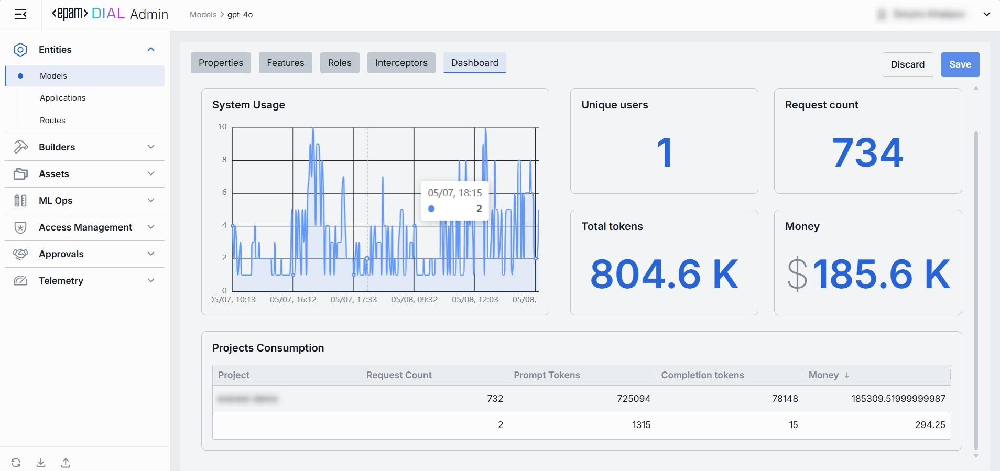

# Dashboard Tab

The **Dashboard** tab provides real-time and historical metrics for the model, so you can monitor usage patterns, enforce SLAs, optimize costs, and troubleshoot anomalies.

Related DIAL Core documentation on Telemetry:

* https://docs.dialx.ai/platform/observability-intro

## 1. Top Bar Controls

| Control                | What It Does                                                                                 |
| ---------------------- |----------------------------------------------------------------------------------------------|
| **Time Period**        | Choose the date range for all charts and tables (e.g. last 15 min, 2 days, 7 days, 30 days). |
| **+ Add filter**       | Drill into specific subsets by adding filters on Projects.                                   |
| **Auto refresh**       | Set the dashboard to poll for new data (e.g. every 1 min) or turn off auto-refresh.          |

## 2. System Usage Chart
* **What it shows**: A time-series line chart of request throughput over your selected period.

* **Metrics plotted**:
  * Requests per interval (auto-defined)

* **Use cases**:
  * Spot traffic peaks and valleys
  * Correlate spikes with deployments or feature rollouts

## 3. Key Metrics

Displayed alongside the chart are four high-level metrics. All calculated for the user-selected period:

| Metric            | Definition                                                          |
|-------------------|---------------------------------------------------------------------|
| **Unique Users**  | Count of distinct user IDs or API keys that have called this model. |
| **Request Count** | Total number of chat or embedding calls routed to this model.       |
| **Total Tokens**  | Sum of prompt + completion tokens consumed by this model.           |
| **Money**         | Estimated spending on this model.                                   |

> **Use cases**:
> * Charge back to internal teams or external customers by “Money.”
> * Track adoption via “Unique Users.”
> * Monitor burst traffic with “Request Count.”
> * Watch token consumption to anticipate quota exhaustion.

## 4. Entities Consumption Table

Below the KPIs is a breakdown table showing consumption by **Entity**:

| Column                | Description                                               |
|-----------------------|-----------------------------------------------------------|
| **Deployment Id**     | Unique identifier of the model or application.            |
| **Request Count**     | Number of calls directed to the entity.                   |
| **Prompt tokens**     | Total tokens submitted in the prompt portion of requests. |
| **Completion tokens** | Total tokens returned by the model as responses.          |
| **Money**             | Estimated cost.                                           |

>**Use cases**:
>  * Compare consumption across various models and applications.
>  * Spot cost-inefficient deployments that should be optimized.

## 4. Projects Consumption Table

Below the KPIs is a breakdown table showing consumption by **Project**:

| Column                | Description                                               |
|-----------------------|-----------------------------------------------------------|
| **Project**           | The entity utilizing this model.                          |
| **Request Count**     | Number of calls directed to the model.                    |
| **Prompt tokens**     | Total tokens submitted in the prompt portion of requests. |
| **Completion tokens** | Total tokens returned by the model as responses.          |
| **Money**             | Estimated cost.                                           |

>**Use cases**:
>  * Compare consumption across multiple projects.