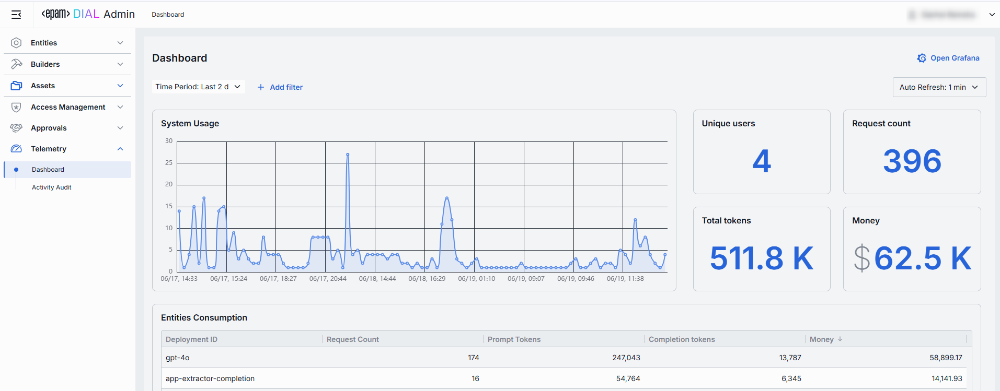
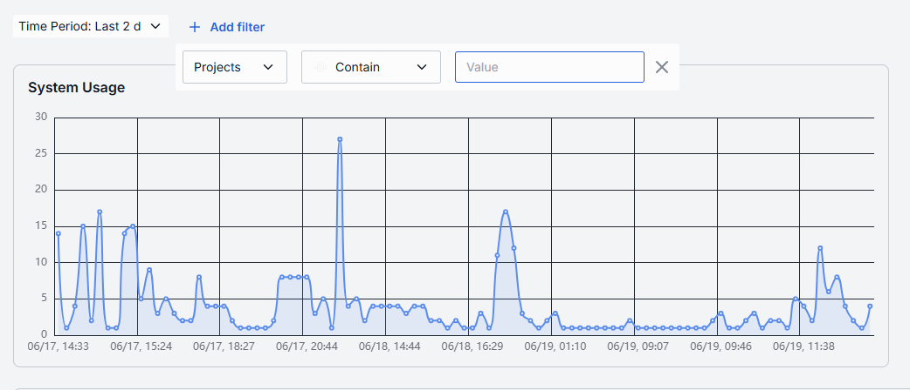
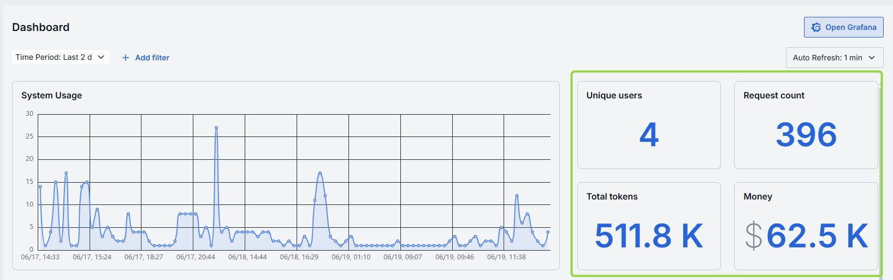
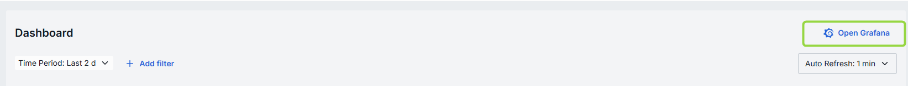
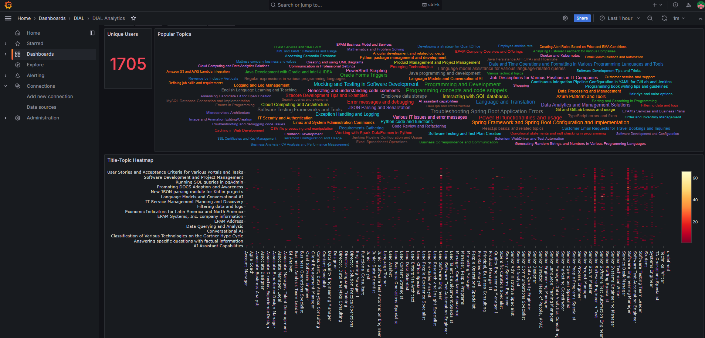

# Dashboard

## About Dashboard

In **Dashboard**, you can monitor system metrics. Monitoring of system metrics is crucial for the health and performance of the system. It helps you to identify and resolve issues before they become critical.
 
> Refer to [Observability](/docs/platform/8.observability-intro.md) to learn about observability and system monitoring in DIAL.

##### Top Bar Controls

| Control                | What It Does                                                                                 |
| ---------------------- |----------------------------------------------------------------------------------------------|
| **Time Period**        | Choose the date range for all charts and tables (e.g. last 15 min, 2 days, 7 days, 30 days). |
| **+ Add filter**       | Drill into specific subsets by adding filters on Projects and Entities (applications, models, routes).                                 |
| **Auto refresh**       | Set the dashboard to poll for new data (e.g. every 1 min) or turn off auto-refresh.          |

## System Usage Chart

System Usage is a time-series line chart showing the requests throughput over the selected time period for projects or entities. You can use it to identify traffic peaks and valleys, correlate spikes with deployments or feature releases.

## Metrics

Metrics are displayed alongside the System Usage Chart. Metrics are calculated for the selected time period for the entire system.

| Metric            | Definition                                                          |
|-------------------|---------------------------------------------------------------------|
| **Unique Users**  | Count of distinct user IDs or API keys. |
| **Request Count** | The total number of chat or embedding calls.       |
| **Total Tokens**  | The total sum of prompt and completion tokens used.           |
| **Money**         | The estimated spending amount.                                   |

## Entities Consumption

This table shows the consumption metrics for deployments: models and applications. You can use it to compare the tokens usage of different models and applications, identify cost-inefficient deployments, and optimize your resources.

| Column                | Description                                               |
|-----------------------|-----------------------------------------------------------|
| **Deployment Id**     | A unique identifier of a model or application.            |
| **Request Count**     | The number of calls directed to the entity.                   |
| **Prompt tokens**     | The total number of tokens submitted in the prompt portion of requests. |
| **Completion tokens** |The total number of tokens returned by the model/application as responses.          |
| **Money**             | Estimated overall costs.                                           |

## Projects Consumption

This table shows the consumption metrics for projects. You can use it to compare the tokens usage of different projects, identify cost-inefficient projects, and optimize your resources.

| Column                | Description                                               |
|-----------------------|-----------------------------------------------------------|
| **Project**           | The entity utilizing this model/application.                          |
| **Request Count**     | Number of calls directed to the model/application.                    |
| **Prompt tokens**     | Total tokens submitted in the prompt portion of requests. |
| **Completion tokens** | Total tokens returned by the model/application in the responses.          |
| **Money**             | Estimated overall costs.                                           |

## Grafana

Click **Open Grafana** to access the Grafana dashboard where you can monitor other system metrics.

