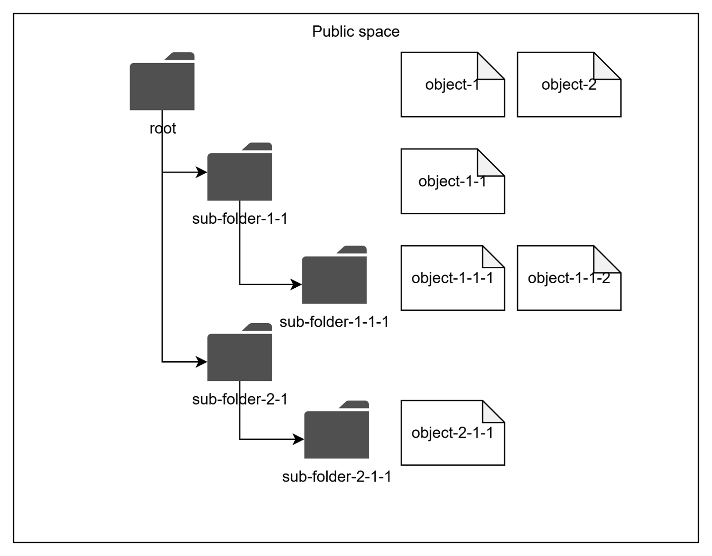

# Access Control in DIAL

## Introduction

This article describes authorization in DIAL. Authorization rules can usually be defined by specifying **Object** of access (what we protect?), **Subject** of access (who we give access to?) and **Action** (what kind of access is given). This article follows this principle for better structuring: it defines Objects, Subjects, authorization rules and mechanisms, how these rules are managed in DIAL.

## Objects

In DIAL, **Objects** refer to entities accessible by users. These include Models, Applications, Toolsets, Files, Prompts, and Conversations. A complete list is provided in the summary table in the [Appendix](#appendix).

> **Note**: In DIAL documentation, the term _Resources_ may be used as a synonym for Objects. However, in this article, we will use the term Objects to emphasize their role in authorization rules.

Technically, [DIAL Core](/docs/platform/3.core/0.about-core.md) manages all objects, handling persistence and associated business logic.

On a low level, objects can be defined in two ways:

- Declaratively via configuration files. For brevity, in this document, we use the term “pre-configured objects” for objects defined in configuration files. All such objects belong to so-called "dynamic settings" of DIAL Core and can be updated in the configuration files and applied without restarting DIAL Core services. They are immutable via API. Refer to [Tutorials](/docs/tutorials/2.devops/1.configuration/0.configuration-guide.md#dynamic-settings) to learn how to configure dynamic setting for DIAL Core.
- Through the [Unified APIs](/docs/platform/3.core/0.about-core.md#unified-api). We use the term “runtime objects” for such objects.

This dual approach to managing objects provides users freedom to choose a configuration strategy based on their business case. For example, centralized management via configuration files is suitable for setups where the DIAL administration team prefers to leverage an Infrastructure as Code approach, whereas the API is suitable for situations where objects should be created by regular users. A combination of both approaches is also fully supported.

> **Note**: There are objects which can be defined only via configuration files and do not have APIs, and vice versa.

> - For general configuration guidelines, refer to [Configuration Guide](/docs/tutorials/2.devops/1.configuration/0.configuration-guide.md#general-method-of-configuration).
> - For details about DIAL Core dynamic settings, please refer to [Tutorials](/docs/tutorials/2.devops/1.configuration/0.configuration-guide.md#dynamic-settings).
> - DIAL Core API reference is available on the [DIALX landing website](https://dialx.ai/dial_api).

### DIAL Chat UI and DIAL Admin Panel

While DIAL Core is responsible for managing objects via configuration files and APIs, DIAL also provides the following UI tools to manage objects:

- [DIAL Chat UI](/docs/platform/4.chat/0.about-chat.md): Allows users to work with runtime objects via API.
- [DIAL Admin Panel](/docs/platform/11.admin-panel.md): Allows admin users to work with pre-configured objects.

Both applications work on top of DIAL Core and rely on DIAL Core’s access control mechanisms, which is why this article focuses on DIAL Core authorization.

## Subjects

**Subjects** are actors who access **Objects**, trying to create, update, delete, read, or use them.

In DIAL, subjects include end-users, API Keys (used by external applications), or DIAL Applications, acting on a user's behalf.

- **End-users** authenticate in DIAL Core using JWT access tokens.
- **API Keys** are used by external applications to access DIAL Core without user context.
- **DIAL Applications** use internally-generated [Per-Request Keys](/docs/platform/3.core/3.per-request-keys.md) that include information about both the application and the user. In this case on one hand, a DIAL Application acts on behalf of a user (who has certain permissions), but on the other hand, DIAL Applications are not fully trusted and should be limited in what they can do. This scenario is covered in a [separate section](#special-subject-dial-application-acting-on-users-behalf) of this article.

### Roles as Subjects

DIAL also supports the notion of **Roles** to avoid managing access individually for every user or API Key.

A role can be associated with multiple individual Subjects, such as Users, User Groups and API Keys, and then used as a Subject to prove access to Objects in specific scenarios.

> **Note**: A role can only be defined via [DIAL Core configuration files](https://github.com/epam/ai-dial-core/blob/development/docs/dynamic-settings/roles.md) (pre-configured object) and not via Core API.

#### Default roles

By default, DIAL defines one dedicated role - DIAL Administrators - which has elevated access over DIAL configuration (dynamic settings) and Core API:

- DIAL Administrators can command DIAL Core to reload “dynamic settings” configuration files without restarting DIAL Core services.
- DIAL Administrators have access to certain DIAL Core APIs and Objects that other Subjects cannot access.

More details on DIAL Administrators role can be found in the sections below, describing DIAL Authorization rules.

#### How to associate a user or API key with a role

- **User** (JWT Token): A User is represented by a JWT token issued by an identity service provider (IDP) and mapped to the roles using claim values in the token. Refer to [Tutorials](/docs/tutorials/2.devops/2.auth-and-access-control/1.jwt.md) to learn how it works.
- **API Key**: An API Key can be defined only in the [DIAL Core configuration file](https://github.com/epam/ai-dial-core/blob/development/docs/dynamic-settings/keys.md) and must include a "roles" attribute specifying the roles assigned to the key. For more details, refer to [Programmatic Auth](/docs/tutorials/2.devops/2.auth-and-access-control/0.api-keys.md).

## Authorization Rules

In this article we use the following logical notation for the Authorization Rule, allowing access for a `{set-of-subjects}` to a `{set-of-objects}`:

`(object: {set-of-objects}, subject: {set-of-subjects}, action: {actions})`

> **Note**: This notation is not how DIAL stores or interprets authorization rules. It was made up for the purpose of this article, for the sake of unification and brevity.

## Authorization Mechanisms

DIAL uses various mechanisms to maintain and enforce authorization rules in different business scenarios. They include **Public** and **Private** spaces, publication and objects sharing, which will be described in the following sections.

### Default Authorization Rules: Public and Private Spaces

DIAL supports two logical spaces for all objects: **Public** and **Private**. Every object belongs to only one of the spaces.

- The **Public** space allows making objects available to a wide audience while maintaining full control and governance.
- The **Private** space assumes objects are available only to their creators (owners) by default. This allows regular users to work with DIAL without compromising their privacy, as the objects they create cannot be accessed by anyone else unless explicitly stated (will be described [further in text](#how-to-provide-access-in-the-private-space)).

As their names assume, the two spaces define default [authorization rules](#authorization-rules), applied to their resources (Objects):

- Any Object in a Public space is available in READ-ONLY mode for any user by default, unless access is restricted as shown [further in the article](#how-to-restrict-access-in-the-public-space); WRITE operations are allowed only for the role of DIAL Administrators. Default authorization rules in Public space are:

  - `(object: public:*, subject: *, action: read)` - Default READ-ONLY access in Public space.
  - `(object: public:*, subject: role:admin, action: *)` - Default full access for users with the DIAL Administrators role in Public space.

  Where:

  - `public:*` - A wildcard for any Object in the Public space.
  - `subject: *` - A wildcard for any Subject.
  - `role:admin` – A notation for all Subjects, belonging to "admin" role. We use the "admin" name for the DIAL Administrators role. As was mentioned earlier, [roles can be used as Subjects](#roles-as-subjects) in the definition of authorization rules.

- Any Object in a Private space is available only to its creator (User, API Key) by default, unless access is [explicitly granted](#how-to-provide-access-in-the-private-space) to another Subject. Logically, every Subject (user or API Key) has its own Private space. The default authorization rule in the Private space is: `(object: private:subject_id:*, subject: subject_id, action:*)`

  Where:

  - `private:subject_id:*` - Any Object in a Private space of a particular Subject (User or API Key), identified by `"subject_id"`.
  - `subject_id` - A unique identifier of a Subject (user or API Key).

#### Pre-configured objects

All objects, defined in DIAL Core configuration files, belong to the Public space, where appropriate default Authorization rules apply.

> **Note**: Objects cannot be defines in a Private space via DIAL Core configuration files.

#### Runtime objects

[DIAL Core API](https://dialx.ai/dial_api) allows creating Objects in both Public and Private spaces. As default authorization rules define, an Object in a Public space can only be created by the DIAL Administrators role, while regular users (including user from DIAL Administrators role) or API Keys can create Objects only within their Private space.

## Hierarchical Structure of the Public Space

This section provides details about how the Public space is structured, which is important for understanding of authorization rules.

Objects in the Public space are arranged hierarchically, like a file system. This means that every object logically belongs to a “sub-folder” within the hierarchy. All pre-configured objects are automatically placed into the “root” folder of the Public space. DIAL Core API allows specifying a sub-folder for newly-created objects.

As you will see below, authorization restrictions can be applied to any sub-folder in the hierarchy. The effective authorization rule for an object in a sub-folder includes restrictions applied to all parent sub-folders up to the “root” folder.

## How to Restrict Access in the Public Space

Default public access to objects in the Public space can be narrowed/restricted as needed.

### Pre-Configured Objects

You can use the `"userRoles"` attribute in the object's definition in the DIAL Core dynamic settings to list all roles that should have access to the object. Refer to [Tutorials](/docs/tutorials/2.devops/2.auth-and-access-control/1.jwt.md) to learn how to do it. It creates the following authorization rule that overrides the default public READ-ONLY access:

`(object: public:object_id, subject: role:{list-of-roles-via-OR}, action: read)`

Where:

- `public:object_id` – A particular object in the Public space (in our case, defined in the DIAL Core configuration file).
- `role:{list-of-roles-via-OR}` – Any user or API key that belong to any role (Role1 OR Role2 OR…OR RoleN), specified in `"userRoles"` attribute of the object definition in the DIAL Core configuration file.

### Runtime Objects

As mentioned above, for Runtime objects, the Public space supports hierarchical structure, similar to a file system. Objects can be placed (or published) to the root folder or any sub-folder within this hierarchy.

Each sub-folder (with the exception of the root folder) can be assigned one or many attribute-based logical predicates, describing Subjects that need access to this sub-folder. These predicates are called `"rules"`. E.g. `“group == my-role”`.

The effective set of rules for each sub-folder includes all rules associated with the sub-folder (via OR) and all the rules inherited from the parent sub-folders (via AND). The final authorization rule for objects in a sub-folder:

`(object: public:sub_folder_path:*, subject: {effective-set-of-rules}, action: read)`

Where:

- `public:sub_folder_path:*` - Any object in the sub-folder of the Public space.
- `{effective-set-of-rules}` – A logical expression, combining all rules from the parent sub-folders (via AND), with each sub-folder rule being a set of predicates joined by OR.

Rules associated with sub-folders can be created by either DIAL Administrators or regular users during the [Publication process](/docs/tutorials/1.developers/1.work-with-resources/0.work-with-publications.md).

> **Note**: Publication is the only way for regular users to add objects to the Public space, which requires an explicit approval from DIAL Administrators.

## How to Provide Access in the Private Space

Default access, limited by the Private space’s owner, can be extended as needed.

### Pre-Configured Objects

**N/A** - As was mentioned earlier in this article, objects defined in DIAL Core configuration files are placed only in the Public space.

### Runtime Objects

As discussed earlier, by default, only the object's creator (e.g. Private space’s owner) maintains full access to the object in the Private space. The object's creator may want to provide access to other users. In this case, they can generate a temporary **Sharing link** for the object, specifying the kind of access required (READ or READ/WRITE). The link can be sent to any DIAL user.

> Refer to [Sharing](/docs/tutorials/1.developers/1.work-with-resources/1.sharing.md) for details.

When the sharing link is used, the following authorization rule is created:

`(object: private:subject_id:object_id, subject: {user-id-who-used-the-link}, action: {action-specified-by-the-link})`

Where:

- `Private:subject_id:object_id` – A particular object in a Private space of the particular subject (User or API Key).
- `{user-id-who-used-the-link}` – A particular user who activated the link (accepted invite).
- `{action-specified-by-the-link}` – READ or READ/WRITE type of permissions, specified by object's creator while creating the Sharing link.

## Special Subject: DIAL Application Acting on User’s Behalf

In the preceding sections, we examined authorization rules applicable to standard subjects, such as users and API keys. We reviewed the default access privileges in both Public and Private spaces, as well as methods for refining or extending these permissions as required.

There is a special case when user or API key allows DIAL Applications to act on their behalf. For example, a user invokes a DIAL Application A, which calls DIAL Core services (e.g. File API), another Application B or a Model M. In such case, the application uses a so called [per-request key](/docs/platform/3.core/3.per-request-keys.md), that contains information about both Application A and the User (or API Key).

Logically, since Applications act as a user, they should have the same level of access in DIAL. However, since applications in DIAL are also Objects, and can be created and deployed by any user, they can potentially contain malicious code and cannot be fully trusted. It means that their access should be minimized to reduce potential negative impact.

Because a per-request key represents both User and Application, it has access to both user’s and application’s objects. Applications in DIAL also have their Private space, where an application (acting via a per-request key) can store and, later, access its objects.

Below, is the summary of what a DIAL application, acting on behalf of a user or API key via a per-request key, can access in DIAL:

- **Objects in a dedicated sub-folder**: Usually, users or API keys can access all objects in their Private space without restrictions. A per-request key for the same user or API key has access to only application’s dedicated sub-folder within user’s or API key's Private space:
  - `(object: private:subject_id:app_id:*, subject: per-request-key, action: READ/WRITE)`, where `private:subject_id:app_id:*` is any object in application-dedicated (`app_id`) sub-folder within user's or API key’s (subject_id) Private space.
- **All objects in the app's Private space**: Apps can access all objects in their own Private space (note, that a per-request key of any user has access to the application’s private space):
  - `(object: private:app_id:*, subject: per-request-key, action: READ/WRITE)`, where `private:app_id:*` is any object in application’s Private space.

## Appendix

### Access Control List (ACL) in DIAL Core

#### Access patterns, used in ACL tables

| Space             | Access Pattern              | Description                                                                                                                                                                          |
| ----------------- | --------------------------- | ------------------------------------------------------------------------------------------------------------------------------------------------------------------------------------ |
| **Public space**  | Public objects              | READ-ONLY access to public objects without restrictions. For “executable objects,” such as Applications, Routes, or Toolsets, it also includes “execute” or “call” permissions. |
|                   | Restricted objects          | READ-ONLY access to objects with matching Rules.                                                                                                                                     |
|                   | Admin access                | • Full READ/WRITE access to any object in Public space.  • DIAL Core configuration files are managed by DIAL Administrators.  • Approve/Reject publication requests.       |
| **Private space** | Own objects                 | • Full READ/WRITE access to any object in own Private space.  • Submit publication requests for objects.  • Create sharing links (share) for objects.                      |
|                   | Own objects per application | Full access to any object in application-specific sub-folder in own Private space.                                                                                                   |
|                   | Application objects         | Full access to any object in application’s Private space.                                                                                                                            |
|                   | Shared objects              | Access to the shared object, level of access is defined in the sharing link:  • READ  • READ/WRITE  • Optionally RE-SHARE (in combination with read or READ/WRITE).   |

#### ACLs for Objects

| Object                                                                                      | DIAL Admin                                                                                       | User w/o Role                                                                                      | User / API Key w/Role(s)                                                                                                     | Per-request Key  Note: does not apply for admins                                                                                             |
| ------------------------------------------------------------------------------------------- | ------------------------------------------------------------------------------------------------ | -------------------------------------------------------------------------------------------------- | ---------------------------------------------------------------------------------------------------------------------------- | ------------------------------------------------------------------------------------------------------------------------------------------------- |
| **Models** Note: Models are managed only via  DIAL Core configuration files. | Public space:  • Admin access Private space:  • N/A                               | Public space:  • Public objects Private space:  • N/A                               | Public space:  • Public objects • Restricted objects Private space:  • N/A                               | Public space:  • Public objects • Restricted objects Private space:  • N/A                                                    |
| **Applications**                                                                            | Public space:  • Admin access Private space:  • Own objects • Shared objects | Public space:  • Public objects Private space:  • Own objects • Shared objects | Public space:  • Public objects • Restricted objects Private space:  • Own objects • Shared objects | Public space:  • Public objects • Restricted objects Private space:  • Own objects per application • Application objects |
| **Toolsets**                                                                                | Public space:  • Admin access Private space:  • Own objects • Shared objects | Public space:  • Public objects Private space:  • Own objects • Shared objects | Public space:  • Public objects • Restricted objects Private space:  • Own objects • Shared objects | Public space:  • Public objects • Restricted objects Private space:  • Own objects per application • Application objects |
| **Routes** Note: Routes are managed only via configuration files                  | Public space:  • Admin access Private space:  • N/A                               | Public space:  • Public objects Private space:  • N/A                               | Public space:  • Public objects • Restricted objects Private space:  • N/A                               | Public space:  • Public objects • Restricted objects Private space:  • N/A                                                    |
| **Files**                                                                                   | Public space:  • Admin access Private space:  • Own objects • Shared objects | Public space:  • Public objects Private space:  • Own objects • Shared objects | Public space:  • Public objects • Restricted objects Private space:  • Own objects • Shared objects | Public space:  • Public objects • Restricted objects Private space:  • Own objects per application • Application objects |
| **Prompts**                                                                                 | Public space:  • Admin access Private space:  • Own objects • Shared objects | Public space:  • Public objects Private space:  • Own objects • Shared objects | Public space:  • Public objects • Restricted objects Private space:  • Own objects • Shared objects | Public space:  • Public objects • Restricted objects Private space:  • Own objects per application • Application objects |
| **Conversations**                                                                           | Public space:  • Admin access Private space:  • Own objects • Shared objects | Public space:  • Public objects Private space:  • Own objects • Shared objects | Public space:  • Public objects • Restricted objects Private space:  • Own objects • Shared objects | Public space:  • Public objects • Restricted objects Private space:  • Own objects per application • Application objects |

#### ACLs for Special Objects

Special Objects represent a part of DIAL’s authorization system and do not belong to Public or Private spaces.

| Object                                                                                                                                                                                                                                                                                                                                                 | DIAL Administrator | User w/o Role | User / API Key w/Role(s) | Per-request Key  Note: does not apply for admins |
| ------------------------------------------------------------------------------------------------------------------------------------------------------------------------------------------------------------------------------------------------------------------------------------------------------------------------------------------------------ | ------------------ | ------------- | ------------------------ | ----------------------------------------------------- | --- |
| **Keys** Note: API keys are managed only via DIAL Core configuration files.  Keys cannot be listed or otherwise accessed via API, even in READ-ONLY mode. User can make a call to [/v1/user/info](https://dialx.ai/dial_api#operation/getUserInfo), authenticated by an API Key, to obtain a limited information about the API Key | +                  | -             | -                        | -                                                     |
| **Roles** Note: Roles are managed only via configuration files.  Roles cannot be listed or otherwise accessed via DIAL Core API, even in READ-ONLY mode                                                                                                                                                                                      | +                  | -             | -                        | -                                                     | -   |

#### ACLs for Core APIs, not related to Objects

| Core API                                                                               | DIAL Administrator             | User w/o Role | User / API Key w/Role(s) | Per-request Key   Note: does not apply for admins |
| -------------------------------------------------------------------------------------- | ------------------------------ | ------------- | ------------------------ | ------------------------------------------------------ |
| [Get User Info](https://dialx.ai/dial_api#operation/getUserInfo)                       | Information about current user |               |                          |                                                        |
| [Reload DIAL Core Config](https://dialx.ai/dial_api#tag/Config/operation/reloadConfig) | +                              | -             | -                        | -                                                      |
