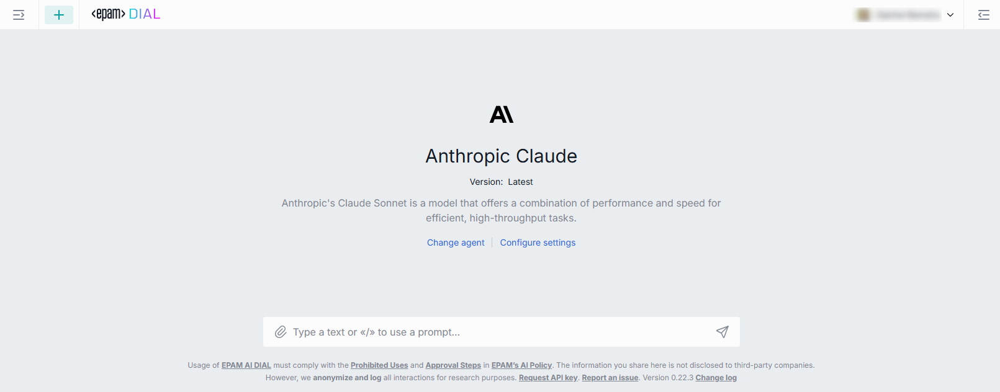

# AI DIAl Chat

AI DIAL Chat is a powerful and highly customizable chat application for end-users, with enterprise-grade access control, extendable functionality and ability to add custom GenAI applications. Overlay enables a seamless embedding of chat into any existing web application.

> * Watch a [demo video](/docs/video%20demos/1.Chat/1.dial-ui-basics.md) with introduction to AI DIAL Chat UI.
> * Refer to [Quick Start](/docs/quick-start.md) to learn how to launch AI DIAL Chat in a few clicks.
> * Refer to [User Guide](/docs/tutorials/0.user-guide.md) to explore chat functionality for end users.

##### Additional Documentation

Refer to [AI DIAL Chat repository](https://github.com/epam/ai-dial-chat) to view the project source code and documentation for additional components:

* DIAL Chat [documentation](https://github.com/epam/ai-dial-chat/blob/development/apps/chat/README.md).
* DIAL Chat Theming [documentation](https://github.com/epam/ai-dial-chat/blob/development/docs/THEME-CUSTOMIZATION.md).
* Chat Overlay [documentation](https://github.com/epam/ai-dial-chat/blob/development/libs/overlay/README.md).
* DIAL Chat Visualizer Connector [documentation](https://github.com/epam/ai-dial-chat/blob/development/libs/chat-visualizer-connector/README.md).

You can also refer to other topics in this documentation:

* Chat localization [instruction](/docs/tutorials/1.developers/3.chat/1.localization.md).
* List of [supported LLMs](/docs/platform/2.supported-models.md).
* Chat UI design [guidelines](/docs/tutorials/1.developers/3.chat/3.chat-design.md).
* Authentication [guidelines](docs/platform/3.core/1.auth-intro.md).
