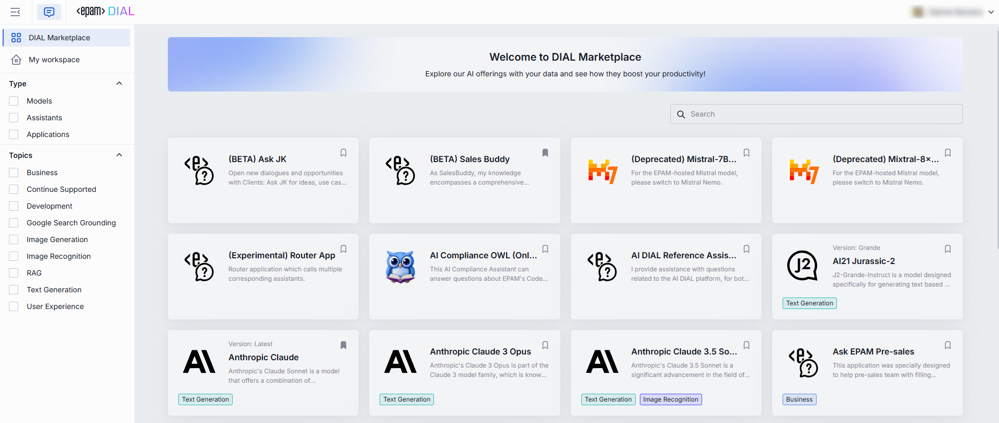

# DIAL Marketplace

## Introduction

> Watch a [demo video](/docs/video%20demos/1.Chat/2.marketplace.md) to explore DIAL Marketplace.

[DIAL Marketplace](https://dialx.ai/features/dial-marketplace) is a single-entry point for all applications, agents, tools, and models available in the DIAL environment of your organization. 

> For a detailed understanding of all that DIAL Marketplace has to offer, please refer to our [User Guide](/docs/tutorials/0.user-guide.md#marketplace).

:cloud: In DIAL SaaS edition, users and developers can find all the available apps and models in the DIAL Marketplace. Use pre-built listed agents as building blocks in new apps. Create apps using no-code wizards.

:floppy_disk: In DIAL On-Prem edition, organizations can leverage DIAL Marketplace to host and manage all their GenAI assets in one place and also to create collaboration and development power house for the entire organization.

## Collaboration Center

Marketplace includes collaboration features. You can [share your](/docs/tutorials/0.user-guide.md#share-2) app with colleagues and grant editing rights or use-only permissions. 

You can also [publish your application](/docs/tutorials/0.user-guide.md#publish-2) to make it available to a wide audience, all within the permission model of your organization.

:cloud: In DIAL SaaS edition, only apps verified and approved by administrators get published to ensure security and safety for all users.

## Development Studio

DIAL Marketplace can also serve as a development studio, with its [low and no-code wizards](/docs/tutorials/0.user-guide.md#application-builder) to create applications. 

