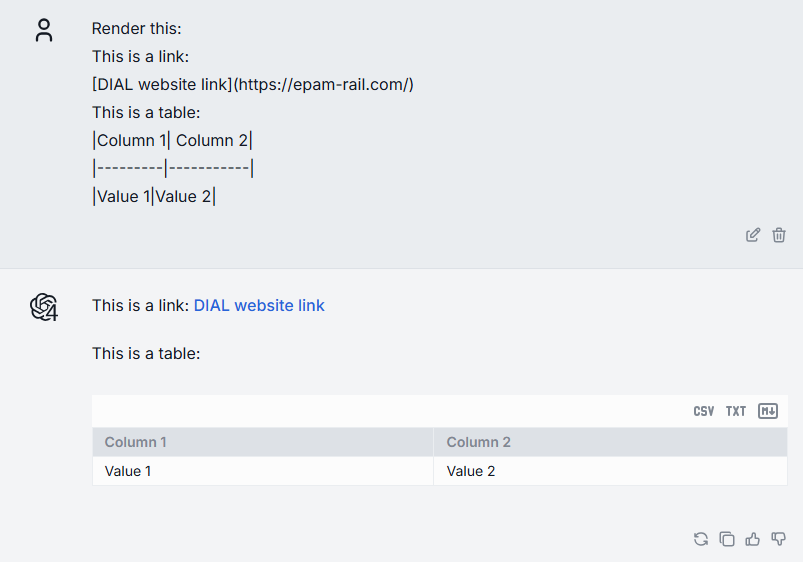
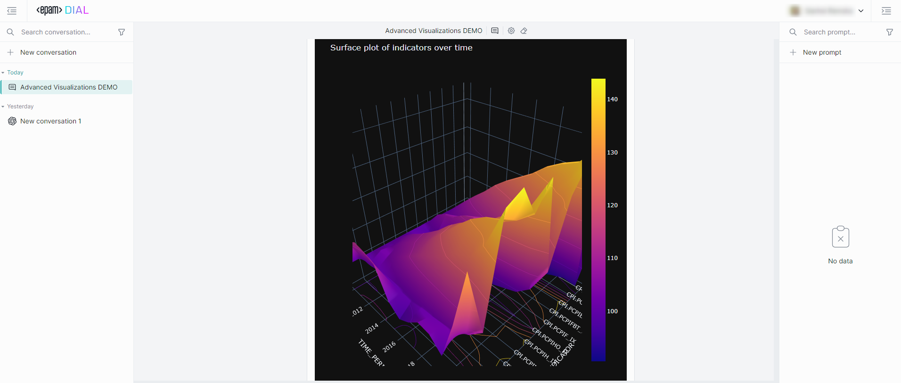

# Data Visualization

## Introduction

DIAL Chat has the capability to render different types of content within a conversation. For example, it has built-in support for Markdown. If the response message from the application includes content in Markdown notation, it will automatically render it in the body of the conversation.

DIAL Chat has also a built-in support for Plotly data visualization libraries: 

* [Plotly JavaScript Open Source Graphing Library](https://plotly.com/javascript/)
* [React Plotly.js in JavaScript](https://plotly.com/javascript/react/)

You can use the [DIAL SDK](https://github.com/epam/ai-dial-sdk) to create custom applications that may need to render different types of content in the body of their response in the chat UI.

This can include attachments with documents and images, stages, and other types of data compatible with the [MIME standard](https://developer.mozilla.org/en-US/docs/Web/HTTP/Basics_of_HTTP/MIME_types/Common_types). Refer to the Custom Content section to learn more.

Watch a [demo video](/docs/video%20demos/1.Chat/6.animated-scatterplot.md) to see how statistical data can be visualized in DIAL Chat using a Plotly animated scatterplot, or view a demo video of the [Omics AI Assistant](/video%20demos/Applications/dial-omics-assistant) to see how protein structures can be visualized with Plotly.

## Visualizers

We call Visualizers special applications that are used for rendering a specific type of content in DIAL Chat UI. You can use [DIAL Chat Visualizer Connector](https://github.com/epam/ai-dial-chat/blob/development/libs/chat-visualizer-connector/README.md) library to create your custom visualizers for specific types of content.

> * Watch a [demo video](/video%20demos/Applications/dial-data-viz) to view how a financial data can be visualized in DIAL Chat.
> * Refer to [Create Visualizer](/docs/tutorials/1.developers/3.chat/2.create-custom-visualizer.md) to learn how to create a custom visualizer.
