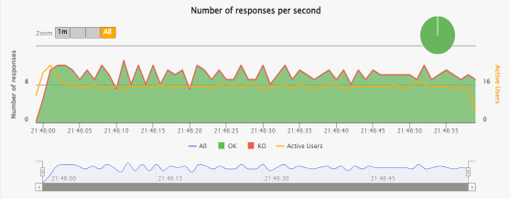
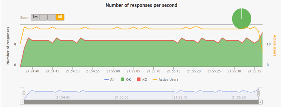
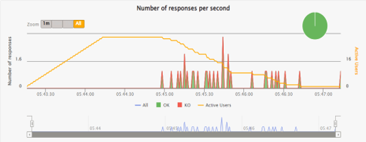
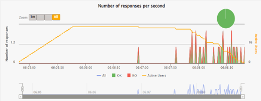
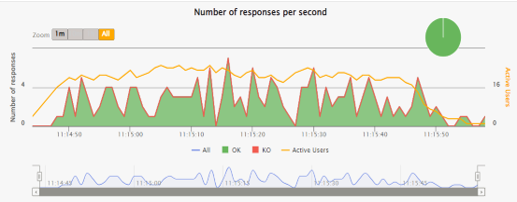
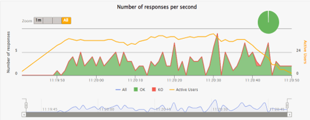
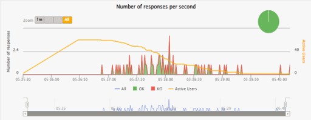
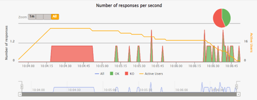

# Handling High Loads in AI DIAL

In this document, we provide the highlights of the results of testing we conducted to measure the errors count and the response speed in AI DIAL under various scenarios, especially under high loads, involving many completions and prompts.

## Preconditions

We ran a series of tests involving various scenarios: small prompt to small completion, small prompt to large completion, large prompt to small completion, and large prompt to large completion.
Also, AI DIAL setup with multiple endpoints was compared to a single-endpoint OpenAI setup to demonstrate the advantages of the load balancing contrary to using single-endpoint setups.

## Response Speed

When testing the average response time, AI DIAL has proven to deliver better results compared to single OpenAI instances.

### Moderate Load

**Number of tokens**: completion=1, prompt=30, total=31

|           | Model            | Endpoints count | Load                | Avg response time, ms |
| --------- | ---------------- | :-------------: | ------------------- | :-------------------: |
| DIAL Core | gpt-35-turbo-16k |        9        | 10 requests per sec |          542          |

The following chart illustrates, that DIAL Core shows a relatively stable and consistent response rate.

|        | Model            | Endpoints count | Load                | Avg response time, ms |
| ------ | ---------------- | :-------------: | ------------------- | :-------------------: |
| OpenAI | gpt-35-turbo-16k |        1        | 10 requests per sec |          799          |

The following chart illustrates, that OpenAI, contrary to the DIAL Core, shows relatively slower and less consistent response rate even with less active users.

### High Load

When we conducted the same tests under higher loads (much more tokens), the results clearly demonstrated that AI DIAL performed better, further showcasing its effectiveness.

**Number of tokens**: completion=2189, prompt=2204, total=4393

|           | Model      | Endpoints count | Load                 | Avg response time, ms |
| --------- | ---------- | :-------------: | -------------------- | :-------------------: |
| DIAL Core | gpt-4-0613 |        6        | 0.5 requests per sec |        121350         |

The following chart illustrates the test case with a significantly higher number of tokens. DIAL Core shows a relatively stable and consistent response rate.

|        | Model      | Endpoints count | Load                 | Avg response time, ms |
| ------ | ---------- | :-------------: | -------------------- | :-------------------: |
| OpenAI | gpt-4-0613 |        1        | 0.5 requests per sec |        177370         |

The following chart illustrates, that OpenAI, contrary to the DIAL Core, shows relatively slower and less consistent response rate.

## Errors Rate

We also ran tests to measure the number of successful completions and the occurrence of errors, specifically HTTP 429 (Too Many Requests). These tests showed that users are far less likely to get an error in the response when using AI DIAL.

### Moderate Load

**Number of tokens**: completion=473, prompt=31, total=504

|           | Model             | Endpoints count | Load               | Errors |
| --------- | ----------------- | :-------------: | ------------------ | :----: |
| DIAL Core | gpt-35-turbo-1106 |        5        | 3 requests per sec |   0    |

The following chart illustrates the test case with a moderate number of tokens. DIAL Core shows a stable and consistent response rate and 0% of failed requests.

|        | Model             | Endpoints count | Load               | Errors |
| ------ | ----------------- | :-------------: | ------------------ | :----: |
| OpenAI | gpt-35-turbo-1106 |        1        | 3 requests per sec |   1%   |

The following chart illustrates the test case with a moderate number of tokens. OpenAI shows a less stable and consistent response rate and 1% of failed requests.

### High Load

**Number of tokens**: completion=2189, prompt=2204, total=4393

|           | Model              | Endpoints count | Load              | Errors |
| --------- | ------------------ | :-------------: | ----------------- | :----: |
| DIAL Core | gpt-4-1106-preview |        3        | 1 request per sec |   0    |

The following chart illustrates that even under high load, DIAL Core shows a stable and consistent response rate and 0% of failed requests.

|        | Model              | Endpoints count | Load              | Errors |
| ------ | ------------------ | :-------------: | ----------------- | :----: |
| OpenAI | gpt-4-1106-preview |        1        | 1 request per sec |  57%   |

The following chart illustrates that under high load, OpenAI shows a significantly lower response rate and very high rate of failed requests.

## Findings

### Efficient Distribution of Quota

AI DIAL allows you to split Azure OpenAI service quotas, which can be allocated to a single deployment or divided among multiple deployments. This feature enables controlled RPM (Requests Per Minute) or TPM (Tokens Per Minute) for applications, optimizing resource allocation and maximizing quota usage.

### Load Balancing

AI DIAL's proprietary load balancer efficiently spreads requests across several deployments, ensuring that no single deployment becomes overwhelmed. This strategy guarantees consistent performance and avoids bottlenecks, especially during times of peak demand. In our tests, AI DIAL reliably delivers faster average response times and handles more requests per second. While single instances often suffer from rapidly declining requests and unpredictable response times under heavy loads, AI DIAL sustains a steady and reliable performance level.

### Fewer Errors and Retry Mechanism

AI DIAL's multiple-deployment strategy significantly reduces the likelihood of encountering errors, a common issue with single OpenAI instances during periods of high demand. Additionally, AI DIAL's ability to automatically retry failed requests boosts overall reliability, ensuring the consistent performance and better user experience.
