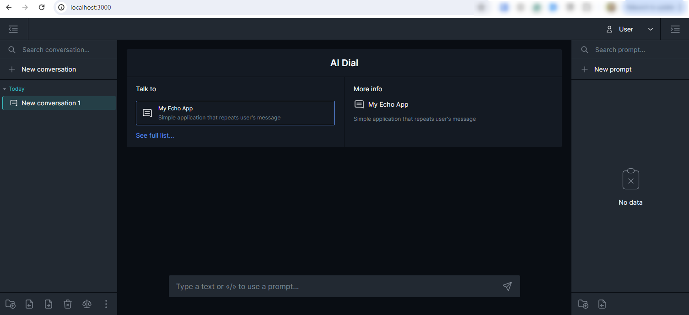

# Quick Start

Follow this tutorial to launch DIAL Chat locally with Echo application. As a result, you will be able to access Chat on http://localhost:3000/ and use Echo application to mirror your prompts.

> * **Follow this link to [Try DIAL SaaS](https://chat.dialx.ai/) edition**.
> * To learn more, watch a [demo video](/docs/video%20demos/3.Developers/Deployment/4.deploy-ollama.md) to see how to deploy a chat application with a self-hosted model.
> * Refer to other quick start instructions in [Tutorials](/docs/tutorials/1.developers/0.local-run\0.quick-start-with-application.md).

## Prerequisites

1. Docker engine (Docker Compose Version 2.20.0 +) installed on your machine. Refer to [Docker](https://docs.docker.com/desktop/) documentation.

## Step 1: Get DIAL

[Download](https://github.com/epam/ai-dial/tree/main/dial-docker-compose/application/) DIAL.

## Step 2: Launch Chat

Run `docker compose up` in the console from the folder with the `docker-compose.yml` file.

Once DIAL Chat is up on http://localhost:3000/, select the Echo Application and start typing in prompts to see how the Echo application mirrors them.

