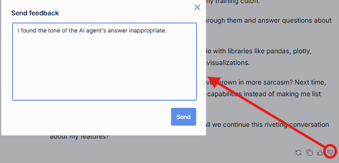

# Release Notes

The purpose of this document is to provide a quick summary of all the biggest new features added in this version and provide some additional description, video, or tutorials for major features. They will be grouped into blocks by functionality.

## Brief Summary

The highlights of this release are significant improvements to DIAL's **Quick Apps** functionality, **multimodality** enhancements with Sora and TTS/STT support, **global interceptors**, and **improved feedback collection**. Feel free to watch a video showcase of the past month's biggest changes below:

## Major Enhancements

**Multimodality**: With the announce of Sora, as well as enhancements to OpenAI's Speech-to-Text and Text-to-Speech models, we made sure that DIAL can handle video and audio attachments natively in the chat UI, as well as in Quick Apps. If video generation, voice-recognition or audio output are important parts of your AI workflows, DIAL can help bring them into your AI ecosystem seamlessly.

**Support system-wide interceptors**: Using AI responsibly within enterprises remains a key challenge as we move to 2026. DIAL now enables administrators to configure the system such that specified interceptors are automatically applied for any newly added models or agents. This can also be applied for only certain application types - for example, an administrator can specify that all interactions with user-created Quick Apps or Code Apps will go through a PII Interceptor. For more information about interceptors and why they are useful, please consult the [documentation](https://docs.dialx.ai/platform/core/interceptors).

**Collect comments in response feedback**: The rules and regulations around AI usage are constantly evolving. For example, the [EU Artificial Intelligence Act](https://artificialintelligenceact.eu/) has outlined several requirements for AI systems with respect to [human oversight](https://artificialintelligenceact.eu/article/14/) and responsiveness to user concerns. To prepare clients for regulations like these and ensure they can remain compliant, DIAL has added the ability for users to provide text responses along with negative feedback.

**Improved Quick Apps flexibility**: Within Quick Apps, we now support a built-in code interpreter, which allows DIAL Chat to execute agent-generated Python code directly within the user interface. Additionally, when creating Quick Apps, users can now change settings for agents such as temperature and supported attachment types. For more information about Quick Apps, please consult the [documentation](https://docs.dialx.ai/platform/core/apps#quick-apps).

**File storage shared between agents**: This feature is desigend for developers creating applications using other applications as building blocks, and it requires a brief technical explanation. In DIAL, applications store files themselves, and by default, other applications do not have any access to it. With this release, developers can now grant permission to other agents to access these files. For example, a DIAL RAG agent builds indexes for certain files and saves them to storage. A developer can now build an application that uses _this_ DIAL RAG agent within their own application - like the DIAL Mind Map Studio. This allows us developers to build multi-agent applications without jeopardizing file storage or security.

## Additional Notes

For full technical release notes with all bug fixes and additional features, please consult the [upgrade guide](upgrade-to-1.38.md) with all the tags for each component, as well as the DIAL documentation.

* **Vertex Adapters**: add Claude 4.1 and 4.5 models and support for gemini-embedding-001
* **Bedrock Adapter**: Support Stability Image Core/Ultra iteration 1, and native document understanding (file upload)
* Support **multiple identity providers** concurrently in Admin panel
