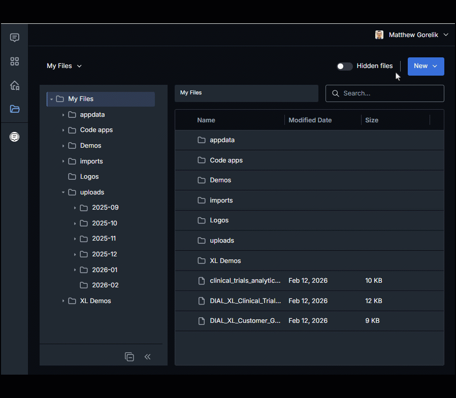
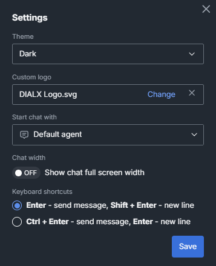

# Release Notes

The purpose of this document is to provide a quick summary of all the biggest new features added in this version and provide some additional description, video, or tutorials for major features.

## Brief Summary

The highlights of this release include a total redesign of DIAL's **File Manager**, initial support for **HuggingFace Model Servings** in the DIAL Admin, quality-of-life enhancements to DIAL Chat including **keyboard shortcuts**, and major upgrades within **DIAL's adapters.** 

## Major Enhancements

**Improved File Management**: DIAL has supported uploading attachments into your conversations and applications for years, but in this release, we made tasks like moving, renaming, downloading, and cleaning up these uploaded files from your DIAL instance far more intuitive for end-users. Files can be dragged-and-dropped into the DIAL UI and into conversations with agents, automatically organized into appropriate folders, then easily renamed later if you so choose. Whether it's retrieving information from unstructured documents or uploading complex presentations and asking for suggestions, if chatting with documents is an important part of your AI journey, DIAL's new file manager makes this much easier. 

**HuggingFace Model Servings**: DIAL's Adapter framework has always made connecting existing Open Source or other self-hosted models possible within DIAL. Many clients have expressed interest in deploying models directly within their DIAL ecosystem, to make it easier to manage and provide additional levels of control and flexibility. Support for NVIDIA NIM models has been available since Q4 2025, and in this release, we have added initial preview support for HuggingFace models as well. While it is still in preview mode, this feature allows system administrators to roll out open source models directly within their DIAL ecoystem.

**Security Enhancements**: A simple but important security feature in this release allows administrators to set restrict API Keys to certain client IP address ranges. This restriction can be applied on a global level or to individual API Keys, and allows DIAL clients an additional level of control for limiting programmatic access to their DIAL instances. Additionally, we have added support of private CAs and self-signed certificates to DIAL's OpenAI Adapter.

**Keyboard Shortcuts**: In addition to the file manager, end-user quality of life has also been improved with support for keyboard shortcuts in the user settings. In this release, the only settings are about configuring 'Enter' behavior for new lines vs. sending messages, but we plan on implementing additional key binding capabilities in the future. Providing a flexible and customizable platform fully within the owner's control has always been a key principle of DIAL, and this small QOL enhancement brings us, and clients, closer to this vision.

**Anthropic Adapter**: Working with Anthropic's Claude has long been supported through AWS Bedrock and Gemini Vertex adapters, but the DIAL team decided it's time to release a native, cloud-agnostic adapter for Anthropic model types. We have released an adapter from DIAL's Chat Completion API to Claude's Messages API. Source code can be found here: https://github.com/epam/ai-dial-adapter-anthropic. This means that Claude is now supported regardless of the cloud vendor of choice, including Azure Foundry as well.

**More Video Generation**: Google DeepMind's Veo 3 and Veo 3.1 models are now available through the Vertex adapter. This provides an alternative to OpenAI's Sora for video generation capabilities within DIAL, and we encourage all clients to test out their inner creativity with these models!

## Additional Notes

For full technical release notes with all bug fixes and additional features, please consult the [upgrade guide](upgrade-to-1.40.md) with all the tags for each component, as well as the DIAL documentation.

* **Gemini Adapter:** Added support for Google's server-side Python code interpreter in Gemini adapter
* **Gemini Adapter:**  Added support for gemini-3-pro-preview model
* **Admin Panel Autoscaling**: Added support for autoscaling of Admin Panel deployments, making configuration of the DIAL Admin easier.
