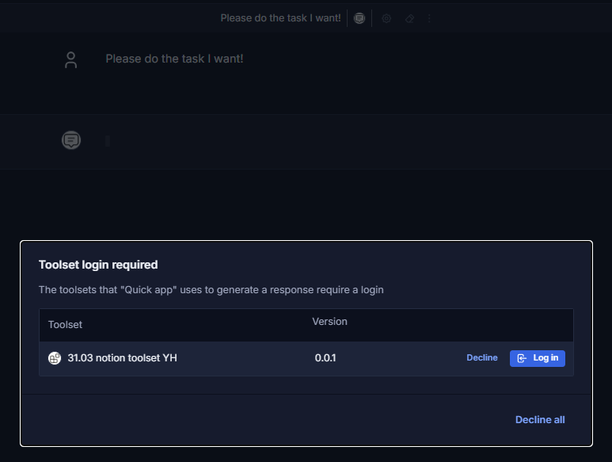
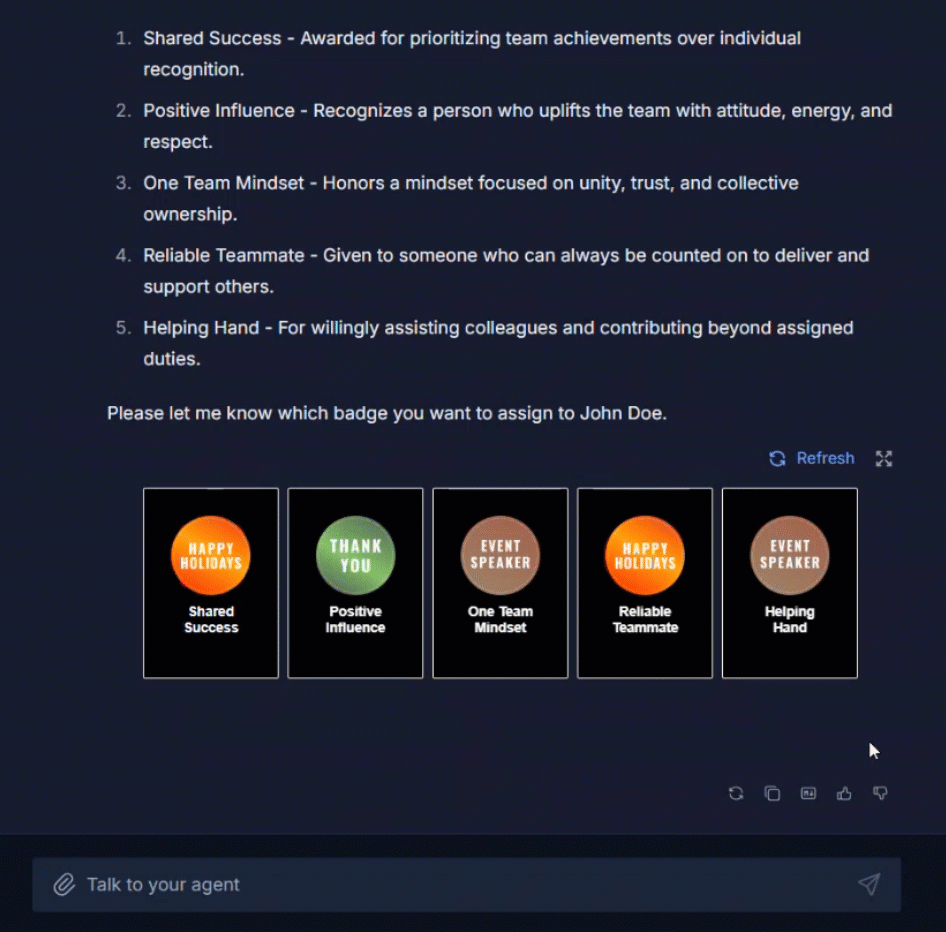

# Release Notes

The purpose of this document is to provide a quick summary of all the biggest new features added in this version and provide some additional description, video, or tutorials for major features.

## Brief Summary

The highlights of this release include significant improvements to **MCP Toolsets** including analytics and mid-chat authentication flow, additional **chat UI enhancements** for borderless attachments, **Hugging Face registry** integration, **several new adapters**, and initial support for **Responses API.** This release completes Q1 of our .

## Major Enhancements

**MCP Toolset Authentication Flow**: This feature streamlines the way end-users authenticate into toolsets. Now, DIAL agents can detect if a user is not logged into a requested toolset while chatting with it, and prompt them to log in mid-conversation. With the growing reliance on MCP servers to perform complex tasks, DIAL now makes managing complex, multi-agent systems far more efficient; a user no longer needs to login to every required MCP toolset prior to starting a chat.

  
**Continued UI Enhancements for Attachments**: Last month's release got the ball rolling on functionality necessary to create powerful custom widgets - this release ties it all together. In some cases, a picture is worth a thousand words - take a look at a simple AI agent seamlessly providing end-users with custom action buttons. DIAL Chat applications are now more flexible and customizable than ever before.

**Responses API**: We have added initial support of [OpenAI's Responses API](https://developers.openai.com/api/reference/responses/overview) in our Unified API. For now, DIAL supports simple text-to-text model conversations through this API. This feature is a pre-requisite for several tasks that are not technically feasible with the Completions API, most notably long-running queries. 

**DIAL Admin Analytics Overhaul**: One of the core principles of DIAL is transparency and traceability of all AI usage within an organization. MCP is a huge piece of this puzzle, and DIAL now supports **full analytics for MCP tools** and custom routes as well as the models and agents. System administrators can now monitor and control costs for all the most popular MCP servers and toolsets being used within their organization. On the backend, the Analytics module now supports **InfluxDB** to improve support for realtime analytics processing.

**Additional DIAL Admin Enhancements**: Another feature added to the Admin in this release is integration with the [Hugging Face Model Registry](https://huggingface.co/models), allowing administrators to search, filter, and sort through the list of available models directly in DIAL before deploying them via Model Servings in the Deployment Manager. We have also added **read-only** permissions for the Admin Panel, allowing system admins to better train their incoming support staff without jeopardizing the stability of the running platform.

## Additional Notes

For full technical release notes with all bug fixes and additional features, please consult the [upgrade guide](upgrade-to-1.42.md) with all the tags for each component, as well as the DIAL documentation.

* **MCP Tools:** "Try Out" functionality is now available in the DIAL Admin
* **OpenAI Adapter**: Added initial vLLM support and reasoning support for Magistral
* **Gemini Adapter**: Support Gemini Embedding 2, Gemini 3.1, and Claude 3.6 models.