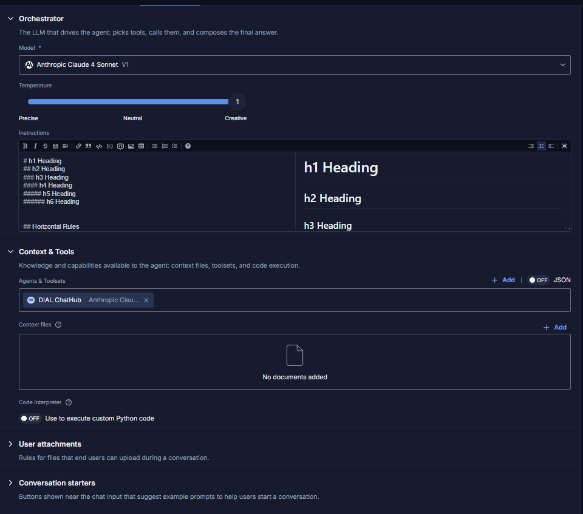

# Release Notes

The purpose of this document is to provide a quick summary of all the biggest new features added in this version and provide some additional description, video, or tutorials for major features.

## Brief Summary

The highlights of this release include a new **Evaluation Framework** for AI quality assessment, expanded **MCP ecosystem** support with registry integration and application-level MCP endpoints, significant **Quick Apps editor** improvements, and expanded **multimodal capabilities** across Vertex and OpenAI adapters including video generation and audio support.

## Major Enhancements

**Evaluation Framework**: One of the most requested capabilities for enterprise AI deployments is the ability to systematically assess and benchmark the quality of AI agents. DIAL Admin now includes an Evaluation Framework allowing agent creators and end-users to design Test Suites and benchmark agent performance, which makes it significantly easier to govern which models and agents are fit for production use within your organization. This feature is currently available in preview mode.

**MCP Registry in Deployment Manager**: Building on DIAL's MCP ecoystem story, administrators can now deploy MCP toolsets from the [Official MCP Registry directly](https://registry.modelcontextprotocol.io/) from the Deployment Manager in the Admin panel. This complements DIAL's existing MCP Toolsets functionality by giving administrators a centralized place to discover, register, and manage MCP servers before making them available to end-users. As MCP adoption accelerates across the industry, DIAL continues to invest in making MCP management as seamless as possible at enterprise scale.

**Connection URLs for Agents and Toolsets**: DIAL's API-first approach and ability to integrate with external applications has always been a key principle. In this release, it is now possible to copy Toolsets and Application URLs for integration into other applications as well. This makes it far easier for end-users to integrate their DIAL agents and toolsets into existing workflows with tools they already use like OpenClaw or Claude Desktop, for example. When combined with the existing governance, cost control, and observability capabilities built into DIAL, this functionality makes DIAL ready to serve enterprises needing to organize their agentic AI needs.

**Quick Apps Editor Improvements:** The Quick Apps experience has received a meaningful upgrade in this release. Creators can now take advantage of Starter Buttons to guide end-users, reducing friction and improving the out-of-the-box experience for end-users. The editor itself has also been improved with collapsible sections for context & tools, attachments, conversation starters, and settings, with a dedicated Instructions area containing markdown preview as well.

**Speech-to-Text:** DIAL Chat now natively supports Speech-to-Text models, enabling users to interact with AI applications using voice input directly from the chat interface. This opens the door to a wider range of use cases, from hands-free workflows to accessibility improvements. Please take a look at the Release Notes video to see this in action!

## Additional Notes

For full technical release notes with all bug fixes and additional features, please consult the [upgrade guide](upgrade-to-1.43.md) with all the tags for each component, as well as the DIAL documentation.

* **Marketplace**: Add a "Featured" section to the DIAL Marketplace
* **Claude:** Support files in tool result messages; support file and audio content parts within all adapters (Vertex, OpenAI, Bedrock)
* **OpenAI Adapter**: Added support for audio attachments in vLLM and DIAL attachments within the Responses-to-Responses API.
* **Vertex Adapter**: Support image-to-video modality in Veo
