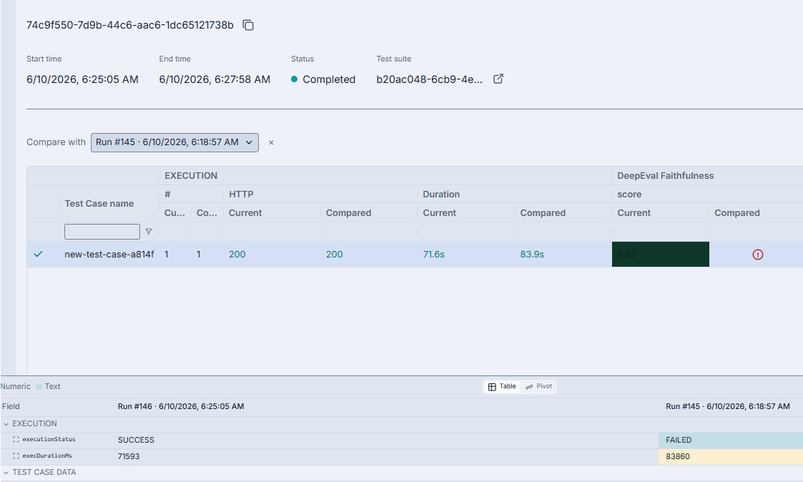
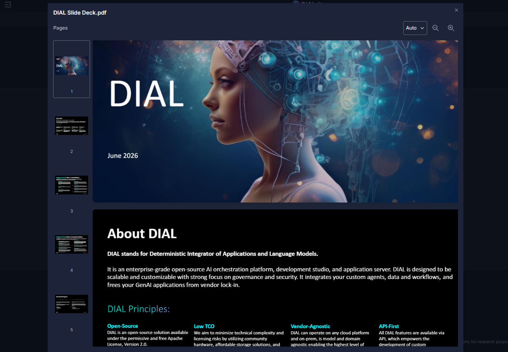

# Release Notes

The purpose of this document is to provide a quick summary of all the biggest new features added in this version and provide some additional description, video, or tutorials for major features.

## Brief Summary

The highlights of this release include a refreshed **DIAL brand identity** with new logos and a website re-design, major **Quick Apps enhancements** including Skills support, pre-configured tool orchestration, and MCP connectivity for connected applications, expanded **Evaluation** capabilities with run comparison and CSV export, and a new **PDF Viewer** in Chat.

## Major Enhancements

**Rebranding**: Welcome in a new DIAL Brand Identiy with updated logos for all components, and new default chat icons! Upcoming releases will have significant enhancements to the DIAL Chat UI to go along with the modernization of the DIAL User Experience. Check it out at [DIALX.ai](https://dialx.ai)!

**SKILL.md Support**: One of the most significant additions to Quick Apps in this release is the support of Anthropic's Agent Skills format. Through a new dedicated configuration section in the Quick Apps editor, users can now register correctly formatted DIAL prompts as agent skills. Agent skills are quickly becoming the standard way to provide structured instructions and extend AI agent capabilities with specialized knowledge and workflows. This ensures that DIAL remains compatible with leading industry standards for building and working with agents in an enterprise ecosystem.

**Orchestrator Tools Capability**: This release unlocks an important new capability for organizations working with models that come with natively bundled tools. Models such as Gemini with Google Search or GPT-5 with Bing Search can now be configured directly as orchestrator models, while preserving their pre-defined tool capabilities. Rather than configuring web search separately as an additional tool, users can delegate this capability directly to the orchestrator, simplifying agent architecture and reducing configuration overhead.

**MCP Support for Applications in Quick Apps**: DIAL's MCP ecosystem story continues to expand. DIAL applications have been able to define both a Completions and an MCP endpoint; this release introduces support for working with both types of endpoints in Quick Apps. When connecting to such an application, users are now given the option to configure whether the app will be used via Chat Completion or MCP. This gives organizations greater flexibility in how they integrate and consume AI capabilities.

**Evaluation Improvements**: Building on the Evaluation Framework introduced in the previous release, DIAL Admin now supports Run Comparison, enabling administrators and AI practitioners to compare evaluation runs side-by-side for more structured and rigorous benchmarking. Results can now also be exported to CSV, making it straightforward to share findings, build custom reports, or integrate evaluation data into broader governance and compliance workflows. These additions make the Evaluation Framework a significantly more complete tool for organizations managing AI quality at scale.

**PDF Viewer in Chat**: DIAL Chat now includes a native PDF viewer for PDF attachments. Users can view PDF documents directly within the chat interface without needing to download them or switch to an external application. This is a meaningful quality-of-life improvement that streamlines document-centric workflows. 

## Additional Notes

For full technical release notes with all bug fixes and additional features, please consult the [upgrade guide](upgrade-to-1.44.md) with all the tags for each component, as well as the DIAL documentation.

* **Token Visibility**: Users can now be allowed to see consumed tokens and remaining token allowance directly within DIAL Chat, providing greater transparency into model usage.
* **Quick Apps Agent Settings**: A new Agent Settings configuration section has been introduced, with Time Awareness of agents as a configurable option.
* **HuggingFace Auto-Detection**: The Deployment Manager can now automatically detect HuggingFace text-classification models, reducing manual configuration effort for teams working with open-source models.
* **Vertex Adapter**: Added support for Mistral models on Vertex AI, along with Workload Identity Federation (WIF) support for AWS container credential providers.
* **OpenAI Adapter**: Added support for `chunking_strategy` configuration in Speech-To-Text models
