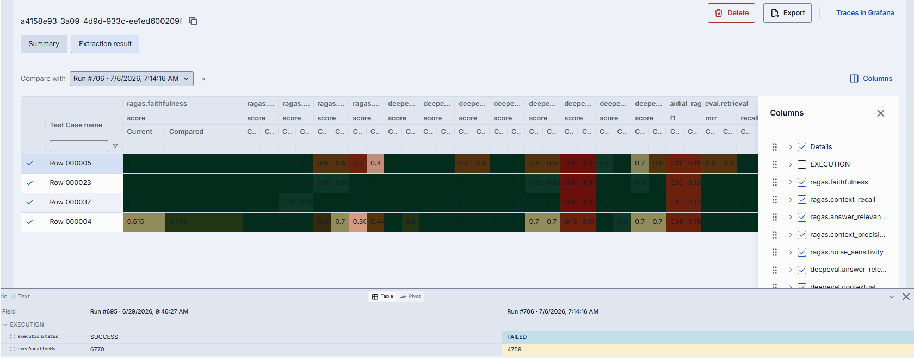

# Release Notes

The purpose of this document is to provide a quick summary of all the biggest new features added in this version and provide some additional description, video, or tutorials for major features.

## Brief Summary

The highlights of this release include significant improvements to **Evaluation in the Admin Panel** including run comparisons and reusable datasets, **additional connecting protocols** for applications, **support for long-running sessions via Responses API**, and several **adapter enhancements**. This release completes Q2 of our .

## Major Enhancements

**Evaluation Improvements**: One of the major milestones for Q2 was delivery of the DIAL Evaluation Toolkit within the Admin Panel. Having a future-proof and resilient AI strategy is necessary in this world of uncertainty surrounding LLM cost, reliability and availability. Knowing that your AI-powered applications continue to work effectively even when the underlying LLMs change is one of many important steps in this AI strategy. The robust DIAL Evaluation Framework within the DIAL Admin allows developers to create deterministic **test suites** and **compare outputs** of different models in a repeatable way. This release also marked a decoupling of **datasets** from **test suites**, which allow users to create and reuse more comprehensive test scenarios. Stay tuned for examples of how to build and use these test suites in our [documentation](https://docs.dialx.ai) and [YouTube channel](https://www.youtube.com/@TeamDIALX)!

**Long-running Sessions**: While live chat is still one of the most common ways end-users interact with AI tools, complex tasks like deep research or iterative coding require support for long-running background sessions that can run asynchronously and paused or resumed. DIAL now fully supports  in our Unified API to accomplish this. Please see the `responsesEndpoint` section of our  for more info on how this is implemented technically in DIAL.

**Application Endpoint Flexibility**: Similar conceptually to the above, adding additional connection protocols for applications allows developers to build agents that do much more than just chat via the completions endpoint. DIAL now supports schema-driven applications, which allows different connecting protocols for these applications. Conceptually, this expands what types of APIs are being used by DIAL applications; in practice, this has enabled developers to build agents that implement MCP endpoints or the Anthropic API for Claude Code integration.

## Additional Notes

For full technical release notes with all bug fixes and additional features, please consult the [upgrade guide](upgrade-to-1.45.md) with all the tags for each component, as well as the DIAL documentation.

* **PDF Highlighter**: DIAL now supports interactive content selection natively with a PDF highlighter that combines existing annotation APIs and OCR techniques to improve ability to make context-aware applications that can cite and annotate from text or image-based PDF sources.
* **Bedrock Adapter:** Passthrough for Claude API
* **OpenAI Adapter**: vLLM embeddings support
* **Gemini Adapter**: New Flash models + Multi-region Support improvements