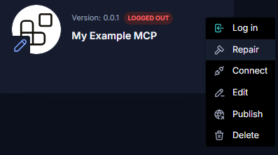
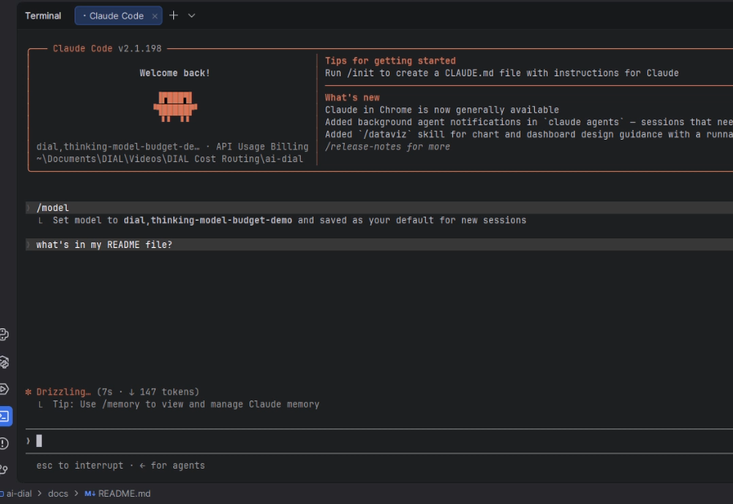
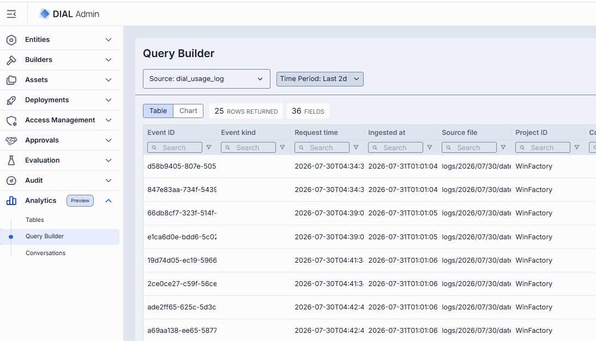

# Release Notes

The purpose of this document is to provide a quick summary of all the biggest new features added in this version and provide some additional description, video, or tutorials for major features.

## Brief Summary

The highlights of this release on the DIAL core side include **native support of agent skills**, redesigned and unified configuration of **application endpoints**, and major improvements to **OAuth Recovery** capabiltiies for MCP Toolset connectivity. The release also focused on continued improvements to the **DIAL Admin** with features like new analytics, and **Evaluation Framework** was improved with aggregated metrics and run comparisons. 

## Major Enhancements

**Skills Abstraction**: Skills are now supported as a first-class citizen in DIAL Core, enabling usage analytics, publications, and sharing of Agent skills within applications. This has been added to the API, and will allow developers and end-users to upload skills folders directly into the DIAL ecosystem and call them from Quick Apps, similar to how Toolsets are handled. As enterprises continue to search for cost savings and consistency improvements within their AI workflows, agent skills provide this layer of **predictable, repeatable instructions** to show general purpose models how to complete specific tasks.

**Toolset OAuth Repair**: Over the past year, MCP connectivity has become the defacto standard for connecting external tools to AI systems. In testing connectivity to external MCP servers, the team found that some MCP servers do not comply with the Dynamic Client Registration authorization standards outlined by the [MCP protocol](https://modelcontextprotocol.io/docs/2026-07-28/tutorials/security/authorization). As a result, we have added the ability to Repair connections dynamically from the Toolset menu in the DIAL Workspace.

**Unified Configuration of Application Endpoints**: DIAL added support for [OpenAI's Responses API](https://developers.openai.com/api/reference/responses/overview) and [Anthropic's Messages API](https://platform.claude.com/docs/en/api/messages) as part of the unified API. This release improves the handling of the configuration all these different API types, while maintaining support for legacy completions endpoints as well. This has enabled enterprises to run Claude Code through models hosted in DIAL, allowing enterprises to take advantage of all DIAL capabilities like rate limits and cost control while continuing to provide developer-focused tools to their end-users.

**DIAL Admin Enhancements**: From its inception, DIAL was designed to be a unified AI ecosystem for enterprises. Advanced logging and telemetry tools have been at the forefront of this messaging. While it is still in preview mode, this release has added more sophisticated **analytics tools** which will allow administrators to aggregate, analyze, and act on the collected historical usage data to identify AI champions, areas for efficiency improvements, and more. In addition, the DIAL Admin's Evaluation capabilities have been extended to include **aggregated metric** values for evaluation runs, and a rework of the evaluation comparisons with heatmaps, table controls, and more. DIAL's evaluation framework is contiunously evolving and strives to change the lifecycle management for agents and applications, allowing developers to have peace of mind that when the underlying model changes, an agent continues to perform as expected in this ever-changing world.

## Additional Notes

For full technical release notes with all bug fixes and additional features, please consult the [upgrade guide](upgrade-to-1.46.md) with all the tags for each component, as well as the DIAL documentation.

* **Quick Apps Attachment Handling**: Improve how orchestrator model handles file attachments, allowing agent chains to work better with the output from previous agents.
* **Vertex Adapter:** Support web search for Claude models and Anthropic API passthrough
* **OpenAI Adapter**: Support tokenization in Responses API, Anthropic API passthrough, and OpenAI models from Bedrock
* **Bedrock Adapter**: Support Bedrock Mantle client and latest Opus models, and Messages API passthrough with Anthropic and Encoding headers