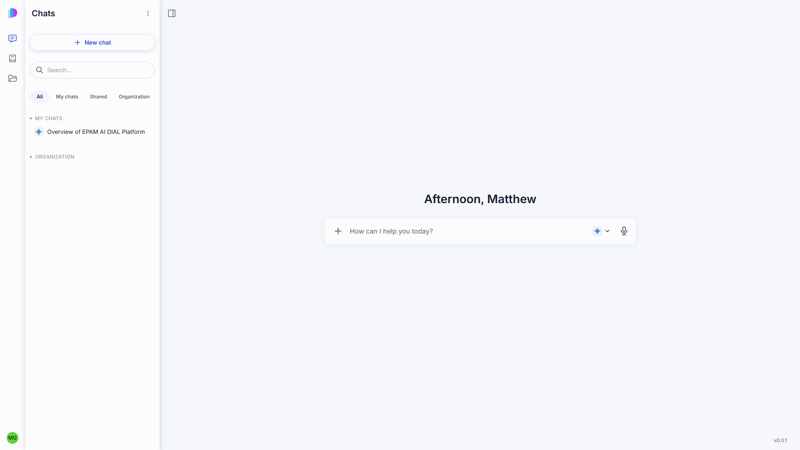
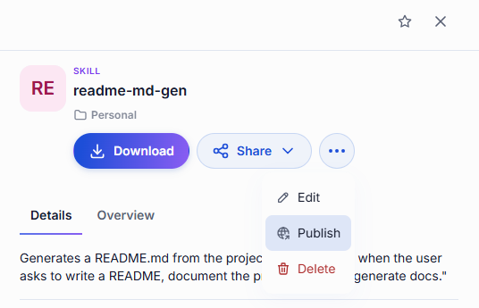
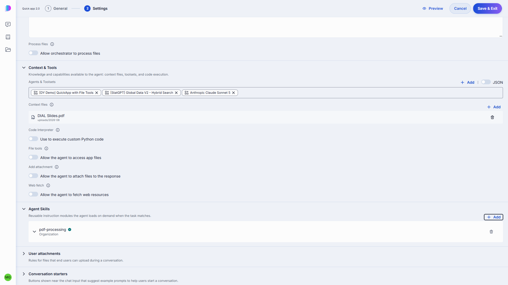

# Release Notes

The purpose of this document is to provide a quick summary of all the biggest new features added in this version and provide some additional description, video, or tutorials for major features.

## Brief Summary

This release is headlined by **DIAL Chat 2.0**, the ground-up rebuild of the chat experience. Please see the below video for a brief walkthrough. Additionally, DIAL now supports full governance to the Agent Skills standard, **Quick Apps** agents work with richer context, improvements to **Token Accounting** makes cached and reasoning token usage visible for chargeback, and an **OpenAPI-to-MCP Bridge** turns any existing REST API into a live set of MCP-ready tools.

## Major Enhancements

**DIAL Chat 2.0**: While many of DIAL's features as an enterprise-grade AI orchestration platform and gateway live in the DIAL Core and provide benefits to developers and API consumers, DIAL Chat remains the main UI for end-users. This release provides a much moremore modern, streamlined, and flexible UI than ever before. Redesigned features include a redesigned model/agent/toolset Catalog with richer per-item details, a reworked conversation panel and message view, a dedicated attachment library, a File Manager, a side canvas for viewing PDFs and other content, improved sharing and publication flows and a runtime UI language selector. `ai-dial-chat` 0.49.0 the final release of the current (0.4x) chat line, which continues to receive maintenance while organizations move across. 

**Agent Skills**: DIAL's support for the open Agent Skills standard is now governed end to end. DIAL Admin makes a skill a first-class, governed asset: a dedicated Skills section in Assets, and a Skill Publication approval queue so a skill authored by one team goes through the same review and publication path as a model, application, or prompt before the wider organization can rely on it. As agent capabilities multiply across an enterprise, keeping agents organized and properly governed is what keeps them useful rather than chaotic.

**Quick Apps Context Improvements**: Quick Apps agents gained several ways to work with more context this release. Agents can now load reference material from a connected MCP server's `resources`, not just call its `tools`, pulling in what they need on demand via a new `read_mcp_resource` tool. A built-in web fetch tool (currently in preview) lets an agent retrieve public web content directly into its workspace. When an agent delegates work to a sub-agent, that sub-agent can now keep its own conversation state across separate calls instead of starting cold each time, so multi-step delegated work holds together the way a person would expect. DIAL Chat now also forwards the user's browser timezone automatically, so agents and tools can reason about local time without being told. And for multinational deployments, model, application, and toolset names and descriptions can now be localized and shown to each user in their own language.

**OpenAPI-to-MCP Bridge**: DIAL can now turn REST APIs that a team already has an OpenAPI 3.x (or Swagger 2.0) description for into a live set of MCP tools, without writing a custom MCP server for it. An application registers the spec and an API destination, and the bridge exposes each operation as a callable tool automatically, reusing DIAL's existing credential resolution and header-forwarding controls so authentication follows the same path as every other tool in DIAL. Most enterprises already have API descriptions for the services they'd want an agent to call; building a dedicated MCP wrapper for each one has been the real bottleneck between having an API and having agents that can use it. This closes the gap directly: an existing API becomes agent-usable tooling in the time it takes to register its spec. It's an early-stage capability, but it turns MCP tool coverage from a hand-built list into something that scales with however many APIs an organization already documents.

## Additional Notes

For full technical release notes with all bug fixes and additional features, please consult the [upgrade guide](upgrade-to-1.47.md) with all the tags for each component, as well as the DIAL documentation.

**DIAL Admin**
* **Enrichment Rules Management:** New Admin UI to manage data-enrichment rules, previously API-only.
* **Catalog Deployment Metadata:** Models, applications, and toolsets can now carry structured catalog metadata, rendered in DIAL Chat 2.0's redesigned Catalog.

**Model Adapters**
* **Bedrock Adapter:** Adds support for Claude Opus 5, Sonnet 5, and Fable 5, plus a new vendor, MiniMax (M2.5 model).
* **Anthropic Adapter:** Passthrough now also supports third-party Anthropic-API-compatible providers, alongside Claude Platform.
* **Token Cache Accounting**: DIAL Core now prices cached-read and cached-write tokens separately from fresh tokens, and usage statistics break out reasoning tokens and cache-write tokens as their own tracked figures. 

**Authentication**
* **DIAL Native:** A new authentication type lets headless/scheduled applications act on behalf of a user via org-wide admin consent, with no per-user login required.

**Evaluation**
* **Multi-Turn Conversation Support:** Test suites can now define a multi-step conversation instead of a single request/response, evaluating multi-step agent behavior the way it's actually used.
