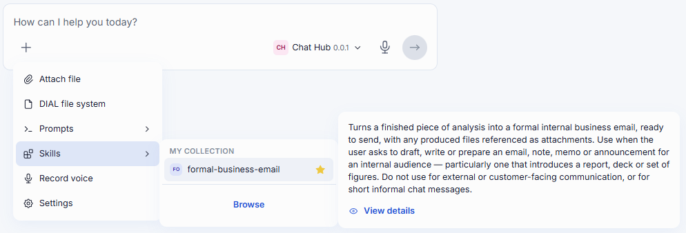
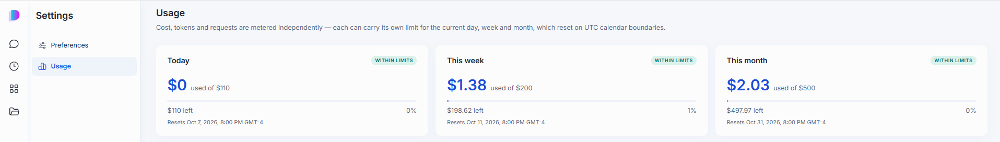
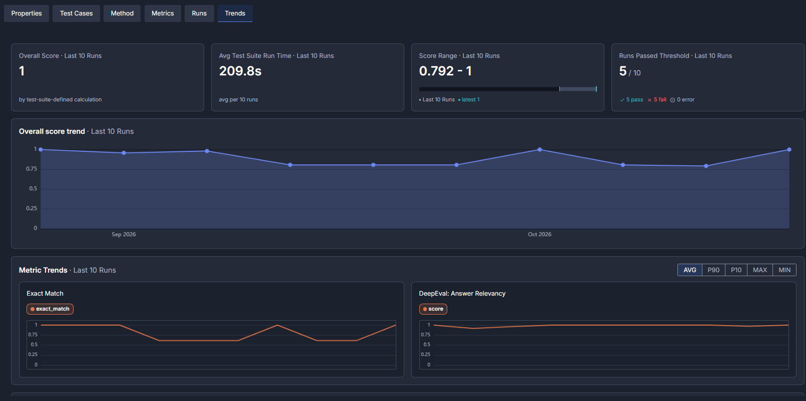

# Release Notes

The purpose of this document is to provide a quick summary of all the biggest new features added in this version and provide some additional description, video, or tutorials for major features.

## Brief Summary

The main highlights in this release include **full Agent Skills invocation** in DIAL Chat (Preview), **API Translators** in DIAL Core for improved model connectivity, full release of the **DIAL TypeScript SDK** for JavaScript developers, and improvements to cost control with clearer **calendar period** support.

## Major Enhancements

**DIAL Chat 2.0 Is Now the Default**: As announced with 1.47, DIAL 1.48 is the first platform release that ships only the new DIAL Chat. This release adds has several UI enhancements to Chat including a new **Preferences** tab in Settings, redesigned text and voice input, prompts from the library that are inserted right where the cursor is, grouped visualizations for applications carried over from the previous chat, and a **Usage** view that shows when each limit resets. Citations became much more precise; users are taken straight to the cited passage in Word documents, the cited rows in Word and PowerPoint tables, and the cited area of a PDF page.

**Agent Skills in Conversations (Preview)**: Users can now pick a skill from the catalog or the message input and **use it directly in a DIAL Chat conversation** when models or agents support them, so a skill that was authored, reviewed, and published once can be reused by anyone in the organization who has access to it. DIAL Core and Quick Apps now also support skills behind the scenes, laying the groundwork for agents to use them. The feature is in Preview and is turned off by default.

**API Translators and Flexible Model Connections**: DIAL already offers several industry-standard APIs: OpenAI Chat Completions, OpenAI Responses, and Anthropic Messages through one gateway. With **translators**, a model can now be used through an API it does not support natively: DIAL converts the request on the fly and returns the answer in the format the client expects. Usage, cost, and limits are still counted only once, so translation never doubles anyone's consumption. Administrators also get much finer control over how each model is connected and which capabilities it offers through each API, and DIAL Admin adds a dedicated **Translators** section to manage this without editing configuration files (in Preview). In practice this means that developer tools like Claude Code or Codex can run through DIAL on models that only offer an OpenAI-compatible API, with no custom integration work.

**DIAL TypeScript SDK**: DIAL now provides a [TypeScript SDK](https://github.com/epam/ai-dial-typescript-sdk) which is available on the [npm registry](https://www.npmjs.com/package/@epam/ai-dial-typescript-sdk?activeTab=readme), making it much easier for JavaScript developers to work with the DIAL Core. In fact, the new DIAL Chat 2.0 leverages this SDK!

**Calendar-Based Usage Limits**: Daily, weekly, and monthly limits now follow **calendar periods** instead of rolling windows. This matches how organizations actually budget and charge back AI usage — "this month" means the calendar month — and makes limits predictable for end users, who can now see exactly when their quota resets directly in DIAL Chat.

**Evaluation Framework Enhancements**: Evaluations now support agents and models that use the **OpenAI Responses API** and **Anthropic Messages API**, so test suites can cover the same APIs used in production. Running test suites can be **cancelled** from DIAL Admin and stop immediately, each test case gets an **overall score**, the **cost** of each run and deployment can now be tracked, and **multi-request test suites** let one test case chain up to ten requests, where each step can use the results of the previous ones — for example, create an item and then check it — and can be tried out before running. Test suites are also checked to make sure they target the intended model, show the author's display name, and can use additional metric providers configured by administrators. Test runs execute more in parallel, so results arrive faster. Together with the multi-turn support added in 1.47, this makes evaluation a practical part of the agent lifecycle, not just a one-off check.

## Additional Notes

For full technical release notes with all bug fixes and additional features, please consult the [upgrade guide](upgrade-to-1.48.md) with all the tags for each component, as well as the DIAL documentation.

**DIAL Core**
* **Configuration Migration:** Existing configuration files can now be migrated into settings managed through DIAL Admin.
* **Faster Cost Calculation:** Costs for models with complex pricing (for example, by service tier or cache duration) are calculated more efficiently.
* **Simpler Toolset Sign-In:** Users are no longer asked to sign in to a toolset again when they submit the same API key.

**DIAL Admin**
* **Analytics (Preview):** Queries that combine several data sources, reusable data-processing pipelines, and easier creation of evaluators. Analytics tables are easier to understand, with plain-language hints and neatly formatted query results, and access to them follows user roles.
* **Configuration Visibility:** Configuration files can be viewed in the Admin UI in read-only mode.
* **Access Control for Platform Assets:** Platform applications and toolsets now support role-based access.
* **Deployment Manager:** Applications can be built from private Git repositories using separate credentials for each repository or project on the same Git server, so teams no longer need to share one account for the whole server.

**Quick Apps**
* **Smarter Tool Use:** Agents get better context about the available tools, and citations from tools are carried through to the final answer.
* **Reasoning Effort Control:** The reasoning effort set for an agent's model or its tools is now respected, so teams can balance answer quality against speed and cost.
* **Large Toolsets (Preview):** Large toolsets are loaded only when needed, keeping agents fast and focused.

**Observability**
* **Realtime Analytics:** Usage through the OpenAI Responses and Anthropic Messages APIs is now tracked, with new ready-made dashboards for both. Usage data is also collected more reliably, even from requests and responses in non-standard formats.
