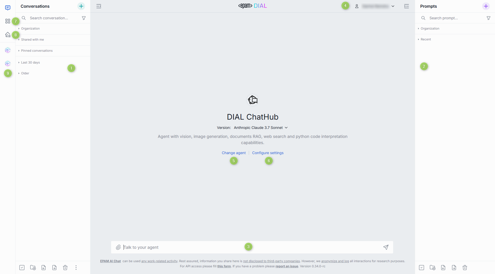
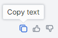
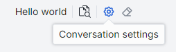
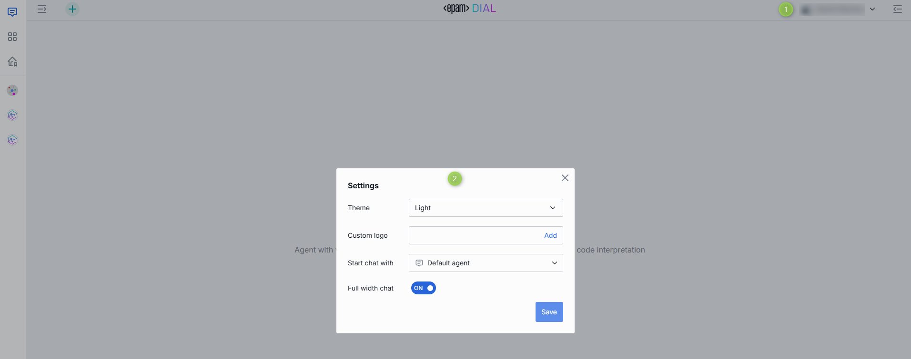
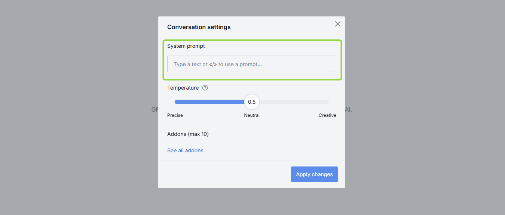
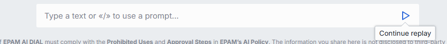
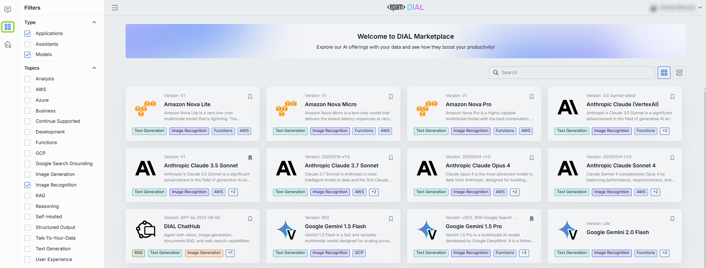
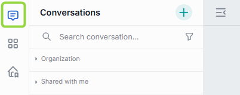
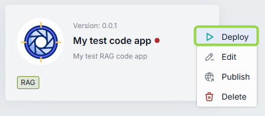
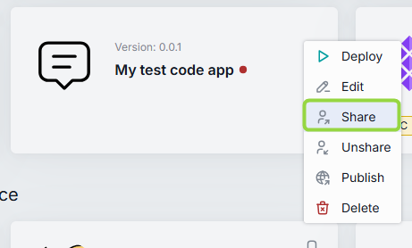

# Chat User Guide

## Introduction

DIAL Chat is a powerful enterprise-grade application that serves as a default web interface for DIAL users, providing access to the full set of DIAL features.

> - Watch a [demo video](/docs/video%20demos/1.Chat/1.dial-ui-basics.md) with introduction to DIAL Chat UI.
> - Refer to [Quick Start](/docs/quick-start.md) to learn how to launch DIAL Chat in a few clicks.

### Additional Documentation

Refer to [DIAL Chat repository](https://github.com/epam/ai-dial-chat) to view the project source code and documentation for additional components:

- DIAL Chat [documentation](https://github.com/epam/ai-dial-chat/blob/development/apps/chat/README.md).
- DIAL Chat Theming [documentation](https://github.com/epam/ai-dial-chat/blob/development/docs/THEME-CUSTOMIZATION.md).
- Chat Overlay [documentation](https://github.com/epam/ai-dial-chat/blob/development/libs/overlay/README.md).
- DIAL Chat Visualizer Connector [documentation](https://github.com/epam/ai-dial-chat/blob/development/libs/chat-visualizer-connector/README.md).

You can also refer to other topics in this documentation:

- Chat localization [instruction](/docs/tutorials/1.developers/3.chat/1.localization.md).
- List of [supported LLMs](/docs/platform/2.supported-models.md).
- Chat UI design [guidelines](/docs/tutorials/1.developers/3.chat/3.chat-design.md).
- Authentication [guidelines](/docs/platform/3.core/1.auth-intro.md).

## Standard Chat Interface Components

> **NOTE**: this user guide covers the functionality of a standard DIAL Chat UI.

The DIAL Chat application user interface has several main sections:

1. [Conversations](#conversations): Here, you can access and manage your conversations. You can collapse and expand the panel by clicking the **Hide panel** icon above it.
2. [Prompts](#prompts): In this section, you can work with prompts: create new templates, update them, and organize them in folders. You can collapse and expand the panel by clicking the **Hide panel** icon above it.
3. [Chat](#chat): Use this section to enter a prompt, view results, and interact with conversational agents.
4. [User Settings](#user-settings): In your user settings, you can customize the color theme (dark or light), replace the standard logo and access other UI customization options.
5. [Agents](#agents): you can view and change conversational agent before or during a conversation.
6. [Conversation settings](#conversation-settings): By default, this section displays the last conversational agent used by the user. In this section, you can modify settings of the selected agent or change the agent.
7. [DIAL Marketplace](#marketplace): Marketplace displays all conversational agents (applications and language models) available on your DIAL environment.
8. [My Workspace](#my-workspace): In My workspace, you can create applications and add agents from the Marketplace.
9. [Files](#files): Manager of files.

## Custom UI

> **NOTE**: this user guide covers the functionality of a standard DIAL Chat UI.

The standard DIAL Chat UI is designed to meet the needs of typical conversational applications.
However, to accommodate the requirements of applications that exceed the standard chat UI functionality, new application types can be introduced to implement a fully custom UI (even not chat-like UI), which can completely replace the standard chat interface during interactions with a specific application.

For example, [Mind Map](#mind-maps) applications implement fully custom UI that overrides the standard chat UI.

## Chat

The chat occupies the central part of the main screen, allowing you to input messages, see replies, and execute various supported tasks based on the application and chat settings.

### Actions

**During a conversation**, you can perform various actions:

- [Work with prompts](#work-with-prompts)
- [Work with responses](#work-with-responses)
- [Work with attachments](#work-with-attachments)
- [Work with conversation settings](#work-with-conversation-settings)

#### Work with prompts

##### Enter prompts

You can enter your prompts in the text box. In [User Settings](#user-settings), you can configure the keyboard combination that will send the message.

You can enter a prompt manually or select one of [existing prompts](#prompts). Enter `/` in the chat text box to select one of the available prompts. You can also click [Use](#use) in the prompt's menu to populate it in the text box or invoke a pop-up window where you can enter prompt variables.

##### Other actions

During a conversation, you can access several tools to work with prompts.

- **Edit**: You can edit an existing prompt in the ongoing conversation. When editing, you can also edit the attached files if needed using drag-and-drop, CTRL+V or by selecting files in the Attachments Manager. After a prompt has been edited, the response is regenerated, and all your prompts after the edited one will be deleted.

  

- **Delete**: You can delete an existing prompt in the ongoing conversation. When you delete your prompt, the response will be deleted, too.
- **Set message template**: Use it to create a [parametrized conversation](#dynamic) using any message in your conversation as a template.

#### Work with responses

##### Copying responses

You can copy answers to reuse them some place else.

* Copy as plain text
* Copy in markdown format

##### Stop and Regenerate

In the process of generating the response, you can stop it by clicking a **Stop** icon in the text box.

When the response generation has been stopped, you can regenerate it. **Important**: If you encounter a server error or click the **Stop Generating** button and receive an empty response, the **Send** button will be disabled. To continue the conversation, you'll need to generate the answer again. If you receive a partial response (a combination of text and an error), the model can still proceed, while for Assistants/Applications, you'll need to generate the response again.

##### Like/Dislike

You can like and dislike responses in a conversation. Use likes to highlight important responses and dislikes to mark the responses you don't find helpful or that are incorrect.

For a Dislike action, you will be prompted to enter a comment in a pop-up window.

#### Work with attachments

Some models and applications (e.g. _DIAL RAG_) support adding attachments (files, links, folders) to conversations. In this case, you'll see the **Attachments** icon available in the chat box. Click it to upload a file from your device or select an already uploaded file. You can also drag-and-drop files or use CTRL+V.

> Attached files are available in [Files](#files).

##### Attaching folders

If the selected application supports this, you can click the attachment icon in the conversation box and select **Attach folders**.

> Note, that you can attach only folders available in [Files](#files) and cannot upload folders from an external source.

In the pop-up window, select a checkbox for the folder you want to attach to your conversation. The attached folder will appear in the conversation box and become available for the application to work with.

##### Attaching links

If the selected application supports this, you can attach a link to a conversation to use it to generate responses:

1. Click the attachment icon in the conversation box and select **Attach link**.

   

2. Specify a valid URL and click **Attach**. The link will be displayed as attachment in the conversation box and become available for the application to work with.

   

##### Attaching files

If the selected agent supports this, you can click the attachment icon in the conversation box and select **Attach uploaded files** or **Upload from device**. You can also _drag-and-drop_ files or use CTRL+V to paste files into the conversation box.

- Attach uploaded files: If you have already uploaded the necessary files, you can select them in [Files](#files).
- Upload from device: Select files you want to upload. Uploaded files you will be able to find in [Files](#files).

The file(s) will be displayed as attachment(s) in the conversation box and become available for the application to work with.

##### View or download attachments

You can perform the following actions on attachments received in AI-generated responses:

- **Download**: Click the **Download** icon to save the attachment to your device.
- **Preview**: Click the **Down Arrow** icon to preview the attachment inline.
- **Full Screen**: Click the **Expand** icon to view graphics in full screen mode.

#### Work with conversation settings

On the top bar you can view and manage agent and conversation settings.

> Refer to [Conversation Settings](#conversation-settings) to learn more.

### Isolated View Mode

In the Isolated View Mode, you can access the DIAL Chat in a simplified view mode with the predefined conversational agent. To access this mode, follow a specific URL `https://server/models/modelID` or `https://server/models/applicationID`. Conversation and prompt panels are not shown in this mode. All conversations that are created in this mode, will also be displayed in the standard chat view mode.

For instance, to open chat with GPT-4 model, go to `https://DIAL Chat URL/models/gpt-4` and access a streamlined user interface that only contains a chat input with GPT-4:

Although this mode offers a simplified view, you can access [Conversation settings](#conversation-settings) the usual way.

## User Settings

In the user area on the top bar, click the dropdown arrow to access additional settings or sign out.

##### Available actions

- **Theme**: Select between the available chat themes. Refer to [Chat Themes](https://github.com/epam/ai-dial-chat/blob/development/docs/THEME-CUSTOMIZATION.md) to learn more.
- **Custom Logo**: Select an image to display in the chat header.
- **Start chat with**: Select a default [agent](#agents) to start a chat with. You can select one of the available agents or applications.
- **Chat width**: Enable/disable full-width chat mode. In the full with chat mode, the chat text box occupies the full width of the screen.
- **Keyboard shortcuts**: Select the keyboard combination to send a message in the chat.

## Conversations

In DIAL, a conversation is a dialogue between a conversational agent, such as a language model or application, and a human user. The agent uses natural language to interact with a human and receive/give a feedback. Within one conversation, you can refer to previous questions and answers. But different conversations don't share context.

> All your conversations are stored on the server, and you can access them from any device you use.

### Agents

In DIAL Chat you can have a conversation with agents: [language models](#models) and [applications](#applications). You can access all the available agents in [DIAL Marketplace](#marketplace) and add them to [your workspace](#my-workspace).

> Refer to [Agentic Platform](/docs/platform/0.architecture-and-concepts/4.agentic-platform.md) to learn more about agents.

##### To change agent

By default, the main window displays the last agent used by the user. You can proceed and have a dialog with this agent or change it before starting a conversation or switch to a different one during the conversation:

Before you begin a conversation, click **Change agent** to invoke the **Select an agent for conversation** window. Here, you can choose among the added agents or navigate to My workspace section.

In the middle of a conversation, you can view information about the current agent and change it by clicking the agent icon.

> **TIP**: You can also set the **default agent** you want to start a conversation with in your [User Settings](#user-settings).

### Conversation Settings

> **Note**: The conversation settings can vary based on the agent selected. It's possible that some agents might not have any configurable settings.

In the Conversation Settings, you can access and modify the following components depending on the selected agent:

- [System prompt](#system-prompt)
- [Temperature](#temperature)

You can modify the conversation settings before or during the conversation:

**Before** you begin a new conversation, click **Configure settings** in the main chat area to invoke the **Conversation settings** window.

**During** the conversation, in the conversation header you can view and modify conversation settings by clicking the **gear** icon.

In the conversation header menu you also can:

- View and change the current agent: you can view information about the current agent and change it by clicking the agent icon. Refer to [Agents](#agents) to learn more.
- Access conversation action menu: click the three-dot menu icon to access the standard conversation [actions menu](#actions).
- Clear conversation history: click the eraser icon to clear the conversation history and start from scratch.

#### System Prompt

> **Note**, there are language models that do not support this feature. In such cases system prompt is disabled.

The system prompt in DIAL acts as the initial set of instructions provided to the model. It serves as a compass for the model, guiding it through the conversational landscape to ensure it remains on track and stays aligned with the intended purpose and desired outcome of the conversation.

Type `/` in the text box to select any previously created prompt as a system prompt (for details, refer to the [Create](#create-1) in Prompts), and it will set the context and tone for the whole conversation.

#### Temperature

The temperature parameter controls the creativity and randomness of the model's output. A higher temperature (e.g., 1.0) makes the output more diverse and creative, while a lower temperature (e.g., 0.1) makes the output more focused and deterministic.

Adjusting the temperature allows you to balance creativity and consistency in the generated response.

### Actions

Click a **...** icon to open a conversation menu. There, you can view a list of all possible actions for the chosen conversation.

> **Note**, that the available actions can vary depending on the selected conversation. For example, the Unpublish action will not be available if the conversation hasn't been published yet.

This is the list of all the supported actions:

- [Select](#select-to-delete): use to select conversations you want to delete.
- [Rename](#rename) - use to rename a conversation.
- [Compare](#compare): use to compare conversations with different settings.
- [Duplicate](#duplicate): use to duplicate a shared conversation.
- [Replay](#replay): use to reproduce conversations but with different settings.
- [Playback](#playback): use to simulate the current conversation without any engagement with models.
- [Export](#export): use to export a conversation.
- [Move to](#arrange): use to relocate conversations.
- [Share](#share): use to share a conversation by providing a link or QR code.
- [Remove access](#remove-access): use to remove access to a shared by you conversation for all users.
- [Unshare](#unshare): use to remove a shared with you conversation from the list.
- [Publish](#publish): use to publish conversations.
- [Unpublish](#unpublish): use to revoke public access from published conversations.
- [Info](#info): use to view metadata of a selected conversation.
- [Delete](#delete): use to delete a single conversation.

### Arrange

You can organize your conversations into folders. To create a new folder, simply click on the folder icon located in the bottom menu:

You can also create a new folder or move a conversation to the existing folder from the **Move to** context menu of the selected conversation. New folders will automatically be arranged in the **Pinned conversations** tab in the Conversations panel.

##### Hierarchy

You can create a hierarchy of folders with three nesting levels. Just create a folder and drag-n-drop it in the other folder to create a nesting level. The same way, you can either drag-n-drop a conversation into a folder or use **Move to** in the context menu of a conversation to move it to a **parent** folder.

> **Note**: empty folders are deleted after refreshing the page.

##### Naming conventions

The following symbols in the folders names are prohibited: tab, `"`, `:`, `;`, `/`, `\`, `,`, `=`, `{`, `}`, `%`, `&` and will be excluded. Note that you can use the `.` symbol at the start or inside a name, but the dot at the end will be automatically removed.

The MAX length of the folder name is limited to 160 symbols. Everything beyond is cut off.

### Search and Filter

Use the **Search** box to search conversations by their names. If you have any shared conversations, you can apply **Shared by me** filter to sort them out.

### Create

There are several ways to initiate a dialog with a [conversational agent](#agents):

- To communicate with the current conversational agent (by default, the last one used by the user), simply begin typing in the text box located in the chat area.
- In My Workspace or Marketplace, select an agent and click **Use ...** button to initiate a conversation. Refer to [Converse](#use-1) to learn more.
- On the main chat screen, click the **Plus** icon to select agent and start a conversation.
- Applications can include starter buttons. You can use them to select a starting prompt for a new conversation. Refer to [Custom Buttons in Apps](/docs/tutorials/1.developers/4.apps-development/1.custom-buttons.md) to see tutorials for developers on how to include custom buttons in applications.

**Please be aware** that new conversations will show up in the conversations panel located to the left of the main chat area. However, if you start a conversation and close it while it is still empty, it will neither be displayed on the panel nor saved in your conversations.

### Rename

When you create a new conversation, it is automatically named after the first line in your first prompt. For instance, if your prompt consists of several sentences divided by a tab, the first sentence will be used as the conversation's name. Moreover, the MAX length of the conversation name is limited to 160 symbols. Everything beyond is cut off. After a conversation is created, you can rename it.

##### To rename a conversation

1. Click **Rename** in the context menu of the selected conversation.
2. Enter a new name and submit.

##### Naming conventions

The following symbols in the conversation names are prohibited: tab, `"`, `:`, `;`, `/`, `\`, `,`, `=`, `{`, `}`, `%`, `&` and will be excluded. Note that you can use the `.` symbol at the start or inside a name, but the dot at the end will be automatically removed.

### Share

You can share a personal conversation or a folder with several conversations with other users. You can also receive a shared conversation.

**Important**: When a conversation is shared, all its attachments are shared as well and become available in [Files](#files).

> - Watch [Collaboration](/docs/video%20demos/1.Chat/3.dial-collaboration.md) demo video to learn more about sharing and other collaboration features in DIAL.
> - Refer to [Collaboration](/docs/platform/7.collaboration-intro.md#sharing) to learn more about sharing.

##### To receive a shared conversation

If a conversation has been shared with you, it can be located in the **Shared with me** section in the left panel.

> **Important**: you cannot change a conversation that has been shared with you. To be able to work with it, [duplicate it](#duplicate).

##### To share a conversation

> **Note**: You can share entire folders with conversations. When you share a folder, all its folders and attachments will be shared as well.

If you want to share a conversation or a folder, click on **Share** in the contextual menu and send the link (or the QR code) to the intended recipient.

After the recipient has opened your link, the arrow icon appears near its name. **Note**, it may be required to reload the page to update the status of the shared conversation.

To filter and view only the conversations that you have shared, click on the **Shared by me** checkbox in the filter:

### Remove access

To revoke access from all users you have shared with, click **Share** in the contextual menu and then click **Remove access for all users**.

### Unshare

In the **Shared with me** section, you can find all conversations that were shared with you. Use **Unshare** in the conversations actions menu to remove selected conversations from this list.

### Duplicate

Duplicate a shared with you conversation to be able to change it. To duplicate a conversation, click **Duplicate** in the contextual menu.

> This feature is available only for conversations shared with you.

### Export

You can export conversations. If a conversation includes attachments, you can export it with or without attachments.

You can also export all your conversations at once without attachments in a JSON format.

> Exported conversations are named by the following pattern: prefix "epam_ai_dial_chat", then "with_attachments" if the conversation was exported with attachments, then "month_day". However, the naming convention is configurable in the chat config.

##### Export a single conversation with attachments

1. On the left panel, in the conversation contextual menu, point to **Export**.
2. Click **With attachments**.

The conversation will be exported as a **ZIP** archive. Please note that the name of the ZIP archive follows the format `file_name.dial`. You can manage it just like a normal ZIP archive.

##### Export a single conversation without attachments

1. On the left panel, in the conversation contextual menu, point to **Export**.
2. Click **Without attachments**.

The conversation will be exported as a **JSON** file.

##### Export all conversations

To export all conversations, at the bottom of the left panel, click the **Export conversations** icon.

> Conversations will be exported without attachments.

### Import

Exported conversations can be imported.

To import a JSON file with a conversation or a ZIP archive with several conversations (may include attachments as well), click the **Import conversations** icon at the bottom of the left panel and then select a file with conversations.

When you import a conversation with attachments, the attachments will be available in the parent of the root folder in [Files](#files).

When importing a **duplicate** of an existing conversation, you will be prompted to select one of the proceeding options for both the conversation and each of the attachments:

- Replace - replace the original conversation/attachment
- Ignore - do nothing
- Postfix - add a postfix to the imported conversation/attachment. For example: _my-conversation 1_ , where 1 is added postfix to the name of the duplicated imported conversation.

### Info

Click **Info** in the conversation menu to view the conversation metadata: the date it was updated and the creation date.

### Delete

You can delete a single conversation, selected conversations or all conversations.

- To delete a **single** conversation, on the left panel, in the conversation contextual menu, select **Delete** and confirm your action.
- To delete **all** conversations, at the bottom of the left panel, click the **Delete all conversations** icon.

### Select to Delete

Also, you can use a _selection_ mode to choose conversation(s) you want to delete:

- Click **Select all** button in the bottom panel. When you do this, all conversations get preselected and you can unselect the ones you want to **keep**. You can also click **Unselect all** in the bottom panel to clear the selection.

- Click **Select** in the conversation menu to enter into a _selection_ mode. In this mode, you can hover over any conversation and use checkboxes to select/unselect conversations you want to delete. You can also click **Unselect all** in the bottom panel to clear the selection.

### Replay

You can use **Replay** to reproduce conversations but with different settings (e.g. a different model). A replayed conversation can be used to compare responses to the same questions from different models and with different settings of the conversation.

Use **Replay as is** to reproduce the conversation with the original settings. You can find Replay as is if you click **Change agent** or an agent icon in the conversation header menu.

##### To replay a conversation

1. Click **Replay** in the conversation menu.
2. Click **Start replay**.
3. In the process of replaying, you can stop and resume the replay process using controls in the text box **Stop generating** and **Continue replay** respectively.

The replayed conversation is displayed as a new conversation with the `[Replay]` tag in the list of your conversations.

### Parameterized Replay

You can use Parameterized Replay to create your own chats or stories with custom variables and share them with your team. Such parametrized conversations others can follow, but with their own details or answers to create a personalized experience. This makes chat a much more useful tool for sharing information and collaboration.

##### Prompt-based

You can create a parametrized conversation using a special prompt with variables.

Let's create a simple Travel Guide conversation, which will take a user though several steps to clarify information and provide the answer.

1. Start by [creating a special prompt](#create-1) with [variables](#variables). Use templates (this `{{VariableName|DefaultValue}}` or this `{{VariableName}}`) to add variables into your prompt with or without default values. For example: `I'd like to travel to {{country|Japan}}. Could you please suggest {{num-attractions|10}} of the best attractions? I will be there for {{num-days}}. Thank you.`
2. To use your parametrized prompt, type `/` in the conversation text input area and select your prompt. You will be asked to provide your inputs for variables in a pop-up window. Enter your inputs and click `Submit`. The prompt is now populated with your inputs in the conversation text box. Send message to start.
3. The chat will return its response to your prompt.
4. You can now click [Replay](#replay) in your conversation's menu to repeat this dialogue but with different input parameters.
5. You can [Share](#share) this conversation with someone. When a person opens the shared conversation, they will be prompted to fill in their personal input in the parameterized prompt, allowing them to have the same conversation but with their custom inputs, for example, travel to USA instead of Japan.

##### Dynamic

You can create a parametrized conversation from any message in your chat. This scenario does not require having any pre-configured prompts.

> Watch a [demo video](/docs/video%20demos/1.Chat/5.dial-parameterized-replay.md) to see it in action.

1. Within a conversation, you can set any message as a template for subsequent replay. Use **Set message template** to invoke the **Message template** window.

   

2. In the **Message template** window, you can substitute sections of your original message with [variables](#variables) under the **Set template** tab. To achieve this, copy a segment from your original message and paste it into the first input box. Then, in the second input box, introduce a variable using the format: `{{Variable name}}`. For instance, in our example, we have replaced "France" with the `{{Country}}` variable.

   

   In the **Preview** tab, you can preview your original message with variables:

   

3. Once you click save, you can return to your conversation. In the conversation menu, select [Replay](#replay) to initiate the replay of this conversation. The chat will prompt you to input values for your variable(s) to replay the conversation. You have the option to replay it as it originally was (using the same model as in your initial conversation) - select **Replay as is** (you can find it if you click **Change agent**), or you can alter the settings of the conversation to experiment with different models and parameters.
4. You can [Share](#share) this conversation with others. When someone opens the shared conversation, they will be prompted to provide their own inputs in the template. This allows experiencing the same conversation but with personalized inputs, such as traveling to the USA instead of France.

### Playback

The Playback mode can be used to simulate the current conversation without any engagement with models. This mode accurately reproduces the conversation like a recording.

> - **Note**, that this differs from [Replay](#replay), where the prompts are resubmitted to the chosen model and the outcomes may differ from the initial conversation.
> - **Note**: playback support in [schema-rich applications](/docs/platform/3.core/7.apps.md#schema-rich-applications) can be enabled/disabled in the application's JSON schema using `dial:applicationTypePlaybackSupport` property.

During playback, you have the ability to rewind, fast forward, or halt the process.

### Compare

Use the Compare mode to compare two new (or two existing) conversations with different setting (e.g. different models or temperature).

##### To compare two NEW conversations

1. Click the **Compare** icon in the menu at the bottom of the left panel.
2. Define settings for both conversations. To do that, click **Configure settings** for any conversation to open a dialog window.
3. Type your question (prompt) in the chat box to begin.

Once you initiate a conversation in this mode, the system creates two new conversations with the same name but adds numbers to them. If you have chosen different language models, the conversations icons will differ accordingly.

##### To compare two EXISTING conversations

> **Important**: this Compare mode works only with conversations with the same amount of prompts from a user. The application will not allow comparing two conversations with different amounts of prompts.

1. On the left panel, in the conversation menu of a conversation, select **Compare**.
2. In the main section, under **Select conversation to compare with**, select the second conversation from the drop box.
3. By default, only conversations with the same name are available in the drop box. Select **Show all conversations** to see the full list of conversations.
4. Type your question (prompt) in the chat box.

### Publish

You can publish conversations to make them available for the target audience. Refer to [Publications](#publications) section of this guide to learn more about publications.

**Note**: to publish a shared conversation, [duplicate](#duplicate) it and then publish.

**Important**: all publication request undergo review by administrators, who can modify or decline it.

> Watch [Publications](/docs/video%20demos/1.Chat/4.dial-publications.md) demo video to learn more about collaboration features in DIAL.

##### To publish a conversation

1. Click **Publish** in the conversation menu.

2. In the pop-up window:

   - Enter **publication request name** in the upper area.
   - In **Publish to**, you can select the target destination. You can also create a dedicated folder to publish your conversation into.
   - Enter the name of the author of the publication request.
   - In **Allow access..**, specify access rules and the target audience. For example Role-Equals-Admin. **Note**: the available roles are configured for each organization individually. Contact your support to find out the rules are applicable in your organization.
   - In **Conversations**, you can choose what conversations you want to publish (if you have selected a folder with several conversations). If conversations include attachments, you can also select them in the **Files** section.
   - Assign a version to your request.
   - Click **Send request** to send your publish request to the administrator.
     

3. When your request is approved, the published conversation or a folder with conversation(s) will become available in the Organization tab.

##### Versioning

When you make a publication request, it is required to assign it a unique version number. A version must follow format: `0.0.0`. With each request you must provide a new version - the system will not accept two identical versions.

Versioning helps you create specific publications for different groups of people, run experiments, and keep track of your conversations easily.

You can add a **version** of your publication request next to the conversation check box:

If you try to publish this conversation again, you will be able to view the last version or a drop-down with versions:

When you open a published conversation, you can view and switch between its versions in the [conversation settings](#conversation-settings):

### Unpublish

You can unpublish conversations to withdraw them from public use.

##### To unpublish a conversation

1. Click **Unpublish** in the conversation menu.

   

2. In the pop-up window:

   - Enter **unpublish request name** in the upper area.
   - In **Conversations**, if you have selected a folder, you can choose what conversations you want to unpublish. If conversation(s) include attachment(s), you can also select them in the **Files** section.
   - Click **Send request** to send your unpublish request to the administrator.

   

3. When your request is approved by the administrator, the unpublished conversation or a folder with conversation(s) will become unavailable in the Organization tab.

## Prompts

A prompt is an instruction, a question, or a message that a user provides to a language model to receive an answer. Prompts can also contain constraints or requirements. They help the model understand the task at hand and the types of responses that are expected.
You can use prompts as templates for your messages, instructions to the model, or to encourage the model to generate specific types of content.
In DIAL, you can create prompts beforehand and reuse them in one or several conversations.

Prompts can be applied to one message or a whole conversation. Refer to the [System prompt](#system-prompt) section of this guide for details.

The section with your prompts is located in the right-hand area of the screen. In this section, you can work with saved prompts: create new templates, update them, and organize them with folders.

> All your prompts are stored on the server, and you can access them from any device you use.

### Actions

Click a **...** icon to open a prompt menu. There, you can find a list of all the available actions for the selected prompt.

This is the list of all the supported actions. Please note that the available actions can differ depending on the selected prompt. For instance, the Unpublish action won't be available if the prompt hasn't been published yet.

- [Use](#use): click to populate the selected prompt in the chat box.
- [View](#view): click to view the details of the selected prompt.
- [Select](#select-to-delete-1): use to select prompts you want to delete.
- [Edit](#create-1): use to edit prompts.
- [Duplicate](#duplicate-1): use to duplicate a shared prompt.
- [Export](#export-import): use to export prompts in JSON format.
- [Import](#export-import): use to import prompts in JSON format.
- [Move to](#arrange-1): use to organize a prompts in folders.
- [Share](#share-1): use to share a prompt or a folder with several prompts with other users.
- [Unshare](#unshare-1): use to remove a shared with you prompt from the list.
- [Remove access](#remove-access-1): use to remove access to a shared by you prompt for all users.
- [Publish](#publish-1): use to publish prompts within the organization.
- [Unpublish](#unpublish-1): use to withdraw prompts from public use.
- [Info](#info-1): use to view the prompt metadata.
- [Delete](#delete-1): you can delete a single prompt, all prompts or selected prompts.

### Arrange

You can organize your prompts in folders. To create a new folder, click on the folder icon in the bottom menu:

You can also create a new folder or move a prompt to the existing folder from the **Move to** context menu of the selected prompt:

New folders will automatically be arranged in the **Pinned prompts** tab in the Prompts panel.

##### Hierarchy

You can create a hierarchy of folders with three nesting levels. Just create a folder and drag-n-drop it in the other folder to create a nesting level. The same way, you can either drag-n-drop a prompt into a folder or use **Move to** in the context menu of a prompt to move it to a **parent** folder.

> **Note**: empty folders are deleted after refreshing the page.

##### Naming conventions

The following symbols in the folders names are prohibited: tab, `"`, `:`, `;`, `/`, `\`, `,`, `=`, `{`, `}`, `%`, `&` and will be excluded. Note that you can use the `.` symbol at the start or inside a name, but the dot at the end will be automatically removed.

The MAX length of the folder name is limited to 160 symbols. Everything beyond is cut off.

### Search and Filter

Use the **Search** box to search prompts by their names. If you have any shared prompts, you can apply **Shared by me** filter to sort them out.

### Use

Click **Use** in the prompt menu to populate the selected prompt in the chat box or open a pop-up window where you can enter values for prompt [variables](#variables).

> Refer to [Chat](#actions-2) to learn more.

### View

Click **View** in the prompt menu to preview the selected prompt. In the **View prompt** window, you can perform various actions and proceed to use the prompt.

### Create

##### To create a new prompt

1. On the right panel, select **New prompt**.
2. Fill in the **Name**, **Description**, and **Prompt** boxes. The following symbols in the prompt names are prohibited: tab, `:`, `;`, `/`, `\`, `,`, `=`, `{`, `}`, `%`, `&`. Note that you can use the `.` symbol at the start or inside a name, but the dot at the end will be automatically removed. The MAX length of the prompt name is limited to 160 symbols. Everything beyond is cut off.
3. Click **Save**.

> While both the **Name** and **Description** fields are required to create a prompt, they do not serve as instructions for the language model. They simply help you differentiate this prompt from others. The language model will only utilize instructions from the **Prompt** box.

#### Variables

You can use prompts as templates for your instructions to a language model. You can also add variables in your prompts. Use notation such as `{{variableName}}` or `{{variableName|Default Value}}` to add variables.

> Refer to [Parameterized Replay](#parameterized-replay) to view a use case when prompts are used to create parametrized conversations.

For example, you need to calculate an equation `a + b/c`, round up the answer, and then divide it by 4.

Create the following prompt:

`{{a}}+{{b}}/{{c}}=`

Round up the answer to three digits and divide by four

Here, `a`, `b`, and `c` are variables. In the prompt body, they are denoted by double curly brackets: `{{ }}`.

> You can combine mathematical expressions and natural language in your prompts.

After you have created the prompt, you can use it by typing a slash `/` in the chat box and selecting the name of a prompt (it is **Math** in our example). You’ll see the following form where you can enter any numbers:

When you submit the form, your message will look like on the illustration below:

Generally, variables can be anything, not only numbers. For example, you can create a prompt with the following body: `Who played {{character}} in {{movie}}? or What is a Latin name of {{plant common name}}?`

### Info

Click **Info** in the prompt menu to view the prompt metadata: the date it was updated and the creation date.

### Delete

You can delete a single prompt, selected prompts or all prompts.

- To delete a single prompt, in the menu of each prompt, select **Delete** and confirm your action.
- To delete all prompts, at the bottom of the right panel, click the **Delete all prompts** icon.

### Select to Delete

Also, you can use a _selection_ mode to choose prompt(s) you want to delete:

Click **Select all** button in the bottom panel. In this case, all prompts are preselected and you can unselect the ones you want to keep. You can also click **Unselect all** in the bottom panel to clear the selection.

Click **Select** in the prompts menu. In this case, you can hover over any prompt and use checkboxes to select/unselect prompts you want to delete. You can also click **Unselect all** in the bottom panel to clear the selection.

### Share

You can share a prompt or a folder with several prompts with other users.

> Watch [Collaboration](/docs/video%20demos/1.Chat/3.dial-collaboration.md) demo video to learn more about sharing and other collaboration features in DIAL.

##### To receive a shared prompt

To obtain a prompt from someone else (receive a shared prompt), you must get a link or a QR code from them. By following the shared link or scanning a QR code, you will import the prompt into your chat.

When someone shares a prompt with you, you can find it in the **Shared with me** section on the right panel. **Important**: you cannot change a prompt that has been shared with you. To be able to work with it, [duplicate it](#duplicate-1). When you receive a shared prompt, a pop-up window opens up, where you can preview a prompt and duplicate it if needed.

You can always view prompts that have been shared with you in the **Shared with me** section and perform various actions on them such as:

- View: opens a pop-up window with a prompt preview.
- Duplicate: use to duplicate a shared with you prompt to be able to modify it.
- Unshare: remove from the list.
- Export: download in a JSON format.

##### To share a prompt

If you want to share a prompt or a folder, click on **Share** in the contextual menu, copy the link or the QR code and pass it to the recipient. All shared prompts can then be located by selecting the **Shared by me** checkbox in the filter.

Once the recipient opens your link, an arrow icon will appear next to its name.

> When you share a folder, all folders and prompts in this folders will be shared.

### Remove access

If you want to remove access to a prompt that you have shared, select **Share** in the prompt's context menu and click **Remove access for all users**.

### Unshare

To remove a shared with prompt from the **Shared with me** section, click **Unshare** in the contextual menu and then confirm actions in the dialog window.

### Duplicate

You can duplicate a prompt to be able to change a prompt that was shared with you. To duplicate a prompt, click **Duplicate** in the contextual menu.

> You can duplicate only prompt shared with you.

### Export Import

You can export and import prompts.

##### To export a single prompt

Select **Export** in the prompt's menu. The prompt will be exported as a JSON file.

##### To export all prompts

Click **Export prompts** at the bottom of the right panel. All your prompts will be exported as a JSON file.

##### To import prompts

Click **Import prompts** at the bottom of the right panel. Only valid JSON files can be imported.

When importing a **duplicate** of an existing prompt, you will be asked to select one of the proceeding options:

- Replace - replace the original prompt
- Ignore - do nothing
- Postfix - add a postfix to the imported prompt. For example: _my-prompt 1_ , where 1 is added postfix to the name of the duplicated imported prompt.

### Publish

You can publish prompts to make them available for the target audience. Refer to [Publications](#publications) section of this guide to learn more about publications.

**Note**: to publish a shared prompt, [duplicate](#duplicate-1) it and then publish.

**Important**: all publication request undergo review by administrators, who can modify or decline it.

> Watch [Publications](/docs/video%20demos/1.Chat/4.dial-publications.md) demo video to learn more about collaboration features in DIAL.

##### To publish a prompt

1. Click **Publish** in the prompt's menu.

   

2. In the pop-up window:

   - Enter **publication request name** in the upper area.
   - In **Publish to**, select the target destination or a folder to publish your prompt into.
   - Enter the name of the author of the publication request.
   - In **Allow access...**, specify access rules and the target audience. For example Role-Equals-Admin. **Note**: the available roles are defined in each organization individually. Contact your support to find out the rules are applicable in your organization.
   - In **Prompts**, if you have selected a folder, you can choose what prompts you want to publish.
   - Assign a **version** to your publication request.
   - Click **Send request** to send your publication request to the administrator.

   

3. When your request is approved by the administrator, the published prompt or a folder with prompt(s) will become available in the Organization tab.

   

##### Versioning

When you make a publication request, it is required to assign it a unique version number. A version must follow format: `0.0.0`. With each request you must provide a new version - the system will not accept two identical versions.

Versioning helps you create specific publications for different groups of people, run experiments, and keep track of your prompts easily.

You can add a **version** of your publication request next to the prompt check box:

If you try to publish this prompt again, you will be able to view the last version or a drop-down with versions:

### Unpublish

You can unpublish prompts to withdraw them from the public use.

##### To unpublish a prompt

1. Click **Unpublish** in the prompt's menu.

   

2. In the pop-up window:

   - Enter **unpublish request name** in the upper area.
   - In **Prompts**, if you have selected a folder, you can choose what prompts you want to unpublish.
   - Click **Send request** to send your unpublish request to the administrator.

   

3. When your request is approved by the administrator, the unpublished prompt or a folder with prompt(s) will become unavailable in the Organization tab.

## Marketplace

##### Overview

> Watch [Marketplace](/docs/video%20demos/1.Chat/2.marketplace.md) demo video to see it in action.

DIAL Marketplace is a single-entry point for all applications, agents, tools, and models available to DIAL Chat users according to their roles and permissions.

> Refer to [Access Control Introduction](/docs/platform/0.architecture-and-concepts/6.access-control.md#roles) to learn more about access control and role-based access to resources in DIAL.

##### Navigation

You can navigate to Marketplace form the main DIAL Chat screen:

From the Marketplace, you can click **Chat** to navigate to the main chat screen.

From the Marketplace, you can navigate to your workspace:

##### Filters & Views

- Use the **Type** filters to view specific conversational agents and AI models, or to display all of them. By default, all agents are shown—simply apply the Type filter to narrow down your selection.
- An agent can be associated with a specific topic describing the area of its application. Use the **Topics** filter to refine the output by specific topics.
- Use the **Source** filter to apply additional filtering criteria related to the source of agents (e.g. you can filter just the apps shared with you or display only published agents).
- The **Search** allows you to swiftly locate any item by its name.
- Use the view toggle to switch between the table and the card view.

##### Add to My workspace

In the DIAL Marketplace main screen, you can view details of any agent or toolset and add it to [My workspace](#my-workspace) using the bookmark icon on the agent's card:

You can also add an agent to your workspace by initiating a conversation with it. For example, to add a model:

1. Select a model in Marketplace.
2. Click **Use model** to navigate back to the main DIAL Chat screen with this model pre-selected for conversation.

> Refer to [Agents](#agents) to learn how to change conversational agents prior or during a conversation.

> **Please note**, that if you start a conversation and then remove the associated item from My workspace, you will need to reinstate the item to continue the conversation with this agent. A call-to-action button will appear in place of the chat text box. Simply click this button to return the item to your workspace and resume the conversation.

## My Workspace

In **My workspace**, you can access and manage all agents and toolsets that you have created or added to your workspace on [DIAL Marketplace](#marketplace). Here you can also access [UI wizards](#application-builder) to add [applications of available types](#application-types) and [toolsets](#toolsets).

> Refer to [Enable Apps](/docs/tutorials/1.developers/4.apps-development/3.enable-app.md) to see tutorials for developers on how to enable applications using DIAL API and DIAL Core configuration.

### Models

On Marketplace, you can [add AI models to your workspace](#add-to-my-workspace) for convenience.

> Refer to [Supported Models](/docs/platform/2.supported-models.md) to view all the models supported in DIAL.

#### Use

##### Talk to model

In My workspace, you can select which model you want to have a dialog with:

1. Click any model.
2. Click **Use model** to launch interaction with the selected model on the main screen.

##### Use model as tool

You can use AI models as tools in [Quick Apps 2.0](#add-quick-app-20).

#### Remove

You can remove models from your workspace at any time using the bookmark button on the model's card:

#### Model Link

For AI models that are available organization-wide, you can copy and share a link that directs users straight to the models's card in the DIAL Marketplace, facilitating quick and easy navigation.

### Applications

In your workspace, you can access applications that you have bookmarked on Marketplace and also add your own application using application wizards.

> Refer to [DIAL-Native Apps](/docs/platform/3.core/7.apps.md) to see a more in-depth information about applications and application types.

#### Application Types

DIAL functions as an application server offering tools to develop, deploy, host and manage different types of GenAI applications. It supports GenAI applications developed on the DIAL platform as well as non-conversational apps created with other technologies, including any LLM framework, LlamaIndex, LangChain, Semantic Kernel, vector databases, and more.

> Refer to [App Server](/docs/platform/0.architecture-and-concepts/5.app-server.md) to learn more.

Applications that follow the DIAL Unified protocol are known as DIAL-native apps. The standard DIAL Chat UI is designed to meet the needs of these apps. However, your DIAL environment can also include non-conversational apps that use custom UIs, which override the standard DIAL Chat UI. Such cases are not covered in this user guide.

> Refer to [DIAL-Native Apps](/docs/platform/3.core/7.apps.md) to see a more in-depth information about applications and application types.

:cloud: DIAL SaaS version includes several predefined application types: Quick Apps, Code Apps and Mind Maps. Application types serve as templates for creating applications of predefined types. Application types included in SaaS edition, also provide [low and no-code Application Wizards](#application-builder) for end users to be able to create applications

:floppy_disk: Self-hosted DIAL setups can include custom application types with fully custom UIs overriding the standard DIAL Chat UI and custom UIs for application wizards. Custom UIs are out of scope of this user guide.

#### Use

##### Interact with application

In My workspace, you can select which application you want to use.

1. Click any application.
2. Click **Use application** to launch interaction with the selected application on the main screen.

> Refer to [Agents](#agents) to learn how to change conversational agents prior or during a conversation.

##### Use application as tool

You can use DIAL apps as tools in [Quick Apps 2.0](#add-quick-app-20).

#### Application Builder

In My Workspace, you can find no-code and low-code application builders (also known as application wizards or editors) for creating [predefined types](#application-types) of applications. The main purpose of this features is to specify configurations, test, host and deploy new applications. Application Builder UI can very depending on the application type. Further in this document, you can learn how to add applications of standard types using application builder.

> - Refer to [DIAL-Native Apps](/docs/platform/3.core/7.apps.md#development) to see a more in-depth information for application developers.
> - Refer to [App Server](/docs/platform/0.architecture-and-concepts/5.app-server.md) to discover DIAL features for creating apps and managing them throughout the lifecycle.

#### Quick Apps

Quick Apps is a no-code orchestrator conceptually similar to OpenAI's GPTs that simplifies the creation of multi-agent workflows. In Quick Apps, you can use AI agents, MCP toolsets, REST APIs, language models and other tools available in the DIAL ecosystem as building blocks to create applications.

Quick Apps can be used to simplify a workflow or carry out a specific task. For example, you can create an app with a toolset allowing it to call an external API to get a real-time weather forecast for a specific location. Another example is a RAG-like application that can generate responses based on predefined sources.

> - Watch a [Demo Video](/docs/video%20demos/2.Applications/5.quick-apps.md) with an introduction to Quick Apps.
> - Refer to [Quick App Configuration Guide](/docs/tutorials/1.developers/4.apps-development/5.quick-app-configuration.md) to see configuration and deployment guidelines for developers and DevOps.

##### Add Quick App

1. In My workspace, click **Add app** and select **Quick App** to launch the Application Builder for Quick Apps.
2. Specify parameters of a new application. Refer to [Add application form](#addedit-quick-app-form) to see the description of parameters.
3. In the preview screen, you can test your solution.
4. When ready, click **Save and exit** to register the application in DIAL.

> **Access Quick App**: Your Quick App will appear only in [My workspace](#my-workspace). To enable others to use it, [share](#share-2) or [publish](#publish-2) your application.

##### Add/Edit Quick app form

| Field | Required | Description |
|--------|:-------:|-------------|
| Name | Yes | Quick app name. |
| Version | Yes | Quick app version, following the format `x.y.z` and contain only numbers and dots. |
| Icon | No | The icon that will be rendered in the chat UI for this Quick app. |
| Description | No | A short description that will be rendered in the chat UI. **Tip:** Add two line breaks and provide an addition description if needed. |
| Topics | No | You can assign one of pre-defined topics to your Quick app. Topics and their styles are defined in [DIAL Chat Themes](https://github.com/epam/ai-dial-chat-themes/blob/development/static/config.json). |
| Document relative URLs | No | If your application includes an instruction in the Toolset to query a document(s) in order to generate a response, use this parameter to select document(s) in [Files](#files). Refer to [RAG Integration](/docs/tutorials/1.developers/4.apps-development/5.quick-app-configuration.md#rag-integration) to learn more. |
| Model | Yes | Select one of the available language models from the dropdown list. This model will be used to reply to prompts from users and to orchestrate actions of agents. |
| Configure toolset | No | Enter a valid Json with a toolset configuration that will be used when making requests. You can define [Web API](/docs/tutorials/1.developers/4.apps-development/5.quick-app-configuration.md#web-api) and [MCP](/docs/tutorials/1.developers/4.apps-development/5.quick-app-configuration.md#mcp-toolset) toolsets. Refer to [Tutorials](/docs/tutorials/1.developers/4.apps-development/5.quick-app-configuration.md#tools) to see a full configuration example. |
| Instructions | No | Instructions to the language model. |
| Temperature | Yes | The temperature controls the creativity and randomness of the model's output. |

#### Quick Apps 2.0

Quick Apps 2.0 is a composer for building applications from reusable components. It gives possibility to put together applications from DIAL agents (apps and AI models) and external integrations (MCP servers), with any AI model registered in DIAL Core acting as an agent orchestrator.

> Watch a [Demo Video](/docs/video%20demos/2.Applications/5.quick-apps.md) with an introduction to Quick Apps 2.0.

##### Add Quick App 2.0

1. In My workspace, click **Add app** and select **Quick App 2.0** to launch the Application Builder for Quick Apps 2.0.
2. Specify parameters of a new application. Refer to [Add application form](#addedit-quick-app-20-form) to see the description of parameters.
3. In the preview screen, you can test your solution.
4. When ready, click **Save and exit** to register the application in DIAL.

> **Access Quick App 2.0**: Your Quick App 2.0 will appear only in [My workspace](#my-workspace). To enable others to use it, [share](#share-2) or [publish](#publish-2) your application.

##### Add/Edit Quick app 2.0 form

| Field | Required | Description |
|-------|:--------:|-------------|
| Name | Yes | Application name that will be displayed on UI. |
| Version | Yes | Application version, following the format `x.y.z` and contain only numbers and dots. |
| Icon | No | The icon that will be rendered in the chat UI and Marketplace for this app. |
| Description | No | A short description that will be rendered in the chat UI and Marketplace. **Tip:** Add two line breaks and provide an addition description if needed. |
| Topics | No | You can assign one of pre-defined topics to your app. Topics and their styles are defined in [DIAL Chat Themes](https://github.com/epam/ai-dial-chat-themes/blob/development/static/config.json). |
| Document relative URLs | No | If your application includes an instruction in the Toolset to query a document(s) in order to generate a response, use this parameter to select document(s) in [Files](#files). |
| Model | Yes | Select one of the available language models from the dropdown list. This list includes only available models that can work with toolsets. This model will be used to reply to prompts from users and to orchestrate actions of agents. |
| Agents & Toolsets | No | Add available [toolsets](#toolsets), [apps](#applications) or [AI models](#models) that will be used as agents in your application. Advanced users can use JSON editor to define agents and toolsets. Hover over the added agents and toolsets to see their details and state. Click any added agent or toolset to access additional actions such as deploy/undeploy for code apps or login/logout for toolsets. **Note**: When using toolsets, make sure to be logged in to use them if authentication is required. |
| Attachment types | No | Types of attachments allowed for this application. Provide the types according to [MIME standard](https://developer.mozilla.org/en-US/docs/Web/HTTP/Basics_of_HTTP/MIME_types/Common_types). E.g.: image/png and click enter. Enter `*/*` to allow all types. |
| Max. attachments number | No | The maximal number of attachments the application is allowed to accept. Skip to apply the max integer number. Enter `0` to disable attachments. |
| Instructions | No | System prompt text. |
| Code Interpreter | No | Enable toggle to use code interpreter agent in your app's workflow. Code Interpreter can execute or analyze Python code in a controlled environment, or generate visualizations directly within the conversation. |
| Temperature | No | The temperature controls the creativity and randomness of the model's output. |

#### Code Apps

DIAL Code Apps allow you to develop, deploy and run your Python applications directly in the DIAL UI. It is a useful tool if you need to quickly create an application for the POC, deploy it and share with the selected audience.

In DIAL Chat Application Builder for Code apps you can:

- Create and customize Code Apps using the built-in Python code editor directly in DIAL Chat.
- Deploy Code Apps without worrying about hosting or scalability.
- Implement essential endpoints for DIAL compatibility.
- Manage environment variables.
- Edit and publish Code Apps.

Limitations and security restrictions:

- Code Apps are deployed and maintained exclusively by DIAL platform, similarly, to handling lambda function by cloud providers.
- Code Apps do not have access to internet.
- Code Apps do not have state outside of DIAL APIs.
- You can use only Python libraries, databases, and models that are supported by DIAL.
- Code Apps cannot call each other or any external endpoints with the exception of DIAL Core, if it is allowed.
- All traffic is encrypted, and Code Apps are run in an isolated network.

> - Watch a [Demo Video](/docs/video%20demos/2.Applications/4.code-apps.md) with an introduction to Code Apps.
> - Refer to [My workspace](#add-code-app) to learn how to add Code Apps.

##### Add Code App

> **Add Code App is Unavailable**: Note, that adding new Code Apps can be disabled for specific user roles. In case this feature is unavailable for your user on UI, contact your system administrator for details.

1. In My workspace, click **Add app** and select **Code App** to launch Application Builder.
2. Specify parameters of a new application. Refer to [Add code app form](#addedit-code-app-form) to see the description of parameters.
3. You can deploy and test your solution in the preview screen.
4. When ready, click **Save and exit** to register the application in DIAL.

> **Access Code App**: Your Code App will appear only in [My workspace](#my-workspace). To enable others to use it, [share](#share-2) or [publish](#publish-2) your application.

##### Deploy

Code apps need to be deployed in order to use them. Application owners, [administrators](#administrators) and [users with editing rights](#sharing-with-editing-rights) can deploy, undeploy and redeploy applications.

1. Select any Code app and open its context menu.
2. Click **Deploy**. 
3. When deployed, you will get a notification on your screen and the Code App's status icon will change from yellow to green - this may take a few minutes.

   

4. Select the deployed application and click **Use application** to launch it.

You can also deploy a Code apps when you add it as tool for [Quick Apps 2.0](#add-quick-app-20):

##### Undeploy

Code apps need to be undeployed to withdraw from usage or [make changes](#to-edit-code-app). To apply changes with less downtime use [Redeploy](#redeploy). Application owners, [administrators](#administrators) and [users with editing rights](#sharing-with-editing-rights) can deploy, undeploy and redeploy applications.

##### Redeploy

Use **Redeploy** in the context menu or directly in the application builder UI to apply changes made to the deployed application without downtime, contrary to the undeploy and deploy process. Application owners, [administrators](#administrators) and [users with editing rights](#sharing-with-editing-rights) can deploy, undeploy and redeploy applications.

##### To Edit Code App

If you are the application owner or have [editing rights](#sharing-with-editing-rights) you can modify the application source code or the application form parameters.

> **Important**: Changes apply with the next deployment of application.

* To change anything but application name and version, make changes and click [Redeploy](#redeploy).
* To change application name and version, click [Undeploy](#undeploy), make changes and then click [Deploy](#deploy).

> **Note**, it is not allowed to modify name and version of shared with you applications.

##### Add/Edit code app form

| Field | Required | Description |
|-------|:--------:|-------------|
| Name | Yes | Code app name. |
| Version | Yes | Code app version, following the format `x.y.z` and contain only numbers and dots. |
| Icon | No | Icon that will be rendered in the chat UI and Marketplace for this Code app. |
| Topics | No | You can assign one of pre-defined topics to your Code app. Topics and their styles are defined in [DIAL Chat Themes](https://github.com/epam/ai-dial-chat-themes/blob/development/static/config.json). |
| Description | No | Short description that will be rendered in the chat UI and Marketplace. Add two line breaks and provide an addition description if needed. |
| Attachment types | No | Types of attachments allowed for this application. Provide the types according to [MIME standard](https://developer.mozilla.org/en-US/docs/Web/HTTP/Basics_of_HTTP/MIME_types/Common_types). E.g.: `image/png` and click enter. Enter `*/*` to allow all types. |
| Max. attachments number | No | Number of attachments the application is allowed to accept. Skip to apply the max integer number. Enter `0` to disable attachments. |
| Select folder with source files | Yes | Use this to define the file structure of your application and enter into the built-in fully functional Python code editor. Here, you can write your app from scratch or upload the existing source code files. |
| Runtime version | Yes | Select the environment in which Python code will be executed. |
| Endpoints | Yes | Code App must expose a chat completion endpoint. You can also add rate and configuration endpoints. Refer to [DIAL Core](https://github.com/epam/ai-dial-core/blob/development/docs/dynamic-settings/applications.md) to learn about endpoints. **Note**: Code Apps cannot call each other or any external endpoints with the exception of DIAL Core, if it is allowed. |
| Environment variables | No | Environment variables used by the application. |

##### To Access Code App Logs

You can view and download logs of the deployed Code App from the application menu.

1. Click **Logs** in the deployed code app.

   

2. In the pop-up window, you can view, refresh and download file with application logs.

   

#### Mind Maps

Mind Map enables users to access information through an interactive knowledge graph and natural language. The application pulls data from various sources, including documents, URLs, and other data inputs and then presents it on UI as a interactive knowledge graph, facilitating intuitive and engaging user interactions with information.

> Watch [demo video](/docs/video%20demos/2.Applications/mindmap-studio.md) to see the [DIAL Mind Map Studio](/docs/tutorials/4.mind-map.md) in action.

##### Add Mind Map

> Refer to [Mind Map Studio](/docs/tutorials/4.mind-map.md) for details.

1. In My workspace, click **Add app** and select **Mind Map** to launch the [Mind Map Studio](/docs/tutorials/4.mind-map.md).
2. Follow the Mind Map Studio to configure your solution.
3. You can test your solution in the preview screen.
4. When ready, click **Save and exit** to register the application in DIAL.

> **Access Mind Map**: Your Mind Map will appear only in [My workspace](#my-workspace). To enable others to use it, [share](#share-2) or [publish](#publish-2) your application.

#### Custom Apps

Use a Custom App UI wizard to add your own GenAI application that does not belong to any available [application types](#application-types) provided it has a chat completion endpoint available for DIAL Core and its API adheres to the [Unified API](https://dialx.ai/dial_api#operation/sendChatCompletionRequest) of DIAL.

##### To Add Custom App

1. In My workspace, click **Add app** and select **Custom App** to launch Application Builder.
2. Specify parameters of a new application. Refer to [Add/Edit application form](#addedit-application-form) to see the description of parameters.
3. You can test your solution in the preview screen.
4. When ready, click **Save and exit** to register the application in DIAL.

> **Access Custom App**: Your app will appear only in [My workspace](#my-workspace). To enable others to use it, [share](#share-2) or [publish](#publish-2) your application.

##### Add/Edit application form

| Field | Required | Description |
|-------|:--------:|-------------|
| Name | Yes | Application name. |
| Version | Yes | Application version, following the format `x.y.z` and contain only numbers and dots. |
| Icon | No | Icon that will be rendered in the chat UI and Marketplace for this application. |
| Topics | No | You can assign one of pre-defined topics to your custom application. Topics and their styles are defined in [DIAL Chat Themes](https://github.com/epam/ai-dial-chat-themes/blob/development/static/config.json). You can also add custom applications using [DIAL API](https://dialx.ai/dial_api#tag/Applications/paths/~1v1~1applications~1%7BBucket%7D~1%7BApplication%20Path%7D/put). In this case, you can add any custom topic to your application by including this parameter in the application configuration JSON file: `"description_keywords": ["My custom topic"]` |
| Description | No | Short description that will be rendered in the chat UI and Marketplace. Add two line breaks and provide an addition description if needed. |
| Features data | No | Application features are specific configurations of applications specified in JSON format. Currently, only two are supported: rate and configuration endpoints: `rateEndpoint` is the endpoint for rate requests. `configurationEndpoint` is the endpoint to request application configuration parameters as JSON schema. Refer to [DIAL Core documentation](https://github.com/epam/ai-dial-core/blob/development/docs/dynamic-settings/applications.md#applicationsapplication_namefeatures) to view the full set of available application features. |
| Attachment types | No | Types of attachments allowed for this application. Provide the types according to [MIME standard](https://developer.mozilla.org/en-US/docs/Web/HTTP/Basics_of_HTTP/MIME_types/Common_types). E.g.: `image/png` and click enter. Enter `*/*` to allow all types. |
| Max. attachments number | No | Number of attachments the application is allowed to accept. Skip to apply the max integer number. Enter `0` to disable attachments. |
| Chat completion URL | Yes | Chat completion URL exposed by your application and used by DIAL Core to send chat completion requests. |

#### Edit

When you add a new application, it is stored in the private folder dedicated to your user. Private applications are under a complete control of the application author, who can edit or delete them anytime.

When you [publish an application](#publish-2), a specific version of it appears in the public folder. You cannot modify the published version of the application. But you can continue working on the application in the private space and, if needed, publish new versions of it.

> Refer to [Access Control](/docs/platform/0.architecture-and-concepts/6.access-control.md) to learn more about private and public spaces.

##### To edit application

> **Note**: you can edit only **your own** apps. Undeploy Code app to be able to [Edit it](#to-edit-code-app).

1. In your workspace, click **Edit** in the application's card actions menu to invoke the application editor.
2. Make changes and click **Save**.

#### Share

Applications in the private space are available only to the application author. To enable access for specific users, application author can generate a sharing link.

In this section, you can learn about:

- [Sharing](#to-share-app)
- [Unsharing](#unshare)
- [Removing access](#to-remove-access)
- [Editing rights](#sharing-with-editing-rights)

##### To share app

Use **Share** to grant other users rights to use your application. You can repeat the procedure described in this section more than once to share with different users.

> **Note**, that you can share only your own applications. You cannot share an application that has been shared with you, unless [re-sharing](/docs/platform/7.collaboration-intro.md#sharing) rights have been explicitly granted.

1. Click **Share** on the application's card actions menu.

2. If necessary, you can select a specific version of the application you want to share.
3. In the pop-up dialog window, select whether you want to give editing rights with the sharing link. **Important**: if you grant editing rights to your app, make sure you are familiar with the [main principles](#sharing-with-editing-rights) outlined in this documentation.
4. Confirm the action in the dialog window.
5. Provide the sharing link (or a QR code) to the user with whom you want to share your app.

A shared application (or its version if only a specific version has been shared) is labeled with the blue arrow:

##### Access to application files

Applications can rely on resources like documents and files to operate. When the application is shared, the resources it includes are shared as well. You can see files that have been shared along with applications in [Files](#files) under the "Shared with me" section. You can Unshare shared files to remove them from this list.

If an application was shared with you **with editing rights** (e.g., a Code App with its source code files), you can access its files in the Attachments Manager under the "Shared with me" section. With editing rights, you can **delete** specific source files via the actions menu.

> Refer to [Access to Application Files](/docs/tutorials/1.developers/4.apps-development/3.enable-app.md#access-to-application-files) to see a more in-depth and technical description of a logic that handles access to files of shared applications.

##### Sharing with editing rights

The key distinction between sharing and [publishing](#publish-2) is that sharing allows you to grant not only the rights to use but also editing access to your application.

**Important**: when an application (or its specific version) is shared, any updates made to the app become immediately available to the users with whom the application has been shared, but it's important to note that **conflict resolution** for simultaneous edits by multiple users is not supported, so the changes submitted first will be applied to the shared application for all users immediately.

Applications shared with and without editing rights have different scope of actions available for the target user. For example, users with editing rights can edit, deploy or undeploy applications.

##### To remove access

> **Note**: a shared application is revoked from the shared usage when the apps's name or version is modified by the application owner.

You can revoke access for all users with whom you have shared the application.

1. Select the shared application for which you want to revoke access. You can identify the shared apps by the blue arrow pinned to the icon of the shared application.
2. Click **Share** in the applications menu.
3. In the open dialog window, click **Remove access for all users** and confirm the action in the pop-up window.

#### Unshare

Use **Unshare** to remove the shared with you application from your workspace.

> **TIP**: To quickly find all apps that have been shared with you, use the **Source** filter in My workspace.

1. In the shared application's menu, click **Unshare**.
2. Confirm the action in the dialog window.

#### Publish

Until published, your application is stored in the dedicated folder of your user and cannot be accessed by anybody. You can publish your application to make it accessible to the selected audience in your organization. Published application is available on [Marketplace](#marketplace) for the target audience.

**Important**: all publication request undergo [review by administrators](#process-publish-requests), who can modify or decline it.

> - Refer to [Publications](#publications) to learn more about this functionality and to [DevOps Tutorials](/docs/tutorials/2.devops/1.configuration/1.enable-publications-chat.md) to learn how to enable publications in DIAL.
> - Refer to [Access Control](/docs/platform/3.core/2.access-control-intro.md) to learn more about public resources and how to restrict access to them.

##### To publish application

1. In the application menu (you can also find a Publish icon in the Edit application form), click **Publish**.
2. Enter **publication request name** in the upper area.
3. In **Publish to**, select the target destination or a folder to publish your application into.
4. In **Allow access...**, specify access rules for the target folder and the authorized audience. For example Role-Equals-Admin. **Note**: the available roles are defined in each organization individually. Contact your support to find out the rules are applicable in your organization.
5. In **Applications** you can choose what applications you want to publish.
6. Assign a **version** to the published application.
7. Enter the name of the **author** of the publication request.
8. Click **Send request** to send your publication request to the administrator.

##### To continue working on the original application after publication

Keep in mind, that after publishing, another instance of the application is created. On the Marketplace, you can find both of them: the original (the one that is stored in your private folder) and the published one (stored in the public folder).

The original application has the editor icon on it - meaning that your can [continue modifying this app](#edit). You can edit your application and publish another updated version of it.

If you wan to use the application version that you have published, find it on the Marketplace, bookmark to [add to your workspace](#add-to-my-workspace) to use it. Published version of the application cannot be modified anymore - you can just unpublish it to withdraw from usage.

##### Access to application files

Applications can rely on resources like documents and files to operate. When the application is published, the resources it includes are published as well. You can access the resources of the published application in [Files](#files) under the "Organization" section.

> Refer to [Access to Application Files](/docs/tutorials/1.developers/4.apps-development/3.enable-app.md#access-to-application-files) to see a more in-depth and technical description of a logic that handles access to files of published applications.

#### Unpublish

The published application can be unpublished by the application owner or the DIAL administrator. When unpublished, the application stops being available on the Marketplace and is removed from the public folder.

##### To unpublish application

1. Find a published application on the Marketplace using filters Type=Applications and Sources=Public.
2. In the applications actions menu, select **Unpublish** and fill in the request form.
3. The application will be withdrawn from the public usage after the [unpublish request](#to-unpublish-a-published-application) is approved by the DIAL administrator.

#### Remove

You can remove applications from your workspace at any time using the bookmark button in the application's card:

#### Delete

Use Delete in the app's menu to completely delete the selected application. **Note** that you can delete only your own apps and apps versions that have not been published.

##### To delete application

1. In your workspace, select one of your own apps that you want to delete.
2. Click **Delete** in the application card's actions menu.
3. Confirm your action in the dialog window.

#### Application Link

For applications that are available organization-wide, you can copy and share a link that directs users straight to the application's card in the DIAL Marketplace, facilitating quick and easy navigation.

### Toolsets

Toolsets are connectors with MCP servers that you can use as tools in [Quick Apps 2.0](#add-quick-app-20) to perform specific actions in your custom workflows.

In DIAL Marketplace you can find all toolsets available on your DIAL environment. Each user can access only those toolsets that are available to their [user role](/docs/platform/3.core/2.access-control-intro.md#roles-as-subjects).

In [your workspace](#my-workspace), you can access toolsets added on the Marketplace screen and add new toolsets.

#### Authentication

If the toolset you’ve chosen requires authentication, you’ll have to sign in before you can use it.

For example, if you’re using an application that relies on the MCP toolset and authentication is required, you won’t be able to access it unless you’re logged in. In this situation, the application will display an error message prompting you to authenticate before proceeding.

Therefore, make sure you are authenticated with toolsets you are about to use.

If you are not logged in, the toolset card displays the LOGGED OUT label:

If you are logged into your own toolset with your credentials, the card of the authenticated toolset displays the label MY CREDS:

If a toolset was [published with credentials](#to-publish-toolset-with-creds), it may be automatically logged in and display the **ORG CREDS** label. DIAL administrators can also [log in with organization credentials](#manage-creds) to make a toolset available to all users within the organization:

A toolset that does not require authentication does not display any label on its card:

##### To log into your own toolset

1. Select one of your won toolsets that requires authentication and click **Log in** in the actions menu. You can also find the **Login** button if you click the toolset card to see the details.
2. Proceed with authentication at the MCP server provider as configured in the toolset.

##### To log into a public toolset

A toolset can be [published with login credentials](#to-publish-toolset-with-creds).

There can be two cases: a public toolset can be logged in and not.

- If a public toolset is logged in, the ORG CREDS label is displayed on its card. You can use it right away without any additional actions or you can log in with your own credentials.
- If a public toolset is not logged in, the LOGGED OUT label is displayed on its card. Click **Login with my creds** to log in and use the toolset.

##### To log out

1. Select the toolset where you have logged in and click **Log out** in the actions menu.
2. Confirm action to log out.

#### Add

In [your workspace](#my-workspace), you can add new toolsets. Added toolsets are stored in a private folder of the toolset author in the DIAL filesystem. You can [publish](#publish-3) toolsets to list them on Marketplace and enable other users to access them.

> Refer to [Access Control](/docs/platform/0.architecture-and-concepts/6.access-control.md) to learn more about private and public spaces.

##### To add toolset

1. Click **Add toolset** to invoke the toolset editor.
2. Fill in the required fields.
3. When ready, click **Save and exit** to register the toolset in DIAL.

> **Access toolset**: Your toolset will appear only in [your workspace](#my-workspace). To enable others to use it, share or [publish](#publish-3) your toolset.

| Field | Required | Description |
|-------|:--------:|-------------|
| Name | Yes | Toolset name. |
| Version | Yes | Toolset version, following the format `x.y.z` and contain only numbers and dots. |
| Icon | No | Icon that will be rendered in the chat UI and Marketplace for this toolset. |
| Description | No | Short description that will be rendered in the chat UI and Marketplace. Add two line breaks and provide an addition description if needed. |
| Topics | No | You can assign one of pre-defined topics to your toolset. Topics and their styles are defined in [DIAL Chat Themes](https://github.com/epam/ai-dial-chat-themes/blob/development/static/config.json). |
| Endpoint | Yes | The MCP endpoint that a Quick App can call to fetch external data. |
| Transport protocol | Yes | A transport supported by MCP server. The available options are: HTTP or SSE. Default: HTTP. Choose SSE for server-sent events when supported. |.
| Authentication | No | Select one of the available authentication methods. - **With login**: Select for a dynamic registration of clients. In this case, the provided MCP endpoint is the only required parameter. - **With login & config**: Select for a static registration of clients and to provide authentication details manually. In this case provide client name and secret to authenticate - **API keys**: Select to authenticate with API key. In this case provide valid API key name and value. |
| Without authentication | No | Choose to create a toolset that does not require authentication. |
| Allowed tools | No | [Tools](https://modelcontextprotocol.io/specification/2025-06-18/server/tools) are specific functions supported by a related MCP server that can be used by clients to perform specific actions. Refer to a related MCP server provider to inquire about the supported tools. |

#### Use

You can use available toolsets as tools in [Quick Apps 2.0](#add-quick-app-20) to perform specific actions.

#### Edit

You can edit toolsets that are stored in your private space.

> Refer to [Access Control](/docs/platform/0.architecture-and-concepts/6.access-control.md) to learn more about private and public spaces.

##### To edit toolset

1. Click **Edit toolset** on the toolset card's actions menu to invoke the toolset editor.
2. Fill in the required fields.
3. When ready, click **Save and exit** to update the toolset.

#### Publish

Until published, your toolset is stored in the dedicated folder of your user and cannot be accessed by anybody. You can publish your toolset to make it accessible to the selected audience in your organization. Published toolset is available on [Marketplace](#marketplace) for the target audience.

**Important**: all publication request undergo [review by administrators](#process-publish-requests), who can modify or decline it.

> - Refer to [Publications](#publications) to learn more about this functionality and to [DevOps Tutorials](/docs/tutorials/2.devops/1.configuration/1.enable-publications-chat.md) to learn how to enable publications in DIAL.
> - Refer to [Access Control](/docs/platform/3.core/2.access-control-intro.md) to learn more about public resources and how to restrict access to them.

##### To publish toolset

1. In the toolset menu, click **Publish**.
2. Enter **publication request name** in the upper area.
3. In **Publish to**, select the target destination or a folder to publish your toolset into.
4. In **Allow access...**, specify access rules and the target audience. For example Role-Equals-Admin. **Note**: the available roles are defined in each organization individually. Contact your support to find out the rules are applicable in your organization.
5. In **Toolsets** you can choose what toolsets you want to publish.
6. Enter the name of the **author** of the publication request.
7. Click **Send request** to send your publication request to the administrator.

##### To publish toolset with creds

You can publish a toolset together with credentials. In this case, users will be able to log in with the credentials that go together with the published toolset.

1. Log in.
2. In the toolset card actions menu, click **Publish**.
3. In the publication request window, select the **Credentials** checkbox.

#### Unpublish

The published toolset can be unpublished by the toolset owner, DIAL administrator or other DIAL users who have access to it. When unpublished, the toolset stops being available on the Marketplace and is removed from the public folder.

##### To unpublish toolset

1. Find a published toolset on the Marketplace using filters Sources=Public.
2. In the toolset's actions menu, select **Unpublish** and fill in the request form.
3. The toolset will be withdrawn from the public usage after the [unpublish request](#to-unpublish-a-published-application) is approved by the DIAL administrator.

#### Remove

You can remove public toolsets from your workspace at any time.

##### To remove toolset from workspace

1. Select a toolset in your workspace.
2. Disable the bookmark button on the toolset's card.

#### Delete

Use **Delete** in the toolset's menu to completely delete the selected toolset. Applications that use this toolset will show an error when trying to communicate with it. Also, the deleted toolset is highlighted in the Quick Apps 2.0 editor in red color.

> **Note**: You can delete only your own toolsets.

##### To delete toolset

1. Select one of your own toolsets in your workspace.
2. In the toolset card's action menu, select **Delete**.

#### Toolset link

For toolsets that are available organization-wide, you can copy and share a link that directs users straight to the toolset's card in the DIAL Marketplace, facilitating quick and easy navigation.

## Files

In Files manager you can view and manage all your private files, files shared with you or available in your organization:

- [My files](#my-files): All your private files - files that you have uploaded or attached to conversations. Refer to [Access Control](/docs/platform/3.core/2.access-control-intro.md) to learn more about private and public spaces in DIAL file storage.
- [Shared with me](#shared-with-me): Files and folders that have been shared with you by other users and files of shared with you applications.
- [Organization](#organization): Files and folder located in public space and available to all or to authorized users in your organization. Refer to [Access Control](/docs/platform/3.core/2.access-control-intro.md) to learn more about private and public spaces in DIAL file storage. 
- **Review files**: Files available for [administrators](#administrators) while reviewing publication requests.
- You can also preview system files (names of such files start with the _dot_ e.g. `.abc.txt`) of published application, which are hidden by default, by enabling the **Hidden files** toggle.

### My files

In this tab, you can find all files that you have uploaded (manually, during conversations). These files are stored in your private space in DIAL file system and cannot be accessed by anyone.

In this tab, you can add new folders, upload and remove files.

> DIAL applications can be configured to allow attaching entire folders to conversations. In this case, only folders created in the files manager can be attached to a conversation.

##### Available actions

You can perform the following actions on your files or folders: 

- **Duplicate**: duplicates the selected file or folder in the same location.
- **Copy to**: creates a copy of the selected file or folder in another folder within your private space.
- **Move to**: moves the selected file or folder to another location within your private space.
- **Download**: downloads the selected file or folder to your local device.
- **Delete**: deletes the selected file or folder from your private space.
- **Rename**: changes the name of the selected file or folder.
- **Info**: displays detailed information about the selected file.

##### To add new item

To add a new file, folder or archive: 

1. Navigate to the location in your files where you want to add a new resource.
2. Click **New** and select the desired option.

> The following symbols in the file names are prohibited: tab, `"`, `:`, `;`, `/`, `\`, `,`, `=`, `{`, `}`, `%`, `&`. Note that you can use the `.` symbol at the start or inside a name, but the `dot` at the end will be automatically removed.

### Shared with me

In this tab you can view and manage files that have been shared with you by other users and files of shared with you applications.

##### Available actions

You can perform the following actions on shared files or folders: 

- **Download**: downloads the selected file or folder to your local device.
- **Delete**: If an application was shared with you with editing rights, you can delete its files. For example, if a Code App was shared with you with the rights to edit its source files, you can open the folder containing them and delete these files. **Please note** that you cannot delete shared files without explicit permission to do so.
- **Unshare**: removes the shared file or folder from this section. You can also unshare folders with source files of the shared with you applications.

### Organization

In this tab, you can view and download files that are available in the public space across your organization.

##### Available actions

You can perform the following actions on public files or folders: 

- **Download**: downloads the selected file or folder to your local device.
- **Info**: displays detailed information about the selected file.

## Publications

You can publish/unpublish your applications, conversations and prompts, or even a collection of those, making them accessible within your organization and on [DIAL Marketplace](#marketplace). When creating a publication request, you can add rules to allow access only to specific roles or groups.

> - Watch [Publications](/docs/video%20demos/1.Chat/4.dial-publications.md) demo video to learn more about publication and collaboration features in DIAL.
> - Refer to [Collaboration](/docs/platform/7.collaboration-intro.md) to learn more about collaboration features in DIAL.
> - Refer to [Tutorials for DevOps](/docs/tutorials/2.devops/1.configuration/1.enable-publications-chat.md) to learn how to enable publications in DIAL.

##### Flow

This is the high level overview of the publication workflow:

1. A chat user sends a publication request for the selected resource(s) ([conversation](#publish), [prompt](#publish-1), [application](#publish-2)).
2. An [admin](#administrators) receives the publication request, reviews it and either approves or declines. Refer to [Process Publish Requests](#process-publish-requests) to learn more. Note, that admin can also modify the publication request, including access rules.
3. In case the publication request has been approved, the published resources (conversations and prompts) become available for the target audience in the Organization section in the chat application. Published applications can be found in [DIAL Marketplace](#marketplace). If the published conversation or application includes attachments or other resources (e.g. Quick apps can include documents for RAG), they will be available in [Files](#files) under the Organization section.
4. Resource owner (or administrator) can unpublish the published resource.

> Refer to [Conversations](#publish), [Prompts](#publish-1) and [Publish App](#publish-2) to view step-by-step instructions.

## Administrators

Users with the admin role have the following privileges:

- Have `READ` and `WRITE` access to all system resources (conversations, prompts, models, toolsets and applications) with the exception of private resources of users.
- Can view, approve, modify and reject publication requests from DIAL users.
- Have access to all DIAL Core API endpoints.

> Refer to [Access Control](/docs/platform/3.core/2.access-control-intro.md) to learn more about dial admins and access to DIAL resources.

##### DIAL Chat for Admins

DIAL Chat has specific sections available only for logged-in administrators where they can process publication requests, access and manage published resources.

> Watch a [video demo](/docs/video%20demos/1.Chat/3.dial-collaboration.md) to see it in action.

##### Admin Panel

Beyond the section for administrators in DIAL Chat, DIAL includes Admin Panel application for administrators.

> - Refer to [Admin Panel](/docs/tutorials/3.admin/home.md) to see the comprehensive user guide of the application for system administrators.
> - Watch a [video demo](/docs/video%20demos/4.dial-admin-panel.md) to see Admin Panel in action.

### Process Publish Requests

Users with the admin role have access to the **Approve required** tab in conversations and prompts sections, where they can view all publish and unpublish requests from users.

- The **Approve required** tab with publication requests for **applications** and **prompts** appear in the Prompts section.
- The **Approve required** tab with publication requests for **conversation** appears in the Conversations section.

The counter shows the number of requests to be reviewed. Each such request has a color dot attached to it.

> **TIP**: Refresh your browser to update this information.

#### Review

All publication requests undergo a review process by administrators before being published. As a result of a review process, a request can be either approved or declined by the administrator. Administrators can also modify a publication request or select what parts to approve.

1. Click on any publication request to open a review window.
2. In the review window, you can preview the details of the request and download attached files, if present. **Note**, that a request can include both publish and unpublish requests. The latter is highlighted in red color in the list of conversations or prompts. Such mixed requests can be currently realized exclusively using DIAL API.

   

3. Administrators can edit request details with the exception of the author and the creation timestamp. Click **Edit** to modify the request.

   

4. A publication request may include nested files or folders. All attached assets are enabled by default. Administrators can select what assets to include in the publication request.

   

5. If **Go to a review...** is displayed, click it to review the request. For the unfinished review, this button changes to **Continue review...**.

   **Note**, you cannot approve the request which has not been reviewed in full.

   

6. In the review mode, you can use arrows to navigate between conversations/prompts and click **Back to publication request** when finished reviewing. **Note**, this is disabled for application publication request.

   

   You can also edit the conversation you are reviewing. In the editing mode, the chat text box appears allowing you to enter new messages, add or remove files in the conversation flow. If a conversation/application that you are reviewing has files attached to it, they are placed in the review bucket in the file storage and are available in the **Review files** section of the attachments manager in the current conversation's chat box.

   

7. Once the review is completed, the **Approve** button is enabled.

### Deploy and Undeploy Code Apps

In the [DIAL Marketplace](#marketplace), administrators can deploy and undeploy Code Apps of different users.

1. Go to DIAL Marketplace and apply filter by Applications. Deployed Code Apps have a green status icon.
2. Click the app you want to undeploy/deploy. Refer to [Code Apps/Deploy](#deploy) to learn more.

### Unpublish

Applications, conversations and prompts published via DIAL Core API or DIAL Chat UI can be unpublished by DIAL administrators and resource owners to withdraw them from public usage. When unpublished, a resource is no longer available in the public space.

> **Note**: Applications added via a direct modification of the DIAL Core config also appear in the public space and DIAL Marketplace but cannot be unpublished by DIAL administrators using DIAL Chat UI, Admin panel or DIAL Core API. Refer to [Access Control](/docs/platform/3.core/2.access-control-intro.md#objects) to learn more about such resources.

> Refer to Unpublish Conversation, Unpublish Prompt and Unpublish Application to learn how this can be done by DIAL Chat users.

##### To unpublish a published conversation

1. In the Conversations area, open the **Organization** tab to see all published conversations.
2. Select a conversation and click **Unpublish** in the [actions menu](#actions) and fill in the [request form](#unpublish).
3. The conversation will be removed from the Organization folder after the unpublish request is approved by the DIAL administrator.

> **Note**, you can unpublish not only single conversations, but also published folders with conversations. In this case, you can select what conversations in the folder you want to unpublish.

##### To unpublish a published prompts

1. In the Prompts area, open the **Organization** tab to see all published prompts.
2. Select a prompt and click **Unpublish** in the [actions menu](#actions-1) and fill in the [request form](#unpublish-1).
3. The prompt will be removed from the Organization folder after the unpublish request is approved by the DIAL administrator.

> **Note**, you can unpublish not only single prompts, but also published folders with prompts. In this case, you can select what prompts in the folder you want to unpublish.

##### To unpublish a published application

1. In the [Marketplace](#marketplace), select Applications in the Type filter and Public in the Sources filter to quickly sort out all published applications.
2. Select **Unpublish** in the actions menu of the selected application and fill in the request form.
3. The application will be removed from Marketplace after the unpublish request is approved by the DIAL administrator.

### Manage creds

DIAL administrators can view and manage the authentication status of public toolsets, including logging in and out with organization credentials on behalf of all users.

1. Navigate to the Toolsets tab in Marketplace.
2. Click any toolset (or a specific version of a toolset) that requires authentication. Refer to [Toolsets](#authentication) to learn more about toolsets authentication feature.
3. On the toolset info card, click **Manage creds**.
4. On the **Manage credentials** modal:
   - **My credentials**: Log in/out using your personal credentials
   - **Entire organization credentials**: Log in/out using organization credentials - this effects the login status of the selected toolset for all users in the organization

## Data Visualization

DIAL Chat enables data visualization for specific data types using data visualizers. It comes with built-in support for the [Plotly data visualizer](#plotly). To link any other custom visualizers, you can use the [DIAL Chat Visualizer Connector](https://github.com/epam/ai-dial-chat/blob/development/libs/chat-visualizer-connector/README.md) library.

> Refer to [Data Visualization](/docs/platform/4.chat/2.data-visualization-intro.md) to learn more about visualizing data in chat and custom visualization apps.

### Plotly

Plotly is an open-source JavaScript library that enables the creation of diverse data visualizations, including charts, 3D graphs, and more.

> - Refer to [Plotly](https://plotly.com/) to learn more.
> - Watch [Animated Scatterplot](/docs/video%20demos/1.Chat/6.animated-scatterplot.md) demo video to see how statistical data can be visualized in DIAL Chat using a Plotly animated scatterplot.
> - Watch [Omics AI Assistant](/docs/video%20demos/2.Applications/7.dial-omics-assistant.md) demo video to see how protein structures can be visualized with Plotly.

DIAL Chat integrates with Plotly, offering robust data visualization capabilities. To utilize Plotly, choose an DIAL application that supports this feature. These applications must be capable of querying data (either from a URL or directly from the Chat application) based on user input and returning it in a format compatible with Plotly. Chat automatically detects attachments in this format and uses Plotly to visualize the data.

The visualizations come with standard Plotly controls for easy manipulation.

> Refer to [Plotly GitHub](https://github.com/plotly/react-plotly.js) to learn more.
