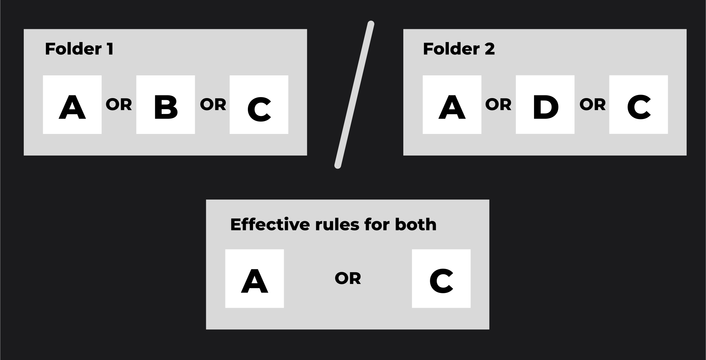

# Publications

You can publish/unpublish your private conversations, prompts, toolsets and applications, making them accessible for other users in DIAL. 

> * Refer to [Collaboration Intro](/docs/platform/7.collaboration-intro.md#publication) to learn more about publications.
> * Refer to [Access Control](/docs/platform/3.core/2.access-control-intro.md#authorization-mechanisms) to learn about public and private resources in DIAL.

By default, any published resource becomes available to all users. You can limit access to the published resource via publication rules to define who can access your published [resources](/docs/platform/0.architecture-and-concepts/1.concepts.md).

When a resource is published, it becomes available in the public folder in the DIAL file system and in DIAL Chat and [DIAL Marketplace](/docs/platform/4.chat/1.marketplace.md) for all users or for a predefined user group as per your publication rules. 

> Watch a [demo video](https://www.youtube.com/watch?v=GxdhfWLspa0) to see publication feature in action.

##### Additional References

## DIAL API

Refer to [DIAL API](https://dialx.ai/dial_api#tag/Publications) to view publications endpoints.

### User Flow

You can publish resources such as conversations, prompts, files or applications by calling [/v1/ops/publication/create](https://dialx.ai/dial_api#tag/Publications/paths/~1v1~1ops~1publication~1create/post) to create a publication request. You can also create a mixed publication request, in which you can pass various resources in the request body with different action types. 

For example, you can pass a collection of new prompts with action type `ADD` and another collection of prompts with action type `DELETE`. This way you can **publish** one set of prompts and **unpublish** the other. Similarly, you can handle other [resource types](/docs/platform/0.architecture-and-concepts/1.concepts.md). 

In the response, you get an object with the `PENDING` status, which is awaiting the action from the admin: approve or reject. While your request is pending, you can delete it by calling [/v1/ops/publication/delete](https://dialx.ai/dial_api#tag/Publications/paths/~1v1~1ops~1publication~1delete/post) endpoint.

### Admin Flow

As an administrator, you can get a list of publication requests awaiting your decision by calling [/v1/ops/publication/list ](https://dialx.ai/dial_api#tag/Publications/paths/~1v1~1ops~1publication~1list/post) endpoint. Further, you can call [/v1/ops/publication/get](https://dialx.ai/dial_api#tag/Publications/paths/~1v1~1ops~1publication~1get/post) endpoint to get a specific publication request and then execute [/v1/ops/publication/approve](https://dialx.ai/dial_api#tag/Publications/paths/~1v1~1ops~1publication~1approve/post) or [/v1/ops/publication/reject](https://dialx.ai/dial_api#tag/Publications/paths/~1v1~1ops~1publication~1reject/post) to change its status.

> Refer to [DIAL Admin](/docs/tutorials/3.admin/approvals-prompt-publications.md) to learn how to manage publication requests in DIAL Admin UI.

### Working with Rules

Use rules in publication requests to define or change access rules for specific folder(s). **Note**, that all resources (conversations, prompts, files, applications) placed in the root folder are always accessible to everyone. To apply access rules, it is necessary to create folders and apply rules to them.

You can call [/v1/ops/publication/rules/list](https://dialx.ai/dial_api#tag/Publications/paths/~1v1~1ops~1publication~1rules~1list/post) endpoint to get a list of all rules for the provided path (folder sequence). Then, call a [/v1/ops/publication/create](https://dialx.ai/dial_api#tag/Publications/paths/~1v1~1ops~1publication~1create/post) endpoint providing a path to a desired folder (`targetFolder`in the request body) and a list of rules to be changed. For instance, if you create a request with `"targetFolder":"public/folder1/folder2/"`, it will only overwrite the rules for `folder2`, while the rules for `folder1` will stay unchanged.

You can create a [/v1/ops/publication/create](https://dialx.ai/dial_api#tag/Publications/paths/~1v1~1ops~1publication~1create/post) request without the `rules` object to left the rules intact.

The effective access rules for a folder structure can be described as follows:

1. Within a single folder, the effective access rule is determined by the logical OR operation applied to all the access rules assigned to that folder. For example, in folder A with access rules a, b, and c, the effective rule is "a OR b OR c".
2. Between nested folders, the effective access rule is determined by the logical AND operation applied between the effective rules of the parent folder and its subfolder. For example, if folder B with access rules d, e, and f is nested under folder A, the effective rule for accessing folder B is "(a OR b OR c) AND (d OR e OR f)".

##### Additional References

> Refer to [Access Control](/docs/platform/3.core/2.access-control-intro.md#hierarchical-structure-of-the-public-space) to learn more about folder structure in public space and how to define access restrictions.
