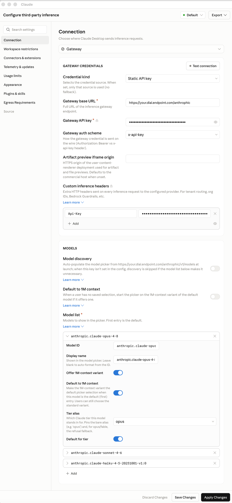

# Connect Claude Cowork to DIAL

In this tutorial you point Claude Cowork, Anthropic's desktop agent, at DIAL through its third-party inference setting and watch a DIAL-hosted model reply. Claude Cowork speaks the native Anthropic Messages API, and DIAL exposes that same API at `/anthropic` — so you configure a gateway connection in the app's UI, add your DIAL deployments, and send a message. This tutorial is for developers who already have a DIAL host.

## Prerequisites

- A DIAL host and API key. See [Before you begin](/docs/tutorials/1.developers/2.agentic-tools/0.overview.md#before-you-begin).
- Claude Cowork installed. See Step 1.

## What you'll build

Claude Cowork routing every turn through DIAL. By the end, you pick a DIAL deployment in the app and get a reply answered by your DIAL host, with DIAL's roles, quotas, and cost tracking applied.

## Step 1: Install Claude Cowork

Download the installer for your platform from [claude.com/download](https://claude.com/download), run it, and launch the app.

**Verify:**

The app opens and shows the **Claude** menu bar.

## Step 2: Enable Developer Mode

Third-party inference lives behind Developer Mode. In the **Claude** menu, select **Help → Troubleshooting → Enable Developer Mode**.

The app restarts to apply the change.

**Verify:**

After the restart, a **Developer** menu appears in the menu bar.

## Step 3: Open the third-party inference settings

In the **Claude** menu, select **Developer → Configure Third-Party Inference…**. The **Configure third-party inference** window opens.

## Step 4: Configure the connection to DIAL

Under **Connection**, choose **Gateway**, then fill in **Gateway credentials**:

| Setting | Value |
| --- | --- |
| Credential kind | Static API key |
| Gateway base URL | `https://<YOUR_DIAL_HOST>/anthropic` |
| Gateway API key | `<DIAL_API_KEY>` |
| Gateway auth scheme | `x-api-key` |

DIAL does not authenticate on the `x-api-key` header that the gateway scheme sends. Add the header DIAL actually reads under **Custom inference headers**:

| Header | Value |
| --- | --- |
| `Api-Key` | `<DIAL_API_KEY>` |

Your window should look like this:

**Warning**
> Set the `Api-Key` custom header, not just the gateway API key. DIAL authenticates on the `Api-Key` header, so without it every request is rejected with `401 "At least API-KEY or Authorization header must be provided"`.

## Step 5: Add your DIAL models

Under **Models**, keep **Model discovery** off — DIAL does not support it yet, so you list deployments by hand. Add each deployment to the **Model list**. The first entry is the default. Use the exact DIAL deployment id for each — Claude Cowork sends it to DIAL unchanged.

| Model ID | Tier alias |
| --- | --- |
| `anthropic.claude-opus-4-8` | opus |
| `anthropic.claude-sonnet-4-6` | sonnet |
| `anthropic.claude-haiku-4-5-20251001-v1:0` | haiku |

Set a **Tier alias** on each so the app maps its Opus, Sonnet, and Haiku tiers to your deployments, and mark the first entry as **Default for tier**. Leave the 1M-context toggles off unless the deployment offers a 1M-context variant.

## Step 6: Save and test

Select **Test connection** in the **Gateway credentials** section — a valid setup reports success. Then select **Apply Changes**.

Open a new conversation, pick a DIAL deployment, and send a message — for example, *"What model are you?"*

**Verify:**

You get a reply answered by your DIAL deployment.

## What you learned

- How to enable Developer Mode and open Claude Cowork's third-party inference settings.
- How to point the app at DIAL's `/anthropic` surface with a gateway connection.
- Why DIAL needs the `Api-Key` custom header for authentication.
- How to add your DIAL deployments and map them to the app's model tiers.

## Good to know

- The `Api-Key` custom header does the real authentication. The `x-api-key` gateway scheme is sent too, but DIAL ignores it — the custom header is what DIAL reads.
- Use exact deployment ids, and set all three tiers. The app routes small background tasks to the Haiku tier, so a missing or wrong Haiku deployment fails those turns. Haiku's full id is `anthropic.claude-haiku-4-5-20251001-v1:0` — a shortened form is rejected as an unknown deployment.
- Model discovery must stay off. DIAL does not support the `/anthropic/v1/models` discovery endpoint yet, so the app cannot auto-populate the picker — list every deployment manually in the model list.
- Tool calling and vision work only when the chosen DIAL deployment advertises those capabilities.
- Other DIAL releases may not expose `/anthropic`. To check, `POST` to `https://<YOUR_DIAL_HOST>/anthropic/v1/messages` — a configured host returns `200`, one without the surface returns `404`.

## Next steps

- [Connect Claude Code to DIAL](/docs/tutorials/1.developers/2.agentic-tools/5.claude-code.md) — point Anthropic's command-line agent at the same `/anthropic` surface
- [Agentic tools overview](/docs/tutorials/1.developers/2.agentic-tools/0.overview.md) — shared prerequisites and the other tools
- [Unified API reference](https://dialx.ai/dial_api) — the API DIAL exposes
