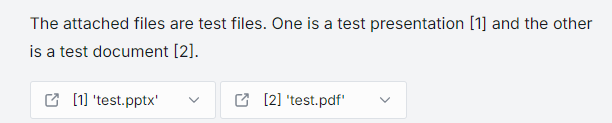
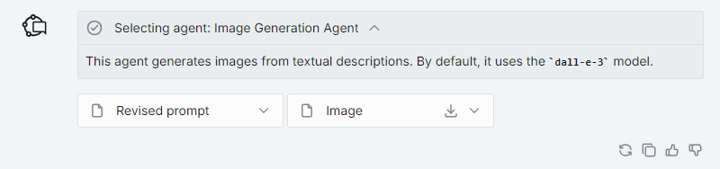
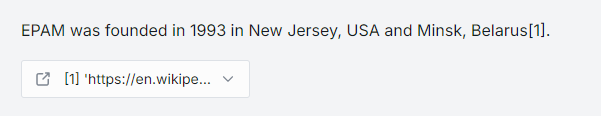
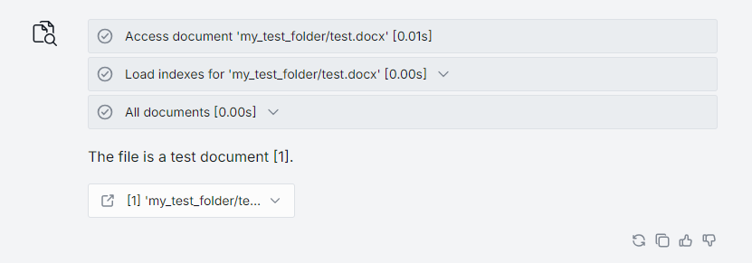
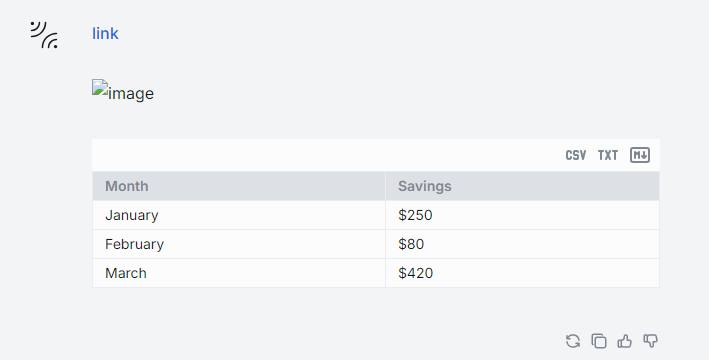
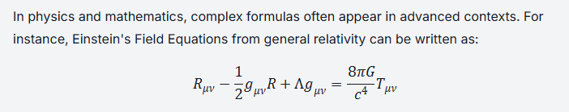
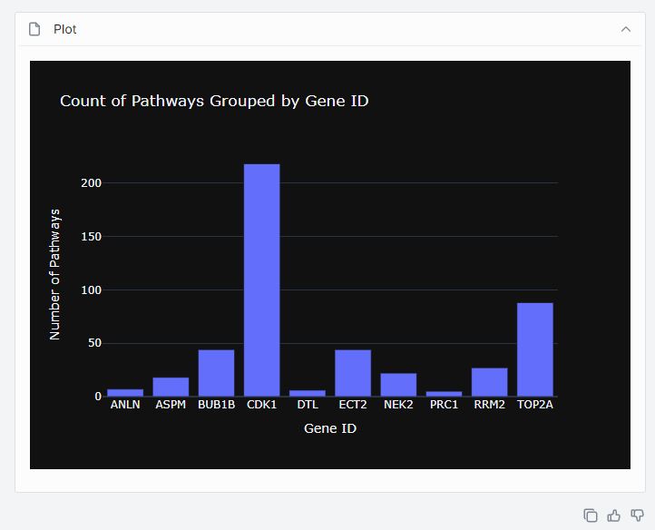

# Custom Content in Chat

## Introduction

DIAL [Completions API](https://dialx.ai/dial_api#/paths/~1openai~1deployments~1%7BDeployment%20Name%7D~1chat~1completions/post) is based on OpenAI Azure API and was extended to support working with advanced DIAL applications (you can use [DIAL SDK](https://github.com/epam/ai-dial-sdk) to create those). Applications can implement a specific logic and may require rendering a special content in the DIAL Chat UI. This is achieved by using `custom_content` in the body of API request or response.

`custom_content` can include:

- [Attachments](#attachments)
- [Stages](#stages)
- [Markdown](#markdown)
- [Visualizers](#visualizers)
- [Plotly](#plotly)

## Attachments

**Definition**: by an attachment we understand a specific content that can be included by a user in the request to an application or by the application in the response. Such attachments can be rendered in the chat UI, where they can be viewed or downloaded. Attachments can also we shared among a specific audience.

> To learn how chat users can use attachments with their requests to applications and models, refer to [User Guide](/docs/tutorials/0.user-guide.md#attachments).

DIAL supports several types of attachments: files (text and images), links and folders. Attached files are stored in a configured blob storage - refer to [DIAL Core](https://github.com/epam/ai-dial-core) to learn how to configure a file storage. Attachments can be both URL and base64-encoded strings. Each attachment has a specific `type`- according to [MIME standard](https://developer.mozilla.org/en-US/docs/Web/HTTP/Basics_of_HTTP/MIME_types/Common_types).

In this section, we will describe how attachments can be used by applications in their responses and rendered in the DIAL Chat UI.

To render an attachment in the response from the application, include `attachments` object the in `custom_content`. Refer to the [Completions API](https://dialx.ai/dial_api#/paths/~1openai~1deployments~1%7BDeployment%20Name%7D~1chat~1completions/post) to view the complete list of fields and descriptions.

```json
  "messages": [
    {
      "custom_content": {
        "attachments": [
          { ... }
        ]
      }
    }
  ]
```

### Document

Applications can be made to return documents in the response. DIAL supports the following document formats: PDF, DOC/DOCX, PPT/PPTX, TXT and other plain text formats such as code files.

For example, the [DIAL RAG](/docs/video%20demos/2.Applications/2.dial-web-rag.md) application enables users to attach files to their requests. These files are stored in a dedicated user bucket, which can be configured to grant access to specific applications. The app then generates the response, taking into consideration the attached files, and includes them in the output along with the response.

To attach a document in the response of your application, follow the example below:

```json
  "messages": [
    {
      "custom_content": {
        "attachments": [
          {
            "type": "application/pdf",
            "title": "test.pdf",
            "url": "files/bucket/my_test_folder/test.pdf"
          },
          {
            "type": "application/vnd.openxmlformats-officedocument.presentationml.presentation",
            "title": "test.pptx",
            "url": "files/bucket/my_test_folder/test.pptx"
          }
        ]
      }
    }
  ]
```

> Refer to [Completions API](https://dialx.ai/dial_api#/paths/~1openai~1deployments~1%7BDeployment%20Name%7D~1chat~1completions/post) to view the description of all fields.

This will render an attachment (similar to the below illustration) with a document in the response in DIAL Chat UI:



### Image

DIAL Chat natively supports images. Supported [MIME types](https://developer.mozilla.org/en-US/docs/Web/HTTP/Basics_of_HTTP/MIME_types/Common_types):

```java
const imageTypes: Set<ImageMIMEType> = new Set<ImageMIMEType>([
  'image/jpeg',
  'image/png',
  'image/gif',
  'image/apng',
  'image/webp',
  'image/avif',
  'image/svg+xml',
  'image/bmp',
  'image/vnd.microsoft.icon',
  'image/x-icon',
]);
```

For example, [DIAL ChatHub](/docs/video%20demos/2.Applications/3.dial-chathub.md) application includes agents that use models of a specific modality to generate images from text and return them attached to the response as files. Such images are then stored in the dedicated bucket of the application and are accessible to authorized users.

To attach an image in the response of your application, follow the example below:

```json
  "messages": [
    {
      "custom_content": {
        "attachments": [
          {
            "index": 1,
            "type": "image/png",
            "title": "Image",
            "url": "files/file_bucket/appdata/model_name/images/your_image.png"
          }
        ]
      }
    }
  ]
```

> Refer to [Completions API](https://dialx.ai/dial_api#/paths/~1openai~1deployments~1%7BDeployment%20Name%7D~1chat~1completions/post) to view the description of all fields.

This will render an attachment with an image in the response in DIAL Chat UI:



### URL

Applications can be made to return a URL in the response. For example, [DIAL Web RAG](/docs/video%20demos/2.Applications/2.dial-web-rag.md) application takes the user's message and sends it as a search query to Bing Search. The search results are then passed to the DIAL RAG application and rendered in DIAL Chat UI as attachments.

To attach a URL in the response of your application, follow the example below:

```json
  "messages": [
    {
      "custom_content": {
        "attachments": [
          {
            "index": 0,
            "type": "text/markdown",
            "title": "URL",
            "data": "Information in the markdown format.",
            "reference_url": "Your attached URL"
          }
        ]
      }
    }
  ]
```

> Refer to [Completions API](https://dialx.ai/dial_api#/paths/~1openai~1deployments~1%7BDeployment%20Name%7D~1chat~1completions/post) to view the description of all fields.

This will render an attachment (similar to the below illustration) with a URL in the response in DIAL Chat UI:



### Folder

To attach a folder in the response of your application, follow the example below:

```json
  "messages": [
    {
      "custom_content": {
        "attachments": [
          {
            "index": 1,
            "type": "application/vnd.dial.metadata+json",
            "title": "Folder_name",
            "url": "files/file_bucket/appdata/model_name/folder_name/"
          }
        ]
      }
    }
  ]
```

> Refer to [Completions API](https://dialx.ai/dial_api#/paths/~1openai~1deployments~1%7BDeployment%20Name%7D~1chat~1completions/post) to view the description of all fields.

## Stages

**Definition**: Stages are intermediate steps an agent or application went through to generate the response.

An application can include logic to return stages in the response and render them in the DIAL Chat UI. Stages can include [attachments](#attachments) - see the example further in this section.

To include stages to the response of your application, follow the example below:

```json
  "messages": [
      "custom_content": {
        "stages": [
          {
            "index": 0,
            "name": "Access document 'my_test_folder/test.docx' [0.01s]",
            "status": "completed"
          },
          {
            "index": 1,
            "name": "Load indexes for 'my_test_folder/test.docx' [0.00s]",
            "status": "completed",
            "content": "Number of chunks: 1\n\nTotal text size: 23 bytes\n\n"
          },
          {
            "index": 2,
            "name": "All documents [0.00s]",
            "status": "completed",
            "attachments": [
              {
                "index": 0,
                "type": "text/markdown",
                "title": "[0] 'my_test_folder/test.docx'",
                "data": "This is a test document",
                "reference_url": "files/8kYT43q2Qt8ANLzV17Xq12128AFcKWpUkK7xoFPKXAB2dL1ztpMssPDBEEwLdvG3Rs/my_test_folder/test.docx"
              }
            ]
          }
        ]
    }
]
```

> Refer to [Completions API](https://dialx.ai/dial_api#/paths/~1openai~1deployments~1%7BDeployment%20Name%7D~1chat~1completions/post) to view the description of all fields.

Following the above pattern, you can render three stages in DIAL Chat UI:



## Markdown

DIAL Chat natively supports markdown.

You can create a message using a standard markdown notation:

```json
  "messages": [
    {
      "role": "user",
      "content": "[link](api/files/bucket/your_image.jpg)\n\n\n\n| Month    | Savings |\n| -------- | ------- |\n| January  | $250    |\n| February | $80     |\n| March    | $420    |\n\n",
      ...
    }
  ]
```

This message will be rendered in DIAL Chat UI like this:



## LaTeX Formulas

DIAL Chat natively supports the Markdown LaTeX format and the rendering of formulas in responses from models that support this feature.



## Visualizers

We call Visualizers special applications that are used for rendering a specific type of content in DIAL Chat UI. DIAL Chat comes with built-in support for the [Plotly data visualizer](#plotly). You can use [DIAL Chat Visualizer Connector](https://github.com/epam/ai-dial-chat/blob/development/libs/chat-visualizer-connector/README.md) library to create visualizers for specific types of content.

Watch a [demo video](/docs/video%20demos/2.Applications/9.dial-data-viz.md) to view how a financial data can be visualized in DIAL Chat.

## Plotly

DIAL Chat has a built-in support for Plotly data visualization library. We use a specific MIME type for Plotly:

`"type": "application/vnd.plotly.v1+json"`

To attach a Plotly visualization in the response of your application, follow the example below:

```json
  "messages": [
    {
      "custom_content": {
        "attachments": [
          {
            "index": 1,
            "type": "application/vnd.plotly.v1+json",
            "title": "Your visualization name",
            "url": "files/bucket/appdata/app_name/your_viz_file.json"
          }
        ]
      }
    }
  ]
```

Similar structure in the application response will include a visualization as an attachment in DIAL Chat UI:



Watch a [demo video](/docs/video%20demos/1.Chat/6.animated-scatterplot.md) to view how a statistical data can be visualized in DIAL Chat in Plotly animated scatterplot or a demo video of the [Omics AI Assistant](/docs/video%20demos/2.Applications/7.dial-omics-assistant.md) to see how protein structures can be visualized using Plotly.
