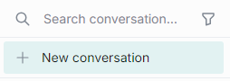
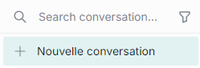

# DIAL Chat Localization

The DIAL Chat application uses [next-i18next](https://github.com/i18next/next-i18next) plugin to manage the translation of the UI elements. 

## How it works

### Step 1: Create Locales

DIAL Chat project has a special directory called [locales](https://github.com/epam/ai-dial-chat/tree/development/apps/chat/public/locales/). In this directory, you can create sub-folders with translations for different languages. 

**Important**: currently, we support only **en** folder, where you can override the text of elements of DIAL Chat UI. Multi-language support is on our roadmap in the near future. 

### Step 2: Provide Translations

In the **locales** directory, you can create sub-folders with translations for different languages. In each sub-folder, place JSON files, each corresponding to a particular category of UI elements. 

Currently we support this feature for the texts in the following UI elements: 

```ts
export enum Translation {
    Chat = 'chat',
    Common = 'common',
    Markdown = 'markdown',
    PromptBar = 'promptbar',
    Settings = 'settings',
    SideBar = 'sidebar',
    Files = 'files',
    Header = 'header'
}
```

In each JSON file, you can provide the alternative text for particular UI elements in the format: `key:value`. Where `key` is the original text on the chat UI and `value` is the replacement text. Only `key:value` pairs corresponding to the particular area (e.g `PromptBar`) will apply. **Note**: if the replacement is not provided, the original text applies. 

**Example**:

To translate the words **New conversation** in the `sidebar` to French, in a sub-folder **/locales/en**, in the `sidebar.json` file, add the following content:

```json
{
    "New conversation": "Nouvelle conversation"
}
```

As a result, this text on UI:




will be replaces like this:



### Step 3: Apply Changes

For your changes to apply, it is necessary to add them to the deployment instance. You do not need to rebuild the application.