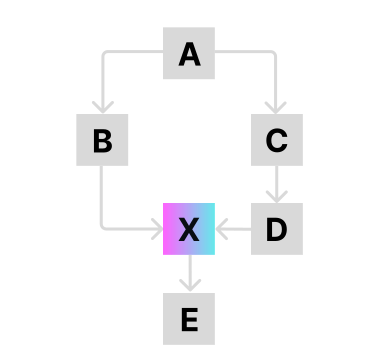

# Managing Authorization in Complex Application Ecosystems

## Introduction & Definitions

This article explores the technical approach to building an **authorization matrix** that enforces consent requirements across application dependency chains. We will discuss how to traverse dependency chains, identify sensitive data flows, and mitigate risks of unauthorized access, ensuring a secure system design.

##### Dependency

In interconnected systems, applications often rely on each other to function, forming complex dependency chains. To manage access to sensitive data in such ecosystems can pose a challenge, especially when multiple applications interact and propagate requests.

##### Consent

A consent is an explicit agreement from a user to allow an application to access their data or perform actions on their behalf. Consent is typically obtained through a consent form, which outlines the specific data access and processing activities that the user is agreeing to. 

## Authorization Matrix

Let's consider a situation, where **App A** provides sensitive data based on user roles. **App B** can call **App A** using [per-request keys](/docs/platform/3.core/3.per-request-keys.md). This creates a potential security risk where **App B** may access sensitive data without explicit user consent.

To address these challenges, we suggest constructing an **authorization matrix** to enforce consent requirements and secure sensitive data. The main principle is traversing application's dependency chain, identifying paths to sensitive applications, and ensuring that all access is explicitly authorized by the user.

Let's consider a more complex execution flow in which **X** requires consent to access:



To use **A**, the user must consent to its dependencies, **B** and **C**, even though **A** does not directly interact with **X**. By consenting to **B and C**, the user implicitly consents to all downstream applications in the dependency chain. As **X** is accessed indirectly via **E** and **G**, the system ensures the user consents to these paths before granting access to **X**.

## Configuration

To define **dependencies** for applications and configure the **consent** requirement, DIAL Core can include additional [dynamic settings](https://github.com/epam/ai-dial-core?tab=readme-ov-file#dynamic-settings):

##### consentRequired

`consentRequired` - `applications.<application_name>.features` can include this flag to indicate whether the app requires a consent to use it. Default value is `false`.

For example, if the `consentRequired` is set to `true` application `B` cannot call application `A` without user consent using [per-request key](/docs/platform/3.core/3.per-request-keys.md):

```json
{
  "applications": {
    "A": {
      "endpoint": "http://localhost:7001/openai/deployments/appA/chat/completions",
      "displayName": "Forecast",
      "iconUrl": "https://host/app.svg",
      "features": {
        "consentRequired": true
      }
    },
    "B": {
      "endpoint": "http://localhost:7001/openai/deployments/appB/chat/completions",
      "displayName": "Forecast",
      "iconUrl": "https://host/app.svg"
    }
  }
}
```
##### dependencies

`dependencies` - `applications.<application_name>` can include an array of deployments (apps) the current app depends upon to function (in our example A depends on B and C). This parameter is optional and can be absent if an application doesn't have any dependencies.

Fore example, this config declares that the application `Forecast` depends upon `appB` and `appC` and needs access to those applications:

```json
{
  "endpoint": "http://localhost:7001/openai/deployments/10k/chat/completions",
  "displayName": "Forecast",
  "dependencies": ["appB", "appC"]
}
```

## DIAL API

DIAL API includes endpoints that can be used by client applications to request and send consent forms to DIAL Core prior to using applications that require user's consent.

##### Get consent

`GET /v1/consent/<deployment_id>` - is used by a client application to request DIAL Core to provide a consent for the selected app. In the response, DIAL Core can return a similar JSON:

```json
{
  "consent": {
    "app_A": {"consentRequired": false},
    "app_B": {"consentRequired": false},
    "app_C": {"consentRequired": false},
    "app_D": {"consentRequired": false},
    "app_E": {"consentRequired": false},
    "app_F": {"consentRequired": false},
    "app_G": {"consentRequired": false},
    "app_X": {"consentRequired": true}
  },
  "accepted": false
}
```

where

* `deployment_id` is the application id the request is sent for. Can be a segment path if a deployment is custom app.
* `consent` includes all dependencies with `consentRequired` flag, indicating whether it requires a consent or not. `consent` can be skipped if the user has accepted the consent or there are no deployments requiring a user consent.
* The field `accepted` indicates if the user has already accepted the consent or not.

DIAL Core builds a consent form by traversing deployment (app in our example) dependencies starting from `<deployment_id>` received with `GET /v1/consent/<deployment_id>`. In our example, DIAL Core traverses from the node **A** towards to a leaf node **X** and the application X is marked as `consentRequired` to be set `true`. The purpose of the traversal is to ensure that all paths leading to the sensitive application **X** are explicitly secured by the user consent:

```
A → B, C
B → D, E
B → X
C → F, G
C → X
E → X
G → X
```

##### Send consent

`POST /v1/consent/<deployment_id>` - is used send the accepted consent back to DIAL Core. DIAL Core replaces the previous `consent` if it exists by the new one. Once user accepts an application's consent it will be stored permanently at the next location as a resource in Redis backed by a cloud storage:

`Users/<user_subject>/user_consent/<deployment_id>`

where

* `deployment_id` - the application id the request is sent for.


### Example

Let's consider the scenario based on DIAL Chat UI as a client:

1. User selects an app in the DIAL Marketplace
1. DIAL Chat UI asks DIAL Core to provide a consent for the selected app using `GET /v1/consent/<deployment_id>`. The Core calculates and returns the consent form in the response back to the client.
1. DIAL Chat UI checks the value of the flag `accepted` in the response from DIAL Core in order to proceed.
1. DIAL Chat UI displays the consent form based on the response.
1. User may reject or accept the consent form.
1. When the user accepts the consent form, the client applications sends it to the DIAL Core via `POST /v1/consent/<deployment_id>`. DIAL Core saves to a permanent storage.
1. In future, DIAL Core uses the received consent to validate chat completion requests to deployments marked with `consentRequired=true`.
