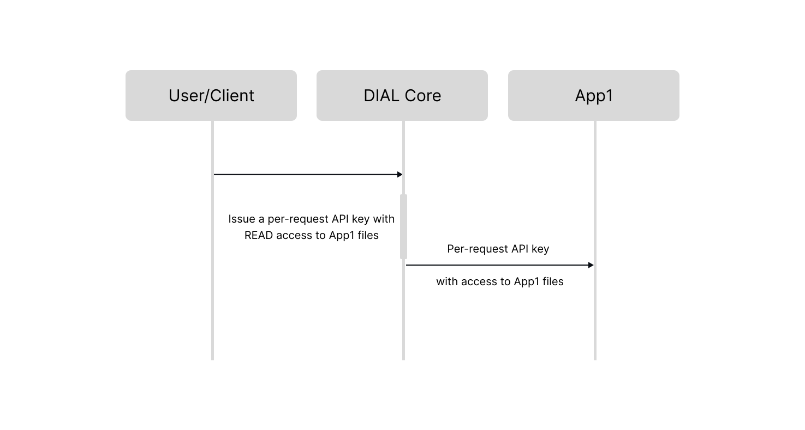
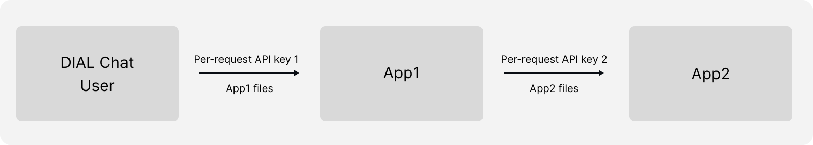

# How to Enable Apps in DIAL

## Introduction

This document describes the process for enabling applications in DIAL to make them available for users. The development of applications are beyond the scope of this document. You can develop applications following [API](https://dialx.ai/dial_api) and [SDK](https://github.com/epam/ai-dial-sdk).

## DIAL-Native Applications

DIAL-native applications adhere to the [unified protocol](https://dialx.ai/dial_api), a single protocol for all applications and models. This makes it possible for them to be used as building blocks in other apps. Refer to [Agentic Platform](/docs/platform/0.architecture-and-concepts/4.agentic-platform.md) to learn more about agents in DIAL.

> Refer to [DIAL-Native Apps](/docs/platform/3.core/7.apps.md) to learn more.

DIAL-native applications can be categorized as either schema-rich or apps without schemas:

##### Schema-rich applications

[Schema-rich applications](#enable-schema-rich-applications) enable users to create instances of applications with different properties via [DIAL Core API](https://dialx.ai/dial_api#tag/Applications/operation/saveCustomApplication). Unlike apps without schemas, where business logic properties are embedded in the application code or container environment and are difficult to change, schema-rich applications provide greater flexibility.

Schema-rich applications are defined by a JSON schema that conforms to the main [meta schema](https://github.com/epam/ai-dial-core/blob/development/config/src/main/resources/custom-application-schemas/schema). JSON schema describes the application's structure, including properties and endpoints (completion, configuration, and other), URLs for application editor (enabling a wizard in the UI for creating/editing applications) and custom application UI to replace the standard chat UI, [custom buttons](/docs/tutorials/1.developers/4.apps-development/1.custom-buttons.md).

There is a method in [DIAL SDK](https://github.com/epam/ai-dial-sdk) (`application_properties = await request.request_dial_application_properties()`) that returns application properties with a configuration request to DIAL Core.

Schema-rich applications are usually associated with a specific **Application Type** - a template for creating applications of that type.


:cloud: DIAL SaaS edition includes application types such as Quick app, Code app and Mind Map.

:floppy_disk: In self-hosted deployments of DIAL, you can add new application types, featuring custom application UI (`applicationTypeViewerUrl`) and wizards (`applicationTypeEditorUrl`) and enabling end-users to create applications of that type.

> Refer to [DIAL-Native Apps](/docs/platform/3.core/7.apps.md#application-types) to learn more about application types.

##### Applications without schemas

[Applications without schemas](#enable-applications-without-schemas) are not tied to any specific application type. When enabling such an app, you must explicitly specify (in the [API PUT request](#using-api-1)) standard parameters of the application and available endpoints the application offers. Properties that define the logic and behavior of the application are part of the application code and the container it runs in, meaning they cannot be modified through the DIAL Core API, contrary to schema-rich applications. For example, to enable two apps without schemas, you may need to launch two containers, whereas for schema-rich apps, you can make just two API calls.

## Enable Schema-Rich Applications

You can enable schema-rich apps either by using [DIAL API](#using-api) or by a [direct modification of the DIAL Core configuration](#using-dial-core-config).

**Prerequisites**:

- A schema of the application type must be included in the DIAL Core configuration.
- Having a running container for each application type. These containers must be accessible via the endpoints specified in the JSON schema for their respective application types.

### Using API

You can use the DIAL API to create a schema-rich application of a specific type.

**Important**: Apps enabled via the DIAL API, can be modified using API or UI wizards (if `applicationTypeEditorUrl` is included in the schema).

Send a [PUT](https://dialx.ai/dial_api#tag/Applications/operation/saveCustomApplication) request to DIAL Core, where you provide:

- Standard parameters for the application (`displayName`, `description` etc.). Refer to [dynamic setting of DIAL Core](https://github.com/epam/ai-dial-core?tab=readme-ov-file#dynamic-settings) to see all the supported parameters for applications.
- `applicationTypeSchemaId`: The identifier of the schema for the application type you want to use as a template. You can retrieve available schemas via the [GET Schemas](https://rail-landing.staging.deltixhub.io/dial_api#tag/Applications/operation/listCustomApplicationSchemas) API call.
- `applicationProperties`: A valid JSON object representing the application's structure, conforming to the specified schema. If the JSON object is invalid, the request will fail.

  - If `applicationTypeSchemaId` is absent or `NULL`, `applicationProperties` are not required. If `applicationTypeSchemaId` is not provided, then this is not a schema-rich application.
  - If `applicationTypeSchemaId` is provided but `applicationProperties` are `NULL`, the application is considered a "stub" and can be updated later, but completion requests will not be possible until then.
  - For applications with schemas, all requests are routed **ONLY** to endpoints specified in the schema. If you specify endpoints in the [PUT](https://dialx.ai/dial_api#tag/Applications/operation/saveCustomApplication) request, such request will fail.

    Example of a PUT request body:

    ```json
    {
      "copilot_deck_app": {
        "displayName": "Copilot Deck Explorer",
        "description": "You can ask about the copilot deck there",
        "applicationTypeSchemaId": "https://mydial.epam.com/custom_application_schemas/quickapps",
        "applicationProperties": {
          "temperature": 0.8,
          "instructions": "Answer using only the information in the document.",
          "model": "gpt-4o-2024-05-13",
          "web_api_toolset": [],
          "document_relative_url": "files/DpZGXdhaTxt4FYCWNadE2Ln/GPT%20Deck.docx"
        }
      }
    }
    ```

    > Refer to [Quick App Configuration Guide](/docs/tutorials/1.developers/4.apps-development/5.quick-app-configuration.md#complete-example) to see a full configuration example for Quick app.

The configuration of the enabled app is saved as a BLOB in the DIAL Core file system with a JSON object that must correspond to the schema of a particular application type. This file is available vial the [DIAL API](https://dialx.ai/dial_api#tag/Applications/operation/getCustomApplicationSchema), according to the defined [Auth Matrix](/docs/tutorials/1.developers/4.apps-development/2.auth-matrix.md) for a specific application.

#### UI Wizard

JSON Schemas of application types can include `applicationTypeEditorUrl` to enable a custom UI where users can create and edit applications.

:cloud: SaaS DIAL edition includes wizards for Quick app, Code app and Mind Map application types.

:floppy_disk: Self-hosted deployment of DIAL gives you an opportunity to create custom wizards for your application types.

> Refer to [User guide](/docs/tutorials/0.user-guide.md#applications) to learn how to create applications using wizards.

### Using DIAL Core Config

DIAL admins can create schema-rich applications by including a valid JSON object with the application representation in the [DIAL Core](https://github.com/epam/ai-dial-core?tab=readme-ov-file#dynamic-settings) configuration in the `applications` section.

Example of dynamic settings in DIAL Core:

```json
 "applications":
    "copilot_deck_app": {
      "displayName": "Copilot Deck Explorer",
      "description": "You can ask about the copilot deck there",
      "applicationTypeSchemaId": "https://mydial.epam.com/custom_application_schemas/quickapps",
      "applicationProperties": {
        "temperature": 0.8,
        "instructions": "Answer using only the information in the document.",
        "model": "gpt-4o-2024-05-13",
        "web_api_toolset": [],
        "document_relative_url": ["files/DpZGXdFYCWNadE2Ln/GPT%20Deck%20text.docx"]
      }
    }
```

**Important**: Apps added through direct modification of the DIAL Core configuration are immutable and cannot be edited via the UI or API, including by administrators. These apps are owned by the DIAL admin and are ideal for use cases where the app is configured once and remains unchanged, becoming available to users with corresponding roles and permissions.

## Enable Applications without Schemas

Applications without schemas, unlike schema-rich apps, are not tied to a specific application type and their business logic cannot be defined through properties in a JSON schema.

To enable such an app in DIAL, you can add its representation in JSON format directly into the [DIAL Core config](#using-dial-core-config-1) or make an [API request](#using-api-1) where you provide all application endpoints and standard parameters - refer to [dynamic setting of DIAL Core](https://github.com/epam/ai-dial-core?tab=readme-ov-file#dynamic-settings) to see all the supported parameters for `applications`.

**Prerequisite**: You must have a running container with your app accessible for DIAL Core via the endpoints you provide in the [PUT request](#using-api-1).

### Using API

**Important**: Apps enabled via the DIAL API, can be modified using API or UI wizards, provided the corresponding permissions are enabled.

Send a [PUT](https://dialx.ai/dial_api#tag/Applications/operation/saveCustomApplication) request to DIAL Core, where in the request body you provide specific endpoints and parameters for your application. You can see them in DIAL Core documentation under the [dynamic setting](https://github.com/epam/ai-dial-core?tab=readme-ov-file#dynamic-settings) for `applications`.

Example of a PUT request body:

```json
{
  "application": {
    "endpoint": "http://localhost:7001/openai/deployments/10k/chat/completions",
    "displayName": "MyApp",
    "iconUrl": "https://host/app.svg",
    "description": "My application description",
    "userRoles": ["AdminRole"],
    "forwardAuthToken": true,
    "features": {
      "rateEndpoint": "http://host/rate",
      "configurationEndpoint": "http://host/configure"
    },
    "maxInputAttachments": 10,
    "inputAttachmentTypes": ["application/msword", "application/vnd.openxmlformats-officedocument.presentationml.presentation"],
    "defaults": {
      "paramStr": "value",
      "paramBool": true,
      "paramInt": 123,
      "paramFloat": 0.25
    },
    "interceptors": ["interceptor1", "interceptor2", "interceptor3"]
  }
}
```

The configuration of an application is saved as a BLOB in the DIAL Core file system with a JSON object. This file is available via the [DIAL API](https://dialx.ai/dial_api#tag/Applications/operation/getCustomApplicationSchema), according to the defined [Auth Matrix](/docs/tutorials/1.developers/4.apps-development/2.auth-matrix.md) for a specific application.

### Using DIAL Core Config

DIAL admins can create an application by including a valid JSON object with the application representation in the [DIAL Core](https://github.com/epam/ai-dial-core?tab=readme-ov-file#dynamic-settings) configuration for the `applications` section.

Example of dynamic settings in DIAL Core:

```json
 "applications": {
    "dial-rag": {
      "displayName": "DIAL RAG",
      "description": "RAG (Retrieval Augmented Generation)",
      "endpoint": "http://dial-rag:5000/openai/deployments/dial-rag/chat/completions",
      "maxInputAttachments": 1,
      "inputAttachmentTypes": [
        "*/*"
      ]
    }
 }
```

**Important**: Apps added through direct modification of the DIAL Core configuration are immutable and cannot be edited via the UI or API, including by setup administrators. These apps are owned by the DIAL admin and are ideal for use cases where the app is configured once and remains unchanged, becoming available to users with predefined roles and permissions.

### Using UI Wizard

:cloud: DIAL SaaS edition includes a UI wizard to add a custom application which has a chat completion endpoint.

> Refer to [User guide](/docs/tutorials/0.user-guide.md#add-custom-app) to learn how to create a custom app.

## Access Control

> Refer to [Access & Cost Control](/docs/platform/3.core/2.access-control-intro.md) to learn how access control to system resources is implemented in DIAL.

Applications, similarly to other DIAL resources such as conversations, prompts and files, can be made available to other users and applications. Access to applications can be controlled by explicitly defining user roles in the DIAL Core configuration or using DIAL Chat UI/DIAL API to publish or share applications.

When application is available to a specific role, it can be accessed via API using its endpoint and in [DIAL Marketplace](/docs/platform/4.chat/1.marketplace.md).

### DIAL Core Configuration

If you enable your application by directly modifying the [DIAL Core configuration](https://github.com/epam/ai-dial-core?tab=readme-ov-file#dynamic-settings), you can add [user roles](https://docs.dialx.ai/platform/core/access-control-intro#about-roles) to the JSON object with the configuration of the application. This allows you to define access permissions for other users as well as impose usage limits.

**Important**: if `userRoles` is not specified, the application will be available to all users.

##### Example

Applications use language models on behalf of users and within the defined limits, provided both model and application can be accessed by a specific user role.

In the following example, the `my_app` application is accessible to users with the `app_user` role. For this user role, usage limits are set on the `chat-gpt-35-turbo` model, as specified in the `limits` section. When a user with the `app_user` role uses the application, the app will use the `chat-gpt-35-turbo` model within these prescribed limits.

Example of dynamic settings in DIAL Core:

```json
"applications":
  "my_app": {
    "userRoles": ["app_user"],
    }
"roles": {
    "app_user": { // the name of the role
        "limits": {
            "chat-gpt-35-turbo": {
              "minute": "100000", //number of tokens per minute
              "day": "10000000", //number of tokens per day
              "week": "10000000", //number of tokens per week
              "month": "10000000", //number of tokens per month
            }
        }
    }
}
```

### UI & API

You can use DIAL UI and API to publish and/or share applications with other users.

>Refer to [Collaboration](https://docs.dialx.ai/platform/collaboration-intro) to learn about sharing and publishing in DIAL.

### Access to Application Files

Applications can rely on resources like documents and files to operate. When the application is shared or published, it is crucial to ensure that these resources are accessible, if needed, to all involved parties in the operation flow.

Providing access to application files differs significantly between schema-rich applications and those without schemas.

##### For applications without schemas

Developers must handle access to files on their own when the application is shared or published. It requires careful implementation to ensure all necessary resources are available for authorized users and apps.

##### For schema-rich applications

In schema-rich applications, **auto-share** principle applies to handle access to files.

JSON schema of schema-rich apps can include links to resources (e.g., files or documents) that are required by the application to operate. Auto-share logic applies to all resources marked as `"dial_file": true`. If the resource is marked as `"dial_file": true`, it will be **automatically** shared when this application is shared with other users, published or as part of a requests chain between applications. **Important**: To prevent specific resources from being shared automatically, avoid using `"dial_file": true` in schema.

Let's consider the following scenario as an example:

1. A DIAL Chat user initiates a conversation with a schema-rich RAG application (App1).
2. DIAL Core issues a [per-request API key](/docs/platform/3.core/3.per-request-keys.md#files-sharing) for this request.
3. DIAL Core checks the schema of the App1 and gives READ access for the per-request API key to all files marked as `"dial_file": true`. This way, the application automatically gets access to necessary files to generate responses.



To enable th auto share mechanics, include this in the application JSON schema:

```json
"rag_files": {
	"type": "array",
	"items": {
		"type": "string",
		"dial_file": true,
    "format": "dial-file-encoded",
	}
}
```

Configuration of the application in DIAL Core dynamic settings can include a path to a specific file that will be shared:

```json
"applicationProperties": {
	"rag_files": ["files/csdvsdvsd/my_file.docx"]
}
```

Similarly, if App1 has to call App2 to perform a specific action, another per-request API key is issued with access to App2 files:



## Enable NOT DIAL-Native Apps

:floppy_disk: In self-hosted deployments of DIAL, you can integrate your conversational (implementing a completion endpoint) or non-conversational apps into DIAL, even if they don't follow the unified protocol of DIAL.

##### Custom UIs

You can create schema-rich application types with custom UIs to replace the default DIAL UI, even for non-conversational apps. Additionally, you can implement separate custom wizards as needed. Custom UIs can follow any logic and are defined in the application type schema using `applicationTypeViewerUrl` for UI and `applicationTypeEditorUrl` for wizard.

##### Application Endpoint

To enable DIAL apps to communicate with your application, you can register your application's endpoint in DIAL Core as a `route`. You can apply roles, usage limits, and associate API keys with these routes, enabling seamless integration with DIAL Core features. For details on registering routes, refer to [DIAL Core dynamic settings](https://github.com/epam/ai-dial-core?tab=readme-ov-file#dynamic-settings).