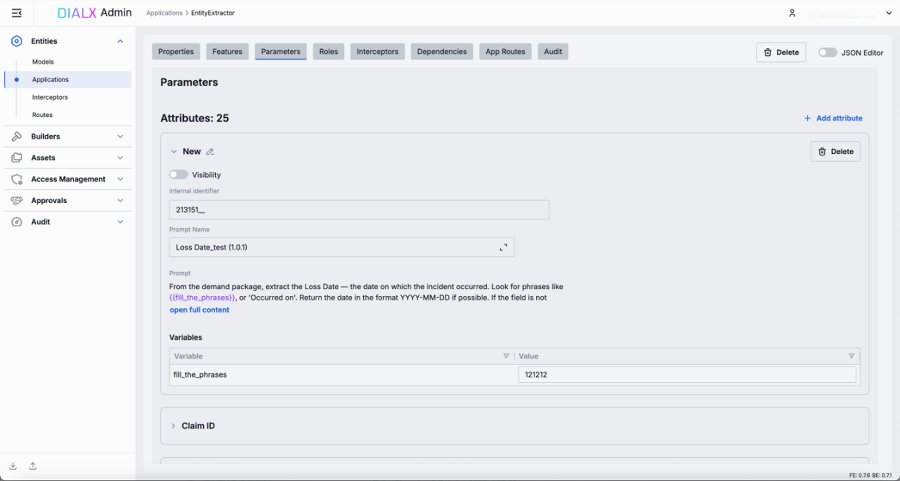
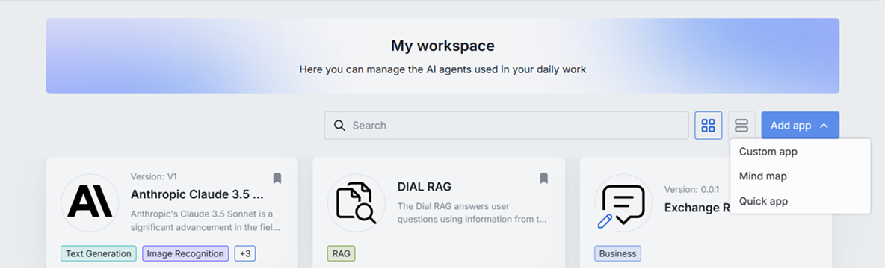
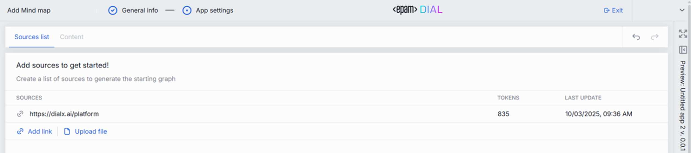
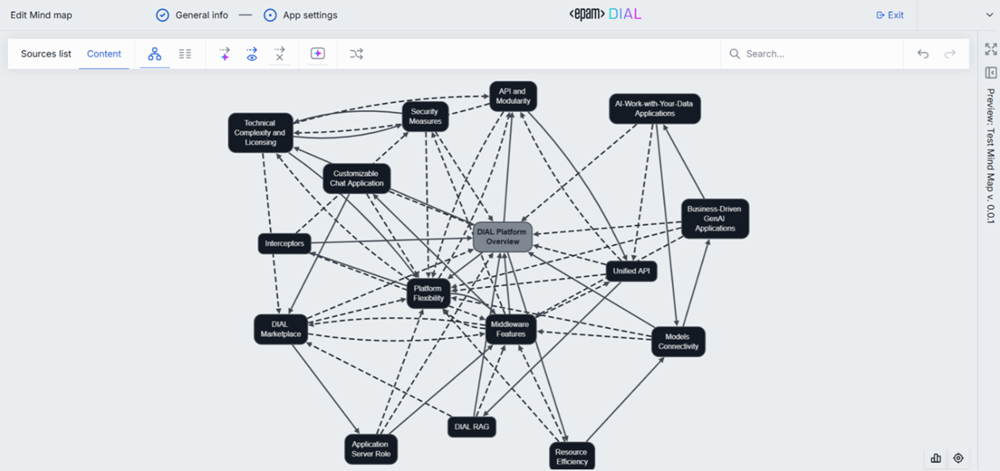
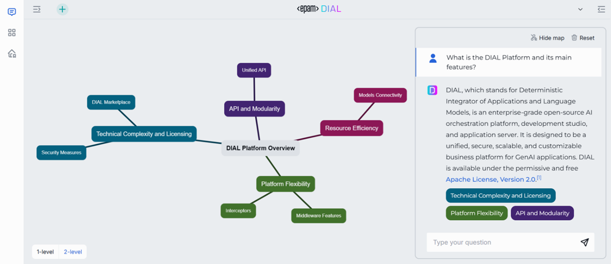
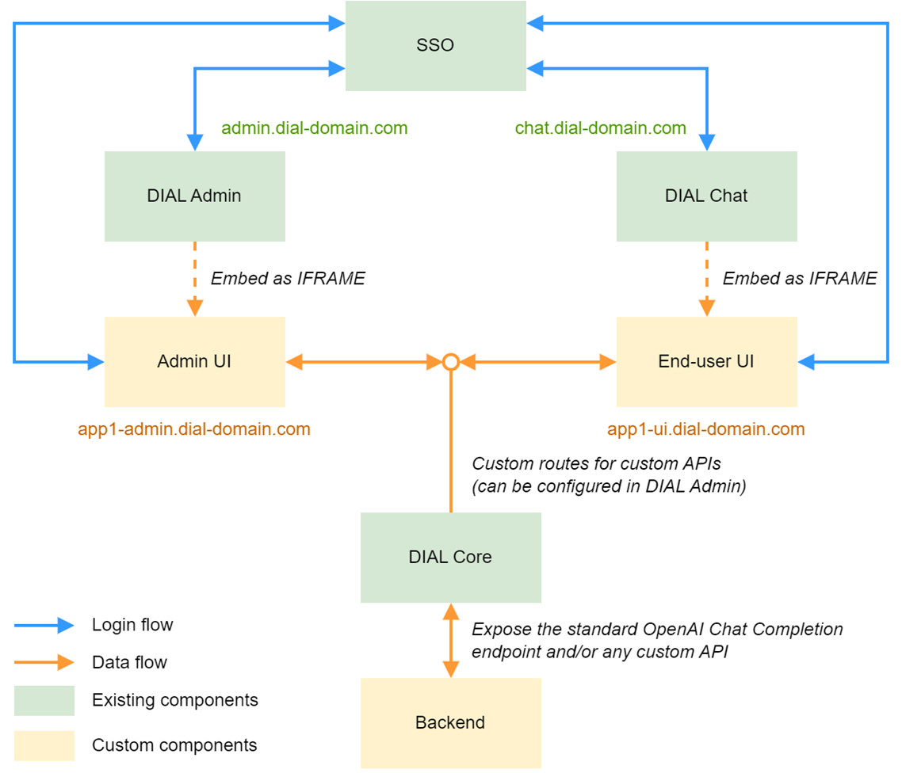
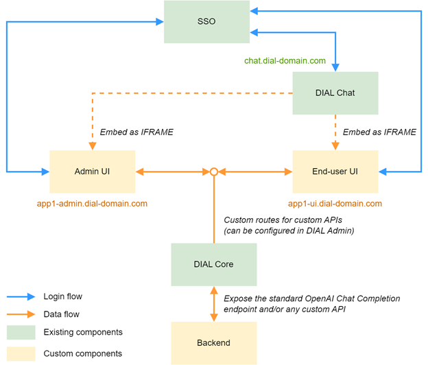

# Developing Custom DIAL Applications

## Introduction

Whenever the no-code and low-code DIAL extensibility features such as Quick Apps, Code Apps or Mind Maps are not sufficient to satisfy the needs of a particular use case, a custom application can be developed in any technology stack and exposed through the DIAL platform. From an end-user perspective, such applications will be accessible through the DIAL Marketplace similarly to models and standard platform applications.

There are two forms of custom applications in DIAL:

- **Custom Standalone Application** – exists as a single logical instance in the platform. Settings and access permissions are managed centrally by an administrator. For example, it can be a standalone document summarization tool, where a platform administrator defines summarization options and quotas.
- **Custom Application Runner** – an application factory that allows end-users create individual logical instances each with its own configuration. For example, a custom RAG application runner may allow an end user to configure a personalized RAG agent by connecting it to chosen data sources, such as internal knowledge bases, document repositories, or external APIs, and then share it with other users and groups. An application runner definition includes a configuration schema that enforces data structure persisted for each instance. It is worth noting that Quick Apps, Code Apps and Mind Maps are application runners available in DIAL platform out of the box. 

Regardless of the form, a custom DIAL application may consist of three separate components – Backend, Viewer UI and Editor UI. The purpose and necessity of each one is indicated in the table below.

|Component|Custom Standalone Application|Custom Application Runner|
|---------|-----------------------------|-------------------------|
|Backend|Implements the business logic. **Required**|Implements the business logic. **Required**|
|Viewer UI|An alternative end-user UI (is needed when the default chat interface is not sufficient). **Optional**|An alternative end-user UI (is needed when the default chat interface is not sufficient). **Optional**|
|Editor UI|A UI screen for managing application settings from the DIAL Administrator application. **Optional**|A UI screen for configuring application settings when creating or updating a logical application instance. **Required**|

There are a few typical sets of components to be developed for a custom DIAL application depending on the use case:

- Backend only – when end-users of a Custom Application are supposed to interact with the application through the default chat interface and there are no application settings to be managed by the DIAL administrator.
- Backend and Admin UI – when a Custom Application has some settings to be managed by the DIAL administrator or you are building a Custom Application Runner, while there is no need to have a custom end-user UI.
- Backend, Admin UI, and End-user UI – when a non-standard end-user UI is needed, and the Custom Application has some settings to be managed by the DIAL administrator, or you are building a Custom Application Runner.

Here is an example of a custom Editor UI accessible through the DIAL Admin for a standalone application:

The screenshots below illustrate a typical user flow for an Application Runner, using Mind Maps as an example where both the Viewer and Editor UIs are customized:

1.	All Application Runners that the current user has access to, are available in the “Add App” dropdown in the user’s Workspace.

    

2.	After populating the General Info tab and proceeding to the App Settings, a custom Editor UI will appear.

    

    

3.	A custom Viewer UI can be seen when a user opens a logical application instance created this way from his DIAL Workspace or Marketplace.

    

The diagram below shows the most complete logical structure of a Custom Standalone Application:

And the following diagram – the most complete structure of a Custom Application Runner:

## Backend

A backend service that implements the necessary business logic and exposes either a standard Open AI chat completion endpoint, or a set of custom API endpoints, or both. Can be implemented using any technology stack, but for simple cases, when only a chat completion endpoint needs to be exposed, it is recommended to use [DIAL SDK for Python](https://github.com/epam/ai-dial-sdk).

For Application Runners, this SDK provides an easy way of getting configuration details about the calling instance (see `request_dial_application_properties` method). These properties are usually managed via a custom Editor UI and are validated by DIAL Core against the configuration schema provided for the application runner. 

The service doesn’t have to validate tokens, since authorization is handled by DIAL Core, which serves as an API gateway in this scenario. When forwarding a call to a backend endpoint, DIAL Core passes a [per-request key](/docs/platform/3.core/3.per-request-keys.md) in the `“api-key”` header instead of the original authorization header, which can later be used by the backend logic to call DIAL Core back for accessing models or other applications.

## UI

Both UI pieces are developed and hosted as standalone applications, but when registered in the platform, they get embedded as IFRAME into respective DIAL UI applications, providing integrated experience.

There are no limitations on the technology stack, but it is recommended to use the [Next.js solution template](https://github.com/epam/ai-dial/tree/main/dial-samples/common-ui-app), since it already has all necessary boilerplate code including the authentication mechanism.

As shown on the diagram above, each of the custom UI applications is supposed to be hosted on a separate subdomain. In order to issue a JWT token for accessing endpoints exposed by DIAL Core, each custom UI application must have its own client registration with the Identity Provider. Separate client registrations allow for more granular control over permissions and scopes, enabling each application to request only the access it requires, which aligns with the principle of least privilege. This separation also simplifies auditing and monitoring, as it becomes easier to trace and identify which application is responsible for specific API calls or security events.

Communication with the corresponding backend service is always made through DIAL Core. When the backend exposes custom API endpoints, the corresponding routes must be configured in the DIAL Core configuration to make them reachable for the UI application.

For Editor UI of an Application Runner it is recommended to save instance configuration in the application object – data stored in application_properties attribute of an application instance is validated against the schema provided for the corresponding Application Runner, persisted, and then can be read by the backend depending on the calling instance. 

## Deployment

There are no limitations of how and where the custom components are deployed, the only requirement is that there must be network connectivity between DIAL Core and the backend service, as well as between UI applications and DIAL Core. Any communication between components is made only through API.
Here are the links to sample configuration guides for different types of applications:

- [Standalone application](/docs/tutorials/1.developers/4.apps-development/7.develop-single-app.md)
- [Application runner](/docs/tutorials/1.developers/4.apps-development/8.develop-app-runner.md)
