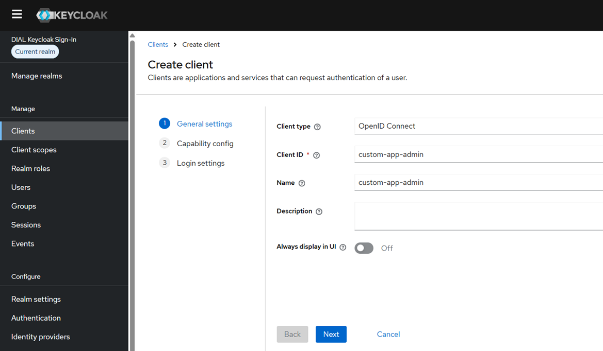
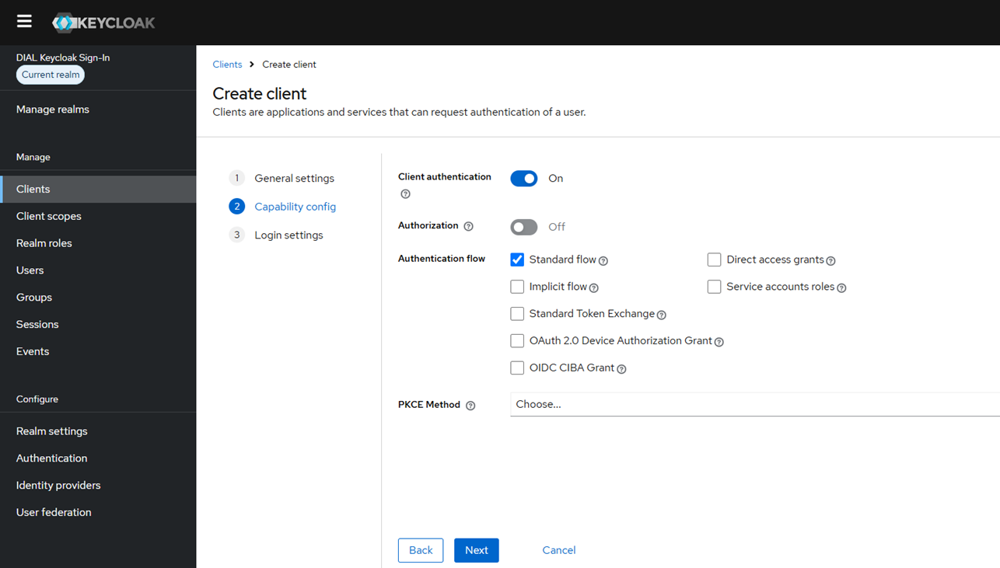
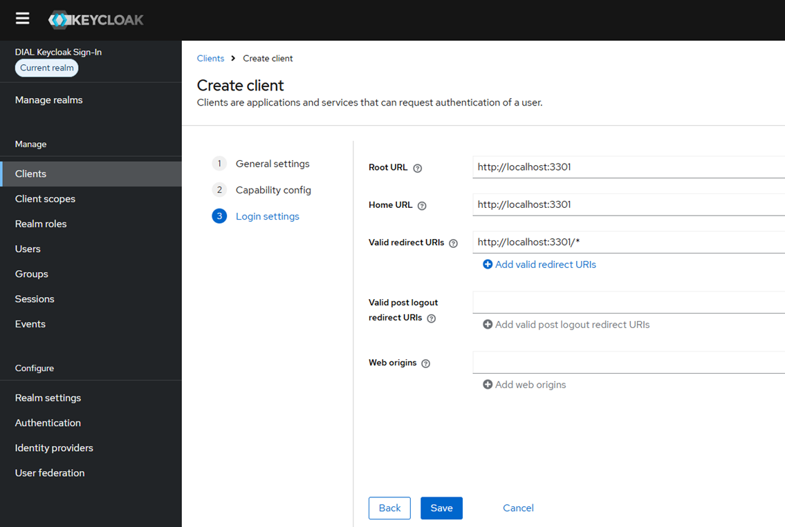
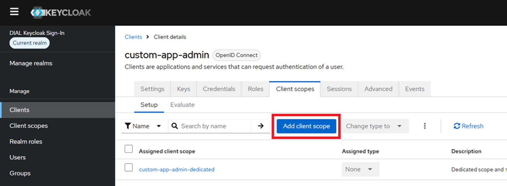
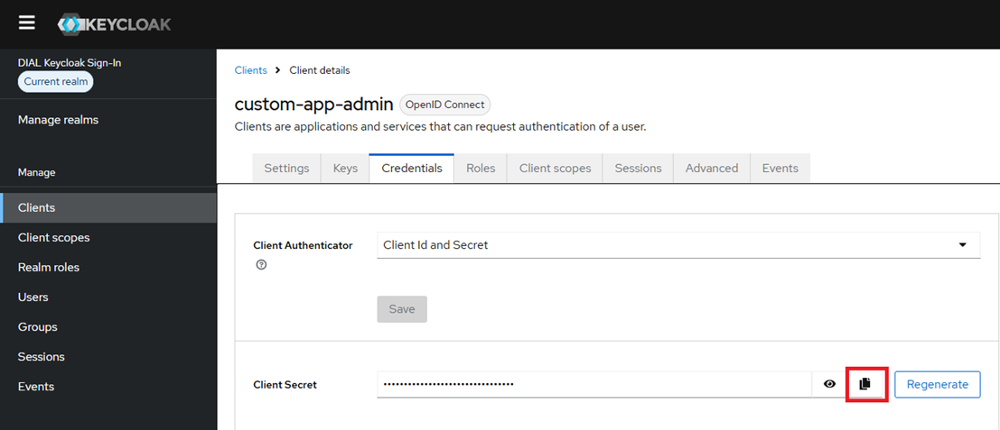
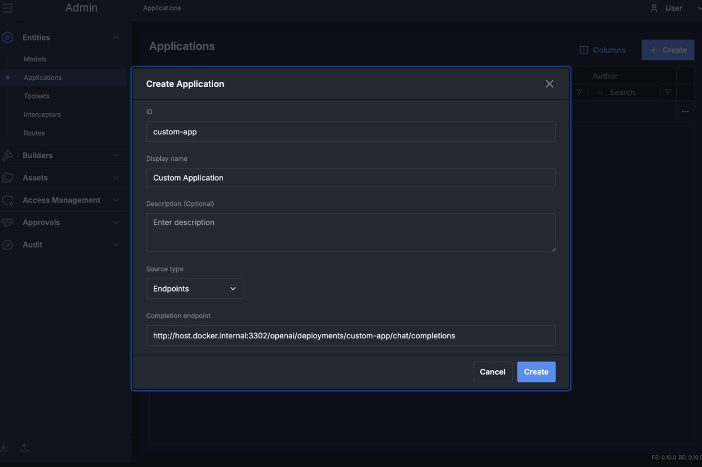
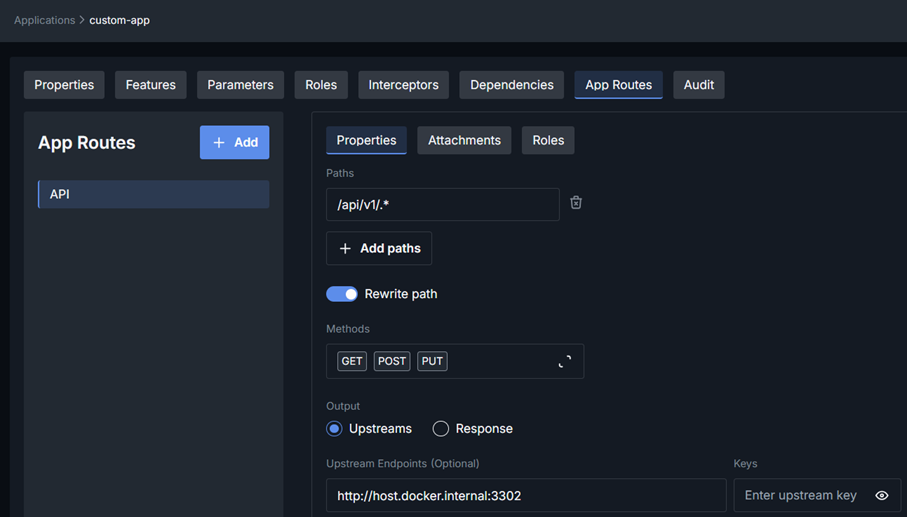
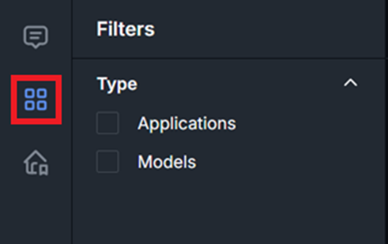
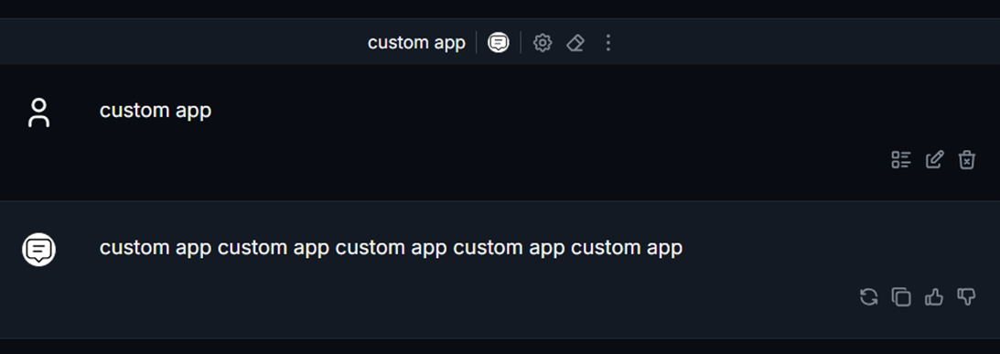

# Developing Chat-Based Standalone Custom Applications

## Introduction

The easiest way to develop a custom application for DIAL, is using the [sample project](https://github.com/epam/ai-dial/blob/main/dial-samples/standalone-app-chat-ui/backend/README.md) as a baseline. The instruction below shows how to set up a local DIAL environment as well as register and run the sample project.

Refer to [Develop Custom Applications](/docs/tutorials/1.developers/4.apps-development/6.develop-custom-apps-overview.md) for a high-level information about application runners.

> **Note**: This tutorial uses a Docker-deployed Keycloak instance as the Identity Provider for demonstration purposes. In your organization, you can apply the same configuration principles to your corporate Identity Provider, using the Keycloak setup here as a reference.

## Running Sample Project

1.	Clone the project containing all templates and Docker Compose scripts from the [ai-dial GitHub repository](https://github.com/epam/ai-dial).
2.	Run the base Docker Compose file.

    1. Go to the `/dial-docker-compose-advanced` folder of the ai-dial GitHub project cloned in the previous step.
    2. Run the following command to launch a local DIAL environment with all components necessary for custom application development and testing:
  
        ```bash
        docker compose -f docker-compose-base.yml up
        ```
      

3.	Create a client in Keycloak for the custom Admin UI:

    1. Open http://localhost:8900 and log in using “admin” as username and password. It is recommended to open this and all further “localhost” references in an incognito browser window.
    2. Click **Manage realms** in the left panel and select the **dial** realm in the realms list.
    3. Click **Clients** in the left panel and click **Create client**.
    4. Set **Client ID** and **Name** to “custom-app-admin” and click **Next**.

        

    5. Turn on the **Client authentication** toggle and click **Next**.

        

    6. Set **Root URL** and **Home URL** to `http://localhost:3301` and **Valid redirect URIs** to `http://localhost:3301/*`, then click **Save**.

        

    7. Go to **Client scopes** tab in the client properties page and click **Add client scope**.

        

    8. Select scopes “profile”, “basic” “email”, and “offline_access”, then click **Add** and select **Default**.

        

4.	Update the custom applications Docker Compose file with client secrets

    1. Go to the **Credentials** tab for the “custom-app-admin” client properties in Keycloak.
    2. Click the **Copy to clipboard** icon next to the Client Secret input field.

        

    3. Paste the copied value to `AUTH_KEYCLOAK_SECRET` variable in the Docker Compose file `/dial-samples/standalone-app-chat-ui/docker-compose.yml` from the cloned GitHub project.

5.	Create a new application in DIAL Admin:
    1. Open http://localhost:3102 and log in using “dial-admin” as username and “dial” as password.
    2. In the **Entities** section in the left panel, open **Applications** and click **Create** in the right upper corner.
    3. Set the **ID** to “custom-app” and the **Display Name** to “Custom Application”.
    4. Set **Completion endpoint** to `http://host.docker.internal:3302/openai/deployments/custom-app/chat/completions` and click **Create**. 
    
      > **Note**: Please note that the “custom-app”  section of this URL must be equal to the name passed to a call to “add_chat_completion” method in the underlying DIAL backend application. If you use a different name in your backend, the URL from above must be updated accordingly.

      

6. Configure new application:

    1. Set **Editor URL** to `http://localhost:3301`.
    2. Go to the **Roles** tab and set the **Make available to specific roles** toggle **off**.
    3. Go to the **App Routes** tab and click **Add**.
    4. Set **Display Name** to “API” and click **Create**.
    5. Set **Path** to “/api/v1/.*”, toggle **Rewrite path** on, select GET, POST, and PUT in the Methods field.
    6. Set **Upstream Endpoint** to `http://host.docker.internal:3302`.
    7. Select both “Read” and “Write” in the **Permissions** field.

      

    8. Go to the **Roles** sub-tab within the **App Route** properties and toggle **Inherit Application Roles** on, then click **Save**.

7.	Make changes in the sample UI application code to make it compatible with the custom API exposed by the backend:

    1. Open the folder `/dial-samples/common-ui-app` in an IDE.
    2. Go to file `/apps/dial-custom-ui-admin/src/app/[lang]/settings/actions.ts`
    3. Comment out the original return statements in both functions and uncomment the following lines of code:

        ```typescipt
        return await configApi.getConfig(token); //In getCofing()
        return await configApi.setConfig(config, token); //In saveConfig()
        ```

        > **Tip**: This change makes the custom admin application call the custom backend API that is intended for storing application settings for this custom standalone application.

8.	Run Docker Compose for the custom application runner with a chat end-user interface: 

    1. Go to the `/dial-samples/standalone-app-chat-ui` folder of the cloned GitHub project.
    2. Run Docker Compose:
    
        ```bash
        docker compose -f docker-compose.yml up --build
        ```

9.	Configure the application setting in the DIAL Admin:

    1. Get back to the DIAL Admin application at http://localhost:3102.
    2. Go to **Entities/Applications** and select **Custom Application** in the table.
    3. In the **Properties** page for the “Custom Application” switch to the **Parameters** tab.
    4. If you see just the “Login” link in the center of the tab – click it and log in with “dial-admin” as a user and “dial” as a password.

        > **Note**: Now you should see a sample custom configuration page with a single input field called “Number”. In this sample application, this property controls how many times your input will be repeated in the end-user chat in response. The configuration page is served by the URL specified in the “Editor URL” property of the application type.
      
    5. Change the default value of 1 with any other integer number (e.g. 5), then click **Save**.
10.	Access the newly-created application named “Custom Application” in the DIAL Marketplace:
    1. Open http://localhost:3100
    2. Log in using “dial” as username and password.
    3. Click the **Marketplace** icon from the left panel.

        

    4. Click on the application named “Custom Application” and then – the **Use Application** button. Now you should see a chat interface, where each of your input messages will be repeated as many times in response, as was specified when configuring the application.

        

11.	Check that the configuration can be changed at any time:

    1. Get back to the DIAL Admin application at http://localhost:3102
    2. Go to **Entities/Applications** and select “Custom Application” in the table.
    3. In the **Properties** page for the “Custom Application” switch to the **Parameters** tab.
    4. Change the number to any other value and check if it affects the behavior of the end-user custom application (see step 8).

## Developing a Real-World Application

A real-world standalone custom application can be developed using such sample applications as templates.

* For a scenario with the standard chat interface for end-users (like demonstrated in this tutorial), the dial-custom-ui-client project of the common-ui-app sample can be ignored and removed.
* The Settings page from dial-custom-ui-admin can be changed however needed to satisfy the configurability requirements of your target use case.
* The backend for the scenario with the standard chat interface is using [DIAL SDK](https://github.com/epam/ai-dial-sdk) to implement the chat completion endpoint. There you can find more information and examples of how to build custom chat completion backends.
* The purpose of each environment variable used by the custom application is documented in the README.md of the corresponding project: 
  - [common-ui-app](https://github.com/epam/ai-dial/blob/main/dial-samples/common-ui-app/README.md)
  - [standalone-app-chat-ui](https://github.com/epam/ai-dial/blob/main/dial-samples/standalone-app-chat-ui/backend/README.md)
  - [app-runner-chat-ui](https://github.com/epam/ai-dial/blob/main/dial-samples/app-runner-chat-ui/backend/README.md)


