# Developing Chat-Based Custom Application Runners

## Introduction 

The easiest way to develop a custom application runner for DIAL, is using the [sample project](https://github.com/epam/ai-dial/blob/main/dial-samples/app-runner-chat-ui/backend/README.md) as a baseline. The instruction below shows how to set up a local DIAL environment as well as register and run the sample project.

Refer to Develop Custom Applications for a high-level information about application runners.

> **Note**: This tutorial uses a Docker-deployed Keycloak instance as the Identity Provider for demonstration purposes. In your organization, you can apply the same configuration principles to your corporate Identity Provider, using the Keycloak setup here as a reference.

## Running Sample Project

1.	Clone the project containing all templates and Docker Compose scripts from the [ai-dial GitHub repository](https://github.com/epam/ai-dial).  
2.	Add custom app URLs to the IFRAME allowed list for the DIAL Chat application

    Add the following two variables for the “chat” service in the `/dial-docker-compose-advanced/docker-compose-base.yml`

    ```yaml
    ALLOWED_IFRAME_ORIGINS: http://localhost:3301
    ALLOWED_IFRAME_SOURCES: http://localhost:3301
    ```

3.	Run the base Docker Compose file.
    1. Go to the `/dial-docker-compose-advanced` folder of the GitHub project cloned in step 1.
    1. Run the following command to launch a local DIAL environment with all components necessary for custom application development and testing:

        ```bash
        docker compose -f docker-compose-base.yml up
        ```
         
4.	Create a client in Keycloak for the custom admin UI:

    1. Open http://localhost:8900 and Log in using “admin” as username and password. It is recommended to open this and all further “localhost” references in an incognito browser window.
    1. Click **Manage Realms** in the left panel and click on the “dial” realm in the realms list.
    1. Click on **Clients** in the left panel and click **Create client**.
    1. Set **Client ID** and **Name** to “custom-app-admin” and click **Next**.

        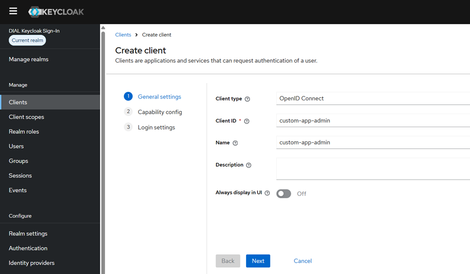
    1. Turn on the **Client authentication** toggle and click **Next**.

        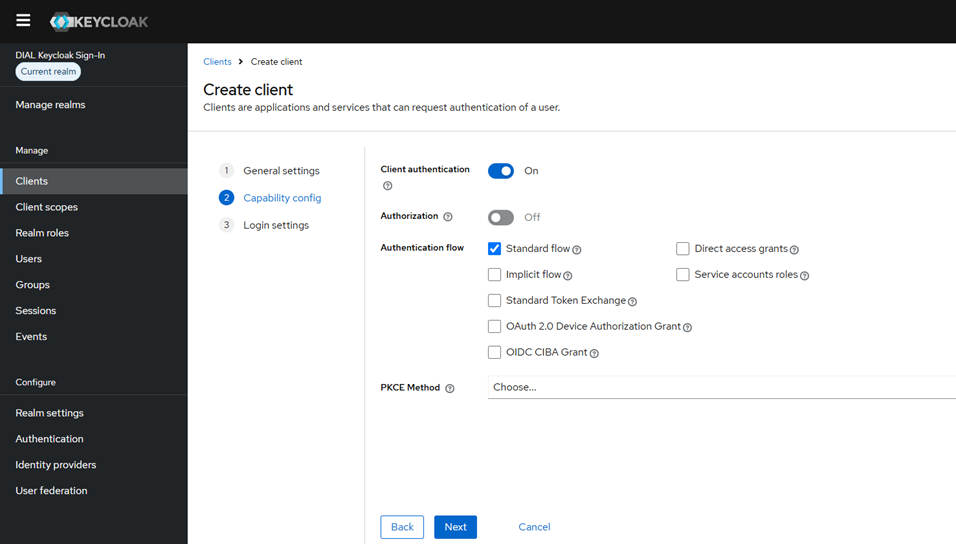
    1. Set **Root URL** and **Home URL** to `http://localhost:3301` and **Valid redirect URIs** to `http://localhost:3301/*`, then click **Save**.

        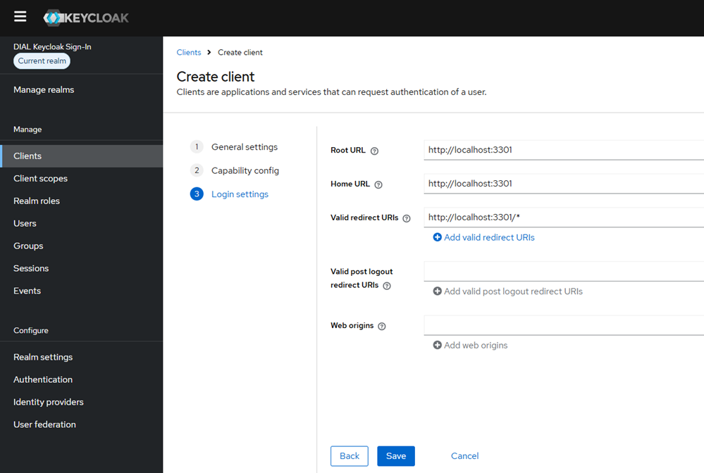
    1. Go to **Client scopes** tab in the client properties page and click **Add client scope**.

        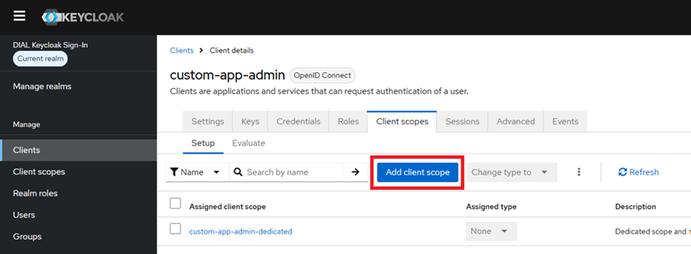
    1. Select scopes “profile”, “basic” “email”, and “offline_access”, then click **Add** and select **Default**.

        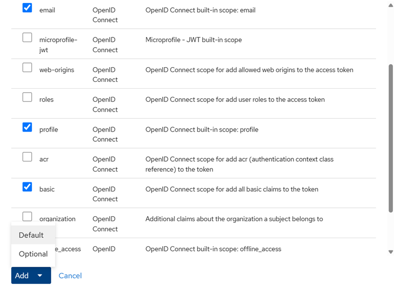
5.	Update the custom applications Docker Compose file with client secrets
    1. Go to the **Credentials** tab for the “custom-app-admin” client properties in Keycloak.
    1. Click the **Copy to clipboard** icon next to the Client Secret input field.

        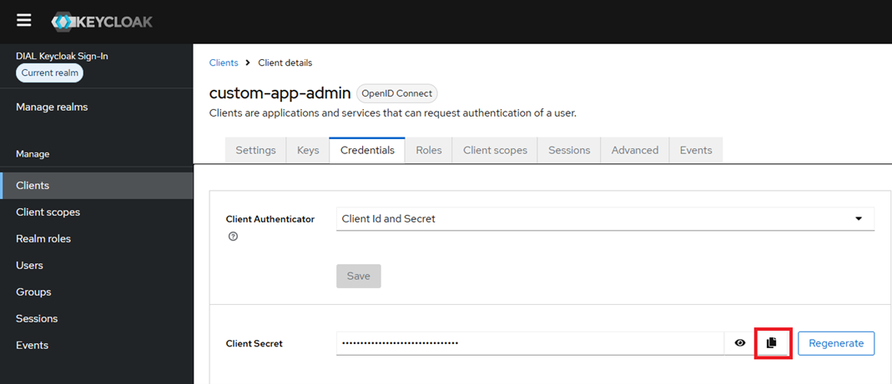
    1. Paste the copied value to `AUTH_KEYCLOAK_SECRET` variable in the Docker Compose file `/dial-samples/app-runner-chat-ui/docker-compose.yml` from the cloned GitHub project.
6.	Create a new application type in DIAL Admin:
    1. Open http://localhost:3102 and log in using “dial-admin” as username and “dial” as password.
    1. Expand the **Builders** section in the left panel and click on **Application Runners**.
    1. Click the **Create** button in the right upper corner.
    1. Set the **ID** to “https://dialx.ai/sample_application_schemas/custom_runner”  (any valid URL is acceptable) and the **Display Name** to “Custom Runner”. When finished, click **Create**.

        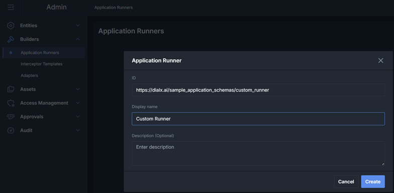
    1. Make sure that the **Display Name** of the application type (“Custom Runner”) is equal to the value of the `DIAL_APPLICATION_NAME` variable from the Docker Compose file `/dial-samples/app-runner-chat-ui/docker-compose.yml`. Otherwise, the application won’t be loaded by the host DIAL Chat application. 
    1. Set **Completion Endpoint** to “http://host.docker.internal:3302/openai/deployments/custom-app/chat/completions” and **Editor URL** to “http://localhost:3301”. When finished, click **Save**. 
    
    > **Note**: Please note that the “custom-app” section of this URL must be equal to the name passed to a call to “add_chat_completion” method in the underlying DIAL backend application. If you use a different name in your backend, the URL from above must be updated accordingly.

        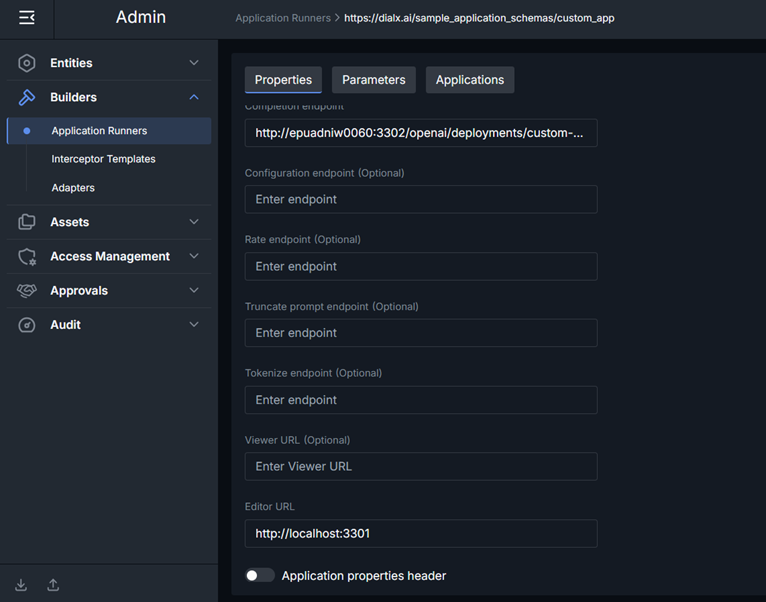

7.	Run Docker Compose for the custom application runner with a chat end-user interface: 

    1. Go to the `/dial-samples/app-runner-chat-ui` folder of the cloned GitHub repository
    1. Run Docker Compose:

        ```bash
        docker compose up --build
        ```
8.	Create a new application instance from the newly-registered application type
    1. Open http://localhost:3100 and log in using “dial” as username and password.
    1. Open **My Workspace** by clicking the Home icon on the left panel.

        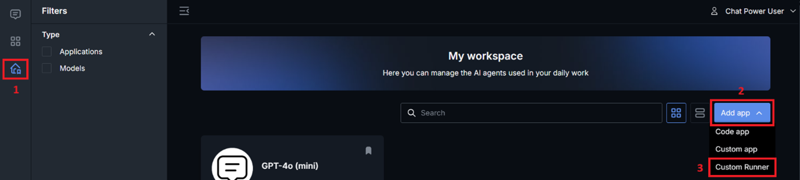

    1. In the **Add app** dropdown select **Custom Runner**.
    1. Set **Name** to “Custom Runner Instance 1” and click **Next**.

        Now you should see a sample custom configuration page with a single input field called “Number”. In this sample application, this property controls how many times your input will be repeated in the end-user chat in response. The configuration page is served by the URL specified in the “Editor URL” property of the application type.

9.	Change the default value of 1 with any other integer number (e.g. 5), then click **Save** and **Exit** in the right upper corner of the page.

    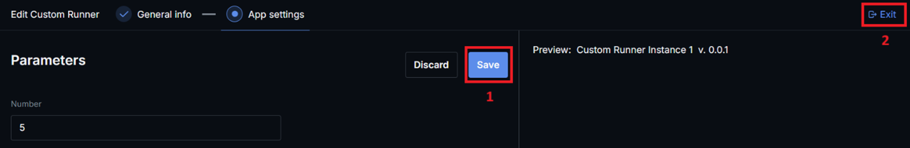

10.	Find the newly-created application instance named “Custom Runner Instance 1” in your workspace and open it.

    Now you should see a chat interface, where each of your input messages will be repeated as many times in response, as was specified when creating the application instance.

    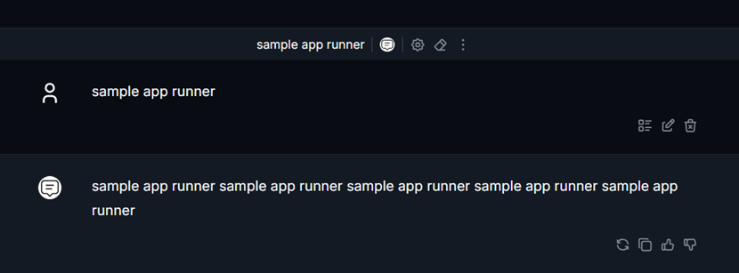

11.	Check if the configuration can be changed at any time:
    1. Get back to your workspace in the DIAL Chat application.
    1. Click tree-dot icon on your newly-created application instance’s tile, and then click **Edit** in the pop-up menu.

        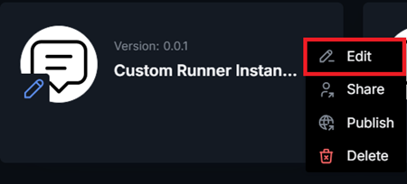

    1. Change the number to any other value and check if it affects the behavior of this chat application instance.

## Developing a Real-World Application

A real-world custom application runner can be developed using such sample applications as templates.

* For a scenario with the standard chat interface for end-users (like demonstrated in this tutorial), the **dial-custom-ui-client** project of **common-ui-app** sample can be ignored and removed.
* The **Settings** page from **dial-custom-ui-admin** can be changed however needed to satisfy the configurability requirements of your target use case.
* The backend for the scenario with the standard chat interface is based on [DIAL SDK](https://github.com/epam/ai-dial-sdk). There you can find more information and examples of how to build custom chat completion backends.
* The purpose of each environment variable used by the custom application is documented in the README.md of the corresponding project:
  - [common-ui-app](https://github.com/epam/ai-dial/blob/main/dial-samples/common-ui-app/README.md)
  - [standalone-app-chat-ui](https://github.com/epam/ai-dial/blob/main/dial-samples/standalone-app-chat-ui/backend/README.md)
  - [app-runner-chat-ui](https://github.com/epam/ai-dial/blob/main/dial-samples/app-runner-chat-ui/backend/README.md)
* The main idea of handling instance-specific configuration with a custom Application Runner is:
    - A custom configuration UI reads and saves instance-specific configuration directly accessing DIAL API (see [getCustomApplication](https://dialx.ai/dial_api#tag/Applications/operation/getCustomApplication), and [saveCustomApplication](https://dialx.ai/dial_api#tag/Applications/operation/saveCustomApplication)
    - A custom chat completion backend reads the instance configuration associated with the current request by calling `request.request_dial_application_properties()`
