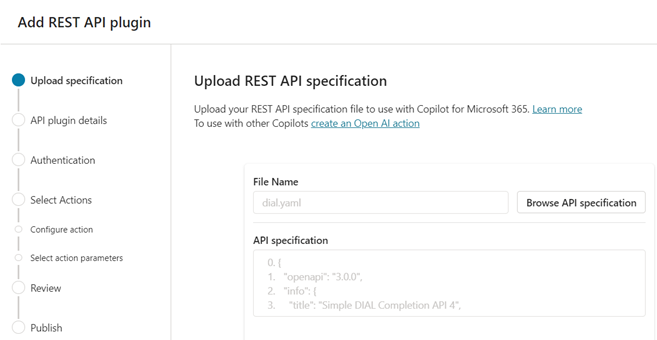

# Integration between AI DIAL and Microsoft Copilot

## Introduction

AI DIAL is an open platform designed to avoid vendor lock-in, enabling seamless integration with external General AI (GenAI) applications, other AI-enabling systems, custom libraries and frameworks on any cloud or chosen environment. Being an orchestration platform, AI DIAL works alongside other AI-enabling systems to augment and expand their functionalities.

This document provides a detailed guide on how to create a MS Power Platform connector for AI DIAL. This connector can be used in MS Copilot Studio prompt flows, facilitating smooth interaction between the systems for creating comprehensive business solutions.

> Watch a [demo video](/docs/video%20demos/3.Developers/Integrations/13.dial-copilot.md) to see this integration in action.

There are two authentication types available for AI DIAL:

* API key
* End-user identity (OAuth2)

The chapters in this document will explain the specifics of integration based on the chosen type of authentication.

### Limitations

* Users can't send attachments to MS Copilot Studio agents: Although the underlying language model supports attachments, MS Copilot users currently cannot pass them to an agent when making a request, either through the UI or the API. For more details, refer to the MS Copilot Studio [documentation](https://learn.microsoft.com/en-us/microsoft-copilot-studio/publication-fundamentals-publish-channels?tabs=web).
* MS Copilot Studio does not support image generation or diagramming. For more details, refer to the Microsoft [community forum](https://community.powerplatform.com/forums/thread/details/?threadid=178879d8-dd5e-4d10-99df-4e8293affb6e).

## Auth with End-user Identity

### Prerequisites

* AI DIAL API is exposed to the Internet (required for OAuth2 authentication).
* AI DIAL API application registration in Azure has Application ID URI and at least one scope configured in the **Expose API** section. AI DIAL Application ID must be known.
* Open API definition YAML file for DIAL API is available.

### Step 1: Entra ID Application Registration

Create an Entra ID application registration for the custom connector:

1.	In **Entra ID -> App registrations** click **New registration**.
2.	Populate **Name** (leave the remaining fields as is) and click **Register**.
3.	Go to **Certificates & secrets** in the properties of the newly created registration and click **New client secret**.

  

4.	Provide a **Name** for the secret and click **Add**.
5.	Copy the generated secret value to a secure place, from where it can be subsequently retrieved.
6.	Got to **API permissions** in the properties of the newly created registration and click **Add a permission**.

  

7.	On the **APIs my organization uses** tab, find an application registration associated with the AI DIAL API.

  

8.	On the next screen, select all scopes exposed by the AI DIAL application registration and click **Add permissions**:

  

### Step 2: Create Connector in Copilot Studio

1.	In the custom topic, where AI DIAL needs to be called, click **+** and select **Call an action** and then select **Add a plugin action** in the **Plugin** tab.

  

  

2.	In the new window, click **Custom connector** and select **Add an API for a custom connector**.

  

3.	In the new window, at the **Upload specification** step, select the file containing the DIAL API YAML specification and click **Next**.

  

4.	Populate API plugin details and click **Next**. If you want to put the new custom connector to an existing Power Platform solution, select this solution in the corresponding field.

  

5.	At the **Authentication** step, select **OAuth (2.0)** authentication type and populate the remaining fields according to the following instructions:

  - **Client ID** - the GUID from the **Application (client) ID** property of the application registration created for this custom connector.
  - **Client Secret** - the secret generated when creating the application registration.
  - **Authorization URL** - `https://login.microsoftonline.com/{tenant}/oauth2/v2.0/authorize`, where `{tenant}` is a placeholder for your Entra ID tenant identifier.
  - **Token URL** - `https://login.microsoftonline.com/{tenant}/oauth2/v2.0/token`
  - **Refresh URL** - `https://login.microsoftonline.com/{tenant}/oauth2/v2.0/token`
  - **Scope** - openid profile email `offline_access {DIAL Application ID}/.default`, where `{DIAL Application ID}` is the application identifier of the AI DIAL API.

6.	At the **Select Actions** step, select the API method you need to call (e.g. completion).

  

7.	Populate the action **Name** and **Description**.
8.	Populate description for all input and output parameters.
9.	Proceed to publish.
10.	In Copilot Studio, navigate to **Solutions** and choose the solution that was created when you set up the custom connector. This solution will have the same name as the custom connector.

  

11.	Find the custom connector in the selected solution and click on it.
12.	Copy the redirect URL shown on the custom connector page.

  

13.	To proceed, open the Azure Application Registration created in the previous section and navigate to **Authentication**.

  

14.	Click **Add platform**, select **Web**, paste the copied Redirect URL, and click **Configure**.
15. The custom connector actions can now be added to the prompt flow within the Copilot Studio topic.

## Auth with API Key and DIAL API Exposed to the Internet

### Prerequisites

* DIAL API is exposed to the Internet.
* Open API definition YAML file for DIAL API is available.

### Create Connector in Copilot Studio

1. Perform **steps 1-4** from the section [Create Connector in Copilot Studio](#step-2-create-connector-in-copilot-studio).
3. Select **API Key** authentication type and populate the required fields as shown on the screenshot.

  

3. Perform **steps 6-9** from the section [Create Connector in Copilot Studio](#step-2-create-connector-in-copilot-studio).

## Auth with API Key and DIAL API NOT Exposed to the Internet

### Prerequisites

* An [on-premises data gateway](https://learn.microsoft.com/en-us/data-integration/gateway/service-gateway-install) is installed within the on-premises network and DIAL API is reachable from the machine it is installed on.
* Open API definition YAML file for DIAL API is available.

### Create Connector in Copilot Studio

1. Patch the Open API definition YAML file for DIAL API to add one more parameter to each method specifying the API Key:

    ```yaml
    - name: Api-Key
      in: header
      required: true
      schema:
        type: string
    ```

2. Perform **steps 1-4** from the section [Create Connector in Copilot Studio](#step-2-create-connector-in-copilot-studio).
3. Select **None** authentication type.
4. Perform **steps 6-9** from the section [Create Connector in Copilot Studio](#step-2-create-connector-in-copilot-studio).
5. In Copilot Studio, navigate to **Solutions** and choose the solution that was created when you set up the custom connector. This solution will have the same name as the custom connector.

    

6. Find the custom connector in the selected solution and click on it.
7. In the Power Automate page for the selected custom connector click **Edit**.
8. Set the checkmark **Connect via on-premises data gateway** in the custom connector properties and update the definition.

  

9. When creating a connection for further usage, the connector administrator will have to select the on-premise data gateway.

  