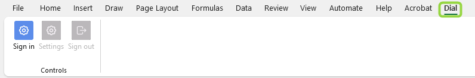
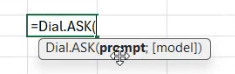
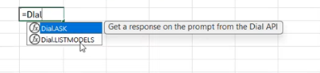
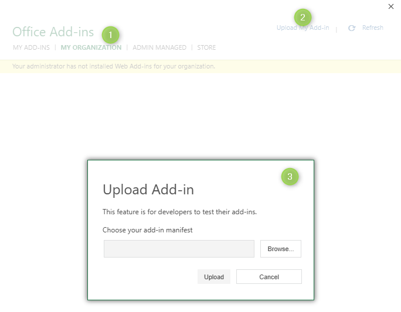

# DIAL Add-in for Microsoft Excel

## Introduction

DIAL is an open platform that can be integrated with external systems, libraries and frameworks, serving to augment and expand their existing functionalities.

This document provides an overview of how DIAL integrates with Microsoft Excel through a dedicated Add-in. This implementation also serves as a practical example of DIAL's integration with other systems.

> Watch a [demo video](/docs/video%20demos/3.Developers/Integrations/14.dial-excel-plugin.md) to see this integration in action.

### About the DIAL Add-in

The DIAL Add-in for Microsoft Excel is a Next.js application, developed using the official [MS Add-ins Development Kit](https://learn.microsoft.com/en-us/office/dev/add-ins/develop/development-kit-overview?tabs=vscode).

The add-in includes custom functions logic, user authentication mechanisms, and user interface (UI) components, including dialogs for settings, sign-in, and sign-out.

DIAL Excel Add-in has two available functions:

* `Dial.ASK`: This function sends a prompt to a selected language model or application within the DIAL ecosystem. You can specify the target model directly as a function argument or use the model configured in the Add-in’s settings.

    

* `Dial.LISTMODELS`: This function retrieves a list of all language models and applications available to the current user within DIAL.

    

Using the DIAL Add-in, you can construct prompts dynamically using data from spreadsheet cells. These prompts are then sent to the chosen language model or application to generate responses directly within your worksheet. All standard Microsoft Excel features applicable to cells and formulas, such as cell referencing, formula recalculation and more, also apply to DIAL functions.

## Integration with Microsoft Excel

### Prerequisites

For the DIAL Add-in to operate, both [DIAL Core](/docs/platform/3.core/0.about-core.md) and the DIAL Add-in application instances must be deployed and running.

### Integration

The DIAL Add-in application integrates with Microsoft Excel via a manifest.xml file. This manifest file defines all UI components of the add-in, specifies the paths to its JavaScript code, and lists other necessary resources.

A file with manifest can be uploaded into MS Excel manually (for a local test deployment) and via the official request to add Add-in to the MS Store.

## How It Works

For the DIAL Add-in to operate, both [DIAL Core](/docs/platform/3.core/0.about-core.md) and the DIAL Add-in application instances must be deployed and running.
The operational flow is as follows:

1.	Microsoft Excel communicates with the DIAL Add-in's backend using the endpoints defined in the manifest.xml file. Make sure that all endpoints you provide in the manifest file work and are available to communicate with the application.
2.	The DIAL Add-in, in turn, interacts with the DIAL Core. It uses DIAL API endpoints, specifically the [list deployments](https://dialx.ai/dial_api#tag/Deployment-listing) endpoint to fetch available models and applications, and the [chat completion](https://dialx.ai/dial_api#operation/sendChatCompletionRequest) endpoint to send user prompts and receive responses.

## Authentication and Authorization of Users

The DIAL Add-in features integration with Keycloak to authenticate Microsoft Office users through its user interface. Upon successful authentication, a token is issued. This token is then used to authorize requests made from the Add-in to DIAL Core.

User roles, configured within Keycloak, are mirrored in [DIAL Core](/docs/tutorials/2.devops/2.auth-and-access-control/2.configure-idps/keycloak.md). These roles are crucial for managing access to specific language models and applications, as well as for enforcing token usage limits. For more detailed information on role configuration and access management, please refer to the [documentation](/docs/platform/3.core/2.access-control-intro.md).
