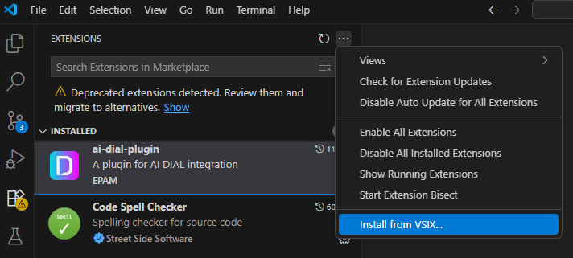
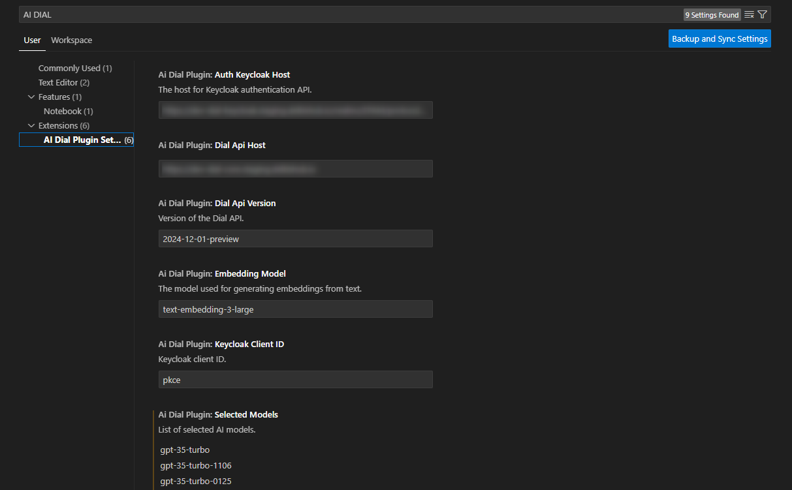
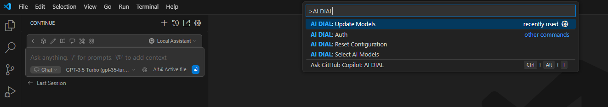

# Integration of DIAL with Continue

## Introduction

DIAL is an open platform that integrates with external systems, libraries, and frameworks to enhance and extend their existing functionalities. This document explains the integration of DIAL with the [Continue](https://marketplace.visualstudio.com/items?itemName=Continue.continue) extension for Visual Studio Code (VS Code) - AI-powered code assistant, similar to a copilot.

The purpose of this integration is to enable VS Code users use the Continue code assistant with DIAL models.

This implementation also serves as a practical example of DIAL's integration with other systems.

## DIAL Extension

To enable this integration, we developed a VS Code extension that automatically modifies the Continue's VS Code extension `config.json` file with configuration data from DIAL Core, based on the authenticated user (e.g., logged-in user and access tokens). This way a DIAL user can use Continue code assistant with DIAL models available to this user and within limits defined in DIAL Core configuration.

> Watch a [demo video](/docs/video%20demos/3.Developers/Integrations/8.dial-continue.md) to see this integration in action.

### Features

These are the main features of the DIAL VS Code extension:

- **Secure Authentication**: The extension uses the PKCE flow with Keycloak for a secure authentication of users.
- **Automatic Token Management**: It refreshes tokens automatically before they expire to ensure uninterrupted access.
- **Configuration File Generation**: The extension automatically creates configuration files required for Continue based on DIAL Core settings.
- **Customizable Settings**: The extension's configuration allows you to define settings specific for your DIAL environment: authentication hosts, realms, and client IDs.

### Installation

DIAL Plugin is not available on the Visual Studio Marketplace, follow these steps to install it manually:

1.  Send us a request to get the latest `.vsix` file.
2.  In VS Code Extensions, click on the three-dot menu in the top right corner of the Extensions pane and select **Install from VSIX...**. Run the `.vsix` file to install both DIAL and Continue extensions.

    
    
4.  Reload VS Code to activate the extension.
5.  Click Ctrl+Shift+P (Cmd+Shift+P on macOS) to open the Command Palette and type in `AI DIAL: Auth` to authenticate with DIAL. Once authenticated, the extension will automatically generate the necessary configuration files for Continue, allowing you to use DIAL models with the Continue extension.

    

### Settings

To configure settings, navigate to File > Preferences > Settings (Code > Preferences > Settings on macOS) and search for the DIAL plugin in the search bar.

The extension allows you to set the following configuration options:

| **Setting**                     | **Type** | **Default** | **Description**                       |
| ------------------------------- | -------- | ----------- | ------------------------------------- |
| `aiDialPlugin.authKeycloakHost` | String   | Auth host   | The Keycloak authentication API host. |
| `aiDialPlugin.keycloakClientId` | String   | pkce        | The Keycloak client ID.               |
| `aiDialPlugin.dialApiHost`      | String   | Dial host   | The DIAL API host.                    |
| `aiDialPlugin.dialApiVersion`   | String   | 2024-02-01  | The version of the DIAL API.          |

### Commands

In VS Code, press Ctrl+Shift+P (Cmd+Shift+P on macOS) to open the Command Palette and type in AI DIAL to see the available commands:

| Command Name                 | Description                                                 |
| ---------------------------- | ----------------------------------------------------------- |
| AI DIAL: Reset Configuration | Use to reset the extension's configuration to default.      |
| AI DIAL: Select AI Models    | Select models that will become available in your extension. |
| AI DIAL: Auth                | Use to authenticate with DIAL.                              |
| AI DIAL: Update Models       | Use to update the list of models.                           |

