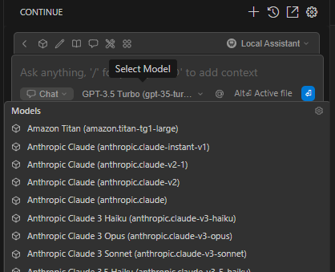

# Integration of DIAL with Continue

## Introduction

DIAL is an open platform that integrates with external systems, libraries, and frameworks to enhance and extend their existing functionalities. This document explains the integration of DIAL with [Continue](https://marketplace.visualstudio.com/items?itemName=Continue.continue) extension for Visual Studio Code (VS Code) - AI-powered code assistant, similar to a copilot. 

The purpose of this integration is to enable VS Code users use the Continue code assistant with DIAL model.

This implementation also serves as a practical example of DIAL's integration with other systems.

## DIAL Extension

To enable this integration, we developed a VS Code extension that automatically modifies the Continue's VS Code extension `config.json` file with configuration data from DIAL Core, based on the authenticated user (e.g., logged-in user and access tokens). This way a DIAL user can use Continue code assistant with DIAL models available to this user and within limits defined in DIAL Core configuration.

> Watch a [demo video](/docs/video%20demos/3.Developers/Integrations/8.dial-continue.md) to see this integration in action.

##### Features of DIAL Extension

- **Secure Authentication**: The extension uses the PKCE flow with Keycloak for secure user authentication.
- **Automatic Token Management**: It refreshes tokens automatically before they expire to ensure uninterrupted access.
- **Configuration File Generation**: The extension automatically creates configuration files required for Continue based on DIAL Core settings.
- **Customizable Settings**: The extension's configuration allows you to define settings specific for your DIAL environment: authentication hosts, realms, and client IDs.

| **Setting**                     | **Type** | **Default**          | **Description**                                   |
|----------------------------------|----------|----------------------|---------------------------------------------------|
| `aiDialPlugin.authKeycloakHost` | String   | Auth host            | The Keycloak authentication API host.            |
| `aiDialPlugin.keycloakClientId` | String   | pkce                 | The Keycloak client ID.                          |
| `aiDialPlugin.dialApiHost`      | String   | Dial host            | The DIAL API host.                                |
| `aiDialPlugin.dialApiVersion`   | String   | 2024-02-01           | The version of the DIAL API.                     |

## How to Use

1. **Installation**: DIAL extension is installed together with the Continue extension via the `vsix` file.

        

2. **Authenticate with DIAL**: Once the extension is installed, you will be prompted to authenticate to enable access to DIAL models.
3. **Use DIAL Models in Continue**: Once authenticated, you can use the Continue extension with DIAL models.

        