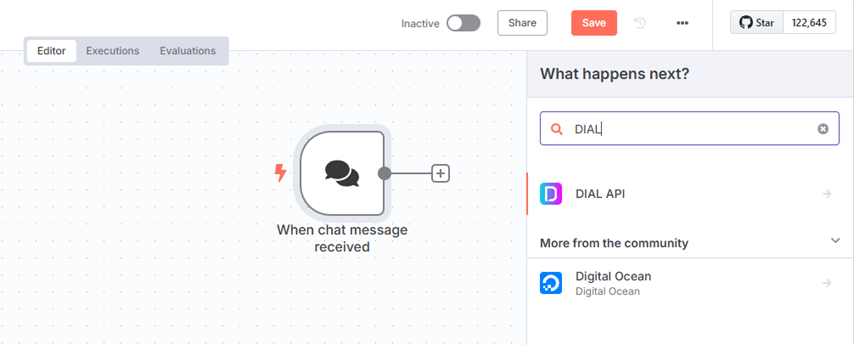
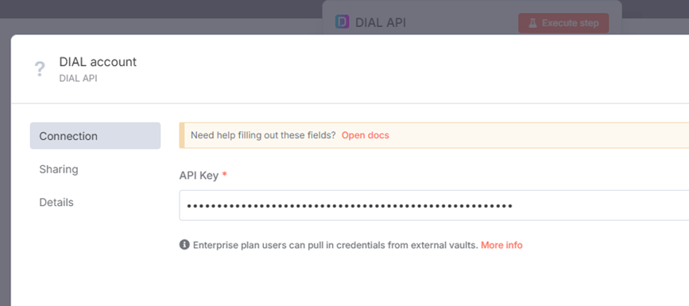
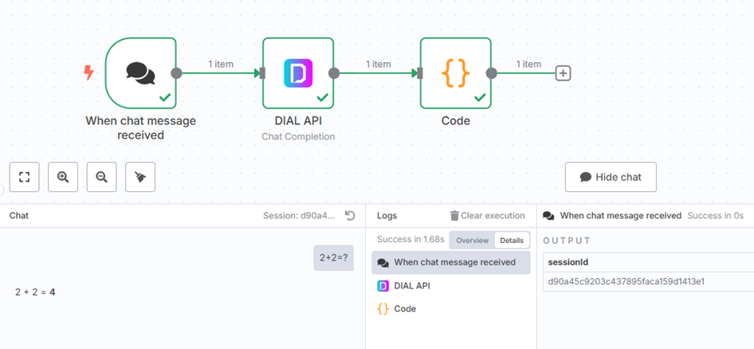
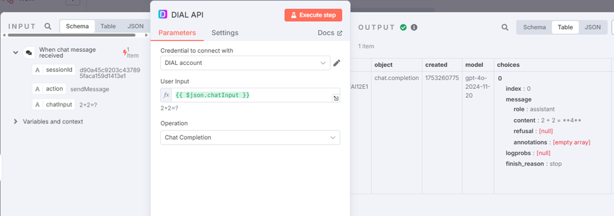
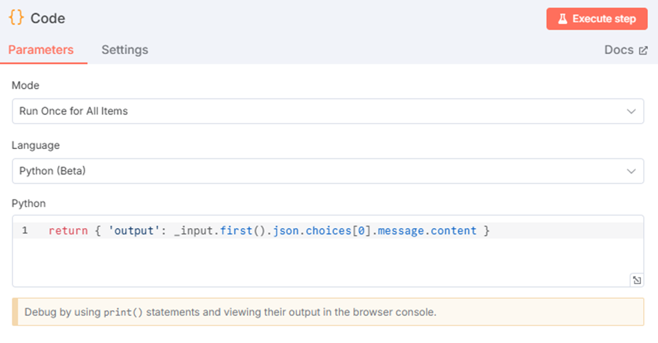

# Integration of DIAL with n8n

## Introduction

DIAL is an open platform designed to avoid vendor lock-in, enabling seamless integration with external General AI (GenAI) applications, other AI-enabling systems, custom libraries and frameworks on any cloud or chosen environment.

Being an orchestration platform, DIAL works alongside other AI-enabling systems to augment and expand their functionality.

This document provides an overview of how DIAL integrates with [n8n](https://n8n.io/) through a [custom node](https://docs.n8n.io/integrations/creating-nodes/overview/). n8n is a free and open-source workflow automation tool that allows users to connect different applications, services, and APIs to automate tasks and processes.

This implementation also serves as a practical example of DIAL's integration with other systems.

## Create DIAL API Custom Node

n8n organizes workflows using [nodes](https://docs.n8n.io/workflows/components/nodes/) - building blocks that perform specific actions, such as interacting with APIs, transforming data, or executing scripts.

Custom nodes are user-defined nodes built to enable advanced functionality beyond the scope of built-in nodes. They are highly customizable and ideal for handling unique business requirements, integrating uncommon APIs, or extending n8n to interact with tailored services like DIAL.

##### Prerequisites

- n8n installed and set up (locally or in the cloud). Refer to [n8n's installation guide](https://docs.n8n.io/hosting/installation/npm/).
- DIAL API key (required for authentication).
- Node.js installed on your local machine for testing and deployment.

### Step 1: Plan a node

The DIAL API custom node will be represented as following:

- Type - [Action node](https://docs.n8n.io/integrations/creating-nodes/plan/node-types/#action-nodes)
- Building approach - [Declarative style](https://docs.n8n.io/integrations/creating-nodes/plan/choose-node-method/)
- UI components - [Credentials, operations, fields](https://docs.n8n.io/integrations/creating-nodes/plan/node-ui-design/#credentials)
- Node file structure - [Choose node file structure](https://docs.n8n.io/integrations/creating-nodes/build/reference/node-file-structure/)

### Step 2: Build a node

To build and test the node you need to [set up a development environment](https://docs.n8n.io/integrations/creating-nodes/build/node-development-environment/).

1.  Fetch the [n8n project template](https://github.com/n8n-io/n8n-nodes-starter) and remove examples from /nodes and /credentials folders.
2.  Generate a [credentials file](https://docs.n8n.io/integrations/creating-nodes/build/declarative-style-node/#step-4-set-up-authentication) named `DialApi.credentials.ts` within the `/credentials` directory, and include the code provided below.

```typescript
import { ICredentialType, INodeProperties } from 'n8n-workflow';

export class DialApi implements ICredentialType {
name = 'dialApi';
displayName = 'DIAL API';
documentationUrl = 'https://<url_to_api_key_docs>/';
properties: INodeProperties[] = [
        {
        displayName: 'API Key',
        name: 'apiKey',
        type: 'string',
        default: '',
        required: true,
        typeOptions: {
                password: true, // Mask the value for security
        },
        description: 'The API key for the DIAL API.',
        }
];
}
```

3.  Generate [metadata file](https://docs.n8n.io/integrations/creating-nodes/build/declarative-style-node/#step-5-add-node-metadata) named `Dial.node.json` within the `/nodes` directory, and include the code provided below.

```json
{
        "node": "n8n-nodes-base.dial",
        "nodeVersion": "1.0",
        "codexVersion": "1.0",
        "categories": [
        "Miscellaneous"
        ],
        "resources": {
        "credentialDocumentation": [
                {
                "url": ""
                }
        ],
        "primaryDocumentation": [
                {
                "url": ""
                }
        ]
        }
}
```

4.  Generate [node file](https://docs.n8n.io/integrations/creating-nodes/build/declarative-style-node/#step-3-create-the-node) named `Dial.node.ts` within the `/nodes` directory, and include the code provided below. Placeholders (`<...>`) must be replaced with real data. Feel free to modify the code depending on your needs.

```typescript
import {
INodeType,
INodeTypeDescription,
INodeExecutionData,
IExecuteFunctions,
IDataObject
} from 'n8n-workflow';

export class Dial implements INodeType {
description: INodeTypeDescription = {
        displayName: 'DIAL API',
        name: 'dialApi',
        group: ['transform'],
        version: 1,
        description: 'Call DIAL API for Chat Completions and Text Embeddings',
        defaults: {
        name: 'DIAL API',
        },
        icon: 'file:favicon.png',
        inputs: ['main'],
        outputs: ['main'],
        credentials: [
        {
                name: 'dialApi',
                required: true,
        },
        ],
        requestDefaults: {
        baseURL: '<URL to your DIAL deployment>',
        headers: {
                Accept: 'application/json',
                'Content-Type': 'application/json',
        },
        },
        properties: [
        {
                displayName: 'User Input',
                name: 'userInput',
                type: 'string',
                default: '',
                required: true,
                description: "The user's request to gather data.",
        },
        {
                displayName: 'Operation',
                name: 'operation',
                type: 'options',
                options: [
                {
                        name: 'Chat Completion',
                        value: 'chatCompletion',
                        description: 'Call the Chat Completion endpoint',
                },
                {
                        name: 'Text Embeddings',
                        value: 'textEmbedding',
                        description: 'Call the Text Embedding endpoint',
                },
                ],
                default: 'chatCompletion',
                description: 'Choose the DIAL API operation to perform',
        },
        ],
};

async execute(this: IExecuteFunctions): Promise<INodeExecutionData[][]> {
        const credentials = await this.getCredentials('dialApi');

        const apiKey = credentials.apiKey as string;
        const userInput = this.getNodeParameter('userInput', 0) as string;
        const operation = this.getNodeParameter('operation', 0) as string;

        const baseUrl = `<URL to your DIAL deployment>`;
        const apiVersion = '<Model version e.g. 2023-12-01-preview>';

        let responseData: IDataObject;
        if (operation === 'chatCompletion') {
        // Chat Completion Endpoint
        const endpointUrl = `${baseUrl}/openai/deployments/gpt-4/chat/completions?api-version=${apiVersion}`;
        const body = {
                messages: [{ role: 'user', content: userInput }],
        };

        responseData = await this.helpers.request({
                method: 'POST',
                url: endpointUrl,
                headers: {
                'Content-Type': 'application/json',
                'Api-Key': apiKey,
                },
                body,
                json: true,
        });
        } else if (operation === 'textEmbedding') {
        // Text Embedding Endpoint
        const endpointUrl = `${baseUrl}/openai/deployments/text-embedding-ada-002/embeddings?api-version=${apiVersion}`;
        const body = {
                input: userInput,
        };

        responseData = await this.helpers.request({
                method: 'POST',
                url: endpointUrl,
                headers: {
                'Content-Type': 'application/json',
                'Api-Key': apiKey,
                },
                body,
                json: true,
        });
        } else {
        throw new Error(`Invalid operation: ${operation}`);
        }

        return this.prepareOutputData(this.helpers.returnJsonArray([
        responseData
        ]));
}
}
```

5.  Modify the `package.json` with the following:

```json
{
        "name": "n8n-nodes-dial",
        "version": "0.1.0",
        "description": "DIAL API integrations",
        "keywords": [
                "n8n-community-node-package"
        ],
        "license": "MIT",
        "homepage": "https://dialx.ai/",
        "author": {
                "name": "<John Doe>",
                "email": "<John_Doe@yourcompany.com>"
        },
        "repository": {
                "type": "git",
                "url": "https://github.com/<yourcompany>/n8n-nodes-dial.git"
        },
        "main": "index.js",
        "scripts": {
                "build": "tsc && gulp build:icons",
                "dev": "tsc --watch",
                "format": "prettier nodes credentials --write",
                "lint": "eslint nodes credentials package.json",
                "lintfix": "eslint nodes credentials package.json --fix",
                "prepublishOnly": "npm run build && npm run lint -c .eslintrc.prepublish.js nodes credentials package.json"
        },
        "files": [
                "dist"
        ],
        "n8n": {
                "n8nNodesApiVersion": 1,
                "credentials": [
                        "dist/credentials/DialApi.credentials.js"
                ],
                "nodes": [
                        "dist/nodes/Dial/Dial.node.js"
                ]
        },
        "devDependencies": {
                "@types/express": "^4.17.6",
                "@types/request-promise-native": "~1.0.15",
                "@typescript-eslint/parser": "~5.45",
                "eslint-plugin-n8n-nodes-base": "^1.11.0",
                "gulp": "^4.0.2",
                "n8n-core": "*",
                "n8n-workflow": "*",
                "prettier": "^2.7.1",
                "typescript": "~4.8.4"
        }
}
```

6.  (Optional) Add a favicon file in a `.png` format. Refer to [n8n docs](https://docs.n8n.io/integrations/creating-nodes/build/declarative-style-node/#step-2-add-an-icon) to learn more.

### Step 3: Deploy a node

To install the node locally refer to the [n8n documentation](https://docs.n8n.io/integrations/creating-nodes/deploy/install-private-nodes/).

## How to Use the DIAL API Custom Node in Your Workflows

##### Prerequisites

- n8n installed and set up with custom DIAL API node.
- DIAL API key (required for authentication).

### Step 1: Access the DIAL API custom node

1. Log in to your n8n instance.
2. Go to the "New Workflow" page or open an existing workflow where you want to use the DIAL custom node.
3. Drag and drop the DIAL API custom node onto the canvas from the Nodes panel (you can search for it by typing "DIAL API" in the search bar).



### Step 2: Authenticate the DIAL API custom node

1. Open the Credentials tab in the DIAL node configuration.
2. Provide the DIAL API Key in the required credentials field:
        * If you saved the API key as part of the credential infrastructure during node creation, just select the appropriate credentials from the dropdown.
4. Test your connection by running the workflow and confirming successful authentication.



### Step 3: Use DIAL API custom node in a Workflow

The DIAL API node is designed to be compatible with other n8n nodes, making it easy to chain actions and automate processes. 

Refer to [Examples of Workflows](#examples-of-workflows) to see how you can use it in different scenarios.

### Examples of Workflows

#### DIAL Chat Completion

**Scenario**: You want to pass the user’s input into DIAL to receive a response from LLM.



1. Add an “On chat message” trigger node to capture user input.
2. Connect the chat trigger node to the DIAL API node and use the chat data as input

```
User Input: {{ $json.chatInput }}
Operation: Chat Completion
```



3. The DIAL API response must have a specific JSON format to be sent properly to the n8n chat.

```json
{ "output": "<response text>" }
```

Add a Code node (Python) to transform the output from the DIAL API node to a proper format.

```python
return { 'output': _input.first().json.choices[0].message.content }
```


