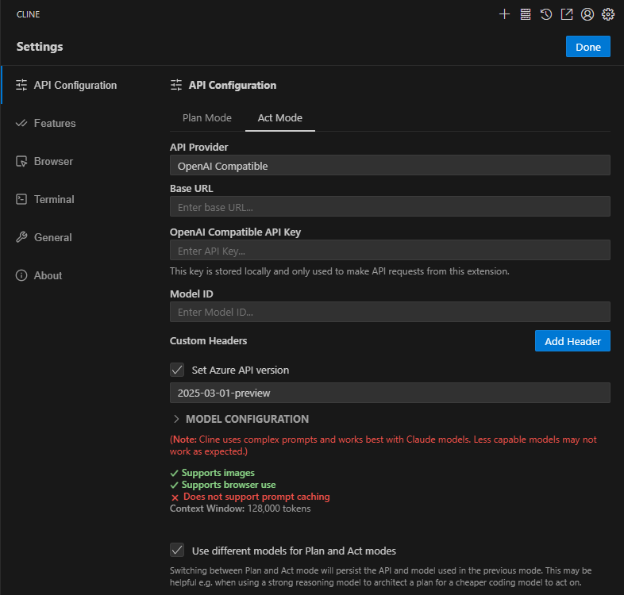

# Integration of DIAL with Cline

## Introduction

DIAL is an open platform that integrates with external systems, libraries, and frameworks to enhance and extend their existing functionalities.

The purpose of this integration is to describe how to configure [Cline extension for MS Visual Studio Code](https://marketplace.visualstudio.com/items?itemName=saoudrizwan.claude-dev) to work with models available in DIAL. 

## Cline Configuration

Cline configuration basically comes down to configuring Cline extension for VS Code to work with DIAL models:

1. [Install VS Code extension for Cline](https://marketplace.visualstudio.com/items?itemName=saoudrizwan.claude-dev).
2. In Cline Settings, go to API Configuration.
        * Select OpenAI Compatible in API Provider box.
        * Set your Base URL for OpenAI.
        * In the OpenAI Compatible API Key field, paste your DIAL API key.
        * Enter the desired model name manually in the Model ID field (e.g., gpt-4o). Make sure it matches the model name used in DIAL.
        * Enable Set Azure API version and select the required API version (e.g., 2025-03-01-preview).
        * Optionally, enable Use different models for Plan and Act modes if you want to use separate models for each mode.
        * Optionally, enter any additional system prompt instructions in the Custom Instructions field (e.g., Run unit tests at the end, Speak in Spanish).
        * Click Done to apply.

