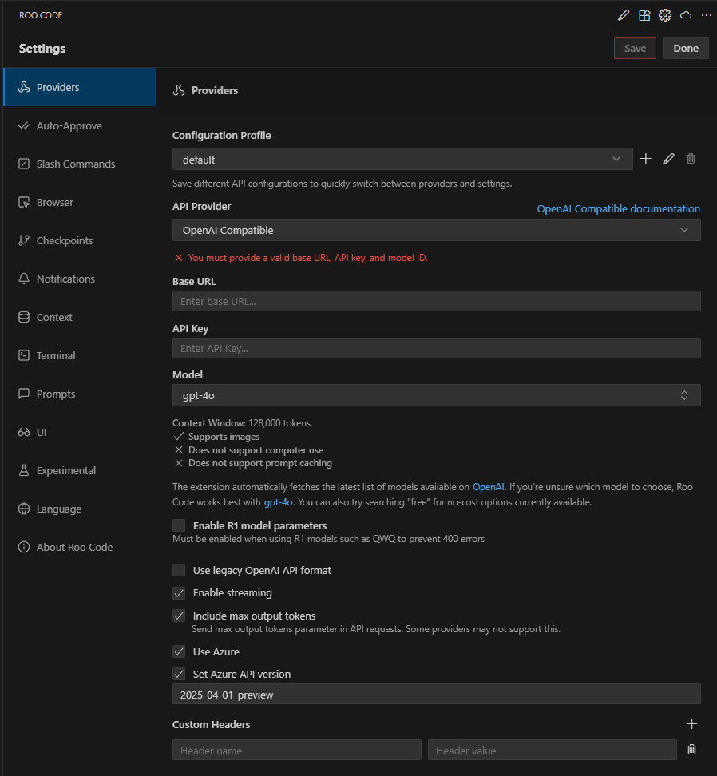

# Integration of DIAL with Roo Code

## Introduction

DIAL is an open platform that integrates with external systems, libraries, and frameworks to enhance and extend their existing functionalities. 

The purpose of this integration is to describe how to configure [Roo Code extension for MS Visual Studio Code](https://marketplace.visualstudio.com/items?itemName=RooVeterinaryInc.roo-cline) to work with models available in DIAL. 

## Roo Code Configuration

Roo Code configuration basically comes down to configuring Roo Code extension for VS Code to work with DIAL models:

1. [Install VS Code extension for Roo Code](https://marketplace.visualstudio.com/items?itemName=RooVeterinaryInc.roo-cline).
2. In Roo Code Settings, go to Providers.
        * Select OpenAI Compatible in API Provider box.
        * Set your Base URL for OpenAI.
        * In the API Key field, paste your DIAL API key.
        * Enter the desired model name manually in the Model ID field (e.g., gpt-4o). Make sure it matches the model name used in DIAL.
        * Check Use Azure, enable Set Azure API version and select the required API version (e.g., 2025-03-01-preview).
        * In Custom Headers, set Api-Key for name and your DIAL API key for value.
        * Max Output Tokens: Set to -1 to let the server set the max tokens.
        * Context Window Size: Set the context window saturation e.g., 128000.
        * Image Support: Check if your model supports images.
        * Model-specific Settings: 
                - Use custom temperature: Enable if needed. Some models do not support the temperature parameter and may not work if the value is not set to 1. If you encounter errors, set the temperature to 1.
        * Advanced settings:
                - Rate Limit: Set a minimum time between API requests (recommended: 30s–60s). This helps reduce the chance of receiving HTTP 429 (Too Many Requests) errors.
        * Click Save and Done to apply.

 