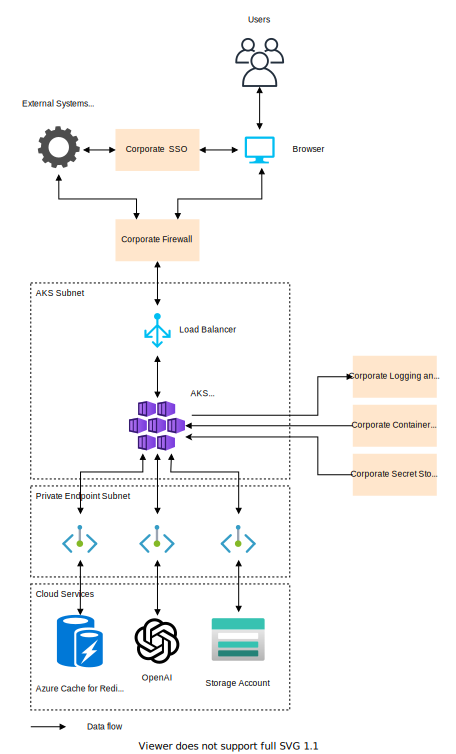

# Azure Deployment Guide

## Prerequisites

The below diagram displays all cloud Azure infrastructure services required for the AI DIAL deployment:

The table below summarizes service tiers recommended for a production deployment. Lower environments may not use zone redundant configurations to save costs.

| Service                  | Tier                                                                 |
|--------------------------|----------------------------------------------------------------------|
| Azure Kubernetes Service | Standard, zone-redundant                                             |
| Load Balancer            | Standard                                                             |
| Storage Account          | Standard, Azure Blob Storage, GZRS                                   |
| Azure Cache for Redis    | Premium P1, zone-redundant                                           |
| OpenAI                   | Depends on the capacity requirements and models – both provisioned throughput and pay-as-you-go models can be used |

There are a few dependencies, where the technology choice may depend on the corporate standards. The table below summarizes Azure services that can be used to implement each of these dependencies if there isn't any corresponding corporate standard.  

| Dependency                  | Azure Service                                      |
|-----------------------------|----------------------------------------------------|
| SSO                         | Azure Active Directory                             |
| Firewall                    | Azure Application Gateway with WAF                 |
| Logging and monitoring tools| Azure Application Insights and Log Analytics       |
| Container registry          | Azure Container Registry                           |
| Secret Storage              | Azure Key Vault                                    |

## Scalability

There are two sets of resources, each of which has its own recommended scaling approach: AI DIAL services and LLM models. 

### AI DIAL Services

AI DIAL services are stateless, so can have multiple copies running concurrently. As a baseline, a production deployment should have two copies of each service running on different nodes to achieve high availability of the solution. Usually there is no need to scale AI DIAL services further, because they are not resource-intensive and can handle an organization with thousands of AI DIAL users. 

However, to be resilient to load spikes, it is recommended to configure autoscaling for AI DIAL Core service so that more copies are run if the total CPU usage across all instances goes beyond a certain threshold for a certain duration (e.g. more 80% of the total CPU limit for 1 minute). 

Apart from that, cluster autoscaling should be configured as well to add an extra node in case the already existing nodes do not have capacity to run a new copy of the AI DIAL Core service.

### Language Models

Scaling of LLM model instances is a common scenario for AI DIAL, because a single instance is usually not enough for an organization due to the model’s request rate limits. With OpenAI service in Azure, there are four levels of scaling:

* Increasing the number of model instances in the same region.
* Requesting a regional quota extension for a model - every region has a fixed quota for every model type in terms of tokens per minute (TPM). The sum of model instance capacities within the same region can’t exceed this quota. If the current quota is not enough, in some cases it is possible to request the extension via the Azure Portal.
* Creating model instances in other regions.
* Using multiple subscriptions to access model endpoints.

It makes sense to use any approach from above only if the previous one doesn’t help anymore.

## High Availability

High availability is achieved via zone redundancy:

-	Running multiple copies of AI DIAL services in different availability zones by utilizing a multi-zone AKS cluster.
-	Using highly available configurations of other Azure services.  

Here is a reference list of availability SLA metrics for the Azure services used by the solution.

| Service                  | Availability SLA                                      | Resilient to zone-wide outages                     |
|--------------------------|-------------------------------------------------------|----------------------------------------------------|
| Azure Kubernetes Service | 99.95% if deployed with zone redundancy               | Yes, if configured explicitly                      |
| Key Vault                | 99.99%                                                | Yes                                                |
| Storage Account          | 99.99% (read), 99.9% (write)                          | Yes, if configured explicitly                      |
| Azure Cache for Redis    | 99.9% if deployed with zone redundancy                | Yes, if configured explicitly                      |
| OpenAI                   | No SLA                                                |                                                    |

Since OpenAI doesn’t have an SLA, it is worth having multiple endpoints in different regions. If one endpoint fails, AI DIAL will automatically attempt the next one in the list, ensuring resilience.

## Disaster Recovery

AI DIAL has two components: DIAL Core and Analytics Realtime. Since Analytics Realtime is an optional component that can be managed separately from the AI DIAL Core, it is better to separate disaster recovery policies for both.

The AI DIAL Core part consists of a set of stateless services and a single permanent storage based on Azure Storage account (Redis in this case is treated as stateless, because it serves only as a cache for the primary storage and can be safely restarted if necessary). In case of a region-wide failure, the entire set of components must be run in a different region:

-	Storage account – since it uses GZRS redundancy, in case of a disaster it can be failed over to the secondary region. After the successful failover it will have only one region (ZRS), so to restore an ability to fail it over once again during the next disaster, the mode should be explicitly set to GZRS again.
-	All other services – since they are stateless, the entire set of services can be deployed in the secondary region from scratch and the AI DIAL instance domain name re-routed to the new entry point. Depending on the RTO requirement, this step can be sped up by having a passive instance of AI DIAL Core always deployed in the secondary region and activated in case of a failure.

When the primary region is restored, there is no need to fail back.

## Support

It is recommended to configure monitoring and alerts to manage the AI DIAL deployment. To seamlessly host AI DIAL in diverse enterprise environments, it provides standard interfaces for logs and metrics collection via OpenTelemetry interfaces.
Specific tools used for logging, monitoring and alerting purposes depend on the corporate standards of each customer.
