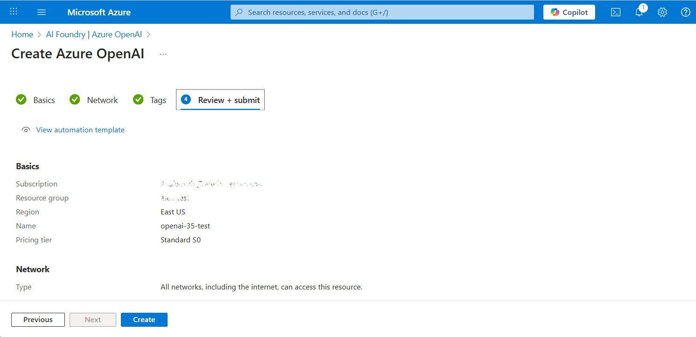
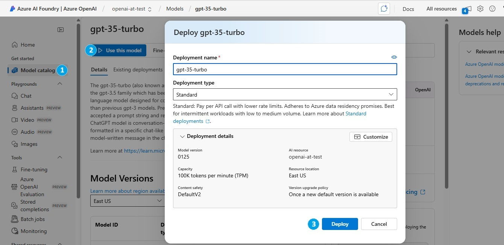

<!-- omit from toc -->
# OpenAI Model Deployment

From this instruction, you will learn how to create an Azure OpenAI model GPT-3.5-turbo/GPT-4 and use it in AI DIAL config.

<div class="docusaurus-ignore">

<!-- omit from toc -->
# Table of Contents
- [Prerequisites](#prerequisites)
- [Step 1: Configuring the AI Model](#step-1-configuring-the-ai-model)
  - [Create Azure OpenAI resource](#create-azure-openai-resource)
  - [Create a Model Deployment](#create-a-model-deployment)
- [Step 2: Get Access to AI Model](#step-2-get-access-to-ai-model)
  - [Configure Azure OpenAI Model and Get API Key](#configure-azure-openai-model-and-get-api-key)
  - [Configure Kubernetes Service Account](#configure-kubernetes-service-account)
- [Step 3: Add Model to AI DIAL](#step-3-add-model-to-ai-dial)
  - [Add Model to AI DIAL Core Config](#add-model-to-ai-dial-core-config)
  - [Configure AI DIAL Adapter](#configure-ai-dial-adapter)
    - [Use Adapter with Azure OpenAI API Key](#use-adapter-with-azure-openai-api-key)
    - [Use Kubernetes Service Account Assigned to Azure user-assigned Managed Identity](#use-kubernetes-service-account-assigned-to-azure-user-assigned-managed-identity)

</div>

## Prerequisites

* Active Azure account

## Step 1: Configuring the AI Model

### Create Azure OpenAI resource

1. Login to the MS Azure portal (https://portal.azure.com/) with your credentials. Create an account if you do not have one.
2. Navigate to Azure OpenAI and click **Create**.
3. Fill in all the details and click **Create**.
   
   

### Create a Model Deployment

1. Use the search bar to look up **Azure OpenAI** and click it to navigate to the **AI Foundry | Azure OpenAI** page.
   
   
   
2. You can now find your OpenAI resource in the **Azure OpenAI** section. Click it to open and then click **Go to Azure AI Foundry portal** in the top bar.
   
   
   
3. In Azure AI Foundry, click **Model catalog** in the navigation menu. Search for needed model, open it and click **Use this model**. Fill in the required fields and click **Deploy** to deploy a model.
   
   

    > It is important to note that certain models may not be accessible for deployment in a particular region. If you need a particular model, you will have to submit a separate request or relocate Azure OpenAI to a different region.

## Step 2: Get Access to AI Model

### Configure Azure OpenAI Model and Get API Key

1. In Azure AI Foundry, click **Deployments** in the navigation menu, and open the model you deployed. In the **Endpoint** section you can find your Target URI and Key that you will need to provide in AI DIAL configuration file.
   
    

2. You can restrict access to your accounts based on a specific subset of networks by configuring network rules, only applications that access data through the designated set of networks are permitted to access the account. You can manage default network access rules for your Azure OpenAI resources in **Resource Management/Networking**.

   > Refer to [Microsoft Documentation](https://learn.microsoft.com/en-us/azure/ai-services/cognitive-services-virtual-networks?context=%2Fazure%2Fcognitive-services%2Fopenai%2Fcontext%2Fcontext&tabs=portal#manage-default-network-access-rules) to learn more.
   > Refer to [Microsoft Data Privacy Policy](https://learn.microsoft.com/en-us/legal/cognitive-services/openai/data-privacy) to learn how data provided by you to the Azure OpenAI service is processed, used, and stored.

   

### Configure Kubernetes Service Account

In case your cluster is located at Azure, the best practice for using Azure OpenAI is to assign an Azure user-assigned managed identity to Kubernetes Service Account. You can do this using Microsoft Entra Workload ID with Azure Kubernetes Service.

> Refer to [Azure Documentation](https://learn.microsoft.com/en-us/azure/aks/workload-identity-overview) to learn how to configure Microsoft Entra Workload ID with Azure Kubernetes Service.

> Refer to [Azure Documentation](https://learn.microsoft.com/en-us/azure/aks/open-ai-secure-access-quickstart) to learn how to configure a secure access to Azure OpenAI from Azure Kubernetes Service.

## Step 3: Add Model to AI DIAL

To deploy a model to AI DIAL, it is necessary to add it to config and configure an adapter for it.

### Add Model to AI DIAL Core Config

Add your model with its parameters in the `models` section. 

> Refer to [AI DIAL Core Configuration](https://github.com/epam/ai-dial-core/blob/development/sample/aidial.config.json#L183) to view an example.

> Refer to [Configure core config](/docs/tutorials/2.devops/1.configuration/0.configuration-guide.md#core-parameters) to view the configuration of AI DIAL core parameters in the helm-based installation.

### Configure AI DIAL Adapter

To work with models, we use applications called Adapters. You can configure OpenAI Adapter via [environment variables](https://github.com/epam/ai-dial-adapter-openai#environment-variables).

> Refer to [Adapter for OpenAI](https://github.com/epam/ai-dial-adapter-openai) to view documentation for a OpenAI AI DIAL Adapter.

#### Use Adapter with Azure OpenAI API Key

In this scenario, it's enough to enable the adapter. Azure OpenAI keys are located in the configuration file of AI DIAL Core. Any other configuration of the adapter is not required.

```yaml
openai:
  enabled: true

```

#### Use Kubernetes Service Account Assigned to Azure user-assigned Managed Identity

> Before taking this step, configure [Microsoft Entra Workload ID with Azure Kubernetes Service](#configure-kubernetes-service-account).

In this scenario, the adapter uses Azure user-assigned managed identity. In such a configuration, there's no need to setting the Azure OpenAI API key in the AI DIAL Core configuration file. Authentication takes place on the adapter level.

```yaml
openai:
  enabled: true

  podLabels:
    azure.workload.identity/use: "true"
  
serviceAccount:
  create: true
  annotations:
    azure.workload.identity/client-id: "client-id"
```
