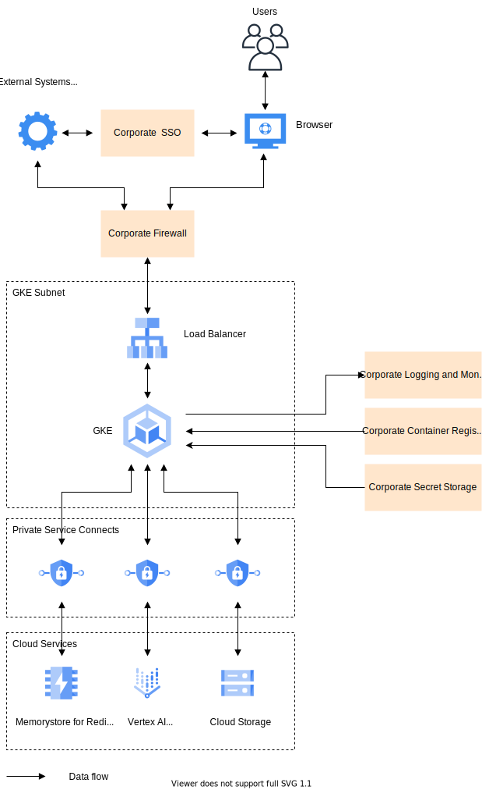

# GCP Deployment Guide

## Prerequisites

All cloud infrastructure services required for the DIAL deployment are shown in the diagram below:

The table summarizes GCP service configurations and tiers recommended for a production deployment. Lower environments may use less resilient configurations to save costs.

| GCP Service   | Configuration / Tier |
| ------------- | --------------------|
| Google Kubernetes Engine (GKE)    | Standard (regional cluster with zone redundancy)      |
| Cloud Load Balancing (Global External HTTP(S)) | Standard    |
| Cloud Storage | Standard storage (dual-region or multi-region)        |
| Memorystore for Redis  | Standard tier, HA configuration |
| Vertex AI Platform     | Depends on the capacity requirements and models (e.g., PaLM API, Gemini models) – usage-based pricing applies. |

There are a few dependencies, where the technology choice may depend on the corporate standards. The table below summarizes Google Cloud services that can be used to implement each of these dependencies if there is no specific corporate standard.

| Dependency| Azure Service |
| ----------| ---------- |
| SSO  | Cloud Identity      |
| Firewall        | Cloud Armor (for WAF capabilities) integrated with Load Balancing, VPC firewall rules |
| Logging and monitoring tools | Google Cloud Observability   |
| Container registry           | Artifact Registry   |
| Secret Storage  | Secret Manager      |

## Scalability

There are two sets of resources, each of which has its own recommended scaling approach: DIAL services and LLM models.

### DIAL Services

DIAL services are stateless, so can have multiple copies running concurrently. As a baseline, a production deployment should have two copies of each service running on different nodes to achieve high availability of the solution. Usually there is no need to scale DIAL services further, because they are not resource-intensive and can handle an organization with thousands of DIAL users.

However, to be resilient to load spikes, it is recommended to configure autoscaling for DIAL Core service so that more copies are run if the total CPU usage across all instances goes beyond a certain threshold for a certain duration (e.g. more 80% of the total CPU limit for 1 minute).
Apart from that, cluster autoscaling should be configured as well to add an extra node in case the already existing nodes do not have capacity to run a new copy of the DIAL Core service.

### Language Models

Scaling of LLM model instances is a common scenario for DIAL, because a single instance is usually not enough for an organization due to the model’s request rate limits. With Vertex AI Platform service in GCP, there are four levels of scaling:

- Increasing the number of model instances in the same region.
- Requesting a regional quota extension for a model - every region has a fixed quota for every model type in terms of tokens per minute (TPM). The sum of model instance capacities within the same region can’t exceed this quota. If the current quota is not enough, in some cases it is possible to request the extension via the GCP Console.
- Deploying model instances in additional regions.
- Using multiple GCP projects to access model endpoints.

It makes sense to use any approach from above only if the previous one doesn’t help anymore.

## High Availability

High availability is achieved through leveraging the platform's regional and multi-zone capabilities:

- Running multiple copies of DIAL services in different availability zones by utilizing a multi-zone GKE cluster.
- Using highly available configurations of other GCP services.

Here is a reference list of availability SLA metrics for the GCP services used in the solution.

| Service| Availability SLA        | Resilient to zone-wide outages|
| ---------- | --------- | ---|
| Google Kubernetes Engine (GKE) | 99.95% if deployed with zone redundancy, otherwise 99.5% | Yes, if configured explicitly |
| Cloud Identity    | 99.9% - 99.99%          | Yes   |
| Cloud Storage     | 99.95% if using dual-region or multi-region location, otherwise 99.9% | Yes   |
| Memorystore for Redis          | 99.9% if deployed with zone redundancy        | Yes, if configured explicitly |
| Vertex AI Platform| 99.5% - 99.9%| Depends on configuration (model type, deployment across zones) |
| Secret Manager    | 99.95%       | Yes   |
| Artifact Registry | 99.95%       | Yes (Regional)   |

Vertex AI services provide an SLA of up to 99.9%, ensuring high availability and reliability for your AI workloads. To improve resilience beyond the SLA, it is worth having multiple endpoints in different regions. If one region becomes unavailable, DIAL can automatically switch to another endpoint, ensuring the service keeps running smoothly.

## Disaster Recovery

There are two pieces of the DIAL solution: [DIAL Core](/docs/platform/0.architecture-and-concepts/2.architecture.md#dial-core-required) and [DIAL Analytics](/docs/platform/0.architecture-and-concepts/2.architecture.md#analytics). Since DIAL Analytics is an optional component that can be managed separately from the Core, it is better to separate disaster recovery policies for both.

The Core part consists of a set of stateless services and a single permanent storage based on GCP Cloud Storage (Memorystore for Redis in this case is treated as stateless, because it serves only as a cache for the primary storage and can be safely restarted if necessary). In case of a region-wide failure, the entire set of components must be run in a different region:

- GCP Cloud Storage – since it uses dual-region or multi-region configurations, Cloud Storage provides built-in redundancy and availability across regions. For disaster recovery, accessing data from the secondary region is automatic or can involve failover procedures depending on the exact setup. To maintain multi-region redundancy after a regional failure, the configuration may need to be reviewed and potentially re-established.
- All other services – since they are stateless, the entire set of services can be deployed in the secondary region from scratch and the DIAL instance domain name re-routed to the new entry point. Depending on the RTO requirement, this step can be sped up by having a passive instance of DIAL Core always deployed in the secondary region and activated in case of a failure.

## Support

It is recommended to configure monitoring and alerts to manage the DIAL deployment. To seamlessly host DIAL in diverse enterprise environments, it provides standard interfaces for logs and metrics collection via OpenTelemetry interfaces.
Specific tools used for logging, monitoring and alerting purposes depend on the corporate standards of each customer.
