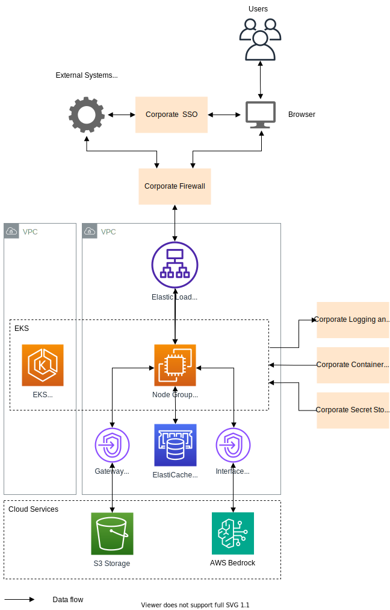

# AWS Deployment Guide

## Prerequisites

All cloud infrastructure services required for the DIAL deployment are shown in the diagram below:

The table summarizes AWS service configurations and tiers recommended for a production deployment. Lower environments may use less resilient configurations to save costs.

| AWS Service   | Configuration / Tier |
| ------------- | --------------------|
| Amazon Elastic Kubernetes Service (EKS)    | Standard, zone redundant     |
| Elastic Load Balancing (ALB) | Standard    |
| Amazon S3| S3 Standard (with S3 Multi-Region Access Points)        |
| ElastiCache | Standard, Multi-AZ (HA configuration) |
| Amazon Bedrock     | Depends on the capacity requirements and models (e.g., Amazon Titan, Claude models) – usage-based pricing applies. |

There are a few dependencies, where the technology choice may depend on the corporate standards. The table below summarizes AWS services that can be used to implement each of these dependencies if there is no specific corporate standard.

| Dependency| AWS Service |
| ----------| ---------- |
| SSO  | Amazon Cognito       |
| Firewall        | AWS WAF integrated with ALB or CloudFront + VPC Security Groups |
| Logging and monitoring tools | Amazon CloudWatch + AWS CloudTrail   |
| Container registry           | Amazon Elastic Container Registry (ECR)   |
| Secret Storage  | AWS Secrets Manager      |

## Scalability

There are two sets of resources, each of which has its own recommended scaling approach: DIAL services and LLM models.

### DIAL Services

DIAL services are stateless, so can have multiple copies running concurrently. As a baseline, a production deployment should have two copies of each service running on different nodes to achieve high availability of the solution. Usually there is no need to scale DIAL services further, because they are not resource-intensive and can handle an organization with thousands of DIAL users.

However, to be resilient to load spikes, it is recommended to configure autoscaling for DIAL Core service so that more copies are run if the total CPU usage across all instances goes beyond a certain threshold for a certain duration (e.g. more 80% of the total CPU limit for 1 minute).
Apart from that, cluster autoscaling should be configured as well to add an extra node in case the already existing nodes do not have capacity to run a new copy of the DIAL Core service.

### Language Models

Scaling of LLM model instances is a common scenario for DIAL, because a single instance is usually not enough for an organization due to the model’s request rate limits. With Amazon Bedrock service in AWS, there are a few options of scaling:

- Requesting a regional quota extension for a model - every region has a fixed quota for every model type in terms of tokens per minute (TPM). If the current quota is not enough, in some cases it is possible to request the extension by submitting a Service Quotas increase request via the AWS Service Quotas Console or AWS Support Center.
- Invoking models in additional regions to distribute load, sometimes combined with [cross-region inference](https://docs.aws.amazon.com/bedrock/latest/userguide/cross-region-inference.html).
- Using multiple AWS accounts to access model endpoints.

It makes sense to use any approach from above only if the previous one doesn’t help anymore.

## High Availability

High availability is achieved through leveraging the platform's regional and multi-zone capabilities:

- Running multiple copies of DIAL services in different availability zones by utilizing a Multi-AZ deployments.
- Using highly available configurations of other AWS services.  

Here is a reference list of availability SLA metrics for the AWS services used in the solution.

| Service| Availability SLA        | Resilient to zone-wide outages|
| ---------- | --------- | ---|
| Amazon Elastic Kubernetes Service (EKS) | 99.95%  | Yes, if configured explicitly |
| AWS IAM    | 99.0% - 99.99%          | Yes   |
| Amazon S3     | 99.9% | Yes (with multi-region replication)   |
| ElastiCache (Redis OSS)          | 99.99% (with Multi-AZ configuration)        | Yes, if configured explicitly |
| Amazon Bedrock| 99.9%| Depends on configuration (model type, deployment across zones) |
| AWS Secrets Manager    | 99.99%       | Yes   |
| Amazon Elastic Container Registry (ECR) | 99.9%       | Yes (Regional)   |

Amazon Bedrock service provides an SLA of up to 99.9%, ensuring high availability and reliability for your AI workloads. To improve resilience beyond the SLA, it is worth having multiple endpoints in different regions. If one region becomes unavailable, DIAL can automatically switch to another endpoint, ensuring the service keeps running smoothly.

## Disaster Recovery

There are two pieces of the DIAL solution: [DIAL Core](/docs/platform/3.core/0.about-core.md) and [DIAL Analytics Realtime](/docs/platform/6.realtime-analytics-intro.md). Since DIAL Analytics is an optional component that can be managed separately from the DIAL Core, it is better to separate disaster recovery policies for both.

The DIAL Core part consists of a set of stateless services and a single permanent storage based on S3 (ElastiCache in this case is treated as stateless, because it serves only as a cache for the primary storage and can be safely restarted if necessary). In case of a region-wide failure, the entire set of components must be run in a different region:

- Amazon S3 – since it offers Cross-Region Replication (CRR) or Multi-Region Access Points, it provides built-in redundancy and availability across regions. For disaster recovery, accessing data from the secondary region is automatic or can involve failover procedures depending on the exact setup. To maintain multi-region redundancy after a regional failure, the configuration may need to be reviewed and potentially re-established.
- All other services – since they are stateless, the entire set of services can be deployed in the secondary region from scratch and the DIAL instance domain name re-routed to the new entry point. Depending on the RTO requirement, this step can be sped up by having a passive instance of DIAL Core always deployed in the secondary region and activated in case of a failure.

When the primary region is restored, there is no need to fail back.

## Support

To make the system supportable, DIAL deployment must provide alerting and monitoring capabilities. To make DIAL easily hostable in diverse enterprise environments, it provides standard interfaces for logs and metrics collection via OpenTelemetry interfaces.

Specific tools used for logging, monitoring and alerting purposes depend on the corporate standards of each customer.

