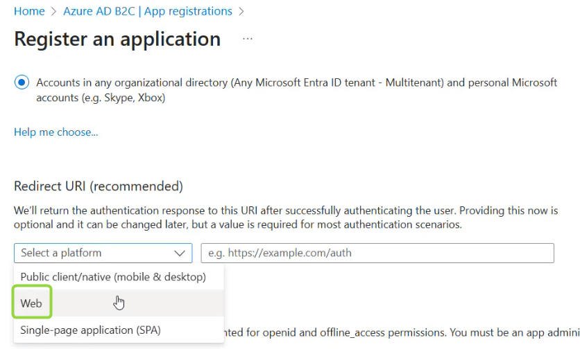
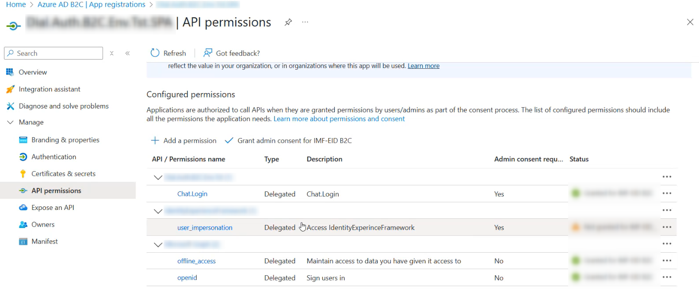

<!-- omit from toc -->
# How to Set Azure AD B2C as Identity Provider

<div class="docusaurus-ignore">

<!-- omit from toc -->
## Table of Contents

- [Introduction](#introduction)
- [Configuration Guidelines](#configuration-guidelines)
  - [Configure Azure AD B2C](#configure-microsoft-entra-id)
  - [Configure DIAL](#configure-dial)
    - [DIAL Chat Settings](#dial-chat-settings)
    - [DIAL Core Settings](#dial-core-settings)
    - [Assignment of Roles](#assignment-of-roles)

</div>

## Introduction

This basic tutorial demonstrates how to configure [Azure AD B2C](https://learn.microsoft.com/en-us/azure/active-directory-b2c/overview) and use it as an identity and access management solution for DIAL users.

In DIAL, you can assign roles to Models and Applications to restrict the number of tokens that can be transmitted in a specific time frame. These roles and their limitations can be created in external systems and then assigned in DIAL's configuration.

## Configuration Guidelines

### Configure Azure AD B2C

> **Note**: Replace `<chat_url>` with the actual address of your DIAL Chat application.

Follow these steps to configure Azure AD B2C:

0. Create a **B2C Tenant** if you do not have one: Refer to [Azure tutorials](https://learn.microsoft.com/en-us/azure/active-directory-b2c/tutorial-create-tenant) to learn how to do this. Save the **tenant id** (`<azure_b2c_tenant_id>`) - you will need it to configure DIAL Chat `AUTH_AZURE_B2C_TENANT_ID` environment variable.
1. Register an enterprise **Web Application**: Refer to [Azure tutorials](https://learn.microsoft.com/en-us/azure/active-directory-b2c/tutorial-register-applications) for detailed instructions on how to register a Web application. Upon the registration, make sure to get the following details - you will need them to configure DIAL:
    - Application ID: The application ID assigned to your app in the Azure portal (`<azure_b2c_app_id>`)
    - Redirect URI: A URI where authentication responses are sent and received by your app. Follow this format - `<chat_url>/api/auth/callback/azure-ad-b2c`



2. Create a **Client secret**: Refer to [Azure tutorials](https://learn.microsoft.com/en-us/azure/active-directory-b2c/tutorial-register-applications#create-a-client-secret) to learn how to do this. Save a client secret `<azure_b2c_client_secret>` and a `<azure_b2c_client_id>` - you will need it to configure DIAL CHAT `AUTH_AZURE_B2C_SECRET` environment variable.
3. Create a **Scope**: Scopes are used to manage permissions to protected resources. In the section **Manage/Expose an API**, add a custom scope `Chat.Login` (`<chat_url>/<azure_b2c_client_id>/Chat.Login`).  You will need them to configure DIAL Chat `AUTH_AZURE_B2C_SCOPE` environment variable. Refer to Azure tutorials to learn [how to configure scopes](https://learn.microsoft.com/en-us/azure/active-directory-b2c/configure-authentication-sample-spa-app?tabs=app-reg-ga#step-22-configure-scopes). 
4. Configure **API Permissions**: To call a protected web API from an application, you need to grant your application permissions to the API. In **App registrations/App registration name/Manage/API Permissions** section, add a Delegated permission type for [OpenID scopes](https://learn.microsoft.com/en-us/entra/identity-platform/scopes-oidc#openid-connect-scopes) you will need include: `openid`, `profile`, `email`, and `offline_access`. Refer to [Azure documentation](https://learn.microsoft.com/en-us/azure/active-directory-b2c/add-web-api-application#grant-permissions) for more details.



5. Create a **User Flow**:  A business logic that users follow to gain access to your application. Refer to [Azure tutorials](https://learn.microsoft.com/en-us/azure/active-directory-b2c/tutorial-create-user-flows?pivots=b2c-user-flow) to learn how to do this. Save the **user flow name**. You will need it to configure DIAL Chat `AUTH_AZURE_B2C_USER_FLOW` environment variable.


### Configure DIAL

By configuring both DIAL Chat and DIAL Core with the necessary environment variables, you will enable them to work together seamlessly with Identity Provider for authentication and authorization purposes.

#### DIAL Chat Settings

Add the following environment variables to DIAL Chat configuration. Refer to [DIAL Chat](https://github.com/epam/ai-dial-chat/blob/development/apps/chat/README.md#environment-variables) for more details.

Authentication variables:

```yaml
AUTH_AZURE_B2C_ADMIN_ROLE_NAMES : admin #claim value from user flow
AUTH_AZURE_B2C_AUD : <azure_b2c_app_id>
AUTH_AZURE_B2C_CLIENT_ID : <azure_b2c_client_id>
AUTH_AZURE_B2C_CLIENT_SECRET : <azure_b2c_client_secret>
AUTH_AZURE_B2C_DIAL_ROLES_FIELD : roles #claim from user flow
AUTH_AZURE_B2C_NAME : Azure B2C
AUTH_AZURE_B2C_SCOPE : openid profile email offline_access <chat_url>/<azure_b2c_client_id>/Chat.Login
AUTH_AZURE_B2C_TENANT_ID : <azure_b2c_tenant_id>
AUTH_AZURE_B2C_USER_FLOW : USER_FLOW_NAME
```

> **Tip**: The application **scope** added above [is required to validate signature](https://learn.microsoft.com/en-us/answers/questions/318741/graphapi-cannot-validate-access-token-signature) of the access token.


Additional variables: 

```yaml
FEDERATED_LOGOUT_PROVIDERS : azure-ad-b2c #define value as azure-ad-b2c to enable logout
```

#### DIAL Core Settings

Add the following parameters to DIAL Core [**static** settings](https://github.com/epam/ai-dial-core?tab=readme-ov-file#static-settings):

> **Note**: generate some random sting for `loggingSalt` parameter, e.g. using `pwgen -s 32 1`

```yaml
aidial.identityProviders.azureb2c.issuerPattern : ^https:\/\/<azure_b2c_tenant_id>\.b2clogin\.com.+$ #describes an issuer in a token
aidial.identityProviders.azureb2c.jwksUrl : <azure_b2c_tenant_id>.b2clogin.com/<azure_b2c_tenant_id>.onmicrosoft.com/<USER_FLOW_NAME>/discovery/v2.0/keys #used to validate a token
aidial.identityProviders.azureb2c.loggingKey : sub
aidial.identityProviders.azureb2c.loggingSalt : your-logging-salt
aidial.identityProviders.azureb2c.projectPath : aud
aidial.identityProviders.azureb2c.rolePath : roles #claim from a user flow
aidial.identityProviders.azureb2c.userDisplayName : name #claim from a user flow
```

#### Assignment of Roles

> **Warning**: User Flow-related must be configured to proceed with this section.

To limit access to DIAL resources based on Use Flow, configure the DIAL Core by adjusting the [Dynamic settings](https://github.com/epam/ai-dial-core?tab=readme-ov-file#dynamic-settings): set the `userRoles` parameter to align with the desired claims.

In the provided example, users assigned the `user-group-name` group will have access to the `chat-gpt-35-turbo` model.

```json
{
  "models": {
    "gpt-35-turbo": {
      "type": "chat",
      "endpoint": "http://localhost:5000/v1/openai/deployments/gpt-35-turbo/chat/completions",
      "upstreams": [
        {
          "endpoint": "https://[REDACTED].openai.azure.com/openai/deployments/gpt-35-turbo/chat/completions",
          "key": "[REDACTED]"
        }
      ],
      "userRoles": [
        "user-group-name" //A specific claim value defined in the User Flow
      ]
    }
  }
}
```