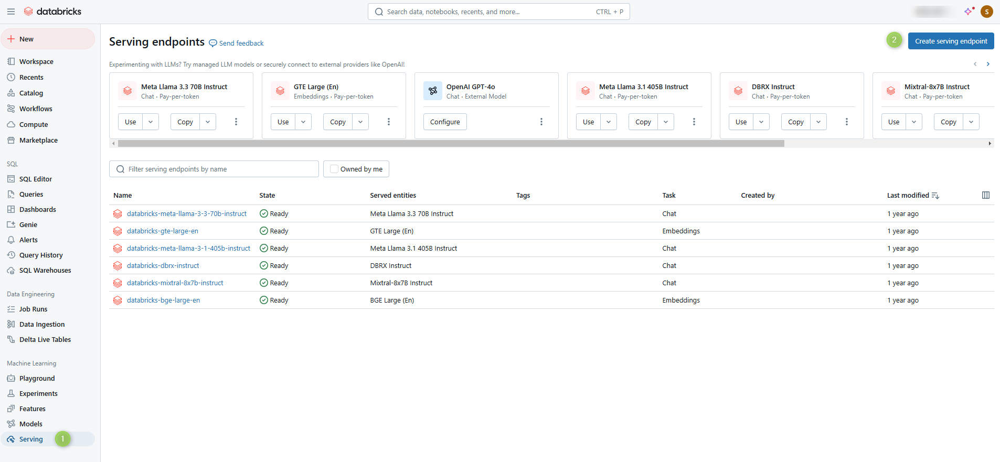
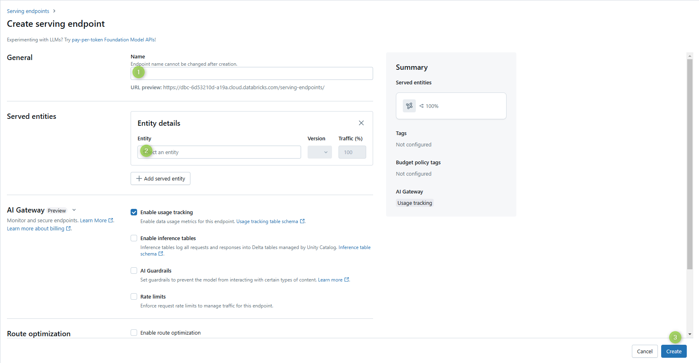
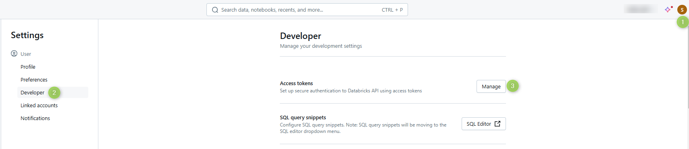

# Using Databricks Models in AI DIAL

From this document you can learn how to use Databricks models in AI DIAL.

## Configure Databricks

### Step 1 (Optional): Create Serving Endpoint

Create a serving endpoint for a Databricks model unless you already have one:

1. In the **Machine Learning** section, navigate to the **Serving** tab and click **Create serving endpoint**.

   

2. Enter a serving endpoint name (it will be used in the [Step 4](#step-4-configure-openai-adapter)) and select the served Entity (model).

   

3. Click **Create**

### Step 2: Create Access Token

To generate access token, navigate to the **Developer** section in your **User Settings**.

    

## Configure AI DIAL

### Step 3: Configure AI DIAL Model

Use the serving endpoint and the access token you have created in two previous steps to add the following configuration in the [DIAL Core dynamic settings](https://github.com/epam/ai-dial-core?tab=readme-ov-file#dynamic-settings) to the `model` section:

```json
"{dial-deployment-name}":
{
    "type": "chat",
    "displayName": "{Deployment name}",
    "endpoint": "http://{open-ai-adapter-host}/openai/deployments/{databricks-deployment-name}/chat/completions",
    "upstreams": [
        {
            "endpoint": "{databricks-account-address}/serving-endpoints/chat/completions",
            "key": "access token"
        }
    ]
}
```

### Step 4: Configure OpenAI Adapter

1. Since Databricks serving endpoints utilize an authorization flow that differs from OpenAI's, it's necessary to specify the Databricks deployments in the OpenAI Adapter environment variable: `DATABRICKS_DEPLOYMENTS=databricks-deployment-name`. Refer to [AI DIAL OpenAI adapter documentation](https://github.com/epam/ai-dial-adapter-openai?tab=readme-ov-file#categories-of-deployments) for details.
2. Restart AI DIAL OpenAI Adapter for changes to apply.
